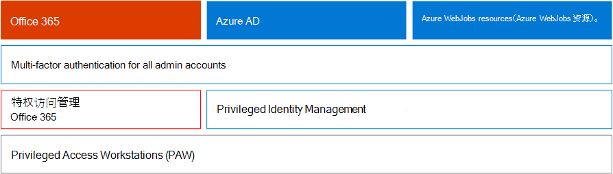

# Microsoft 365业务决策者的安全 (BDM) 

本文讨论组织当前针对其生产环境所面临的一些最常见的威胁和攻击Microsoft 365，以及用于缓解这些风险的建议操作。 尽管Microsoft 365预配置的安全功能，但还需要客户负责保护用于访问云服务的自己的标识、数据和设备。 本指南由 Microsoft 云安全架构师 (Kozeta 的) 和 Microsoft 高级顾问 (的一位) 。

本文按工作优先级进行组织，首先保护用于管理最重要的服务和资产（如租户、电子邮件和 SharePoint） 的帐户。 它提供了一种接近安全性的有条理的方法，并可以与以下电子表格协同工作，以便你可以跟踪你在整个组织中与利益干系人及团队的进度：Microsoft 365 BDM 电子表格[的安全性](https://github.com/MicrosoftDocs/microsoft-365-docs/raw/public/microsoft-365/downloads/Microsoft-365-BDM-security-recommendations-spreadsheet.xlsx)。 

Microsoft 在租户中提供了安全分数工具，可基于常规活动自动分析安全状态、分配分数并提供安全改进建议。 在采取本文建议的操作之前，请记下当前的分数和建议。 本文中建议的操作将提高分数。 目标不是获得最大分数，而是注意以不会对用户工作效率造成负面影响的方式保护环境的机会。 请参阅 [Microsoft 安全分数](defender/microsoft-secure-score.md)。

还有一点在我们开始之前。 . . 请务必打开["审核日志"。](../compliance/search-the-audit-log-in-security-and-compliance.md) 在需要调查事件或泄露时，稍后将需要此数据。 

## 保护特权帐户

作为第一步，我们建议确保为环境中的关键帐户提供额外一层保护，因为这些帐户具有管理和更改关键服务和资源的访问权限，如果受到威胁，会对整个组织产生负面影响。 保护特权帐户是防范试图将遭到入侵的帐户的权限提升给管理帐户的攻击者的最有效的方法之一。 

|建议  |E3 |E5  |
|---------|---------|---------|
|针对所有管理帐户 (多重) MFA 身份验证。||| 
|实现Azure Active Directory (Azure AD) Privileged Identity Management (PIM) ，以将实时特权访问应用到 Azure AD 和 Azure 资源。 还可以发现谁有权访问并查看特权访问。|         | |
|实现特权访问管理，以管理对管理中心中特权管理任务的Office 365。 |         | |
|Configure and use Privileged Access Workstations (PAW) to administer services. 不要使用相同的工作站浏览 Internet 并检查与管理帐户不相关的电子邮件。|  | | 

下图说明了这些功能。

其他建议：
- 确保未为从本地同步的帐户分配云服务的管理员角色。 这有助于防止攻击者应用本地帐户，从而获取对云服务的管理访问权限。 
- 确保未为服务帐户分配管理员角色。 这些帐户通常不会受监视，并且使用不会过期的密码进行设置。 首先确保 AADConnect 和 ADFS 服务帐户默认情况下不是全局管理员。
- 从管理员帐户中删除许可证。 除非存在将许可证分配给特定管理员帐户的特定用例，否则请从这些帐户中删除许可证。 

## 减少攻击面

下一个焦点是减少攻击面。 这可以通过最少的工作量和影响用户和服务完成。 通过减少攻击面，攻击者向组织发起攻击的方法更少。

下面是一些示例：
- 禁用 POP3、IMAP 和 SMTP 协议。 大多数现代组织不再使用这些较旧的协议。 可以安全地禁用这些异常，并仅根据需要允许例外。 
- 减少租户中的全局管理员数量，并保持所需的绝对最小值。 这将直接减少所有云应用程序的攻击面。 
- 停用环境中不再使用的服务器和应用程序。 
- 实现用于禁用和删除不再使用的帐户的过程。 

## 防范已知威胁

已知威胁包括恶意软件、遭到入侵的帐户和网络钓鱼。 可快速实施针对这些威胁的一些保护，而不会影响用户，而其他防护则需要更多的规划和用户培训。 

|建议  |E3  |E5  |
|---------|---------|---------|
|**设置多重身份验证并使用建议的条件访问策略，包括登录风险策略**。 Microsoft 推荐并测试了一组协同工作以保护所有云应用的策略，包括Office 365和Microsoft 365服务。 请参阅 [标识和设备访问配置](./office-365-security/microsoft-365-policies-configurations.md)。 | ||
|**要求所有用户进行多重身份验证**。 如果您没有实现建议的条件访问策略所需的许可，则至少需要为所有用户进行多重身份验证。|||
|**提高邮件中恶意软件防护的级别**。 您的Office 365环境Microsoft 365恶意软件防护，但您可以通过阻止包含通常用于恶意软件的文件类型的附件来增强此保护。|||
|**保护你的电子邮件免受目标网络钓鱼攻击**。 如果已针对您的 Office 365 或 Microsoft 365 环境配置了一个或多个自定义域，您可以配置目标防钓鱼保护。 防钓鱼保护是 Defender for Office 365的一部分，可帮助保护组织免受基于恶意模拟的网络钓鱼攻击和其他网络钓鱼攻击。 如果您尚未配置自定义域，则无需这样做。| ||
|**防范电子邮件中的勒索软件攻击**。 勒索软件通过加密文件或锁定计算机屏幕来删除对数据的访问权限。 然后，它尝试通过请求"勒索"（通常采用加密货币（如"为"客户"）来勒索资金，以交换对数据的返回访问权限。 通过创建一个或多个邮件流规则来阻止通常用于勒索软件的文件扩展名，或警告通过电子邮件接收这些附件的用户，可以帮助防御勒索软件。|||
|阻止来自不与 有业务关系 **的国家/地区建立的连接**。 创建一Azure AD条件访问策略，以阻止来自这些国家/地区的任何连接，从而有效地在租户周围创建地理防火墙。| ||

下图说明了这些功能。

## 防范未知威胁

向特权帐户添加额外保护并防范已知攻击后，将注意力转移到防范未知威胁。 更加确定和高级的攻击者使用创新且未知的方法来攻击组织。 通过 Microsoft 收集的数十亿设备、应用程序和服务数据丰富的遥测，我们可以在 Windows、Office 365 和 Azure 上执行 Office 365 的 Defender，以防止 Zero-Day 攻击、利用沙盒环境，并检查有效性，然后再允许访问内容。 

|建议  |E3  |E5  |
|---------|---------|---------|
|**配置 Microsoft Defender for Office 365：** * 保险箱 Attachments * 保险箱 Links * Microsoft Defender for Endpoint for SharePoint、OneDrive 和 Microsoft Teams * Defender for Office 365 保护中的防钓鱼|         | |
|**为终结点功能配置 Microsoft Defender：** * Windows Defender 防病毒  * Exploit Protection   * 攻击面减少   * 基于硬件的隔离  * 受控文件夹访问权限     |         | |
|**使用 Microsoft Defender for Cloud Apps** 发现 SaaS 应用并开始使用行为分析和异常检测。 |         | |

下图说明了这些功能。

其他建议：
- 保护合作伙伴通道通信，如使用 TLS 的电子邮件。
- 仅Teams合作伙伴打开联盟联盟。
- 不要向允许列表添加发件人域、单个发件人或源 IP，因为允许这些域绕过垃圾邮件和恶意软件检查 — 客户通常的做法是添加其自己的接受域或电子邮件流问题可能已报告给 allowlist 的许多其他域。 不要将域添加到"垃圾邮件和连接筛选"列表中，因为这可能会绕过所有垃圾邮件检查。 
- 启用出站垃圾邮件通知 — 在内部向支持人员或 IT 管理员团队启用对通讯组列表的出站垃圾邮件通知，以报告任何内部用户是否正在外部发送垃圾邮件。 这可能是帐户遭到入侵的指示器。
- 为所有用户禁用远程 PowerShell — 管理员主要使用远程 PowerShell 访问服务以用于管理目的或编程 API 访问。 我们建议为非管理员用户禁用此选项，以避免重新出现，除非他们具有访问该选项的业务要求。 
- 阻止所有Microsoft Azure管理员访问管理门户。 可以通过创建条件访问规则来阻止所有用户（管理员除外）来实现此目的。 

## 假定泄露

尽管 Microsoft 采取一切可能措施来防止威胁和攻击，但我们建议始终在"假设泄露"意识下工作。 即使攻击者已试图进入环境，我们也需要确保他们无法从环境中过滤数据或标识信息。 因此，我们建议启用针对敏感数据泄露（如社会保险号、信用卡号、其他个人信息和其他组织级别的机密信息）的保护。 

"假设泄露"意识要求实施零信任网络策略，这意味着用户并非完全信任，因为他们是网络内部用户。 相反，在授权用户可以执行哪些操作时，会指定条件集，当满足此类条件时，将强制执行某些控制。 条件可能包括设备运行状况状态、正在访问的应用程序、正在执行的操作和用户风险。 例如，设备注册操作应始终触发 MFA 身份验证，以确保未将任何路由设备添加到你的环境中。 

零信任网络策略还要求你了解信息存储位置，并应用适当的控件进行分类、保护和保留。 若要有效保护最关键和敏感的资产，你需要首先确定它们所在的位置并清点库存，这非常具有挑战性。 接下来，与您的组织一起定义管理策略。 为组织定义分类架构并配置策略、标签和条件需要仔细规划和准备。 认识到这不是 IT 驱动的流程，这一点很重要。 请务必与法律和合规性团队合作，为组织数据开发适当的分类和标签架构。

Microsoft 365信息保护功能可帮助你发现你拥有的信息、存储的位置以及需要额外保护的信息。 信息保护是一个持续的过程，Microsoft 365功能让你了解用户如何使用和分发敏感信息、当前存储信息的位置以及信息流的位置。 还可以查看用户如何处理受监管以确保应用了适当的标签和保护的信息。

|建议 |E3|E5 |
|---------|---------|---------|
|**查看并优化条件访问和相关策略，以与零信任网络的目标保持一致**。 防范已知威胁包括实现一组建议 [的策略](./office-365-security/microsoft-365-policies-configurations.md)。 查看这些策略的实现，以确保保护应用和数据免受获得网络访问权限的黑客的攻击。 建议用于应用的 Intune 应用保护Windows 10启用Windows WIP (WIP) 。 WIP 防止通过应用和服务（如电子邮件、社交媒体和公共云）意外泄露组织数据。 |         ||
|**禁用外部电子邮件转发**。 获取用户邮箱访问权限的黑客可以通过将邮箱设置为自动转发电子邮件来窃取您的邮件。 即使没有用户感知，也可能发生此情况。 您可以通过配置邮件流规则来防止发生这种情况。| ||
|**禁用匿名外部日历共享**。 默认情况下，允许外部匿名日历共享。 [禁用日历](/exchange/sharing/sharing-policies/modify-a-sharing-policy) 共享以减少敏感信息的潜在泄露。| ||
|**为敏感数据配置数据丢失防护策略**。 在安全与合规中心创建数据丢失防护策略，以发现和保护敏感数据，如信用卡号、社会保险号 &amp; 和银行帐号。 Microsoft 365数据丢失防护策略中可以使用的许多预定义敏感信息类型。 您还可以为环境自定义的敏感数据创建自己的敏感信息类型。 |||
|**实现数据分类和信息保护策略**。 实现敏感度标签，并使用这些标签对敏感数据进行分类和应用保护。 您还可以在数据丢失防护策略中使用这些标签。 如果你使用的是 Azure 信息保护标签，我们建议你避免在其他管理中心创建新标签。|         ||
|使用 Defender for Cloud Apps 保护第三 **方应用和服务中的数据**。 配置适用于云应用的 Defender 策略，以保护跨第三方云应用（如 Salesforce、Box 或 Dropbox）的敏感信息。 可以使用在 Defender for Cloud Apps 策略中创建的敏感信息类型和敏感度标签，并在整个 SaaS 应用中应用它们。   Microsoft Defender for Cloud Apps 允许你强制执行各种自动化过程。 可以设置策略以提供连续合规性扫描、法律电子数据展示任务、公开共享的敏感内容的 DLP 等。 适用于云应用的 Defender 可以监视基于 20 多个元数据筛选器的任何文件类型 (例如访问级别、文件类型) 。 |         ||
|**使用 [Microsoft Defender for Endpoint](/windows/security/threat-protection/microsoft-defender-atp/information-protection-in-windows-overview)确定用户** 是否将敏感信息存储在其Windows设备上。 |         ||
|**使用 [AIP 扫描](/azure/information-protection/deploy-aip-scanner) 程序跨服务器和文件共享标识和分类信息**。 使用 AIP 报告工具查看结果并采取适当的措施。|         ||

下图说明了这些功能。

## 持续监视和审核

最后一点，Microsoft 365环境以及 Windows 和设备的持续监控和审核对于确保快速检测和修正任何入侵至关重要。 安全分数、Microsoft 365 Defender 门户和 Microsoft Intelligent Graph 的高级分析等工具向租户提供有价值的信息，并链接大量威胁情报和安全数据，从而提供强大的威胁防护和检测。

|建议 |E3 |E5 |
|---------|---------|---------|
|确保 **审核日志** 打开。|||
|**每周查看安全** 分数 — 安全分数是访问公司的安全状态并基于安全分数建议采取措施的中心位置。 建议每周执行一次此检查。|||
|使用 **Microsoft Defender for Office 365** 工具： * 威胁调查和响应功能  * 自动调查和响应 |         ||
|使用 **Microsoft Defender for Endpoint**：  *    [终结点检测和响应](/windows/security/threat-protection/microsoft-defender-atp/overview-endpoint-detection-response)   * 自动调查和修正安全分数  *    [高级搜寻](/windows/security/threat-protection/microsoft-defender-atp/advanced-hunting-overview)  |         ||
|使用 **Microsoft Defender for Cloud Apps** 检测跨云应用的异常行为，以识别勒索软件、遭到入侵的用户或未授权的应用程序、分析高风险使用情况并自动修正以限制组织的风险。|         ||
|使用 **Microsoft Sentinel** 或当前 SIEM 工具监视整个环境中的威胁。 |         ||
|**部署 [Microsoft Defender for Identity](/azure-advanced-threat-protection/what-is-atp)** 以监视并防范针对本地 Active Directory 环境的威胁。   |         | |
|使用 **Microsoft Defender for Cloud** 监视混合和云工作负载中的威胁。 Microsoft Defender for Cloud 包括一层免费功能和一个基于资源小时或交易付费的标准功能层。|         |         |

下图说明了这些功能。

建议执行的建议监视操作：

- **每周查看一次 Microsoft 安全** 分数 — 安全分数是访问租户的安全状态并基于主要建议采取措施的中心位置。 建议每周执行一次此检查。 安全分数包括来自 Azure AD、Intune、Defender for Cloud Apps 和 Microsoft Defender for Endpoint 的建议，Office 365。
- **每周查看有风险** 登录 - Azure AD管理中心每周查看有风险登录。 推荐的标识和设备访问规则集包括一个策略，用于对有风险的登录强制实施密码更改。  
- **每周** 查看主要恶意软件和网络钓鱼用户 — 使用 Microsoft Defender for Office 365 威胁资源管理器查看以恶意软件和网络钓鱼为目标的主要用户，并找出这些用户受到影响的根本原因。
