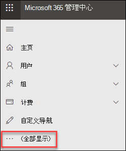
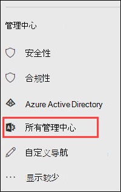
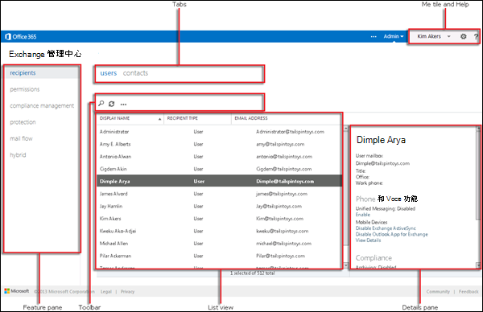

# 独立 EOP 中的 Exchange 管理中心

[!INCLUDE [Microsoft 365 Defender rebranding](../includes/microsoft-defender-for-office.md)]

**适用对象**
-  [独立 Exchange Online Protection](exchange-online-protection-overview.md)

Exchange 管理中心 (EAC) 是适用于独立 Exchange Online Protection (EOP) 的基于 Web 的管理控制台。

正在查找此主题的 Exchange Online 版本？ 请参阅 [Exchange admin center in Exchange Online](/exchange/exchange-admin-center)。

## 在 EOP 中打开 EAC

独立 EOP 客户可以通过以下方法访问 EAC：

- **从 Microsoft 365 管理中心：**

  1. 转到 ， <https://admin.microsoft.com> 然后单击全部 **显示**。

     

  2. 在出现的 **"管理中心**"部分中，单击"**所有管理中心"。**

     

  3. 在出现的 **"所有管理中心"** 页上，单击 **"Exchange Online Protection"。**

- 直接转到 `https://admin.protection.outlook.com/ecp/` 。

## EOP 中的 EAC 中的常见用户界面元素

本部分将介绍 EAC 中的用户界面元素。

### 功能窗格

这是您要在 EAC 中执行的大部分任务的第一级导航。功能窗格按功能区域组织。

- **收件人**：这是您将查看组和外部联系人的地方。

- **权限**：你将在此管理管理员角色。

- **合规性管理**：你可以在这里找到管理员角色组报告和管理审核日志报告。

- **保护**：你可以在这里管理反恶意软件策略、默认连接筛选器策略和 DKIM。

  > [!NOTE]
  > 应在安全与合规中心内管理反恶意软件策略和&筛选器策略。 有关详细信息，请参阅在 [EOP](configure-anti-malware-policies.md) 中配置反恶意软件策略和 [在 EOP](configure-the-connection-filter-policy.md)中配置连接筛选。

- **邮件** 流：这是管理邮件流规则的位置 (传输规则) 、接受域和连接器，以及运行邮件跟踪的位置。

- **混合**：这是您可以运行混合配置 [向导](/Exchange/hybrid-configuration-wizard)的地方，您可以在其中安装 Exchange Online [PowerShell 模块](/powershell/exchange/mfa-connect-to-exchange-online-powershell)。

### 选项卡

选项卡是导航的第二级。每个功能区都包含各种选项卡，每种选项卡代表一项功能。

### 工具栏

单击大多数选项卡时，将看到一个工具栏。工具栏包含执行特定操作的图标。下表介绍图标及其操作。

****

|图标|名称|Action|
|---|---|---|
||添加、新建|使用此图标可创建一个新对象。其中一些图标有关联的向下箭头，单击该箭头会显示可以创建的其他对象。|
||编辑|使用此图标可编辑对象。|
||删除|使用此图标可删除对象。有些删除图标有一个向下箭头，单击该箭头可显示其他选项。|
||搜索|使用此图标可打开一个搜索框，可在其中键入要查找的对象的搜索短语。|
||刷新|使用此图标可刷新列表视图。|
||更多选项|使用此图标可以查看可对该选项卡的对象执行的更多操作。 例如，在 **"收件人 \> ""用户** "中，单击此图标将显示用于执行高级 **搜索的选项**。|
||向上箭头和向下箭头|使用这些图标可以将对象的优先级上移或下移。|
||删除|使用此图标可从列表中删除对象。|
|

### 列表视图

选择某个选项卡时，在大多数情况下，将会看到一个列表视图。EAC 列表视图的可查看限制大约为 10,000 个对象。此外还包括了分页功能，因此可以对结果进行分页。

### 详细信息窗格

从列表视图中选择对象时，有关该对象的信息将在详细信息窗格中显示。在某些情况下，详细信息窗格包括管理任务。

### 自有图块和帮助

使用“自有”图块可以注销 EAC，然后以其他用户身份登录。 从 **"帮助**  "下拉菜单中，可以执行以下操作：

- **帮助**：单击  图标"查看联机帮助内容。
- **反馈**：留下反馈。
- **社区**：在社区论坛中发布问题以查找答案。
- **禁用帮助气泡**：当您创建或编辑对象时，帮助气泡会显示字段的上下文帮助。 您可以关闭"帮助"气泡，如果已被禁用，也可以打开它。
- **显示命令日志记录**：将打开一个新窗口，根据 EAC 中配置的功能显示等效的 PowerShell 命令。

## 支持的浏览器

若要获得最佳的 EAC 使用体验，我们建议您始终使用最新的浏览器、Office 客户端和应用程序。 我们还建议您安装可用的软件更新。 有关服务支持的浏览器和系统要求的信息，请参阅 [Office 的系统要求](https://products.office.com/office-system-requirements)。

## 支持的语言

独立 EOP 中的 EAC 支持并可以使用以下语言。

- 阿姆哈拉语
- 阿拉伯语
- 巴斯克语（巴斯克）
- 孟加拉语（印度）
- 保加利亚语
- 加泰罗尼亚语
- 中文（简体）
- 中文（繁体）
- 克罗地亚语
- 捷克语
- 丹麦语
- 荷兰语
- 英语
- 爱沙尼亚语
- 菲律宾语（菲律宾）
- 芬兰语
- 法语
- 加利西亚语
- 德语
- 希腊语
- 古吉拉特语
- 希伯来语
- 印地语
- 匈牙利语
- 冰岛语
- 印度尼西亚语
- 意大利语
- 日语
- 卡纳达语
- 哈萨克斯坦语
- 斯瓦希里语
- 朝鲜语
- 拉脱维亚语
- 立陶宛语
- 马来语（文莱达鲁萨兰国）
- 马来语（马来西亚）
- 马拉雅拉姆语
- 马拉地语
- 挪威语（博克马尔）
- 挪威语（尼诺斯克语）
- 奥里雅语
- 波斯语
- 波兰语
- 葡萄牙语（巴西）
- 葡萄牙语（葡萄牙）
- 罗马尼亚语
- 俄语
- 塞尔维亚语（西里尔文，塞尔维亚）
- 塞尔维亚语（拉丁文）
- 斯洛伐克语
- 斯洛文尼亚语
- 西班牙语
- 瑞典语
- 泰米尔语
- 泰卢固语
- 泰语
- 土耳其语
- 乌克兰语
- 乌尔都语
- 越南语
- 威尔士语