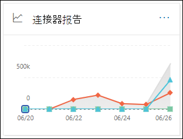
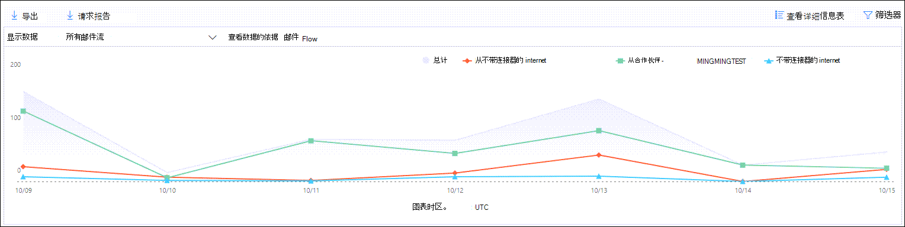
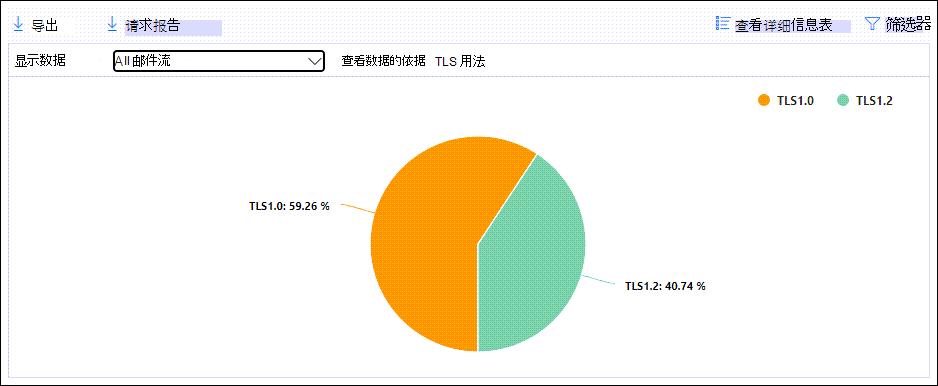
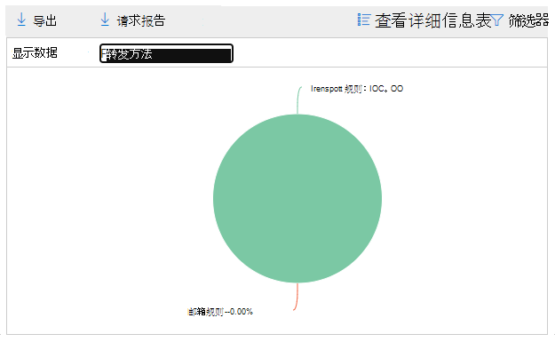
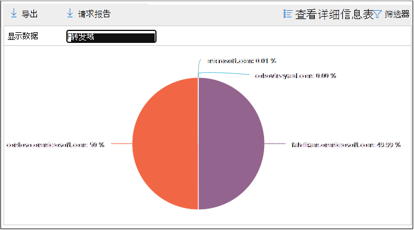
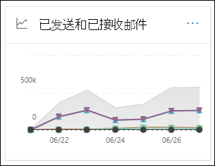

# 在安全与合规中心的"报告"仪表板中&邮件流报告

[!INCLUDE [Microsoft 365 Defender rebranding](../includes/microsoft-defender-for-office.md)]

**适用对象**
- [Exchange Online Protection](exchange-online-protection-overview.md)
- [Microsoft Defender for Office 365 计划 1 和计划 2](defender-for-office-365.md)
- [Microsoft 365 Defender](../defender/microsoft-365-defender.md)

除了安全 & 合规中心的邮件流仪表板中提供的邮件流报告之外，报告仪表板中还提供了各种其他邮件流报告，以帮助您监视 Microsoft 365 组织。

如果您具有 [必要的权限](#what-permissions-are-needed-to-view-these-reports)，可以在安全与合规中心内查看这些报告 [&"报告仪表板](https://protection.office.com) \> **"。** 若要直接转到"报表"仪表板，请打开 <https://protection.office.com/insightdashboard> 。

## 连接器报告

连接器 **报告显示** 为组织配置的 [入站](/Exchange/mail-flow-best-practices/use-connectors-to-configure-mail-flow/use-connectors-to-configure-mail-flow) 和出站连接器上的邮件流活动。

若要查看报告，请打开安全与合规 [&，转到](https://protection.office.com)**报告仪表板** \> ，然后选择连接器 **报告**。 若要直接转到报告，请打开 <https://protection.office.com/reportv2?id=ConnectorReport> 。

### 连接器报表的报表视图

以下图表可用于报表视图：

- **查看数据者：邮件流**：此图表显示组织方式的入站和出站邮件数：

  - **Total**
  - **从 Internet（不含连接器）**
  - **在没有连接器的情况下连接到 Internet**
  - 已配置的特定连接器。

  若要隔离图表中的数据，请使用"显示数据 **以** 控制"选择这些选项之一或"**所有邮件流"。**

  

- **查看数据者：TLS 使用情况**：此图显示传输层安全性 (TLS) 邮件流版本使用率的百分比。

  若要隔离图表中的数据，请使用"显示 **控件的数据** "选择以下选项之一：

  - **所有邮件流**
  - **从 Internet（不含连接器）**
  - **在没有连接器的情况下连接到 Internet**
  - 已配置的特定连接器。

  

如果 **单击筛选器中的** 报表视图，可以指定开始日期和 **结束日期的日期范围**。 

### 连接器报告的详细信息表视图

如果单击 **视图中的"** 查看详细信息"报表视图，将显示以下信息：

- "日期"
- **连接器方向和名称**
- **连接器类型**
- **强制 TLS？：** 值 **True** 或 **False**。
- **无 TLS** (百分比) 
- **TLS 1.0** (百分比) 
- **TLS 1.1** (百分比) 
- **TLS 1.2** (百分比) 
- **Volume：** 消息数。

如果在详细信息 **表** 视图中单击"筛选器"，可以指定开始日期和 **结束日期的日期范围**。 

若要返回到报告报表视图，请单击"查看 **报告"。**

## Exchange 传输规则报告

**Exchange 传输规则报告显示** 邮件流规则对组织中 (传输规则) 传入和传出邮件的影响。

若要查看报告，请打开安全与合规 [&，转到](https://protection.office.com)**报告仪表板** \> ，然后选择 **Exchange 传输规则**。 若要直接转到报告，请打开 <https://protection.office.com/reportv2?id=ETRRuleReport> 。

### Exchange 传输规则报告的报告视图

以下图表可用于报表视图：

- **查看数据者：Exchange 传输规则** \>**Break down by： Direction**： This chart shows the number of **Inbound** and **Outbound** messages that were affected by transport rules.

- **查看数据者：Exchange 传输规则** \>**按以下值进行** 分解：严重性：此图表显示高严重性和中等严重性和 **低严重性邮件的数量**。 将严重性级别设置为规则中的操作， (严重性级别审核此规则或 _SetAuditSeverity_) 。 有关详细信息，请参阅 Mail [flow rule actions in Exchange Online。](//Exchange/security-and-compliance/mail-flow-rules/mail-flow-rule-actions)

- **查看数据者：DLP Exchange 传输规则** \>**Break down by： Direction**： This chart shows the number of **Inbound** and **Outbound** messages that were affected by data loss prevention (DLP) rules. 您可以通过选择以下选项来进一步优化图表：

  - **显示数据：所有 DLP 传输规则**
  - **显示针对：遭到入侵的用户的数据**
  - **显示数据：检测到美国爱国者法案的内容量较低**

- **查看数据者：DLP Exchange 传输规则** \>**Break down by： Direction**： This view shows the number of **High severity** and **Medium severity**， and Low **severity messages** that were affected by DLP transport rules. 您可以通过选择以下选项来进一步优化图表：

  - **显示数据：所有 DLP 传输规则**
  - **显示针对：遭到入侵的用户的数据**
  - **显示数据：检测到美国爱国者法案的内容量较低**

如果 **单击筛选器中的** 报表视图，可以使用以下筛选器修改结果：

- **开始日期和****结束日期**
- 方向值
- 严重性值

### Exchange 传输规则报告的详细信息表视图

如果单击 **"查看详细信息表**"，显示的信息取决于您所查看的图表：

- **查看数据者：Exchange 传输规则**：

  - "日期"
  - **传输规则**
  - **主题**
  - **发件人地址**
  - **收件人地址**
  - **严重性**
  - **方向**

- **查看数据者：DLP Exchange 传输规则**：

  - "日期"
  - **DLP 策略**
  - **传输规则**
  - **主题**
  - **发件人地址**
  - **收件人地址**
  - **严重性**
  - **方向**

如果在详细信息 **表** 视图中单击"筛选器"，可以使用以下筛选器修改结果：

- **开始日期和****结束日期**
- 方向值
- 严重性值

若要返回到报告报表视图，请单击"查看 **报告"。**

## 转发报告

转发 **报告显示** 您的组织自动将邮件从 Exchange Online 邮箱转发到外部域。 转发的邮件可能会带来安全或合规性风险，并可能指示帐户遭到入侵。

若要查看报告，请打开安全与&中心，**转到报告**[仪表板](https://protection.office.com) \> ，然后选择 **转发报告**。 若要直接转到报告，请打开 <https://protection.office.com/reportv2?id=MailFlowForwarding> 。

### 转发报告的报表视图

下表中提供了以下报表视图：

- **显示以下方法的数据：转发方法**：显示以下方法：

  - **传输规则**：也称为邮件 [流规则](/Exchange/security-and-compliance/mail-flow-rules/mail-flow-rules)。
  - **邮箱规则**：也称为收件箱 [规则](https://support.microsoft.com/office/c24f5dea-9465-4df4-ad17-a50704d66c59)。

  

- **显示数据：转发域**：此视图显示作为转发目标收件人域。

  

- **显示以下转发器** 的数据：转发器如下所示：

  - **传输规则**
  - 包含转发收件箱规则的邮箱。

  

如果 **单击筛选器中的** 报表视图，可以指定开始日期和 **结束日期的日期范围**。 

### 转发报告的详细信息表视图

如果单击 **视图中的"** 查看详细信息"报表视图，将显示以下信息：

- **转发器**：值 **传输规则** 或包含转发收件箱规则的邮箱。
- **转发类型**：值 **Mailbox rule** 或 **Transport rule**。
- **收件人名称**
- **收件人域**
- **详细信息**：这是邮件流规则的 GUID 值或收件箱规则的 RuleIdentity 值。
- **Count**
- **第一个转发日期**

如果在详细信息 **表** 视图中单击"筛选器"，可以指定开始日期和 **结束日期的日期范围**。 

若要返回到报告视图，请单击"查看 **报告"。**

## 邮件流状态报告

邮件 **流状态报告** 类似于"已发送和已接收 [电子邮件](#sent-and-received-email-report)"报告，包含有关边缘上允许或阻止的电子邮件的其他信息。 这是包含边缘保护信息的唯一报告，它显示了在 Exchange Online Protection (EOP) 允许进入服务之前阻止的电子邮件数。 必须了解，如果将一封邮件发送给五个收件人，我们会将邮件计为五个不同的邮件，而不是一封邮件。
若要查看报告，请打开安全与合规 [&，转到](https://protection.office.com)**报告仪表板** \> ，然后选择 **邮件流状态报告**。 若要直接转到邮件 **流状态报告，** 请打开 <https://protection.office.com/mailflowStatusReport> 。

### 邮件流状态报告的类型视图

打开报表时，默认情况下 **会选中** "类型"选项卡。 默认情况下，此视图包含一个图表和一个使用以下筛选器配置的数据表：

- **日期**：最近 7 天。
- **方向**：

  - **入站**
  - **出站**
  - **组织内部**：此计数用于租户内的邮件，即 发件人 abc@domain.com 发送到收件人的邮件 xyz@domain.com (与 **入站** 和出站邮件 **分开计算)**

- **类型**：

  - **良好的邮件**
  - **恶意软件**
  - **垃圾邮件**
  - **边缘保护**
  - **规则邮件**
  - **钓鱼电子邮件**

图表按 Type **值组织** 。

可以通过单击"筛选器 **"或单击** 图表图例中的值来更改这些筛选器。

该数据表包含以下信息：

- **方向**
- **类型**
- **24 小时**
- **3 天**
- **7 天**
- **15 天**
- **30 天**

If you click **Choose a category for more details**， you can select from the following values：

- **网络钓鱼电子邮件**：此选择将你带至 [威胁防护状态报告](view-email-security-reports.md#threat-protection-status-report)。
- **电子邮件中的恶意软件**：此选择将你带至 [威胁防护状态报告](view-email-security-reports.md#threat-protection-status-report)。
- **垃圾邮件检测**：此选择将你带至 [垃圾邮件检测报告](view-email-security-reports.md#spam-detections-report)。
- **边缘阻止的垃圾邮件**：此选择将你带至 [垃圾邮件检测报告](view-email-security-reports.md#spam-detections-report)。

**导出**：

对于详细信息视图，只能导出一天的数据。 因此，如果要导出 7 天的数据，需要执行 7 种不同的导出操作。

每个导出的 .csv 文件限制为 150，000 行。 如果当天的数据包含超过 150，000 行，将创建多个 .csv 文件。

### 邮件流状态报告的方向视图

如果单击" **方向"** 选项卡，则使用"类型"视图中 **的相同** 默认筛选器。

图表按 Direction **值** 组织。

可以通过单击"筛选器 **"或单击** 图表图例中的值来更改这些筛选器。 使用"类型" **视图中的** 相同筛选器。

该数据表包含"类型"视图中 **的相同** 信息。

" **选择类别"了解更多详细信息** 可用的选择和行为与"类型 **"视图相同** 。

**导出**：

对于详细信息视图，只能导出一天的数据。 因此，如果要导出 7 天的数据，需要执行 7 种不同的导出操作。

每个导出的 .csv 文件限制为 150，000 行。 如果当天的数据包含超过 150，000 行，将创建多个 .csv 文件。

### 邮件流状态报告的漏斗视图

漏 **斗** 视图显示 Microsoft 的电子邮件威胁防护功能如何筛选组织中传入和传出的电子邮件。 它提供有关总电子邮件计数以及配置的威胁防护功能（包括边缘保护、反恶意软件、反网络钓鱼、反垃圾邮件和反欺骗）如何影响此计数的详细信息。

如果单击" **漏斗"** 选项卡，默认情况下，此视图包含一个图表和一个使用以下筛选器配置的数据表：

- **日期**：最近 7 天。

- **方向**：

  - **入站**
  - **出站**
  - **组织内部**：此计数用于租户内发送的邮件;即，发件人 abc@domain.com 收件人的邮件 xyz@domain.com (入站和出站邮件分开计算) 。

聚合视图和数据表视图允许筛选 90 天。

如果单击 **"筛选器**"，可以同时筛选图表和数据表。

此图表显示按以下方式组织的电子邮件计数：

- **电子邮件总数**
- **边缘保护后的电子邮件**
- **反恶意软件后的电子邮件， 文件信誉， 文件类型阻止**
- **反网络钓鱼后的电子邮件， URL 信誉， 品牌模拟， 反欺骗**
- **反垃圾邮件、批量邮件筛选后的电子邮件**
- **用户和域模拟之后的电子邮件**1
- **文件和 URL 触发**1之后的电子邮件
- **在传递后保护或 URL 单击时间保护 (检测为安全)**

仅 1 个 Defender for Office 365

若要查看由 EOP 或 Defender for Office 365 单独筛选的电子邮件，请单击图表图例中的值。

该数据表包含以下信息，按降序日期顺序显示：

- "日期"
- **电子邮件总数**
- **边缘保护**
- **反恶意软件， 文件信誉， 文件类型阻止**：
  - **文件信誉**：由于其他 Microsoft 客户标识的附加文件而筛选的邮件。
  - **文件类型阻止**：由于邮件中标识的恶意文件类型而筛选的邮件。
- **反网络钓鱼， URL 信誉， 品牌模拟， 反欺骗**：
  - **URL 信誉**：由于其他 Microsoft 客户标识的 URL 而筛选的邮件。
  - **品牌模拟**：由于来自已知品牌模拟发件人的邮件而筛选的邮件。
  - **反欺骗**：由于邮件试图欺骗收件人所属的域或邮件发件人不属于的域而筛选的邮件。
- **反垃圾邮件，批量邮件筛选**：
  - **批量邮件筛选**：由于尝试将批量邮件传递至收件人而筛选的邮件。
- **Office 365 (Defender 中的** 用户和) ：
  - 用户模拟：由于尝试模拟用户 (邮件发件人) （在反网络钓鱼策略的模拟保护设置中定义）而筛选的邮件。
  - **域模拟**：由于尝试模拟在反网络钓鱼策略的模拟保护设置中定义的域而筛选的邮件。
- **Office 365 (Defender 的文件和 URL) ：**
  - **文件触发**：由安全附件策略筛选的邮件。
  - **URL 触发**：由安全链接策略筛选的邮件。
- **传递后保护和 ZAP (ATP) 或 ZAP (EOP)**：ZAP 表示零时差自动清除。

如果在数据表中选择一行，则电子邮件计数的进一步细分将显示在该飞出区中。

**导出**：

单击"选项 **"** 下的 **"** 导出"后，可以选择下列值之一：

- **摘要 (最近 90 天的数据汇总)**
- **有关 (最近 30 天的数据的详细信息)**

在 **"日期**"下，选择一个范围，然后单击"应用 **"。** 当前筛选器的数据将导出到 .csv 文件。

每个导出的 .csv 文件限制为 150，000 行。 如果数据包含超过 150，000 行，将创建多个 .csv 文件。

 

### 邮件流状态报告的技术视图

" **技术"** 视图类似于漏 **斗视图** ，提供有关配置的威胁防护功能的更具体的详细信息。 从图中，你可以看到如何在威胁防护的不同阶段对邮件进行分类。

如果单击" **技术视图** "选项卡，默认情况下，此视图包含一个图表和一个使用以下筛选器配置的数据表：

- **日期**：最近 7 天。

- **方向**：

  - **入站**
  - **出站**
  - **组织内部**：此计数用于租户内的邮件，即 发件人 abc@domain.com 发送到收件人的邮件 xyz@domain.com (与入站和出站邮件分开计数) 

聚合视图和数据表视图允许筛选 90 天。

如果单击 **"筛选器**"，可以同时筛选图表和数据表。

此图显示按以下类别组织的邮件：

- **电子邮件总数**
- **边缘允许** 和 **边缘筛选**
- **非恶意软件**、**安全附件检测** \* 、**反恶意软件引擎检测和****规则邮件**
- **非网络钓鱼****、DMARC 失败**、**模拟检测**、**欺骗检测和****钓鱼检测**
- **无需检测 URL 触发和** **URL 触发检测**\*
- **不是垃圾邮件** 和  **垃圾邮件**
- **非恶意电子邮件**、**安全链接检测和** \* **ZAP**

\* Defender for Office 365

将鼠标悬停在图表中的类别上时，可以看到该类别中的消息数。

该数据表包含以下信息，按降序日期顺序显示：

- "日期"
- **电子邮件总数**
- **已筛选边缘**
- **反恶意软件引擎，安全附件，已筛选规则**：
  - **已筛选规则**：由于邮件流规则而筛选 (也称为传输规则) 。
- **DMARC， 模拟， 欺骗， 网络钓鱼筛选：**
  - **DMARC：** 由于邮件未通过 DMARC 身份验证检查而筛选的邮件。
- **URL 触发检测**
- **已筛选反垃圾邮件**
- **ZAP 已删除**
- **通过安全链接检测**

如果在数据表中选择一行，则电子邮件计数的进一步细分将显示在该飞出区中。

**导出**：

单击" **导出"，** 在" **选项** "下，可以选择下列值之一：

- **摘要 (最近 90 天的数据汇总)**
- **有关 (最近 30 天的数据的详细信息)**

在 **"日期**"下，选择一个范围，然后单击"应用 **"。** 当前筛选器的数据将导出到 .csv 文件。

每个导出的 .csv 文件限制为 150，000 行。 如果数据包含超过 150，000 行，将创建多个 .csv 文件。

 

## 已发送和已接收电子邮件报告

" **已发送和** 已接收电子邮件"报告是一个智能报告，它显示有关传入和传出电子邮件的信息，包括垃圾邮件检测、恶意软件和标识为"良好"的电子邮件。 此报告与邮件流状态报告之间的区别在于：此报告不包含有关被边缘保护阻止的邮件的数据。必须了解，如果将一封邮件发送给五个收件人，我们会将邮件计为一封邮件。

聚合视图和报告的详细视图允许筛选 90 天。

若要查看报告，请打开安全与&中心，转到报告 [仪表板](https://protection.office.com) \> ，然后选择 **已发送和已接收的电子邮件**。 若要直接转到报告，请打开 <https://protection.office.com/reportv2?id=SentAndReceivedMailATP> 。

### 已发送和已接收电子邮件报告的报告视图

下表中提供了以下报表视图：

- **分类：类型**：图表显示所有可用类别：

  - **Total**
  - **良好的邮件**
  - **EOP (反恶意软件)  (** 恶意软件) 
  - **垃圾邮件检测**
  - **规则邮件**
  - Microsoft **Defender** for Office 365 (高级恶意软件) 

  当您将鼠标悬停在图表中 (一) ，可以看到当天的详细信息。

  

- **按：方向：** 图表显示 **总计**、 **入站** 和 **出站** 数据。 当您将鼠标悬停在图表中 (一) ，可以看到当天的详细信息。

  

- **向下钻取** \>**恶意软件 (反恶意软件) ：** 此选择将你带至电子邮件 [报告中的恶意软件检测](view-email-security-reports.md#malware-detections-in-email-report)。

- **向下钻取** \>**垃圾邮件检测) ：** 此选择将您带至 [垃圾邮件检测报告](view-email-security-reports.md#spam-detections-report)。

如果 **单击筛选器** 中的报表视图，可以使用以下筛选器修改结果：

- **开始日期和****结束日期**
- 方向值
- 类型值

若要返回到报告报表视图，请单击"查看 **报告"。**

### 已发送和已接收电子邮件报告的详细信息表视图

如果在"**中断者：** 方向"或"中断者：方向"视图中单击"查看详细信息"表，将显示以下信息：

- **Date (UTC)**
- **类型**
- **方向**
- **邮件计数**

如果在详细信息 **表** 视图中单击"筛选器"，可以使用以下筛选器修改结果：

- **开始日期和****结束日期**
- 方向值
- 类型值

若要返回到报告报表视图，请单击"查看 **报告"。**

## 首要发件人和收件人报告

The **Top senders and recipients** report is a pie chart showing your top email senders and recipients.

若要查看报告，请打开安全与合规&，**转到"** 报告 [仪表板](https://protection.office.com)"，然后选择" \> **顶级发件人和收件人"。** 若要直接转到报告，请打开 <https://protection.office.com/reportv2?id=TopSenderRecipientsATP> 。

### 顶级发件人和收件人报告的报告视图

下表中提供了以下报表视图：

- **显示热门 \> 邮件发件人的数据**
- **显示热门 \> 邮件收件人的数据**
- **显示热门 \> 垃圾邮件收件人的数据**
- **显示数据 \>** EOP 邮件 (恶意软件) 
- **在 Defender for \> Office 365 (中显示热门恶意软件收件人)**

饼图的组成将基于这些选择进行更改。

将鼠标悬停在饼图中的一个浮点上时，可以看到已发送或已接收邮件的计数。

如果 **单击筛选器中的** 报表视图，可以指定开始日期和 **结束日期的日期范围**。 

### "热门发件人和收件人"报告的详细信息表视图

如果单击 **"查看详细信息表**"，显示的信息取决于您所查看的图表：

- **显示热门 \> 邮件发件人的数据**

  - **热门邮件发件人**
  - **Count**

- **显示热门 \> 邮件收件人的数据**

  - **热门邮件收件人**
  - **Count**

- **显示热门 \> 垃圾邮件收件人的数据**

  - **热门垃圾邮件收件人**
  - **Count**

- **显示数据 \>** EOP 邮件 (恶意软件) 

  - **热门恶意软件收件人**
  - **Count**

- **在 Defender for \> Office 365 (中显示热门恶意软件收件人)**

  - **适用于 Office 365 (Defender 的热门恶意软件)**
  - **Count**

如果在详细信息 **表** 视图中单击"筛选器"，可以指定开始日期和 **结束日期的日期范围**。 

若要返回到报告报表视图，请单击"查看 **报告"。**

## 查看这些报告需要哪些权限？

若要查看和使用本文中所述的报告，你需要是安全与合规中心内以下角色&之一：

- **组织管理**
- **安全管理员**
- **安全读者**
- **全局读者**

有关详细信息，请参阅 [安全与合规中心的权限](permissions-in-the-security-and-compliance-center.md)。

> [!NOTE]
> 向 Microsoft 365 管理中心相应的 Azure 活动目录添加用户会向其提供安全与合规中心的必备权限 _以及_ Microsoft 365其它功能的权限。 有关详细信息，请参阅 [关于管理员角色](../../admin/add-users/about-admin-roles.md)。

## 相关主题

[安全与合规中心内的智能报告和见解](reports-and-insights-in-security-and-compliance.md)

[安全与合规中心内的邮件流见解](mail-flow-insights-v2.md)

[查看安全与合规中心内的电子邮件安全报告](view-email-security-reports.md)

[查看适用于 Office 365 的 Microsoft Defender 报告](view-reports-for-mdo.md)
