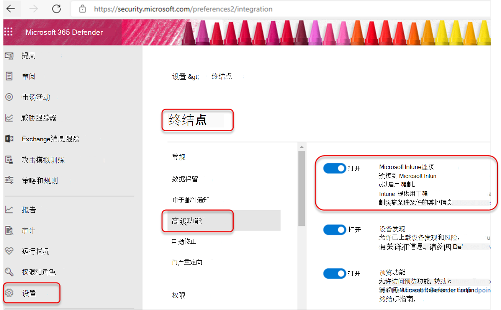
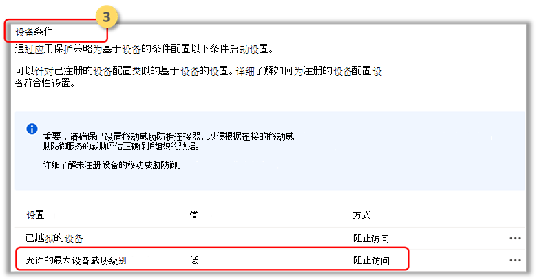
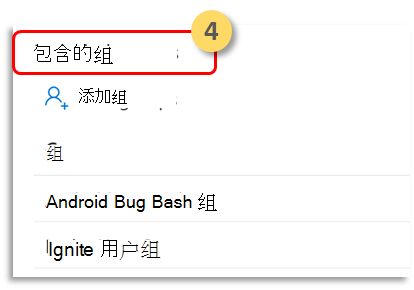

# 使用应用保护策略配置 Microsoft Defender for Endpoint 风险信号 (MAM) 

[!INCLUDE [Microsoft 365 Defender rebranding](../../includes/microsoft-defender.md)]

**适用于：**
- [Microsoft Defender for Endpoint](https://go.microsoft.com/fwlink/p/?linkid=2154037)
- [Microsoft 365 Defender](https://go.microsoft.com/fwlink/?linkid=2118804)

Microsoft Defender for Endpoint Android 已在移动设备管理 (MDM) 方案中保护企业用户，现在扩展支持移动应用管理 (MAM) 。 此功能允许您在应用程序中管理和保护组织的数据。

Intune 应用保护策略利用 Microsoft Defender for Endpoint Android 威胁信息来保护这些应用。 APP (保护策略) 保护策略是一些确保组织数据保持安全或包含在托管应用中的规则。 托管应用程序应用了应用保护策略，并且可通过 Intune 进行管理。  

Microsoft Defender for Endpoint (Mobile) 支持 MAM 的两种配置
- **Intune MDM + MAM：IT** 管理员只能在使用 Intune 移动设备管理或 MDM) 注册的设备上使用应用保护策略管理 (应用。
- **未注册设备的 MAM：** 没有设备注册的 MAM 或 MAM-WE 允许 IT 管理员在未注册 Intune MDM 的设备上使用应用保护策略管理应用。 这意味着应用可以在注册到第三方 EMM 提供程序的设备上由 Intune 管理。 若要在以上两种配置中管理应用，客户应在管理中心Microsoft Endpoint Manager [Intune](https://go.microsoft.com/fwlink/?linkid=2109431)

若要启用此功能，管理员需要配置 Microsoft Defender for Endpoint 和 Intune 之间的连接、创建应用保护策略，以及将策略应用于目标设备和应用程序。 
 
最终用户还需要采取措施，在设备上安装 Microsoft Defender for Endpoint 并激活载入流程。

## 管理员先决条件

- **验证 Microsoft Defender for Endpoint-Intune连接器是否已启用**

  a. 转到 security.microsoft.com。 

  b. 选择 **设置 >终结点>连接> Microsoft Intune"** 高级功能"。

  c. 如果连接未打开，请选择该开关将其打开，然后选择"保存 **首选项"。**

  

  d. 转到 **"Microsoft Endpoint Manager (Intune**) 并验证 Microsoft Defender for Endpoint-Intune 连接器是否已启用。

  

- **启用适用于 Endpoint 的 Microsoft Defender (Mobile) Connector for App Protection Policy (APP)**
  
  配置 Intune 上的连接器Microsoft Endpoint Manager应用保护策略：

  a. 转到租户 **管理 > 连接器和令牌> Microsoft Defender for Endpoint**。

  b. 打开 Android 和 iOS 应用保护策略的 (如以下屏幕截图中所示) 。

  c. 选择“**保存**”。

  

- **创建应用保护策略** 
 
通过创建应用保护策略，基于 Microsoft Defender for Endpoint 风险信号阻止访问或擦除托管应用的数据。
Microsoft Defender for Endpoint 可以配置为发送要用于应用保护策略 (应用（也称为 MAM) ）。 借助此功能，可以使用 Microsoft Defender for Endpoint 保护托管应用。

1. 创建策略  
APP (保护策略) 保护策略是一些确保组织数据保持安全或包含在托管应用中的规则。 策略可以是在用户尝试访问或移动"公司"数据时强制执行的规则，或者是在用户位于应用内时禁止或监视的一组操作。 

2. 添加应用  
    a. 选择要如何将此策略应用到不同设备上的应用。 然后至少添加一个应用。  
    使用此选项指定此策略是否适用于非托管设备。 对于 Android，你可以指定适用于 Android Enterprise、设备管理员或非托管设备的策略。 还可以选择将策略定向到任何管理状态设备上的应用。
由于移动应用管理不需要设备管理，因此你可以保护托管和未托管设备上的公司数据。 管理以用户标识为中心，这将删除设备管理的要求。 公司可以同时使用具有或不使用 MDM 的应用保护策略。 例如，考虑使用公司颁发的电话和其自己的个人平板电脑的员工。 公司手机在 MDM 中注册，并受应用保护策略保护，而个人设备仅受应用保护策略保护。

    b. 选择应用 
    托管应用是应用了应用保护策略的应用，并且可以通过 Intune 进行管理。 任何已与[Intune SDK](/mem/intune/developer/app-sdk)集成或由[Intune](/mem/intune/developer/apps-prepare-mobile-application-management) App Wrapping Tool的应用都可以使用 Intune 应用保护策略进行管理。 请参阅[已使用Microsoft Intune](/mem/intune/apps/apps-supported-intune-apps)构建且可供公共使用的受保护应用的官方列表。

    *示例：Outlook托管应用*

    

 3. 设置保护策略的登录安全要求。  
在 **">条件"中选择** "设置允许的最大设备 **威胁级别"，** 然后输入一个值。 然后选择操作 **："阻止访问"。** Microsoft Defender for Endpoint (Mobile) 共享此设备威胁级别。

    

- **分配需要为其应用策略的用户组。** 
  选择 **"包含的组"。** 然后添加相关组。 

    

## 最终用户先决条件
- 需要安装代理应用
    - Android：Intune 公司门户
    
- 用户具有托管应用所需的许可证，并且安装了该应用

### 最终用户载入 

1. 登录到托管应用程序，例如Outlook。 设备已注册，并且应用程序保护策略已同步到设备。 应用程序保护策略可识别设备的运行状况。  

2. 选择 **继续**。 显示一个屏幕，建议下载和设置适用于 Endpoint Android 应用的 Microsoft Defender。

3. 选择 **下载**。 你将重定向到 Google play (应用商店) 。 

4.  安装 Microsoft Defender for Endpoint (Mobile) 应用并启动"托管应用载入"屏幕。

  

5.  单击 **"继续>启动"。** Microsoft Defender for Endpoint 应用载入/激活流已启动。 按照步骤完成载入。 将自动重定向回托管应用载入屏幕，现在指示设备运行正常。

6. 选择 **"** 继续"以登录到托管应用程序。 

## 相关主题

- [Android 上的 Microsoft Defender for Endpoint 概述](microsoft-defender-endpoint-android.md)
- [使用 Microsoft Intune 在 Android 上部署 Microsoft Defender for Endpoint](android-intune.md)
