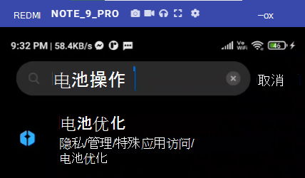
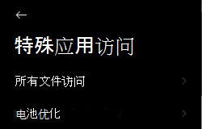
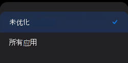
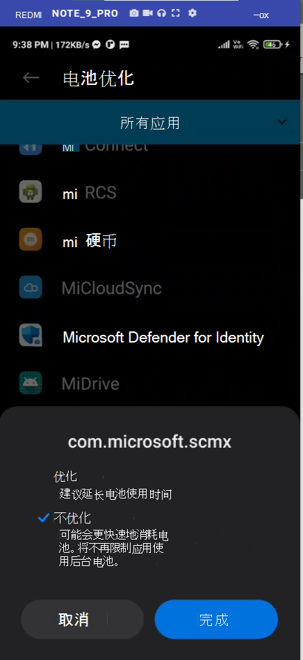

# 排查 Android 上 Microsoft Defender for Endpoint 的问题

[!INCLUDE [Microsoft 365 Defender rebranding](../../includes/microsoft-defender.md)]

**适用于：**
- [Microsoft Defender for Endpoint 计划 1](https://go.microsoft.com/fwlink/p/?linkid=2154037)
- [Microsoft Defender for Endpoint 计划 2](https://go.microsoft.com/fwlink/p/?linkid=2154037)
- [Microsoft 365 Defender](https://go.microsoft.com/fwlink/?linkid=2118804)

> 希望体验 Microsoft Defender for Endpoint？ [注册免费试用版](https://signup.microsoft.com/create-account/signup?products=7f379fee-c4f9-4278-b0a1-e4c8c2fcdf7e&ru=https://aka.ms/MDEp2OpenTrial?ocid=docs-wdatp-exposedapis-abovefoldlink)。

在载入设备时，你可能会在安装应用后看到登录问题。

在载入期间，在设备上安装应用后，你可能会遇到登录问题。

本文提供的解决方案可帮助解决登录问题。

## 登录失败 - 意外错误

**登录失败：意外***错误，请稍后尝试*

:::image type="content" alt-text="登录失败错误意外错误的图像。" source="images/f9c3bad127d636c1f150d79814f35d4c.png":::

**消息：**

意外错误，请稍后尝试

**原因：**

设备上安装了较旧版本的"Microsoft Authenticator"应用。

**解决方案：**

从 Google Play 应用商店[Microsoft Authenticator](https://play.google.com/store/apps/details?id=com.azure.authenticator)最新版本和版本，然后重试。

## 登录失败 - 许可证无效

**登录失败：许可证***无效，请联系管理员*

:::image type="content" alt-text="登录失败的图像请联系管理员。" source="images/920e433f440fa1d3d298e6a2a43d4811.png":::

**邮件：***许可证无效，请联系管理员*

**原因：**

您未分配Microsoft 365许可证，或者您的组织没有用于订阅Microsoft 365 企业版许可证。

**解决方案：**

请与管理员联系以寻求帮助。

## 报告不安全网站

网络钓鱼网站会模拟可信赖的网站，以获取你的个人或财务信息。 如果要 [报告可能是网络钓鱼](https://www.microsoft.com/wdsi/filesubmission/exploitguard/networkprotection) 网站的网站，请访问提供有关网络保护的反馈页面。

## 某些 OEM 设备上不会阻止网络钓鱼页面

**适用于：** 仅特定 OEM

- **小米**

某些用户不会阻止 Defender for Android 终结点检测到的网络钓鱼和有害的 Web 威胁。 以下功能在这些设备上不起作用。

**原因：**

用户设备包括新的权限模型。 这将阻止 Defender for Endpoint for Android 在后台运行时显示弹出窗口。

用户权限："在后台运行时显示弹出窗口"。

**解决方案：**

对一些设备启用所需的权限。

- 在后台运行时显示弹出窗口。

## 在某些 OEM 设备上载入期间，无法允许"永久保护"的权限

**适用于：** 仅特定 OEM 设备。

- **使用 Android 11 的一位小马**

作为应用载入的一部分，Defender 应用会要求在设备上使用电池优化/永久保护权限，选择"允许"将返回无法设置权限的错误。 它只影响最后一个称为"永久保护"的权限。 

**原因：**

在 Android 11 中，用户更改了电池优化权限。 不允许 Defender for Endpoint 将此设置配置为忽略电池优化。

**解决方案：**

我们正在与 OEM 合作，通过应用载入屏幕查找启用此权限的解决方案。 在解决此问题时，我们将更新文档。
用户可以按照以下步骤从设备设置启用相同的权限： 

1. 转到 **设置** 上的"设置"。

2. 搜索并选择电池 **优化**。

   

3. 在 **"特殊应用访问"中**，选择 **"电池优化"。**

   

4. 将下拉列表更改为显示 **所有应用**。

   

   

5. 找到"适用于终结点的 Microsoft Defender"，然后选择 **"不优化"。**

   

返回到适用于终结点的 Microsoft Defender 载入屏幕，选择"允许"，你将重定向到仪表板屏幕。

## 发送应用内反馈

如果用户面临以上部分中尚未解决的问题，或者无法使用列出的步骤解决问题，则用户可以提供应用内 **反馈以及诊断****数据**。 然后，我们团队可以调查日志以提供正确的解决方案。 用户可以按照以下步骤执行相同的操作：

1.  在设备上 **打开 MDE** 应用程序，然后单击左上角的配置文件图标。

    :::image type="content" alt-text="单击配置文件图标。" source="images/select-profile-icon-1.jpg":::

2.  选择"帮助&反馈"。

    :::image type="content" alt-text="选择帮助和反馈。" source="images/selecthelpandfeedback2.png":::

3.  选择"向 Microsoft 发送反馈"。

    :::image type="content" alt-text="选择&quot;向 Microsoft 发送反馈&quot;。" source="images/send-feedback-to-microsoft-3.jpg":::

4.  从给定选项中进行选择。 若要报告问题，请选择"我想报告问题"。

    :::image type="content" alt-text="报告问题。" source="images/report-issue-4.jpg":::

5.  提供你所面临的问题的详细信息并检查"发送诊断数据"。 我们建议选中"包括你的电子邮件地址"，以便团队可以使用解决方案或跟进联系你。

    :::image type="content" alt-text="添加详细信息并附加诊断数据。" source="images/finalsubmit5.png":::

6.  单击"提交"以成功发送反馈。
