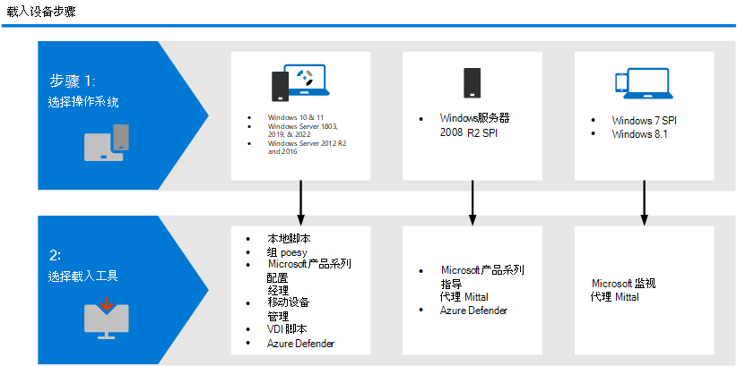

# 适用于 Defender for Endpoint 中 Windows设备的载入工具和方法

[!INCLUDE [Microsoft 365 Defender rebranding](../../includes/microsoft-defender.md)]

**适用于：**
- [Microsoft Defender for Endpoint](https://go.microsoft.com/fwlink/p/?linkid=2154037)
- [Microsoft 365 Defender](https://go.microsoft.com/fwlink/?linkid=2118804)
- [Microsoft 365DLP (终结点数据丢失) ](/microsoft-365/compliance/endpoint-dlp-learn-about)
- [Microsoft 365内部风险管理](/microsoft-365/compliance/insider-risk-management)

> 想要体验适用于终结点的 Defender？ [注册免费试用版](https://signup.microsoft.com/create-account/signup?products=7f379fee-c4f9-4278-b0a1-e4c8c2fcdf7e&ru=https://aka.ms/MDEp2OpenTrial?ocid=docs-wdatp-assignaccess-abovefoldlink)。

必须配置组织中设备，以便 Defender for Endpoint 服务可以从这些设备获取传感器数据。 可以使用多种方法和部署工具来配置贵组织的设备。

通常，你将确定要Windows的设备，然后按照适合设备或环境的相应工具操作。

## 终结点载入工具
根据要Windows的终结点，使用下表中描述的相应工具或方法。

Windows设备 | 载入工具或方法
:---|:---
|<ul><li> Windows 10</li> <li>Windows服务器 1803、2019 和 2022</li> <li>Windows Server 2012R2 和 2016  [[1](#fn1)]</li></ul>  |   [本地脚本 (最多 10 台设备) ](configure-endpoints-script.md)    [组策略](configure-endpoints-gp.md)    [Microsoft Endpoint Configuration Manager](configure-endpoints-sccm.md)   [Microsoft Endpoint Manager/Intune (移动设备管理) ](configure-endpoints-mdm.md)     [VDI 脚本](configure-endpoints-vdi.md)    **注意**：本地脚本适用于概念证明，但不应用于生产部署。 对于生产部署，我们建议使用组策略、Microsoft Endpoint Configuration Manager或 Intune。
|<ul><li> Windows Server 2008 R2 SP1 </li></ul>| [Microsoft Monitoring Agent (MMA) ](onboard-downlevel.md)  [载入以前版本的 Windows](onboard-downlevel.md) [或 Azure Defender](/azure/security-center/security-center-wdatp)    **注意**：Microsoft Monitoring Agent现在为 Azure Log Analytics 代理。 若要了解更多信息，请参阅 [Log Analytics agent overview](/azure/azure-monitor/platform/log-analytics-agent)。  
|<ul><li> Windows 7 SP1 </li> <li>  Windows 7 SP1 Pro </li> <li>  Windows 8.1 专业版 </li> <li> Windows 8.1 企业版</li></ul>  | [Microsoft Monitoring Agent (MMA) ](onboard-downlevel.md)    **注意**：Microsoft Monitoring Agent现在为 Azure Log Analytics 代理。 若要了解更多信息，请参阅 [Log Analytics agent overview](/azure/azure-monitor/platform/log-analytics-agent)。

 (<a id="fn1">1</a>) Windows Server 2016和 Windows Server 2012 R2 将需要按照载入服务器中的说明[Windows载入](configure-server-endpoints.md#windows-server-2012-r2-and-windows-server-2016)。

主题|说明
:---|:---
[使用组策略载入设备](configure-endpoints-gp.md)|使用组策略在设备上部署配置包。
[使用 Microsoft Endpoint Configuration Manager 载入设备](configure-endpoints-sccm.md)|可以使用 Microsoft Endpoint Manager (当前分支) 版本 1606 或 Microsoft Endpoint Manager (current branch) 版本 1602 或更早版本在设备上部署配置包。
[使用移动设备管理工具载入设备](configure-endpoints-mdm.md)|使用移动设备管理工具或Microsoft Intune在设备上部署配置包。
[使用本地脚本载入设备](configure-endpoints-script.md)|了解如何使用本地脚本在终结点上部署配置包。
[载入非永久虚拟桌面基础结构 （VDI） 设备](configure-endpoints-vdi.md)|了解如何使用配置包配置 VDI 设备。

> 想要体验适用于终结点的 Defender？ [注册免费试用版](https://signup.microsoft.com/create-account/signup?products=7f379fee-c4f9-4278-b0a1-e4c8c2fcdf7e&ru=https://aka.ms/MDEp2OpenTrial?ocid=docs-wdatp-configureendpoints-belowfoldlink)。

载入设备后，你可以选择运行检测测试，以验证设备是否正确载入到服务。 有关详细信息，请参阅对新载入的 [Microsoft Defender for Endpoint](run-detection-test.md)设备运行检测测试。