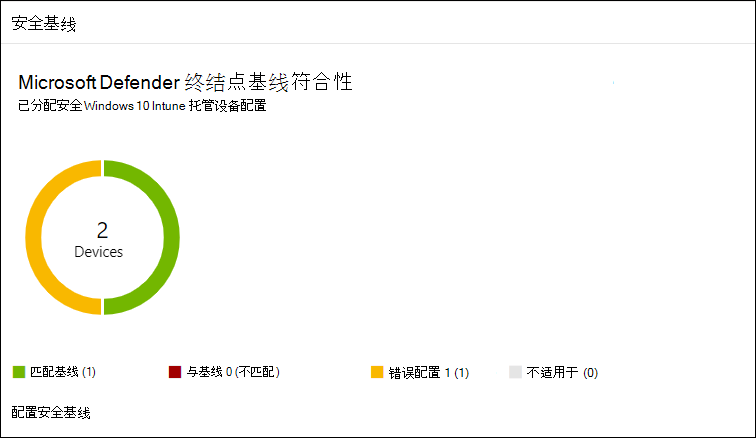

# 提高 Microsoft Defender 终结点安全基线的合规性Increase compliance to the Microsoft Defender for Endpoint security baseline

[!INCLUDE [Microsoft 365 Defender rebranding](../../includes/microsoft-defender.md)]

**适用于：****Applies to:**
- [Microsoft Defender for EndpointMicrosoft Defender for Endpoint](https://go.microsoft.com/fwlink/p/?linkid=2154037)
- [Microsoft 365 DefenderMicrosoft 365 Defender](https://go.microsoft.com/fwlink/?linkid=2118804)

>想要体验适用于终结点的 Defender？Want to experience Defender for Endpoint? [注册免费试用版。Sign up for a free trial.](https://www.microsoft.com/microsoft-365/windows/microsoft-defender-atp?ocid=docs-wdatp-onboardconfigure-abovefoldlink)

安全基线可确保根据安全专家和专家 Windows 系统管理员的指导配置安全功能。Security baselines ensure that security features are configured according to guidance from both security experts and expert Windows system administrators. 部署后，Defender for Endpoint 安全基线将设置 Defender for Endpoint 安全控件以提供最佳保护。When deployed, the Defender for Endpoint security baseline sets Defender for Endpoint security controls to provide optimal protection.

若要了解安全基线以及如何使用配置文件在 Intune 上分配这些基线， [请阅读此常见问题](https://docs.microsoft.com/intune/security-baselines#q--a)解答。To understand security baselines and how they are assigned on Intune using configuration profiles, [read this FAQ](https://docs.microsoft.com/intune/security-baselines#q--a).

在部署和跟踪安全基线的合规性之前：Before you can deploy and track compliance to security baselines:
- [将设备注册到 Intune 管理Enroll your devices to Intune management](configure-machines.md#enroll-devices-to-intune-management)
- [确保您具有必要的权限Ensure you have the necessary permissions](configure-machines.md#obtain-required-permissions)

## 比较 Microsoft Defender for Endpoint 和 Windows Intune 安全基线Compare the Microsoft Defender for Endpoint and the Windows Intune security baselines
Windows Intune 安全基线提供了一组全面的建议设置，用于安全配置运行 Windows 的设备，包括浏览器设置、PowerShell 设置以及某些安全功能（如 Microsoft Defender 防病毒）的设置。The Windows Intune security baseline provides a comprehensive set of recommended settings needed to securely configure devices running Windows, including browser settings, PowerShell settings, as well as settings for some security features like Microsoft Defender Antivirus. 相比之下，Defender for Endpoint 基线提供了优化 Defender for Endpoint 堆栈中所有安全控件的设置，包括终结点检测和响应 (EDR) 的设置以及 Windows Intune 安全基线中的设置。In contrast, the Defender for Endpoint baseline provides settings that optimize all the security controls in the Defender for Endpoint stack, including settings for endpoint detection and response (EDR) as well as settings also found in the Windows Intune security baseline. 有关每个基线详细信息，请参阅：For more information about each baseline, see:

- [Intune 的 Windows 安全基线设置Windows security baseline settings for Intune](https://docs.microsoft.com/intune/security-baseline-settings-windows)
- [Intune 的 Microsoft Defender for Endpoint 基线设置Microsoft Defender for Endpoint baseline settings for Intune](https://docs.microsoft.com/intune/security-baseline-settings-defender-atp)

理想情况下，已载入 Defender for Endpoint 的设备同时部署两个基线：Windows Intune 安全基线最初用于保护 Windows，然后是分层分层的 Defender for Endpoint 安全基线，以最佳方式配置 Defender for Endpoint 安全控件。Ideally, devices onboarded to Defender for Endpoint are deployed both baselines: the Windows Intune security baseline to initially secure Windows and then the Defender for Endpoint security baseline layered on top to optimally configure the Defender for Endpoint security controls. 若要从有关风险和威胁的最新数据中获益，并随着基线的不断发展最大程度地减少冲突，请始终在发布所有产品后对所有产品应用基线的最新版本。To benefit from the latest data on risks and threats and to minimize conflicts as baselines evolve, always apply the latest versions of the baselines across all products as soon as they are released.

>[!NOTE]
>Defender for Endpoint 安全基线已针对物理设备进行了优化，当前不建议在虚拟机 (VM 或 VDI) 使用。The Defender for Endpoint security baseline has been optimized for physical devices and is currently not recommended for use on virtual machine (VMs) or VDI endpoints. 某些基线设置可能会影响虚拟化环境的远程交互式会话。Certain baseline settings can impact remote interactive sessions on virtualized environments.

## 监视对 Defender for Endpoint 安全基线的合规性Monitor compliance to the Defender for Endpoint security baseline

设备 **配置** 管理上的安全基线 [卡](configure-machines.md) 概述了分配了 Defender for Endpoint 安全基线的 Windows 10 设备的合规性。The **Security baseline** card on [device configuration management](configure-machines.md) provides an overview of compliance across Windows 10 devices that have been assigned the Defender for Endpoint security baseline.

 
*显示 Defender for Endpoint 安全基线合规性的卡片**Card showing compliance to the Defender for Endpoint security baseline*

每台设备都给定以下状态类型之一：Each device is given one of the following status types:

- **匹配基线**- 设备设置与基线中的所有设置匹配**Matches baseline**—device settings match all the settings in the baseline
- **与基线不匹配**— 至少一个设备设置与基线不匹配**Does not match baseline**—at least one device setting doesn't match the baseline
- **配置错误**— 设备上未正确配置至少一个基线设置，并且处于冲突、错误或挂起状态**Misconfigured**—at least one baseline setting isn't properly configured on the device and is in a conflict, error, or pending state
- **不适用**— 设备上至少有一个基线设置不适用**Not applicable**—At least one baseline setting isn't applicable on the device

若要查看特定设备，请选择 **"在卡上** 配置安全基线"。To review specific devices, select **Configure security baseline** on the card. 这会将你带去 Intune 设备管理。This takes you to Intune device management. 从其中， **为设备的** 名称和状态选择设备状态。From there, select **Device status** for the names and statuses of the devices.

>[!NOTE]
>在设备配置管理页面上显示的聚合数据以及 Intune 中的概述屏幕上显示的聚合数据中，你可能会遇到差异。You might experience discrepancies in aggregated data displayed on the device configuration management page and those displayed on overview screens in Intune.

## 查看并分配 Microsoft Defender for Endpoint 安全基线Review and assign the Microsoft Defender for Endpoint security baseline

设备配置管理仅监视专门分配了 Microsoft Defender 终结点安全基线的 Windows 10 设备的基线合规性。Device configuration management monitors baseline compliance only of Windows 10 devices that have been specifically assigned the Microsoft Defender for Endpoint security baseline. 你可以方便地查看基线并将其分配给 Intune 设备管理上的设备。You can conveniently review the baseline and assign it to devices on Intune device management.

1. 选择 **安全基线卡** 上的配置 **安全基线** 以转到 Intune 设备管理。Select **Configure security baseline** on the **Security baseline** card to go to Intune device management. 显示比较基准合规性的类似概述。A similar overview of baseline compliance is displayed.

   >[!TIP]
   > 或者，你可以从所有服务 > Intune > 设备安全 > 安全基线 > **Microsoft Defender ATP** 基线导航到 Microsoft Azure 门户中的 Defender for Endpoint 安全基线。Alternatively, you can navigate to the Defender for Endpoint security baseline in the Microsoft Azure portal from **All services > Intune > Device security > Security baselines > Microsoft Defender ATP baseline**.

2. 创建新的配置文件。Create a new profile.

    
   *Intune 上的 Microsoft Defender for Endpoint 安全基线概述**Microsoft Defender for Endpoint security baseline overview on Intune*

3. 创建配置文件期间，你可以查看和调整基线上的特定设置。During profile creation, you can review and adjust specific settings on the baseline.

    
   *在 Intune 上创建配置文件期间的安全基线选项**Security baseline options during profile creation on Intune*

4. 将配置文件分配给相应的设备组。Assign the profile to the appropriate device group.

    
   *在 Intune 上分配安全基线配置文件**Assigning the security baseline profile on Intune*

5. 创建配置文件以保存它并将其部署到分配的设备组。Create the profile to save it and deploy it to the assigned device group.

    
   *在 Intune 上创建安全基线配置文件**Creating the security baseline profile on Intune*

>[!TIP]
>Intune 上的安全基线提供了一种全面保护设备的便捷方式。Security baselines on Intune provide a convenient way to comprehensively secure and protect your devices. [详细了解 Intune 上的安全基线](https://docs.microsoft.com/intune/security-baselines)。[Learn more about security baselines on Intune](https://docs.microsoft.com/intune/security-baselines).

>想要体验 Microsoft Defender for Endpoint？Want to experience Microsoft Defender for Endpoint? [注册免费试用版。Sign up for a free trial.](https://www.microsoft.com/microsoft-365/windows/microsoft-defender-atp?ocid=docs-wdatp-onboardconfigure-belowfoldlink)

## 相关主题Related topics
- [确保设备配置正确Ensure your devices are configured properly](configure-machines.md)
- [获取载入到 Microsoft Defender for Endpoint 的设备Get devices onboarded to Microsoft Defender for Endpoint](configure-machines-onboarding.md)
- [优化 ASR 规则部署和检测Optimize ASR rule deployment and detections](configure-machines-asr.md)
