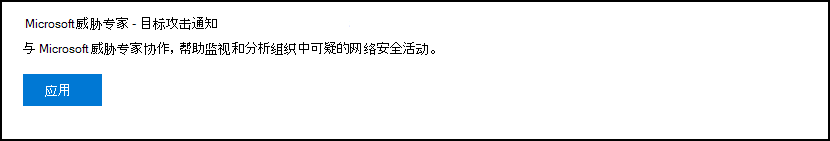

# 配置和管理 Microsoft 威胁专家功能Configure and manage Microsoft Threat Experts capabilities

[!INCLUDE [Microsoft 365 Defender rebranding](../../includes/microsoft-defender.md)]

**适用于：****Applies to:**
- [Microsoft Defender for EndpointMicrosoft Defender for Endpoint](https://go.microsoft.com/fwlink/p/?linkid=2154037)
- [Microsoft 365 DefenderMicrosoft 365 Defender](https://go.microsoft.com/fwlink/?linkid=2118804)

>想要体验适用于终结点的 Defender？Want to experience Defender for Endpoint? [注册免费试用版。Sign up for a free trial.](https://www.microsoft.com/microsoft-365/windows/microsoft-defender-atp?ocid=docs-wdatp-assignaccess-abovefoldlink)

## 准备工作Before you begin 
> [!NOTE]
> 在适用于 Microsoft 威胁专家 - 目标攻击通知托管威胁搜寻服务之前，与 Microsoft 技术服务提供商和帐户团队讨论资格要求。Discuss the eligibility requirements with your Microsoft Technical Service provider and account team before you apply to Microsoft Threat Experts - Targeted Attack Notification managed threat hunting service.

确保在你的环境中部署了 Defender for Endpoint 并注册了设备，而不只是在实验室设置上。Ensure that you have Defender for Endpoint deployed in your environment with devices enrolled, and not just on a laboratory set-up.

如果你是适用于终结点的 Defender 客户，你需要申请 **Microsoft 威胁** 专家 - 目标攻击通知，获取特殊的见解和分析，以帮助识别最重要的威胁，以便你可以快速响应它们。If you're a Defender for Endpoint customer, you need to apply for **Microsoft Threat Experts - Targeted Attack Notifications** to get special insights and analysis to help identify the most critical threats, so you can respond to them quickly. 联系你的客户团队或 Microsoft 代表，订阅 **Microsoft 威胁** 专家 - 专家按需咨询我们的威胁专家，了解相关检测和对手。Contact your account team or Microsoft representative to subscribe to **Microsoft Threat Experts - Experts on Demand** to consult with our threat experts on relevant detections and adversaries.

## 适用于 Microsoft 威胁专家 - 目标攻击通知服务Apply for Microsoft Threat Experts - Targeted Attack Notifications service 
如果你已经是适用于终结点的 Defender 客户，可以通过 Microsoft Defender 安全中心申请。If you're already a Defender for Endpoint customer, you can apply through the Microsoft Defender Security Center. 

1. 在导航窗格中，转到"设置">"常规> Microsoft 威胁专家 - >攻击通知"中的 **"高级功能"。**From the navigation pane, go to **Settings > General > Advanced features > Microsoft Threat Experts - Targeted Attack Notifications**.

2. 单击“**应用**”。Click **Apply**.

    

3. 输入你的姓名和电子邮件地址，以便 Microsoft 可以在你的应用程序上返回给你。Enter your name and email address so that Microsoft can get back to you on your application.

    

4. 阅读 [隐私声明，](https://privacy.microsoft.com/en-us/privacystatement)**完成后单击提交**。Read the [privacy statement](https://privacy.microsoft.com/en-us/privacystatement), then click **Submit** when you're done. 应用程序获得批准后，您将收到欢迎电子邮件。You will receive a welcome email once your application is approved.

    

接受后，你将收到欢迎电子邮件，并且你将看到"应用"按钮更改为"打开"的切换。When accepted, you will receive a welcome email and you will see the **Apply** button change to a toggle that is “on”. 如果你希望将自己从目标攻击通知服务中退出，请滑动切换"关闭"，然后单击页面底部的"保存首选项"。In case you want to take yourself out of the Targeted Attack Notifications service, slide the toggle “off” and click **Save preferences** at the bottom of the page. 

## 你将在哪里看到来自 Microsoft 威胁专家的定向攻击通知Where you'll see the targeted attack notifications from Microsoft Threat Experts 
可以通过以下媒体从 Microsoft 威胁专家接收目标攻击通知：You can receive targeted attack notification from Microsoft Threat Experts through the following medium:  
- 终结点门户的 Defender **事件** 页面The Defender for Endpoint portal's **Incidents** page 
- Defender for Endpoint 门户 **的警报** 仪表板The Defender for Endpoint portal's **Alerts** dashboard  
- OData 警报 [API](https://docs.microsoft.com/windows/security/threat-protection/microsoft-defender-atp/get-alerts) 和 [REST API](https://docs.microsoft.com/windows/security/threat-protection/microsoft-defender-atp/pull-alerts-using-rest-api)OData alerting [API](https://docs.microsoft.com/windows/security/threat-protection/microsoft-defender-atp/get-alerts) and [REST API](https://docs.microsoft.com/windows/security/threat-protection/microsoft-defender-atp/pull-alerts-using-rest-api)
- [高级搜寻中的 DeviceAlertEvents](https://docs.microsoft.com/windows/security/threat-protection/microsoft-defender-atp/advanced-hunting-devicealertevents-table) 表[DeviceAlertEvents](https://docs.microsoft.com/windows/security/threat-protection/microsoft-defender-atp/advanced-hunting-devicealertevents-table) table in Advanced hunting
- 您的电子邮件（如果选择进行配置）Your email, if you choose to configure it 

若要通过电子邮件接收目标攻击通知，请创建电子邮件通知规则。To receive targeted attack notifications through email, create an email notification rule.

### 创建电子邮件通知规则Create an email notification rule 
可以创建规则来发送通知收件人的电子邮件通知。You can create rules to send email notifications for notification recipients. 有关详细信息  [，请参阅配置警报](configure-email-notifications.md) 通知以创建、编辑、删除或解决电子邮件通知问题。See  [Configure alert notifications](configure-email-notifications.md) to create, edit, delete, or troubleshoot email notification, for details.

## 查看目标攻击通知View the targeted attack notification  
在将系统配置为接收电子邮件通知后，你将开始在电子邮件中收到来自 Microsoft 威胁专家的定向攻击通知。You'll start receiving targeted attack notification from Microsoft Threat Experts in your email after you have configured your system to receive email notification.  

1. 单击电子邮件中的链接，转到使用威胁专家标记的仪表板中的相应 **警报上下文**。Click the link in the email to go to the corresponding alert context in the dashboard tagged with **Threat experts**. 

2. 从仪表板中，选择与从电子邮件获得相同的警报主题，以查看详细信息。From the dashboard, select the same alert topic that you got from the email, to view the details.  

## 订阅 Microsoft 威胁专家 - 专家按需Subscribe to Microsoft Threat Experts - Experts on Demand
这作为订阅服务提供。This is available as a subscription service. 如果你已经是适用于 Endpoint 的 Defender 客户，你可以联系你的 Microsoft 代表，订阅 Microsoft 威胁专家 - 专家按需订阅。If you're already a Defender for Endpoint customer, you can contact your Microsoft representative to subscribe to Microsoft Threat Experts - Experts on Demand. 

## 咨询 Microsoft 威胁专家，了解组织中可疑的网络安全活动Consult a Microsoft threat expert about suspicious cybersecurity activities in your organization 
你可以与可直接在 Microsoft Defender 安全中心内参与的 Microsoft 威胁专家合作，以及时准确地做出响应。You can partner with Microsoft Threat Experts who can be engaged directly from within the Microsoft Defender Security Center for timely and accurate response. 专家提供见解，以更好地了解复杂的威胁、你收到的定向攻击通知，或者如果你需要有关警报、可能受到威胁的设备或你在门户仪表板上看到的威胁智能上下文详细信息。Experts provide insights to better understand complex threats, targeted attack notifications that you get, or if you need more information about the alerts, a potentially compromised device, or a threat intelligence context that you see on your portal dashboard. 

> [!NOTE]
> - 目前不支持与组织的自定义威胁情报数据相关的警报查询。Alert inquiries related to your organization's customized threat intelligence data are currently not supported. 有关详细信息，请咨询安全运营或事件响应团队。Consult your security operations or incident response team for details.
> - 你需要在安全中心门户中拥有"管理安全设置"权限，才能提交"咨询威胁专家"查询。You need to have the **Manage security settings** permission in the Security Center portal to be able to submit a "Consult a threat expert" inquiry.

1. 导航到包含要调查的相关信息的门户页面，例如"事件 **"** 页面。Navigate to the portal page with the relevant information that you'd like to investigate, for example, the **Incident** page. 发送调查请求之前，请确保相关警报或设备的页面已查看。Ensure that the page for the relevant alert or device is in view before you send an investigation request. 

2. 从右上角的菜单中，单击" **？"**From the upper right-hand menu, click the **?** 图标。icon. 然后，选择 **"咨询威胁专家"。**Then, select **Consult a threat expert**. 

    

    将打开一个飞出屏幕。A flyout screen opens. 以下屏幕显示你何时使用试用版订阅。The following screen shows when you are on a trial subscription.

    

    以下屏幕显示你何时使用完整的 Microsoft 威胁专家 - 专家按需订阅。The following screen shows when you are on a full Microsoft Threat Experts - Experts on-Demand subscription.

    

    " **查询"** 主题字段预填充了指向调查请求的相关页面的链接。The **Inquiry topic** field is pre-populated with the link to the relevant page for your investigation request. 例如，指向发出请求时所访问的事件、警报或设备详细信息页面的链接。For example, a link to the incident, alert, or device details page that you were at when you made the request.

3.  In the next field， provide enough information to give the Microsoft Threat Experts enough context to start the investigation.In the next field, provide enough information to give the Microsoft Threat Experts enough context to start the investigation.
  
4. 输入要用于与 Microsoft 威胁专家对应的电子邮件地址。Enter the email address that you'd like to use to correspond with Microsoft Threat Experts.

> [!NOTE]
> 如果要通过 Microsoft 服务中心跟踪专家按需案例的状态，请联系你的技术客户经理。If you would like to track the status of your Experts on Demand cases through Microsoft Services Hub, reach out to your Technical Account Manager. 

观看此视频，快速概览 Microsoft 服务中心。Watch this video for a quick overview of the Microsoft Services Hub.

>[!VIDEO https://www.microsoft.com/videoplayer/embed/RE4pk9f] 

   
## 可以咨询 Microsoft 威胁专家 - 按需专家的示例调查主题Sample investigation topics that you can consult with Microsoft Threat Experts - Experts on Demand 

**警报信息****Alert information**
- 我们会看到一种针对陆地外活动二进制文件的新警报类型：[AlertID]。We see a new type of alert for a living-off-the-land binary: [AlertID]. 能否告诉我们有关此警报以及我们可以如何进一步调查的更多信息？Can you tell us something more about this alert and how we can investigate further?
- 我们观察到两个类似的攻击，它们尝试执行恶意 PowerShell 脚本，但生成不同的警报。We’ve observed two similar attacks, which try to execute malicious PowerShell scripts but generate different alerts. 一种是"可疑 PowerShell 命令行"，另一种是"根据 O365 提供的指示检测到恶意文件"。One is "Suspicious PowerShell command line" and the other is "A malicious file was detected based on indication provided by O365". 区别是什么？What is the difference?
- 今天，我收到一个有关高配置文件用户设备登录失败异常数量的奇数警报。I receive an odd alert today for abnormal number of failed logins from a high profile user’s device. 我找不到有关这些登录尝试的任何进一步证据。I cannot find any further evidence around these sign-in attempts. Defender for Endpoint 如何查看这些尝试？How can Defender for Endpoint see these attempts? 正在监视哪种类型的登录？What type of sign-ins are being monitored?
- 能否提供关于此警报的更多上下文或见解："已观察到系统实用工具的可疑行为"。Can you give more context or insights about this alert: “Suspicious behavior by a system utility was observed”. 

**可能的机器入侵****Possible machine compromise**
- 能否帮助回答我们为何看到"观察到的未知进程？"Can you help answer why we see “Unknown process observed?” 此消息或警报在许多设备上经常看到。This message or alert is seen frequently on many devices. 感谢你的任何输入来阐明此消息或警报是否与恶意活动相关。We appreciate any input to clarify whether this message or alert is related to malicious activity.
- 是否有助于验证以下系统在 [date] 上可能遭到入侵，其行为与 [month] 中的同一系统上之前的 [恶意软件名称] 恶意软件检测行为类似？Can you help validate a possible compromise on the following system on [date] with similar behaviors as the previous [malware name] malware detection on the same system in [month]?

**威胁情报详细信息****Threat intelligence details**
- 我们检测到一封钓鱼电子邮件，该电子邮件向用户传递了恶意 Word 文档。We detected a phishing email that delivered a malicious Word document to a user. 恶意 Word 文档引发了一系列可疑事件，触发了针对 [恶意软件名称] 恶意软件的多个 Microsoft Defender 警报。The malicious Word document caused a series of suspicious events, which triggered multiple Microsoft Defender alerts for [malware name] malware. 你是否有关于此恶意软件的信息？Do you have any information on this malware? 如果是，可以向我发送链接吗？If yes, can you send me a link?
- 我最近看到[社交媒体参考，例如 Twitter 或博客]文章，关于面向我的行业的威胁。I recently saw a [social media reference, for example, Twitter or blog] post about a threat that is targeting my industry. 你可以帮助我了解针对此威胁参与者的 Defender 提供什么保护？Can you help me understand what protection Defender for Endpoint provides against this threat actor? 

**Microsoft 威胁专家的警报通信****Microsoft Threat Experts’ alert communications** 
- 事件响应团队能否帮助我们处理我们得到的目标攻击通知？Can your incident response team help us address the targeted attack notification that we got?
- 我收到了来自 Microsoft 威胁专家的此目标攻击通知。I received this targeted attack notification from Microsoft Threat Experts. 我们还没有自己的事件响应团队。We don’t have our own incident response team. 现在，我们可以做什么，如何包含事件？What can we do now, and how can we contain the incident?
- 我收到了来自 Microsoft 威胁专家的定向攻击通知。I received a targeted attack notification from Microsoft Threat Experts. 您可以向我们提供哪些数据，我们可以将这些数据传递给事件响应团队？What data can you provide to us that we can pass on to our incident response team?

  >[!NOTE]
  >Microsoft 威胁专家是一项托管网络安全搜寻服务，而不是事件响应服务。Microsoft Threat Experts is a managed cybersecurity hunting service and not an incident response service. 但是，专家可以在必要时将调查无缝转换到 Microsoft 网络安全解决方案组 (CSG) 的检测和响应团队 () 服务。However, the experts can seamlessly transition the investigation to Microsoft Cybersecurity Solutions Group (CSG)'s  Detection and Response Team (DART) services, when necessary. 还可以选择与自己的事件响应团队合作，以解决需要事件响应的问题。You can also opt to engage with your own incident response team to address issues that requires an incident response. 

## 方案Scenario

### 接收有关托管搜寻查询的进度报告Receive a progress report about your managed hunting inquiry 
Microsoft 威胁专家的响应因你的查询而异。Response from Microsoft Threat Experts varies according to your inquiry. 他们将在两天内通过电子邮件向你发送关于咨询威胁专家查询的进度报告，以传达以下类别的调查状态：They will email a progress report to you about your **Consult a threat expert** inquiry within two days, to communicate the investigation status from the following categories: 
- 需要更多信息才能继续执行调查More information is needed to continue with the investigation 
- 需要一个或多个文件示例来确定技术上下文A file or several file samples are needed to determine the technical context 
- 调查需要更多时间Investigation requires more time   
- 初始信息足以结束调查Initial information was enough to conclude the investigation 

快速响应以保持调查的运行至关重要。It is crucial to respond in quickly to keep the investigation moving. 

## 相关主题Related topic
- [Microsoft 威胁专家概述Microsoft Threat Experts overview](microsoft-threat-experts.md)
