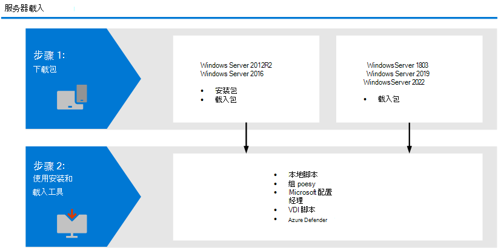

# <a name="onboard-windows-servers-to-the-microsoft-defender-for-endpoint-service"></a>将Windows载入 Microsoft Defender for Endpoint 服务

[!INCLUDE [Microsoft 365 Defender rebranding](../../includes/microsoft-defender.md)]

**适用于：**

- Windows Server 2012 R2
- Windows Server 2016
- Windows Server Semi-Annual Enterprise Channel
- Windows Server 2019 及更高版本
- Windows Server 2019 核心版本
- Windows Server 2022

[!include[Prerelease information](../../includes/prerelease.md)]

> 想要体验适用于终结点的 Defender？ [注册免费试用版](https://signup.microsoft.com/create-account/signup?products=7f379fee-c4f9-4278-b0a1-e4c8c2fcdf7e&ru=https://aka.ms/MDEp2OpenTrial?ocid=docs-wdatp-configserver-abovefoldlink)。

Defender for Endpoint 扩展支持，还包括 Windows Server 操作系统。 此支持通过安全中心控制台无缝提供高级攻击检测和Microsoft 365 Defender功能。 对 Windows Server 的支持可更深入地了解服务器活动、内核和内存攻击检测的范围，并启用响应操作。

本主题介绍如何将特定 Windows服务器载入到 Microsoft Defender for Endpoint。

有关许可和基础结构需要满足的实际指导，请参阅使用 Defender for Endpoint Windows[服务器。](https://techcommunity.microsoft.com/t5/What-s-New/Protecting-Windows-Server-with-Windows-Defender-ATP/m-p/267114#M128)

有关如何为服务器下载和使用 Windows 安全中心 比较基准Windows，请参阅 Windows 安全中心[Baselines](/windows/device-security/windows-security-baselines)。

## <a name="windows-server-onboarding-overview"></a>Windows服务器载入概述

需要完成以下常规步骤，以成功载入服务器。



**Windows Server 2012 R2 和 Windows Server 2016 (Preview)**

- 下载安装和载入程序包
- 安装应用程序
- 按照相应工具的载入步骤操作

**Windows Server Semi-Annual Enterprise Channel and Windows Server 2019**

- 下载载入程序包
- 按照相应工具的载入步骤操作

### <a name="new-functionality-in-the-modern-unified-solution-for-windows-server-2012-r2-and-2016-preview"></a>适用于 R2 和 Windows Server 2012 2016 Preview 的新式统一解决方案中的新功能

上一次实现 Windows Server 2012 R2 Windows Server 2016要求使用 Microsoft Monitoring Agent (MMA) 。

新的统一解决方案包通过删除依赖项和安装步骤更轻松地载入服务器。 此外，此统一解决方案包还进行了以下重大改进：

- [Microsoft Defender 防病毒](/microsoft-365/security/defender-endpoint/microsoft-defender-antivirus-windows)R2[的下一](/microsoft-365/security/defender-endpoint/next-generation-protection)代Windows Server 2012保护
- [攻击面减少 (ASR) 规则](/microsoft-365/security/defender-endpoint/attack-surface-reduction-rules)
- [网络保护](/microsoft-365/security/defender-endpoint/network-protection)
- [受控文件夹访问权限](/microsoft-365/security/defender-endpoint/controlled-folders)
- [PUA 阻止 (可能不需要) 应用程序](/microsoft-365/security/defender-endpoint/detect-block-potentially-unwanted-apps-microsoft-defender-antivirus)
- [改进的检测功能](/microsoft-365/security/defender-endpoint/overview-endpoint-detection-response)
- [设备和文件](/microsoft-365/security/defender-endpoint/respond-machine-alerts) 上的扩展响应 [功能](/microsoft-365/security/defender-endpoint/respond-file-alerts)
- [EDR阻止模式](/microsoft-365/security/defender-endpoint/edr-in-block-mode)
- [实时响应](/microsoft-365/security/defender-endpoint/live-response)
- [AIR (自动调查和) ](/microsoft-365/security/defender-endpoint/automated-investigations)
- [防篡改保护](/microsoft-365/security/defender-endpoint/prevent-changes-to-security-settings-with-tamper-protection)

如果之前已使用 MMA 载入服务器，请按照服务器迁移中提供的指南[](server-migration.md)迁移到新解决方案。

>[!NOTE]
>虽然此 Windows Server 2012 R2 和 Windows Server 2016 的载入方法是预览版，但你可以选择继续使用之前使用 Microsoft Monitoring Agent (MMA) 。 有关详细信息，请参阅使用 [MMA 安装和配置终结点](onboard-downlevel.md#install-and-configure-microsoft-monitoring-agent-mma)。

#### <a name="known-issues-and-limitations"></a>已知问题和限制

以下具体信息适用于 R2 和 Windows Server 2012 2016 的新统一解决方案包：

- 确保满足允许访问代理服务器中的 [Microsoft Defender for Endpoint 服务 URL 中](/microsoft-365/security/defender-endpoint/configure-proxy-internet?enable-access-to-microsoft-defender-for-endpoint-service-urls-in-the-proxy-server) 指定的连接要求。 它们等效于 Windows Server 2019。
- 以前，OMS/Log Analytics) 在 Windows Server 2016 及以下允许使用 MMA Microsoft Monitoring Agent (，以提供与 Defender 云服务的连接。 新解决方案（如 Windows Server 2019 上的 Microsoft Defender for Endpoint、Windows Server 2022 和 Windows 10）不支持此网关。
- On Windows Server 2016， verify that Microsoft Defender 防病毒 is installed， is active and up to date. 可以使用"更新"下载并安装Windows版本。 或者，从 [Microsoft](https://www.catalog.update.microsoft.com/Search.aspx?q=KB4052623) 更新目录或 MMPC 手动下载 [更新包](https://go.microsoft.com/fwlink/?linkid=870379&arch=x64)。  
- 在 Windows Server 2012 R2 上，没有用于Microsoft Defender 防病毒。 此外，Windows Server 2016用户界面只允许基本操作。 若要在本地设备上执行操作，请参阅使用 [PowerShell、WMI ](/microsoft-365/security/defender-endpoint/manage-atp-post-migration-other-tools)和 MPCmdRun.exe管理 Microsoft Defender for Endpoint。 因此，专门依赖用户交互的功能（如提示用户做出决定或执行特定任务）可能无法如期工作。 建议禁用或不启用用户界面，也建议在任何托管服务器上进行用户交互，因为它可能会影响保护功能。
- 并非所有攻击面减少规则都适用于所有操作系统。 请参阅 [攻击面减少 (ASR) 规则](/microsoft-365/security/defender-endpoint/attack-surface-reduction-rules)。
- 若要启用 [网络保护](/microsoft-365/security/defender-endpoint/network-protection)，需要其他配置：
  - `Set-MpPreference -EnableNetworkProtection Enabled`
  - `Set-MpPreference -AllowNetworkProtectionOnWinServer 1`
  - `Set-MpPreference -AllowNetworkProtectionDownLevel 1`
  - `Set-MpPreference -AllowDatagramProcessingOnWinServer 1`

  此外，在网络通信量较高的计算机上，强烈建议在广泛启用此功能之前，先在环境中执行性能测试。 您可能需要考虑额外的资源消耗。
- 在 Windows Server 2012 R2 上，网络事件可能不会在时间线中填充。 This issue requires a Windows Update released as part of the [October 12， 2021 monthly rollup (KB5006714) ](https://support.microsoft.com/topic/october-12-2021-kb5006714-monthly-rollup-4dc4a2cd-677c-477b-8079-dcfef2bda09e).
- 不支持操作系统升级。 卸载，然后在升级之前卸载。
- R2 不支持自动排除服务器Windows Server 2012 R2。 有关添加排除项详细信息，请参阅病毒扫描建议[Enterprise运行](https://support.microsoft.com/topic/virus-scanning-recommendations-for-enterprise-computers-that-are-running-currently-supported-versions-of-windows-kb822158-c067a732-f24a-9079-d240-3733e39b40bc)当前受支持版本的病毒扫描Windows。

- 在 Windows Server 2012 R2 上，网络事件可能不会在时间线中填充。 This issue requires a Windows Update released as part of the [October 12， 2021 monthly rollup (KB5006714) ](https://support.microsoft.com/topic/october-12-2021-kb5006714-monthly-rollup-4dc4a2cd-677c-477b-8079-dcfef2bda09e).
- 不支持操作系统升级。 卸载，然后在升级之前卸载。

<a name="integration-with-azure-defender"></a>

## <a name="integration-with-microsoft-defender-for-cloud"></a>与 Microsoft Defender for Cloud 集成

Microsoft Defender for Endpoint 与 Microsoft Defender for Cloud 无缝集成。 你可以自动载入服务器，使 Azure Defender 监视的服务器显示在 Defender for Endpoint 中，并作为 Microsoft Defender 云客户进行详细调查。

有关详细信息，请参阅与 [Microsoft Defender for Cloud 集成](azure-server-integration.md)。

> [!NOTE]
> 对于Windows Server 2012新式统一解决方案预览的 R2 和 2016，尚未提供与 Microsoft Defender for Cloud/Microsoft Defender 服务器集成以用于警报和自动部署。 尽管你可以在这些计算机上安装新解决方案，但 Microsoft Defender for Cloud 中不会显示任何警报。

## <a name="windows-server-2012-r2-and-windows-server-2016"></a>Windows Server 2012 R2 和 Windows Server 2016

> [!NOTE]
> 虽然此 Windows Server 2012 R2 和 Windows Server 2016 的载入方法是预览版，但你可以选择继续使用之前使用 Microsoft Monitoring Agent (MMA) 。 有关详细信息，请参阅使用 [MMA 安装和配置终结点](onboard-downlevel.md#install-and-configure-microsoft-monitoring-agent-mma)。

### <a name="prerequisites"></a>先决条件

**R2 Windows Server 2012的先决条件**

如果你已使用最新的每月汇总程序包完全更新计算机 [](/troubleshoot/windows-client/deployment/standard-terminology-software-updates.md#monthly-rollup)，则没有 **其他** 先决条件。


安装程序程序包将检查是否通过更新安装了以下组件：

- [客户体验和诊断遥测更新](https://support.microsoft.com/help/3080149/update-for-customer-experience-and-diagnostic-telemetry)
- [Windows 中的通用 C 运行时更新](https://support.microsoft.com/topic/update-for-universal-c-runtime-in-windows-c0514201-7fe6-95a3-b0a5-287930f3560c)

**部署Windows Server 2016** 

验证Microsoft Defender 防病毒是否处于活动状态且是最新的。 可以使用"更新"下载并安装Windows版本。 或者，从 [Microsoft](https://www.catalog.update.microsoft.com/Search.aspx?q=KB4052623) 更新目录或 MMPC 手动下载 [更新包](https://go.microsoft.com/fwlink/?linkid=870379&arch=x64)。

**Windows Server 2012 R2 和 2016 上的 Microsoft Defender for Endpoint 的新更新程序包**

若要接收适用于 EDR 组件的常规产品改进和修补程序，请确保Windows[更新 KB5005292](https://go.microsoft.com/fwlink/?linkid=2168277)获得应用或批准。 此外，若要使保护组件保持更新，请参阅管理Microsoft Defender 防病毒[更新和应用基线](/microsoft-365/security/defender-endpoint/manage-updates-baselines-microsoft-defender-antivirus#monthly-platform-and-engine-versions)。

### <a name="download-installation-and-onboarding-packages"></a>下载安装和载入程序包

1. In Microsoft Defender 安全中心， go to **设置 > Device Management > Onboarding**.

2. 选择 **Windows Server 2012 R2 和 2016。**

3. 选择 **下载安装程序包** 并保存.msi文件。 可以通过安装向导运行 msi 程序包，或按照使用命令行安装 Microsoft Defender [for Endpoint 中的命令行步骤操作](#install-microsoft-defender-for-endpoint-using-command-line)。

   > [!NOTE]
   > Microsoft Defender 防病毒将安装并处于活动状态，除非你将它设置为被动模式。 
 

4. 选择 **下载载入程序包并** 保存.zip文件。

5. 使用任一选项安装安装程序包Microsoft Defender 防病毒。 

6. 按照载入步骤部分中 [提供的步骤](#onboarding-steps) 操作。

### <a name="options-to-install-microsoft-defender-for-endpoint"></a>安装适用于终结点的 Microsoft Defender 的选项

在上一部分中，你下载了安装程序包。 安装程序包包含所有 Microsoft Defender for Endpoint 组件的安装程序。

### <a name="install-microsoft-defender-for-endpoint-using-command-line"></a>使用命令行安装 Microsoft Defender for Endpoint

使用上一步中的安装程序包安装 Microsoft Defender for Endpoint。

运行以下命令以安装 Microsoft Defender for Endpoint：

```console
Msiexec /i md4ws.msi /quiet
```

若要卸载，请确保首先使用相应的卸载脚本将计算机卸载。 然后，使用控制面板 \> 程序 \> 程序和功能执行卸载。

或者，运行以下卸载命令以卸载 Microsoft Defender for Endpoint：

```console
Msiexec /x md4ws.msi /quiet
```

必须使用相同的程序包进行安装，上述命令才能成功。

该 `/quiet` 开关禁止显示所有通知。

> [!NOTE]
> Microsoft Defender 防病毒不会自动进入被动模式。 如果你运行的是非 Microsoft Microsoft Defender 防病毒/反恶意软件解决方案，你可以选择将应用设置为在被动模式下运行。 对于命令行安装，可选组件 `FORCEPASSIVEMODE=1` 会立即Microsoft Defender 防病毒被动模式以避免干扰。 然后，为了确保 Defender 防病毒在载入后保持被动模式以支持 EDR 阻止等功能，请设置"ForceDefenderPassiveMode"注册表项。
>
> - Windows Server 2019 和 Windows Server 2022 的载入Microsoft Endpoint Manager目前附带了脚本。 若要详细了解如何在 Configuration Manager 中部署脚本，请参阅 Configuration [Manager 中的程序包和程序](/configmgr/apps/deploy-use/packages-and-programs)。
> - 本地脚本适用于概念证明，但不应用于生产部署。 对于生产部署，我们建议使用组策略或Microsoft Endpoint Configuration Manager。

对 Windows Server 的支持可更深入地了解服务器活动、内核和内存攻击检测的范围，并启用响应操作。

### <a name="install-microsoft-defender-for-endpoint-using-a-script"></a>使用脚本安装 Microsoft Defender for Endpoint

您还可以使用安装程序 [脚本来帮助](server-migration.md#installer-script) 自动执行安装、卸载和载入。

## <a name="windows-server-semi-annual-enterprise-channel-and-windows-server-2019-and-windows-server-2022"></a>Windows Server Semi-Annual Enterprise Channel and Windows Server 2019 and Windows Server 2022

Windows Server 2019 和 Windows Server 2022 的载入Microsoft Endpoint Manager目前附带了一个脚本。 若要详细了解如何在 Configuration Manager 中部署脚本，请参阅 Configuration [Manager 中的程序包和程序](/configmgr/apps/deploy-use/packages-and-programs)。

### <a name="download-package"></a>下载包

1. In Microsoft Defender 安全中心， go to **设置 > Device Management > Onboarding**.

2. 选择 **Windows Server 1803 和 2019。**

3. 选择 **下载程序包**。 将其另存为WindowsDefenderATPOnboardingPackage.zip。

4. 按照载入步骤部分中 [提供的步骤](#onboarding-steps) 操作。

## <a name="onboarding-steps"></a>载入步骤

1. 现在，你已下载所需的载入程序包，请使用载入工具和服务器 [方法](configure-endpoints.md#endpoint-onboarding-tools) 中列出的指南。

2.  (仅在使用第三方反恶意软件解决方案解决方案时) 。 你需要将以下内容应用于被动Microsoft Defender 防病毒设置。 验证是否正确配置了它：

    1. 设置以下注册表项：
       - 路径： `HKLM\SOFTWARE\Policies\Microsoft\Windows Advanced Threat Protection`
       - 名称：`ForceDefenderPassiveMode`
       - 类型： `REG_DWORD`
       - 值：`1`

    2. 运行以下 PowerShell 命令以验证被动模式是否配置：

        ```powershell
        Get-WinEvent -FilterHashtable @{ProviderName="Microsoft-Windows-Sense" ;ID=84}
        ```

        > [!NOTE]
        > - Microsoft Defender for servers 和 Microsoft Defender for Endpoint 之间的集成已扩展为支持 Windows Server 2022、Windows [Server 2019 和 Windows Virtual Desktop (WVD) 。 ](/azure/security-center/release-notes#microsoft-defender-for-endpoint-integration-with-azure-defender-now-supports-windows-server-2019-and-windows-10-virtual-desktop-wvd-in-preview)
        > - 已针对客户禁用利用此集成的服务器终结点Office 365 GCC监视。

    3. 确认找到包含被动模式事件的最近事件：

       

> [!IMPORTANT]
>
> - 当你使用 Microsoft Defender for Cloud 监视服务器时，会自动在美国为美国用户创建 (、为欧洲用户创建欧盟，以及为英国用户自动创建) 。
Defender for Endpoint 收集的数据存储在预配期间标识的租户地理位置中。
> - 如果在使用 Microsoft Defender for Cloud 之前使用 Defender for Endpoint，则数据将存储在创建租户时指定的位置，即使以后与 Microsoft Defender for Cloud 集成。
> - 配置后，你无法更改数据存储的位置。 如果需要将数据移动到其他位置，需要联系 Microsoft 支持部门来重置租户。

## <a name="verify-the-onboarding-and-installation"></a>验证载入和安装

验证Microsoft Defender 防病毒和 Microsoft Defender for Endpoint 是否正在运行。

## <a name="run-a-detection-test-to-verify-onboarding"></a>运行检测测试以验证载入

载入设备后，你可以选择运行检测测试，以验证设备是否正确载入到服务。 有关详细信息，请参阅对新载入的 [Microsoft Defender for Endpoint](run-detection-test.md)设备运行检测测试。

> [!NOTE]
> 无需Microsoft Defender 防病毒运行应用程序，但建议这样做。 如果另一个防病毒供应商产品是主要终结点保护解决方案，可以在被动模式下运行 Defender 防病毒。 在验证 Microsoft Defender for Endpoint 传感器是否处于运行状态后，你 (被动) 处于打开状态。

1. 运行以下命令以验证Microsoft Defender 防病毒安装：

    >[!NOTE]
    >只有在将 Microsoft Defender 防病毒用作活动的反恶意软件解决方案时，才需要执行此解决步骤。

    `sc.exe query Windefend`


    如果结果是"指定的服务作为已安装的服务不存在"，则需要安装Microsoft Defender 防病毒。 


    有关如何使用组策略配置和管理 Microsoft Defender 防病毒 服务器Windows的信息，[请参阅使用组](use-group-policy-microsoft-defender-antivirus.md)策略设置配置和管理Microsoft Defender 防病毒。

2. 运行以下命令以验证 Microsoft Defender for Endpoint 是否正在运行：

    `sc.exe query sense`

    结果应显示它正在运行。 如果你遇到载入问题，请参阅 [载入疑难解答](troubleshoot-onboarding.md)。

## <a name="run-a-detection-test"></a>运行检测测试

按照对新载入 [的设备运行检测](run-detection-test.md) 测试中的步骤验证服务器是否向终结点服务的 Defender 报告。

## <a name="next-steps"></a>后续步骤

成功将设备载入服务后，你需要配置适用于终结点的 Microsoft Defender 的单个组件。 按照 [采用顺序](prepare-deployment.md#adoption-order) 指导如何启用各种组件。

## <a name="offboard-windows-servers"></a>载出Windows服务器

可以使用适用于 Windows 10 客户端设备的相同方法Windows Server 2012 R2、Windows Server 2016、Windows Server (SAC) 、Windows Server 2019、Windows Server 2019 Core 版本。

- [使用组策略的载出设备](configure-endpoints-gp.md#offboard-devices-using-group-policy)
- [使用 Configuration Manager 的载出设备](configure-endpoints-sccm.md#offboard-devices-using-configuration-manager)
- [使用移动设备管理工具离开并监视设备](configure-endpoints-mdm.md#offboard-and-monitor-devices-using-mobile-device-management-tools)
- [使用本地脚本的载出设备](configure-endpoints-script.md#offboard-devices-using-a-local-script)

对于其他Windows版本，有两个选项可以与Windows服务器一起离开：

- 卸载 MMA 代理
- 删除 Defender for Endpoint 工作区配置

>[!NOTE]
>*如果你运行的是适用于需要 MMA 的 Windows Server 2016 和 Windows Server 2012 R2 的 Microsoft Defender for Endpoint，则适用于其他 Windows 服务器版本的这些载出说明也适用。 有关迁移到新的未关注解决方案的说明，请参阅 Microsoft [Defender for Endpoint 中的服务器迁移方案](/microsoft-365/security/defender-endpoint/server-migration)。

## <a name="related-topics"></a>相关主题

- [载入以前版本的 Windows](onboard-downlevel.md)
- [载入 Windows 10 设备](configure-endpoints.md)
- [载入非 Windows 设备](configure-endpoints-non-windows.md)
- [配置代理和 Internet 连接设置](configure-proxy-internet.md)
- [在新载入的适用于终结点的 Defender 设备上运行检测测试](run-detection-test.md)
- [Microsoft Defender 终结点载入问题疑难解答](troubleshoot-onboarding.md)
