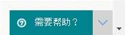

# 联系 Microsoft Defender for Endpoint 客户服务Contact Microsoft Defender for Endpoint support

[!INCLUDE [Microsoft 365 Defender rebranding](../../includes/microsoft-defender.md)]

**适用于：****Applies to:**
- [Microsoft Defender for EndpointMicrosoft Defender for Endpoint](https://go.microsoft.com/fwlink/p/?linkid=2154037)
- [Microsoft 365 DefenderMicrosoft 365 Defender](https://go.microsoft.com/fwlink/?linkid=2118804)

>想要体验适用于终结点的 Defender？Want to experience Defender for Endpoint? [注册免费试用版。Sign up for a free trial.](https://www.microsoft.com/microsoft-365/windows/microsoft-defender-atp?ocid=docs-wdatp-assignaccess-abovefoldlink)

Defender for Endpoint 最近升级了支持流程，可提供更现代、更高级的支持体验。Defender for Endpoint has recently upgraded the support process to offer a more modern and advanced support experience. 

新的小组件允许客户：The new widget allows customers to:
- 查找常见问题的解决方案Find solutions to common problems
- 向 Microsoft 支持团队提交支持案例Submit a support case to the Microsoft support team

## 先决条件Prerequisites
了解有权打开支持案例的特定角色很重要。It's important to know the specific roles that have permission to open support cases.

至少必须具有服务支持管理员 **或支持管理员** 角色。At a minimum, you must have a Service Support Administrator **OR** Helpdesk Administrator role.

有关哪些角色具有权限详细信息，请参阅安全 [管理员权限](https://docs.microsoft.com/azure/active-directory/users-groups-roles/directory-assign-admin-roles#security-administrator-permissions)。For more information on which roles have permission see, [Security Administrator permissions](https://docs.microsoft.com/azure/active-directory/users-groups-roles/directory-assign-admin-roles#security-administrator-permissions). 包含操作的角色 `microsoft.office365.supportTickets/allEntities/allTasks` 可以提交案例。Roles that include the action `microsoft.office365.supportTickets/allEntities/allTasks` can submit a case.

有关管理员角色的常规信息，请参阅关于 [管理员角色](https://docs.microsoft.com/microsoft-365/admin/add-users/about-admin-roles?view=o365-worldwide&preserve-view=true)。For general information on admin roles, see [About admin roles](https://docs.microsoft.com/microsoft-365/admin/add-users/about-admin-roles?view=o365-worldwide&preserve-view=true).

## 访问小组件Access the widget
可通过以下两种方式之一访问新的支持小组件：Accessing the new support widget can be done in one of two ways:

1.  单击门户右上方的问号，然后单击"Microsoft 支持"：Clicking on the question mark on the top right of the portal and then clicking on "Microsoft support":

    

2. 单击需要帮助 **？**Clicking on the **Need help?**  Microsoft Defender 安全中心右下角的 按钮：button in the bottom right of the Microsoft Defender Security Center:

    

在小组件中，你将获得两个选项：In the widget you will be offered two options:

- 查找常见问题的解决方案Find solutions to common problems    
- 创建服务请求Open a service request  

## 查找常见问题的解决方案Find solutions to common problems
此选项包含可能与您可能询问的问题相关的文章。This option includes articles that might be related to the question you may ask. 只需在搜索框中键入问题，就会显示与搜索相关的文章。Just start typing the question in the search box and articles related to your search will be surfaced.

如果建议的文章不够用，可以打开服务请求。In case the suggested articles are not sufficient, you can open a service request.

## 创建服务请求Open a service request

了解如何通过联系 Defender for Endpoint 支持来打开支持票证。Learn how to open support tickets by contacting Defender for Endpoint support. 

> [!Note]
> 如果你有与 Microsoft 的协助支持合同，你将在小组件上看到顶级标记。If you have a permier support contract with Microsoft, you will see the premier tag on the widget. 如果没有，请联系你的 Microsoft 帐户经理。If not, contact your Microsoft account manager.

### 联系支持人员Contact support
通过单击看起来像耳机的图标可使用此选项。This option is available by clicking the icon that looks like a headset. 然后，你将获取以下页面以提交支持案例：You will then get the following page to submit your support case:

1. 填写你所面临的问题的标题和说明，以及我们可能会联系你的电话号码和电子邮件地址。Fill in a title and description for the issue you are facing, as well as a phone number and email address where we may reach you. 

2.  (可选) 包括最多五个与问题相关的附件，以便提供支持案例的其他上下文。(Optional) Include up to five attachments that are relevant to the issue in order to provide additional context for the support case. 

3. 选择时区和备用语言（如果适用）。Select your time zone and an alternative language, if applicable. 请求将发送给 Microsoft 支持团队。The request will be sent to Microsoft Support Team. 团队将尽快响应你的服务请求。The team will respond to your service request shortly.

## 相关主题Related topics
- [服务疑难解答Troubleshoot service issues](troubleshoot-mdatp.md)
- [检查服务运行状况Check service health](service-status.md)
