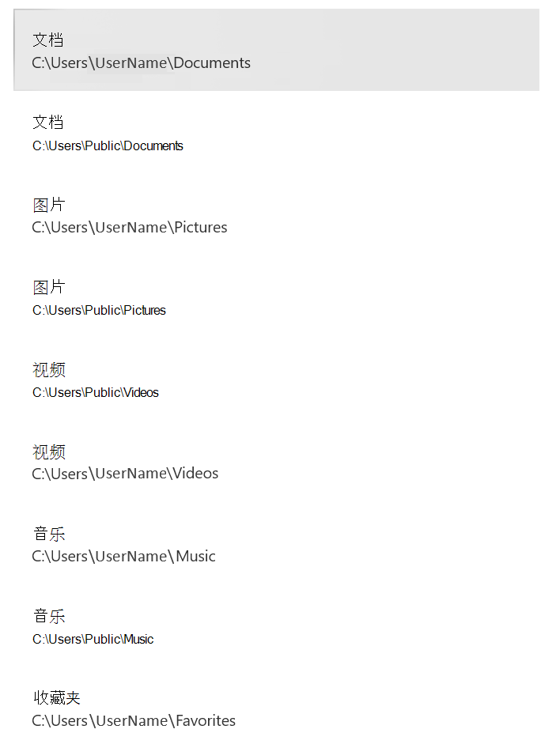

# <a name="protect-important-folders-with-controlled-folder-access"></a>使用受控文件夹访问保护文重要件夹

[!INCLUDE [Microsoft 365 Defender rebranding](../../includes/microsoft-defender.md)]

**适用于：**

- [Microsoft Defender for Endpoint 计划 2](https://go.microsoft.com/fwlink/p/?linkid=2154037)
- [Microsoft 365 Defender](https://go.microsoft.com/fwlink/?linkid=2118804)

> 想要体验适用于终结点的 Defender？ [注册免费试用版](https://signup.microsoft.com/create-account/signup?products=7f379fee-c4f9-4278-b0a1-e4c8c2fcdf7e&ru=https://aka.ms/MDEp2OpenTrial?ocid=docs-wdatp-assignaccess-abovefoldlink)。

## <a name="what-is-controlled-folder-access"></a>什么是受控文件夹访问权限？

受控文件夹访问权限有助于保护你有价值的数据免受恶意应用和威胁（如勒索软件）的侵害。 受控文件夹访问权限通过针对已知受信任应用列表检查应用来保护你的数据。 在 Windows Server 2019、Windows Server 2022、Windows 10 和 Windows 11 客户端上支持，可以使用 Windows 安全中心 App 打开受控文件夹访问权限。Microsoft Endpoint Configuration Manager托管设备 (或 Intune) 。

> [!NOTE]
> 脚本引擎不受信任，你无法允许它们访问受控的受保护文件夹。 例如，即使允许使用证书和文件指示器，受控文件夹访问权限也不信任 PowerShell[。](/microsoft-365/security/defender-endpoint/indicator-certificates)

受控文件夹访问权限最适合 [Microsoft Defender for Endpoint](microsoft-defender-endpoint.md)，它为你提供有关受控文件夹访问权限事件的详细报告，并作为常见警报调查方案的一部分 [进行阻止](investigate-alerts.md)。

> [!TIP]
> 受控文件夹访问块不会在警报队列中 [生成警报](alerts-queue.md)。 但是，可以使用高级搜寻或自定义检测规则在设备时间线视图中[](investigate-machines.md)查看有关受控文件夹访问[块的信息](custom-detection-rules.md)。[](advanced-hunting-overview.md)

## <a name="how-does-controlled-folder-access-work"></a>受控文件夹访问权限是如何工作的？

受控文件夹访问权限仅允许受信任应用访问受保护的文件夹。 在配置受控文件夹访问权限时指定受保护的文件夹。 通常，常用文件夹（如用于文档、图片、下载等的文件夹）包含在受控文件夹列表中。

受控文件夹访问权限适用于受信任应用列表。 受信任软件列表中包含的应用将正常工作。 列表中未包含的应用无法对受保护文件夹内的文件进行任何更改。

根据应用的普遍程度和信誉将应用添加到列表中。 在整个组织中非常普遍且从未显示任何被视为恶意行为的应用被视为可信赖。 这些应用会自动添加到列表中。

还可使用 Configuration Manager 或 Intune 将应用手动添加到受信任的列表中。 可以从管理门户执行Microsoft 365 Defender操作。

## <a name="why-controlled-folder-access-is-important"></a>受控文件夹访问权限为什么很重要

受控文件夹访问权限在帮助保护文档和信息免受勒索软件攻击 [方面尤其有用](https://www.microsoft.com/wdsi/threats/ransomware)。 在勒索软件攻击中，你的文件可以加密并保存。 受控文件夹访问权限就位后，应用尝试对受保护文件夹中的文件进行更改的计算机上将显示一条通知。 你可以使用公司的详细信息和联系人信息[自定义通知](attack-surface-reduction-rules-deployment-implement.md#customize-attack-surface-reduction-rules)。 还可以单独启用规则以自定义功能所监视的技术。

受保护的 [文件夹包括](#review-controlled-folder-access-events-in-windows-event-viewer) 公用系统文件夹 (包括启动) ，你可以 [添加更多文件夹](customize-controlled-folders.md#protect-additional-folders)。 还可以允许 [应用](customize-controlled-folders.md#allow-specific-apps-to-make-changes-to-controlled-folders) 向它们授予对受保护文件夹的访问权限。

可以使用审核 [模式评估](audit-windows-defender.md) 受控文件夹访问权限启用后对组织的影响。 您还可以访问 Windows Defender 测试场[网站，demo.wd.microsoft.com](https://demo.wd.microsoft.com?ocid=cx-wddocs-testground) 确认功能是否正常工作并查看其工作方式。

> [!NOTE]
> 位于 Demo.wd.microsoft.com 的 Defender for Endpoint 演示网站已弃用，并且将在未来删除。

受控文件夹访问权限支持以下版本的 Windows：

- [Windows 10版本 1709](/windows/whats-new/whats-new-windows-10-version-1709) 及更高版本
- Windows 11
- [Windows Server 2019](/windows-server/get-started-19/whats-new-19)
- Windows Server 2022

## <a name="windows-system-folders-are-protected-by-default"></a>Windows默认保护系统文件夹

Windows默认保护系统文件夹以及其他一些文件夹：

受保护的文件夹包括公用系统文件夹 (包括启动) ，你可以添加其他文件夹。 还可以允许应用向它们授予对受保护文件夹的访问权限。  默认情况下Windows系统文件夹包括：

- `c:\Users\<username>\Documents`
- `c:\Users\Public\Documents`
- `c:\Users\<username>\Pictures`
- `c:\Users\Public\Pictures`
- `c:\Users\Public\Videos`
- `c:\Users\<username>\Videos`
- `c:\Users\<username>\Music`
- `c:\Users\Public\Music`
- `c:\Users\<username>\Favorites`

默认文件夹显示在用户配置文件中的"此电脑 **"下**。
   > [!div class="mx-imgBorder"]
   > 

> [!NOTE]
> 可以将其他文件夹配置为受保护，但不能删除Windows系统文件夹。

## <a name="requirements-for-controlled-folder-access"></a>受控文件夹访问权限的要求

受控文件夹访问权限需要启用Microsoft Defender 防病毒[实时保护](configure-real-time-protection-microsoft-defender-antivirus.md)。

## <a name="review-controlled-folder-access-events-in-the-microsoft-365-defender-portal"></a>在管理门户中查看受控文件夹Microsoft 365 Defender事件

Defender for Endpoint 在 Microsoft 365 Defender 门户的警报调查方案中提供有关事件和阻止的详细[](investigate-alerts.md)报告;请参阅 Microsoft 365 Defender 中的 [Microsoft Defender for Endpoint](../defender/microsoft-365-security-center-mde.md)。

可以使用高级搜寻查询 Microsoft Defender 的终结点 [数据](advanced-hunting-overview.md)。 如果你使用的是审核[模式，](audit-windows-defender.md)可以使用高级搜寻查看受控文件夹[](advanced-hunting-overview.md)访问权限设置在启用后将如何影响你的环境。

示例查询：

```PowerShell
DeviceEvents
| where ActionType in ('ControlledFolderAccessViolationAudited','ControlledFolderAccessViolationBlocked')
```

## <a name="review-controlled-folder-access-events-in-windows-event-viewer"></a>在事件查看器中查看受控Windows访问事件

你可以查看Windows事件日志，以查看当受控文件夹访问权限阻止应用 (或审核应用) 创建的事件：

1. 下载 [评估包](https://aka.ms/mp7z2w) ，将文件 *cfa-events.xml* 设备上易于访问的位置。
2. 在 **事件** 查看器中"开始"菜单事件查看器以Windows事件查看器。
3. 在左侧面板的"操作 **"** 下，选择" **导入自定义视图..."**。
4. 导航到提取 *文件cfa-events.xml并选择* 它。 或者， [直接复制 XML](event-views.md)。
5. 选择“**确定**”。

下表显示与受控文件夹访问权限相关的事件：

<br/><br/>

|事件 ID|描述|
|---|---|
|5007|更改设置时的事件|
|1124|已审核的受控文件夹访问事件|
|1123|阻止的受控文件夹访问事件|

## <a name="view-or-change-the-list-of-protected-folders"></a>查看或更改受保护的文件夹列表

可以使用应用Windows 安全中心受受控文件夹访问权限保护的文件夹列表。

1. 在 Windows 10 或 Windows 11 设备上，打开Windows 安全中心应用。
2. 选择“**病毒和威胁防护**”。
3. 在 **勒索软件保护下**，选择 **管理勒索软件保护**。
4. 如果关闭受控文件夹访问权限，你需要将其打开。 选择 **受保护的文件夹**。
5. 请按照以下步骤之一操作：
   - 若要添加文件夹，请选择 **" + 添加受保护的文件夹"**。
   - 若要删除文件夹，请选择该文件夹，然后选择"删除 **"**。

> [!NOTE]
> [Windows系统文件夹](#windows-system-folders-are-protected-by-default)默认受到保护，并且无法从列表中删除它们。
