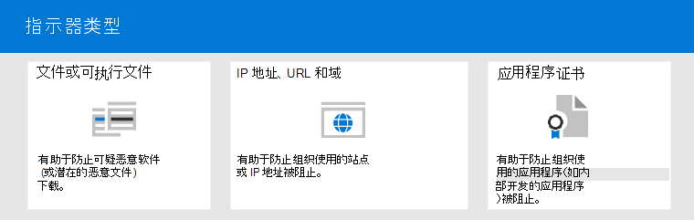

# <a name="address-false-positivesnegatives-in-microsoft-defender-for-endpoint"></a>解决 Microsoft Defender for Endpoint 中的误报/漏报

[!INCLUDE [Microsoft 365 Defender rebranding](../../includes/microsoft-defender.md)]

**适用对象**

- [Microsoft Defender for Endpoint](https://go.microsoft.com/fwlink/p/?linkid=2146806)

在终结点保护解决方案中，误报是一个实体（如文件或进程）被检测并标识为恶意实体，即使实体实际上不是威胁。 漏报是未检测为威胁的实体，即使它实际上是恶意实体。 任何威胁防护解决方案（包括 [Microsoft Defender for Endpoint）](microsoft-defender-endpoint.md)都可能发生误报/负数。


幸运的是，可以采取措施来解决并减少此类问题。 如果在以前的 Microsoft 365 Defender (中看到误报/负[](microsoft-defender-security-center.md)Microsoft Defender 安全中心) ，安全操作可以执行以下步骤，通过以下过程解决这些问题：

1. [查看警报并进行分类](#part-1-review-and-classify-alerts)
2. [查看已采取的修正操作](#part-2-review-remediation-actions)
3. [查看并定义排除项](#part-3-review-or-define-exclusions)
4. [提交实体进行分析](#part-4-submit-a-file-for-analysis)
5. [查看和调整威胁防护设置](#part-5-review-and-adjust-your-threat-protection-settings)

执行本文所述任务后，如果仍有误报/负值问题，可以获取帮助。 请参阅 [是否仍然需要帮助？](#still-need-help)


> [!NOTE]
> 本文旨在指导使用 [Microsoft Defender for Endpoint](microsoft-defender-endpoint.md)的安全操作员和安全管理员。

## <a name="part-1-review-and-classify-alerts"></a>第 1 部分：查看警报并分类

如果 [看到由于检测到](alerts.md) 恶意或可疑的警报而触发的警报，可以抑制该实体的警报。 您还可以禁止不一定是误报但不重要的警报。 建议您对警报进行分类。

管理警报和分类真/假误报有助于培训威胁防护解决方案，并随着时间的推移减少误报或漏报数量。 执行这些步骤还有助于减少安全操作仪表板中的干扰，以便安全团队可以专注于优先级较高的工作项。

### <a name="determine-whether-an-alert-is-accurate"></a>确定警报是否准确

在分类或抑制警报之前，请确定警报是准确、误报还是无害。

1. 转到"Microsoft 365 Defender门户 <https://security.microsoft.com> () 并登录。

2. 在导航窗格中，选择"**警报队列"。**

3. 选择警报以了解有关警报的更多详细信息。  (查看 [适用于终结点的 Microsoft Defender](review-alerts.md)中的警报) 

4. 根据警报状态，执行下表中所述的步骤：

<br/><br/>

   |警报状态|需执行的操作|
   |---|---|
   |警报准确无误|分配警报，然后 [进一步调查](investigate-alerts.md) 。|
   |警报为误报|<ol><li>[将警报分类](#classify-an-alert) 为误报。</li><li>[抑制警报](#suppress-an-alert)。</li><li>[创建适用于](#indicators-for-microsoft-defender-for-endpoint) 终结点的 Microsoft Defender 指示器。</li><li>[将文件提交到 Microsoft 进行分析](#part-4-submit-a-file-for-analysis)。</li></ol>|
   |警报准确无误，但 (不重要) |[将警报分类](#classify-an-alert) 为真正的正数，然后 [抑制警报](#suppress-an-alert)。|

### <a name="classify-an-alert"></a>对警报进行分类

警报可以归类为警报中的误报或Microsoft 365 Defender。 对警报进行分类有助于培训 Microsoft Defender for Endpoint，以便随着时间的推移，你将看到更多真实警报和更少的假警报。

1. 转到"Microsoft 365 Defender门户 <https://security.microsoft.com> () 并登录。

2. 选择 **"警报队列**"，然后选择警报。

3. 对于所选警报，选择"**操作""** \> **管理警报"。** 将打开一个飞出窗格。

4. 在"**管理警报"** 部分，选择"**真警报"或**"**假警报"。**  (使用 **False 警报** 对误报进行分类。) 

> [!TIP]
> 有关抑制警报的信息，请参阅管理 [适用于终结点的 Microsoft Defender 警报](/microsoft-365/security/defender-endpoint/manage-alerts)。 此外，如果你的组织在 SIEM (使用安全信息和事件) ，请确保也定义抑制规则。

### <a name="suppress-an-alert"></a>抑制警报

如果您具有误报或为真误报的警报，但是对于不重要的事件，可以在事件记录中禁止这些Microsoft 365 Defender。 抑制警报有助于减少安全操作仪表板中的噪音。

1. 转到"Microsoft 365 Defender门户 <https://security.microsoft.com> () 并登录。

2. 在导航窗格中，选择 **警报队列**。

3. 选择要禁止的警报以打开其" **详细信息"** 窗格。

4. 在"**详细信息"** 窗格中，选择省略号 **" (...) "，** 然后选择"**创建抑制规则"。**

5. 指定抑制规则的所有设置，然后选择"保存 **"。**

> [!TIP]
> 需要有关抑制规则的帮助？ 请参阅 [抑制警报并创建新的抑制规则](/microsoft-365/security/defender-endpoint/manage-alerts#suppress-an-alert-and-create-a-new-suppression-rule)。

## <a name="part-2-review-remediation-actions"></a>第 2 部分：查看修正操作

[修正操作](manage-auto-investigation.md#remediation-actions)（例如，将文件发送到隔离或停止进程）对 (实体执行，) 被检测为威胁的文件。 多种类型的修正操作通过自动调查和调查自动Microsoft Defender 防病毒：

- 隔离文件
- 删除注册表项
- 终止进程
- 停止服务
- 禁用驱动程序
- 删除计划任务

其他操作（如启动防病毒扫描或收集调查包）手动发生，或者通过 [实时响应发生](live-response.md)。 无法撤消通过实时响应采取的操作。

查看警报后，下一步是 [查看修正操作](manage-auto-investigation.md)。 如果由于误报而进行了任何操作，您可以撤消大多数种类的修正操作。 具体来说，您可以：

- [从操作中心还原隔离文件](#restore-a-quarantined-file-from-the-action-center)
- [一次撤消多个操作](#undo-multiple-actions-at-one-time)
- [跨多个设备从隔离中删除文件](#remove-a-file-from-quarantine-across-multiple-devices)。 和
- [从隔离区还原文件](#restore-file-from-quarantine)

检查和撤消由于误报而采取的操作后，请继续查看 [或定义排除项](#part-3-review-or-define-exclusions)。

### <a name="review-completed-actions"></a>查看已完成的操作

1. 在导航门户的左侧导航窗格中，Microsoft 365 Defender操作 **中心"。**

2. 选择 **"历史记录** "选项卡以查看已采取的操作列表。

3. 选择一个项目以查看有关已采取的修正操作的详细信息。

### <a name="restore-a-quarantined-file-from-the-action-center"></a>从操作中心还原隔离文件

1. 在导航门户的左侧导航窗格中，Microsoft 365 Defender操作 **中心"。**

2. 在 **"历史记录** "选项卡上，选择要撤消的操作。

3. 在飞出窗格中， **选择撤消**。 如果使用此方法无法撤消该操作，则看不到"撤消 **"** 按钮。  (有关详细信息，请参阅 Undo [completed actions](manage-auto-investigation.md#undo-completed-actions).) 

### <a name="undo-multiple-actions-at-one-time"></a>一次撤消多个操作

1. 在导航门户的左侧导航窗格中，Microsoft 365 Defender操作 **中心"。**

2. 在 **"历史记录** "选项卡上，选择要撤消的操作。

3. 在屏幕右侧窗格中，选择"撤消 **"。**

### <a name="remove-a-file-from-quarantine-across-multiple-devices"></a>跨多个设备从隔离中删除文件

> [!div class="mx-imgBorder"]
> 

1. 在门户的左侧导航窗格中，Microsoft 365 Defender操作 **中心"。**

2. 在" **历史记录** "选项卡上，选择操作类型为"隔离 **文件"的文件**。

3. 在屏幕右侧窗格中，选择"应用到此文件的 **X** 更多实例"，然后选择"撤消 **"。**

### <a name="restore-file-from-quarantine"></a>从隔离区还原文件

如果在调查后确定文件是干净的，你可以回滚并从隔离区中删除文件。 在隔离文件的每台设备上运行以下命令。

1. 在设备上打开提升的命令行提示符：

   1. 转到“**开始**”并键入“_cmd_”。
   2. 右键单击“**命令提示符**”，然后选择“**以管理员身份运行**”。

2. 输入以下命令，然后按 **Enter：**

    ```console
    "ProgramFiles%\Windows Defender\MpCmdRun.exe" -Restore -Name EUS:Win32/CustomEnterpriseBlock -All
    ```

    > [!IMPORTANT]
    > 在某些情况下 **，ThreatName 可能** 显示为 `EUS:Win32/CustomEnterpriseBlock!cl` 。 Defender for Endpoint 将还原最近 30 天内在此设备上隔离的所有自定义阻止文件。
    >
    > 作为潜在网络威胁隔离的文件可能无法恢复。 如果用户尝试在隔离后还原文件，则该文件可能无法访问。 这是因为系统不再具有访问该文件的网络凭据。 通常，这是临时登录到系统或共享文件夹且访问令牌过期的结果。

3. 在屏幕右侧窗格中，选择"应用到此文件的 **X** 更多实例"，然后选择"撤消 **"。**

## <a name="part-3-review-or-define-exclusions"></a>第 3 部分：查看或定义排除项

排除项是指定为修正操作例外的实体，如文件或 URL。 排除的实体仍可以检测到，但不对实体执行修正操作。 也就是说，Microsoft Defender for Endpoint 不会停止、将检测到的文件或进程发送到隔离、删除或以其他方式更改。

若要定义 Microsoft Defender for Endpoint 中的排除项，请执行以下任务：

- [定义列表的Microsoft Defender 防病毒](#exclusions-for-microsoft-defender-antivirus)
- [为 Microsoft Defender for Endpoint 创建"允许"指示器](#indicators-for-microsoft-defender-for-endpoint)

> [!NOTE]
> Microsoft Defender 防病毒仅应用于防病毒保护，不适用于其他 Microsoft Defender for Endpoint 功能。 若要广泛排除文件，请使用 microsoft Defender for Endpoint [](/microsoft-365/security/defender-endpoint/manage-indicators) Microsoft Defender 防病毒自定义指示器的排除项。

本节中的过程介绍如何定义排除项和指示器。

### <a name="exclusions-for-microsoft-defender-antivirus"></a>排除项Microsoft Defender 防病毒

一般情况下，你无需为项目定义排除Microsoft Defender 防病毒。 请确保谨慎定义排除项，并且只包含导致误报的文件、文件夹、进程和进程打开的文件。 此外，请确保定期查看定义的排除项。 我们建议使用[Microsoft Endpoint Manager](/mem/endpoint-manager-overview)定义或编辑防病毒排除项;但是，可以使用其他方法，如组策略 ([](/azure/active-directory-domain-services/manage-group-policy)管理[Microsoft Defender for Endpoint](manage-atp-post-migration.md)) 。

> [!TIP]
> 是否需要有关防病毒排除的帮助？ 请参阅[配置并验证扫描Microsoft Defender 防病毒排除项](configure-exclusions-microsoft-defender-antivirus.md)。

#### <a name="use-microsoft-endpoint-manager-to-manage-antivirus-exclusions-for-existing-policies"></a>使用Microsoft Endpoint Manager管理现有策略 (的防病毒) 

1. 转到管理Microsoft Endpoint Manager中心 <https://endpoint.microsoft.com> () 登录。

2. 选择 **"终结点** \> **安全防病毒"，** 然后选择现有策略。  (如果没有现有策略，或者要创建新策略，请 [跳至下](#use-microsoft-endpoint-manager-to-create-a-new-antivirus-policy-with-exclusions) 一步) 。

3. 选择 **"属性"，** 在"**配置设置"旁边**，选择"编辑 **"。**

4. 展开 **Microsoft Defender 防病毒排除项**"，然后指定排除项。

5. 选择 **"审阅 + 保存"，** 然后选择"保存 **"。**

#### <a name="use-microsoft-endpoint-manager-to-create-a-new-antivirus-policy-with-exclusions"></a>使用Microsoft Endpoint Manager创建排除项的新防病毒策略

1. 转到管理Microsoft Endpoint Manager中心 <https://endpoint.microsoft.com> () 登录。

2. 选择 **"终结点安全** \> **防病毒** \> **+ 创建策略"。**

3. 选择平台 (，Windows 10 **更高版本****、macOS** 或 Windows 10 和 **Windows Server**) 。

4. 对于 **"配置文件****"，Microsoft Defender 防病毒** 排除项"，然后选择"创建 **"。**

5. 指定配置文件的名称和说明，然后选择"下一步 **"。**

6. 在"**配置设置"** 选项卡上，指定防病毒排除项，然后选择"下一步 **"。**

7. 在" **范围标记** "选项卡上，如果您在组织中使用范围标记，请为要创建的策略指定范围标记。  (范围 [标记](/mem/intune/fundamentals/scope-tags).) 

8. 在"**分配**"选项卡上，指定应应用策略的用户和组，然后选择"下一步 **"。**  (如果需要分配帮助，[请参阅在](/mem/intune/configuration/device-profile-assign).Microsoft Intune .) 

9. 在"**查看 + 创建"** 选项卡上，查看设置，然后选择"创建 **"。**

### <a name="indicators-for-microsoft-defender-for-endpoint"></a>适用于终结点的 Microsoft Defender 指示器

[尤其是 (](/microsoft-365/security/defender-endpoint/manage-indicators) 泄露指示器或 IoCs) 使安全运营团队能够定义实体的检测、防护和排除。 例如，可以在 Microsoft Defender for Endpoint 的扫描和修正操作中指定要省略的某些文件。 或者，指示器可用于对某些文件、IP 地址或 URL 生成警报。

若要将实体指定为 Microsoft Defender for Endpoint 的排除项，请为这些实体创建"允许"指示器。 Microsoft Defender for Endpoint 中的此类"允许"[](microsoft-defender-antivirus-in-windows-10.md)指示器适用于下一代[](overview-endpoint-detection-response.md)保护、终结点检测和响应以及自动调查[&修正](/microsoft-365/security/defender-endpoint/automated-investigations)。

"允许"指示器可用于：

- [Files](#indicators-for-files)
- [IP 地址、URL 和域](#indicators-for-ip-addresses-urls-or-domains)
- [应用程序证书](#indicators-for-application-certificates)



#### <a name="indicators-for-files"></a>文件指示器

为 [文件（](/microsoft-365/security/defender-endpoint/indicator-file)如可执行文件）创建"允许"指示器时，它有助于防止组织使用的文件被阻止。 文件可以包括可移植的可执行 (PE) 文件，如 和 `.exe` `.dll` 文件。

创建文件指示器之前，请确保满足以下要求：

- Microsoft Defender 防病毒配置了启用基于云的保护 (请参阅[管理基于云的保护](/windows/security/threat-protection/microsoft-defender-antivirus/deploy-manage-report-microsoft-defender-antivirus)) 
- 反恶意软件客户端版本为 4.18.1901.x 或更高版本
- 设备正在运行Windows 10版本 1703 或更高版本;Windows Server 2016、Windows Server 2019 或 Windows Server 2022
- " [阻止或允许"功能已打开](/microsoft-365/security/defender-endpoint/advanced-features)

#### <a name="indicators-for-ip-addresses-urls-or-domains"></a>IP 地址、URL 或域的指示器

为 [IP 地址、URL](/microsoft-365/security/defender-endpoint/indicator-ip-domain)或域创建"允许"指示器时，它有助于防止组织使用的站点或 IP 地址被阻止。

为 IP 地址、URL 或域创建指示器之前，请确保满足以下要求：

- Defender for Endpoint 中的网络保护在阻止模式下启用 (请参阅启用 [网络保护](/microsoft-365/security/defender-endpoint/enable-network-protection)) 
- 反恶意软件客户端版本为 4.18.1906.x 或更高版本
- 设备正在运行Windows 10版本 1709 或更高版本

自定义网络指示器在"设置"[中Microsoft 365 Defender。](microsoft-defender-security-center.md) 若要了解更多信息，请参阅 [高级功能](/microsoft-365/security/defender-endpoint/advanced-features)。

#### <a name="indicators-for-application-certificates"></a>应用程序证书指示器

为 [应用程序证书创建"允许](/microsoft-365/security/defender-endpoint/indicator-certificates)"指示器时，它有助于防止组织使用的应用程序（如内部开发的应用程序）被阻止。 `.CER` 或 `.PEM` 文件扩展名。

创建应用程序证书指示器之前，请确保满足以下要求：

- Microsoft Defender 防病毒配置了启用基于云的保护 (请参阅[管理基于云的保护](deploy-manage-report-microsoft-defender-antivirus.md)) 
- 反恶意软件客户端版本为 4.18.1901.x 或更高版本
- 设备正在运行Windows 10版本 1703 或更高版本;Windows Server 2016、Windows Server 2019 或 Windows Server 2022
- 病毒和威胁防护定义是最新的

> [!TIP]
> 创建指示器时，可以一个一个地定义它们，也可以一次导入多个项。 请记住，单个租户的指示器限制为 15，000 个。 而且，您可能需要首先收集某些详细信息，例如文件哈希信息。 请确保先查看先决条件，然后再 [创建指示器](manage-indicators.md)。

## <a name="part-4-submit-a-file-for-analysis"></a>第 4 部分：提交文件进行分析

你可以将实体（如文件和无文件检测）提交给 Microsoft 进行分析。 Microsoft 安全研究人员分析所有提交，其结果有助于通知 Microsoft Defender 终结点威胁防护功能。 当你在提交网站登录时，你可以跟踪你的提交。

### <a name="submit-a-file-for-analysis"></a>提交文件进行分析

如果文件被错误地检测为恶意或丢失，请按照以下步骤提交文件进行分析。

1. 查看以下指南： [提交文件进行分析](/windows/security/threat-protection/intelligence/submission-guide)。

2. 访问Microsoft 安全智能提交 <https://www.microsoft.com/wdsi/filesubmission> () ，然后提交你的 (提交) 。

### <a name="submit-a-fileless-detection-for-analysis"></a>提交无文件检测进行分析

如果根据行为检测到恶意软件，并且您没有文件，您可以提交 `Mpsupport.cab` 文件进行分析。 可以通过使用.cab上的 Microsoft 恶意软件防护工具Command-Line实用程序 (MPCmdRun.exe) 文件Windows 10。

1. 转到 ` C:\ProgramData\Microsoft\Windows Defender\Platform\<version>` ，然后以 `MpCmdRun.exe` 管理员角色运行。

2. 键入 `mpcmdrun.exe -GetFiles` ，然后按 **Enter。**

   生成.cab诊断日志的诊断文件。 文件的位置在命令提示符的输出中指定。 默认情况下，位置为 `C:\ProgramData\Microsoft\Microsoft Defender\Support\MpSupportFiles.cab` 。

3. 查看以下指南： [提交文件进行分析](/windows/security/threat-protection/intelligence/submission-guide)。

4. 访问Microsoft 安全智能提交网站 <https://www.microsoft.com/wdsi/filesubmission> () 提交你的.cab文件。

### <a name="what-happens-after-a-file-is-submitted"></a>提交文件后会发生什么情况？

我们的系统会立即扫描你的提交，以在分析员开始处理你的案例之前提供最新决定。 分析员可能已经提交和处理了文件。 在这种情况下，迅速作出决定。

对于尚未处理的提交，将按如下方式对提交进行优先分析：

- 对于可能会影响大量计算机的流行文件，其优先级更高。
- 经过身份验证的客户（尤其是具有有效软件保障 ([或) 的 ](https://www.microsoft.com/licensing/licensing-programs/software-assurance-default.aspx)企业级客户）的优先级更高。
- 由 SAID 持有者标记为高优先级的提交将被立即关注。

若要检查有关你的提交的更新，请在你的提交Microsoft 安全智能[登录](https://www.microsoft.com/wdsi/filesubmission)。

> [!TIP]
> 若要了解更多信息，请参阅 [提交文件进行分析](/windows/security/threat-protection/intelligence/submission-guide#how-does-microsoft-prioritize-submissions)。

## <a name="part-5-review-and-adjust-your-threat-protection-settings"></a>第 5 部分：查看和调整威胁防护设置

Microsoft Defender for Endpoint 提供各种选项，包括针对各种特性和功能微调设置的功能。 如果收到大量误报，请务必查看组织的威胁防护设置。 您可能需要进行一些调整以：

- [云端保护](#cloud-delivered-protection)
- [针对可能不需要的应用程序的修正](#remediation-for-potentially-unwanted-applications)
- [自动调查和修正](#automated-investigation-and-remediation)

### <a name="cloud-delivered-protection"></a>云端保护

检查云提供的保护级别，了解Microsoft Defender 防病毒。 默认情况下，云提供的保护设置为"未配置"，这与大多数组织的正常保护级别相对应。  如果云提供的保护设置为 **高**、高 **+** 或 **零容** 限，则可能会遇到更多误报。

> [!TIP]
> 若要详细了解如何配置云保护，请参阅指定 [云保护级别](/windows/security/threat-protection/microsoft-defender-antivirus/specify-cloud-protection-level-microsoft-defender-antivirus)。

我们建议你[Microsoft Endpoint Manager](/mem/endpoint-manager-overview)或设置云保护设置;但是，可以使用其他方法，如组策略 ([](/azure/active-directory-domain-services/manage-group-policy)管理[Microsoft Defender for Endpoint](manage-atp-post-migration.md)) 。

#### <a name="use-microsoft-endpoint-manager-to-review-and-edit-cloud-delivered-protection-settings-for-existing-policies"></a>使用Microsoft Endpoint Manager查看和编辑云提供的保护设置 (现有策略) 

1. 转到管理Microsoft Endpoint Manager中心 <https://endpoint.microsoft.com> () 登录。

2. 选择 **"终结点** \> **安全防病毒"，** 然后选择现有策略。  (如果没有现有策略，或者要创建新策略，请 [跳至下](#use-microsoft-endpoint-manager-to-set-cloud-delivered-protection-settings-for-a-new-policy) 一步) 。

3. 在 **"管理"** 下，选择"**属性"。** 然后，在"配置 **设置"旁边，** 选择"编辑 **"。**

4. 展开 **云保护**，然后查看云提供的保护 **级别行中的当前** 设置。 我们建议将云提供的保护设置为"未配置 **"，** 这将提供强大的保护，同时降低误报的可能性。

5. 选择 **"审阅 + 保存"，** 然后选择"**保存"。**

#### <a name="use-microsoft-endpoint-manager-to-set-cloud-delivered-protection-settings-for-a-new-policy"></a>使用Microsoft Endpoint Manager设置云保护设置 (策略设置) 

1. 转到管理Microsoft Endpoint Manager中心 <https://endpoint.microsoft.com> () 登录。

2. 选择 **"终结点安全** \> **防病毒** \> **+ 创建策略"。**

3. 对于 **"** 平台"，选择一个选项，然后对于"配置文件"，选择"防病毒"或Microsoft Defender 防病毒 (具体选项取决于为 **"** 平台"选择) 然后选择"创建 **"。**

4. 在 **"基本信息"** 选项卡上，指定策略的名称和说明。 然后选择“**下一步**”。

5. 在" **配置设置"** 选项卡上，展开 **"云保护**"，并指定以下设置：

   - 将 **"启用云保护"设置为****"是"。**
   - 将“**云端保护级别**”设为“**未配置**”。  (此级别默认情况下提供强大的保护级别，同时降低误报的可能性。) 

6. 在" **范围标记** "选项卡上，如果您在组织中使用范围标记，请为策略指定范围标记。  (范围 [标记](/mem/intune/fundamentals/scope-tags).) 

7. 在"**分配**"选项卡上，指定应应用策略的用户和组，然后选择"下一步 **"。**  (如果需要分配帮助，请参阅在 .Microsoft Intune 中分配[用户和设备](/mem/intune/configuration/device-profile-assign)) 

8. 在"**查看 + 创建"** 选项卡上，查看设置，然后选择"创建 **"。**

### <a name="remediation-for-potentially-unwanted-applications"></a>针对可能不需要的应用程序的修正

PUA (可能不需要) 是一类软件，可能会导致设备运行缓慢、显示意外广告或安装可能意外或不需要的其他软件。 PUA 的示例包括广告软件、捆绑软件和与安全产品行为不同的软件。 尽管 PUA 不被视为恶意软件，但某些类型的软件是基于其行为和信誉的 PUA。

> [!TIP]
> 若要了解有关 PUA 的更多信息，请参阅 [检测并阻止可能不需要的应用程序](/windows/security/threat-protection/microsoft-defender-antivirus/detect-block-potentially-unwanted-apps-microsoft-defender-antivirus)。

根据你的组织使用的应用，你可能由于 PUA 保护设置而收到误报。 如有必要，请考虑在审核模式下运行一段时间的 PUA 保护，或将 PUA 保护应用于组织中设备的子集。 PUA 保护可以配置为Microsoft Edge浏览器和 Microsoft Defender 防病毒。

我们建议[使用Microsoft Endpoint Manager或](/mem/endpoint-manager-overview)设置 PUA 保护设置;但是，可以使用其他方法，如组策略 ([](/azure/active-directory-domain-services/manage-group-policy)管理[Microsoft Defender for Endpoint](manage-atp-post-migration.md)) 。

#### <a name="use-microsoft-endpoint-manager-to-edit-pua-protection-for-existing-configuration-profiles"></a>使用 Microsoft Endpoint Manager编辑现有配置文件 (PUA 保护) 

1. 转到管理Microsoft Endpoint Manager中心 <https://endpoint.microsoft.com> () 登录。

2. 选择 **"设备** \> **配置文件"，** 然后选择现有策略。  (如果没有现有策略，或者想要创建新策略，请 [跳到下](#use-microsoft-endpoint-manager-to-set-pua-protection-for-a-new-configuration-profile)一过程 .) 

3. 在 **"管理"** 下，**选择"属性**"，然后在"配置 **设置"旁边**，选择"编辑 **"。**

4. 在"**配置设置"** 选项卡上，向下滚动并展开 **"Microsoft Defender 防病毒"。**

5. 将 **"检测可能不需要的应用程序"设置为****"审核"。**  (你可以将其关闭，但通过使用审核模式，你将能够看到检测。) 

6. 选择 **"审阅 + 保存"，** 然后选择"保存 **"。**

#### <a name="use-microsoft-endpoint-manager-to-set-pua-protection-for-a-new-configuration-profile"></a>使用Microsoft Endpoint Manager设置新的配置文件 (PUA 保护) 

1. 转到管理Microsoft Endpoint Manager中心 <https://endpoint.microsoft.com> () 登录。

2. 选择 **"设备** \> **配置文件** \> **+ 创建配置文件"。**

3. 对于 **平台**，选择 **Windows 10** 和更高版本，对于 **配置文件**，选择 **设备限制**。

4. 在 **"基本信息"** 选项卡上，指定策略的名称和说明。 然后选择“**下一步**”。

5. 在"**配置设置"** 选项卡上，向下滚动并展开 **"Microsoft Defender 防病毒"。**

6. 将 **"检测可能不需要的应用程序"设置为****"审核"，** 然后选择"下一 **步"。**  (你可以关闭 PUA 保护，但通过使用审核模式，你将能够看到检测。) 

7. 在"**分配**"选项卡上，指定应应用策略的用户和组，然后选择"下一步 **"。**  (如果需要分配帮助，请参阅在 .Microsoft Intune 中分配[用户和设备](/mem/intune/configuration/device-profile-assign)) 

8. 在 **"适用性规则** "选项卡上，指定要包含或排除在策略中的操作系统版本。 例如，你可以将策略设置为应用于所有设备特定版本的 Windows 10。 然后选择“**下一步**”。

9. 在"**查看 + 创建**"选项卡上，查看设置，然后选择"创建 **"。**

### <a name="automated-investigation-and-remediation"></a>自动调查和修复

[AIR (](automated-investigations.md) 自动调查和) 功能旨在检查警报并立即采取措施来解决违规问题。 触发警报并运行自动调查时，将针对调查的每个证据生成裁定。 裁定结果可以是 *"恶意"、"**可疑"* 或 *"未找到威胁"。*

根据为 [组织](/microsoft-365/security/defender-endpoint/automation-levels)设置的自动化级别和其他安全设置，将针对视为恶意或 *可疑的项目采取**修正操作*。 在某些情况下，将自动执行修正操作;在其他情形下，修正操作是手动采取的，或仅在安全运营团队批准后执行。

- [详细了解自动化级别](/microsoft-365/security/defender-endpoint/automation-levels);然后
- [在 Defender for Endpoint 中配置 AIR 功能](/microsoft-365/security/defender-endpoint/configure-automated-investigations-remediation)。

> [!IMPORTANT]
> 我们建议使用 *完全自动化* 进行自动调查和修正。 不要因为误报而关闭这些功能。 相反， [使用"允许"指示器定义](#indicators-for-microsoft-defender-for-endpoint)例外，并保留自动调查和修正集以自动采取适当操作。 遵循 [本指南](automation-levels.md#levels-of-automation) 有助于减少安全运营团队必须处理的警报数量。

## <a name="still-need-help"></a>是否仍需要帮助？

如果已执行本文中所有步骤，但仍需要帮助，请联系技术支持人员。

1. 转到 <https://security.microsoft.com> Microsoft 365 Defender () 并登录。

2. 在右上角，选择问号 **" (？) "，** 然后选择 **"Microsoft 支持"。**

3. 在" **支持助手"** 窗口中，描述您的问题，然后发送邮件。 可以从中打开服务请求。

## <a name="see-also"></a>另请参阅

[管理 Microsoft Defender for Endpoint](manage-atp-post-migration.md)

[Microsoft 365 Defender门户概述](/microsoft-365/security/defender-endpoint/use)
