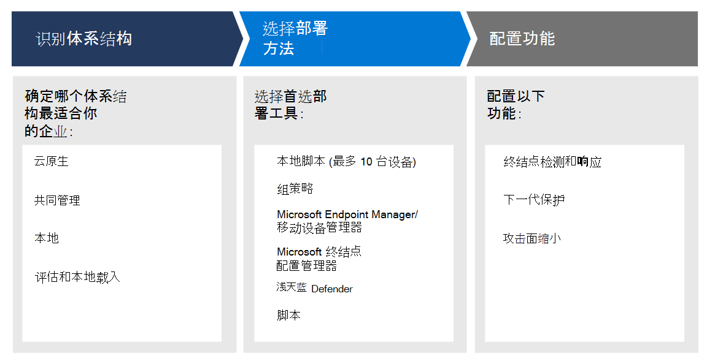

# 计划 Microsoft Defender for Endpoint 部署

[!INCLUDE [Microsoft 365 Defender rebranding](../../includes/microsoft-defender.md)]

**适用于：**
- [Microsoft Defender for Endpoint 计划 2](https://go.microsoft.com/fwlink/p/?linkid=2154037)
- [Microsoft 365 Defender](https://go.microsoft.com/fwlink/?linkid=2118804)

> 想要体验适用于终结点的 Defender？ [注册免费试用版](https://signup.microsoft.com/create-account/signup?products=7f379fee-c4f9-4278-b0a1-e4c8c2fcdf7e&ru=https://aka.ms/MDEp2OpenTrial?ocid=docs-wdatp-secopsdashboard-abovefoldlink)。

规划 Microsoft Defender for Endpoint 部署，以便你可以最大化套件中的安全性功能，并更好地保护你的企业免受网络威胁。

此解决方案提供了有关如何确定环境体系结构、选择最符合您需求的部署工具类型的指导，以及如何配置功能的指南。

## 步骤 1：确定体系结构

我们知道每个企业环境都是唯一的，因此我们提供了多个选项，让你能够灵活地选择如何部署服务。

根据你的环境，某些工具更适合某些体系结构。

使用以下材料选择最适合贵组织的适用于终结点的 Defender 体系结构。

| 项目 | 说明 |
|:-----|:-----|
|  [PDF](https://download.microsoft.com/download/5/6/0/5609001f-b8ae-412f-89eb-643976f6b79c/mde-deployment-strategy.pdf)  \| [Visio](https://download.microsoft.com/download/5/6/0/5609001f-b8ae-412f-89eb-643976f6b79c/mde-deployment-strategy.vsdx) | 体系结构资料有助于规划如下体系结构的部署： <ul><li> 云-本机 </li><li> 协同管理 </li><li> 本地</li><li>评估和本地载入</li>

## 步骤 2：选择部署方法

| 端点     | 部署工具                       |
|--------------|------------------------------------------|
| **Windows**  |  [本地脚本 (最多 10 台设备) ](configure-endpoints-script.md)    [组策略](configure-endpoints-gp.md)    [Microsoft Endpoint Manager/移动设备管理器](configure-endpoints-mdm.md)     [Microsoft Endpoint Configuration Manager](configure-endpoints-sccm.md)   [VDI 脚本](configure-endpoints-vdi.md)   [与 Microsoft Defender for Cloud 集成](configure-server-endpoints.md#integration-with-azure-defender)  |
| **macOS**    | [本地脚本](mac-install-manually.md)   [Microsoft Endpoint Manager](mac-install-with-intune.md)   [JAMF Pro](mac-install-with-jamf.md)   [移动设备管理](mac-install-with-other-mdm.md) |
| **Linux Server** | [本地脚本](linux-install-manually.md)   [百分百](linux-install-with-puppet.md)   [Ansible](linux-install-with-ansible.md)|
| **iOS**      | [Microsoft Endpoint Manager](ios-install.md)                                |
| **Android**  | [Microsoft Endpoint Manager](android-intune.md)               | 

下表列出了受支持的终结点和可使用的相应部署工具，以便可以相应地规划部署。

|端点|部署工具|
|---|---|
|**Windows**|[本地脚本 (最多 10 台设备) ](configure-endpoints-script.md)    [组策略](configure-endpoints-gp.md)    [Microsoft Endpoint Manager/移动设备管理器](configure-endpoints-mdm.md)     [Microsoft Endpoint Configuration Manager](configure-endpoints-sccm.md)   [VDI 脚本](configure-endpoints-vdi.md)   [与 Microsoft Defender for Cloud 集成](configure-server-endpoints.md#integration-with-azure-defender)|
|**macOS**|[本地脚本](mac-install-manually.md)   [Microsoft Endpoint Manager](mac-install-with-intune.md)   [JAMF Pro](mac-install-with-jamf.md)   [移动设备管理](mac-install-with-other-mdm.md)|
|**Linux Server**|[本地脚本](linux-install-manually.md)   [百分百](linux-install-with-puppet.md)   [Ansible](linux-install-with-ansible.md)|
|**iOS**|[基于应用](ios-install.md)|
|**Android**|[Microsoft Endpoint Manager](android-intune.md)|

## 步骤 3：配置功能

载入终结点后，在 Defender for Endpoint 中配置安全功能，以便你可以最大化套件中可用的强大安全保护。 功能包括：

- 终结点检测和响应
- 下一代保护
- 攻击面减少

## 相关主题

- [部署阶段](deployment-phases.md)
