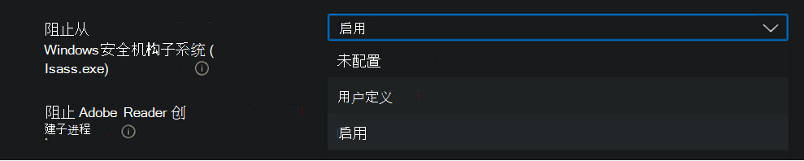

# <a name="enable-attack-surface-reduction-rules"></a>启用攻击面减少规则

**适用于：**

- [Microsoft Defender for Endpoint 计划 2](https://go.microsoft.com/fwlink/p/?linkid=2154037)
- [Microsoft 365 Defender](https://go.microsoft.com/fwlink/?linkid=2118804)

> [!TIP]
> 想要体验适用于终结点的 Defender？ [注册免费试用版](https://signup.microsoft.com/create-account/signup?products=7f379fee-c4f9-4278-b0a1-e4c8c2fcdf7e&ru=https://aka.ms/MDEp2OpenTrial?ocid=docs-wdatp-assignaccess-abovefoldlink)。

[攻击面减少规则](attack-surface-reduction.md) (ASR 规则) 有助于防止恶意软件经常滥用以损害设备和网络的操作。

## <a name="requirements"></a>要求

跨多个版本的攻击Windows功能

你可以为运行以下任一版本和版本的设备设置攻击面减少规则Windows：

- Windows 10 专业版版本 [1709](/windows/whats-new/whats-new-windows-10-version-1709) 或更高版本
- Windows 10 企业版版本 [1709](/windows/whats-new/whats-new-windows-10-version-1709) 或更高版本
- Windows Server 版本 [1803 (半年频道) ](/windows-server/get-started/whats-new-in-windows-server-1803)或更高版本
- [Windows Server 2019](/windows-server/get-started-19/whats-new-19)
- [Windows Server 2016](/windows-server/get-started/whats-new-in-windows-server-2016)
- [Windows Server 2012 R2](/windows/win32/srvnodes/what-s-new-for-windows-server-2012-r2)
- Windows Server 2022

若要使用攻击面减少规则的整个功能集，你需要：

- Windows Defender 防病毒作为主 AV (实时保护) 
- [某些规则](/windows/security/threat-protection/microsoft-defender-antivirus/enable-cloud-protection-microsoft-defender-antivirus) 要求 (上的云传递保护) 
- Windows 10 企业版 E5 或 E3 许可证

尽管攻击面减少规则不需要 [Windows E5](/windows/deployment/deploy-enterprise-licenses) 许可证，但使用 Windows E5 许可证，你可以获得高级管理功能，包括适用于终结点的 Defender 中提供的监视、分析和工作流，以及 Microsoft 365 Defender 门户中的报告和<a href="https://go.microsoft.com/fwlink/p/?linkid=2077139" target="_blank">配置</a>功能。 这些高级功能不适用于 E3 许可证，但你仍可以使用事件查看器查看攻击面减少规则事件。

每个 ASR 规则包含四个设置之一：

- **未配置** | **已禁用**：禁用 ASR 规则
- **阻止**：启用 ASR 规则
- **审核**：评估 ASR 规则在启用后对组织的影响
- **警告**：启用 ASR 规则，但允许最终用户绕过阻止

> [!IMPORTANT]
> 目前，在 MEM 中配置 ASR 规则时，三个 ASR 规则Microsoft Endpoint Manager (警告) 。 若要了解更多信息，请参阅 [不支持警告模式的情况](attack-surface-reduction.md#cases-where-warn-mode-is-not-supported)。

我们建议将 ASR 规则与 Windows E5 许可证 (或类似的许可 SKU) 一同使用，以利用适用于 Endpoint (Defender for Endpoint) 的 [Microsoft Defender](microsoft-defender-endpoint.md) 中提供的高级监视和报告功能。 但是，如果您有不包含高级监视和报告功能的另一个许可证（如 Windows Professional 或 Windows E3），您可以在触发 ASR 规则时在每个终结点生成的事件（例如，事件转发 () ）上开发自己的监视和报告工具。

> [!TIP]
> 若要了解有关许可Windows，请参阅Windows 10[许可并](https://www.microsoft.com/licensing/product-licensing/windows10?activetab=windows10-pivot:primaryr5)获取适用于 Windows 10 的[批量许可Windows 10](https://download.microsoft.com/download/2/D/1/2D14FE17-66C2-4D4C-AF73-E122930B60F6/Windows-10-Volume-Licensing-Guide.pdf)。

可以使用以下任一方法启用攻击面减少规则：

- [Microsoft Intune](#intune)
- [移动设备管理 (MDM)](#mdm)
- [Microsoft Endpoint Configuration Manager](#microsoft-endpoint-configuration-manager)
- [组策略](#group-policy)
- [PowerShell](#powershell)

Enterprise Intune 或 Microsoft Endpoint Manager等级别管理。 Enterprise级别管理将在启动时覆盖任何冲突的组策略或 PowerShell 设置。

## <a name="exclude-files-and-folders-from-asr-rules"></a>从 ASR 规则中排除文件和文件夹

你可以排除大多数攻击面减少规则评估的文件和文件夹。 这意味着，即使 ASR 规则确定文件或文件夹包含恶意行为，它将不会阻止文件运行。 这可能会允许不安全的文件运行并感染你的设备。

通过允许指定的 Defender for Endpoint 文件和证书指示器，还可以从基于证书和文件哈希触发的 ASR 规则排除。  (请参阅 [管理指示器](manage-indicators.md).) 

> [!IMPORTANT]
> 排除文件或文件夹会大大降低 ASR 规则所提供的保护。 将允许运行排除的文件，并且不会记录任何报告或事件。
> 如果 ASR 规则正在检测你认为不应检测的文件，应首先使用审核模式 [测试规则](evaluate-attack-surface-reduction.md)。

可以使用文件夹路径或完全限定的资源 (指定单个文件或文件夹) ，但无法指定排除项应用于的规则。 仅在已排除的应用程序或服务启动时应用排除。 例如，如果为已在运行的更新服务添加排除项，则更新服务将继续触发事件，直到停止并重新启动该服务。

ASR 规则支持环境变量和通配符。 有关使用通配符的信息，请参阅在文件名和文件夹路径或扩展名排除列表中 [使用通配符](configure-extension-file-exclusions-microsoft-defender-antivirus.md#use-wildcards-in-the-file-name-and-folder-path-or-extension-exclusion-lists)。

## <a name="policy-conflict"></a>策略冲突

1. 如果通过 MDM 和 GP 应用冲突策略，则从 MDM 应用的设置优先。

2. MEM 托管设备的攻击面减少规则现在支持合并不同策略中的设置的行为，以为每个设备创建策略超集。 只有未发生冲突的设置会合并，而存在冲突的设置不会添加到规则的超集。 以前，如果两个策略包含单个设置的冲突，则两个策略都被标记为存在冲突，并且不会部署任何配置文件中的设置。 攻击面减少规则合并行为如下所示：
   - 针对应用这些规则的每个设备评估来自以下配置文件的攻击面减少规则：
     - 设备>配置策略> Endpoint Protection 配置文件> **Microsoft Defender 攻击防护** > [减少。](/mem/intune/protect/endpoint-protection-windows-10#attack-surface-reduction-rules)
     - 终结点安全> **攻击面减少策略** > [附加图面减少规则](/mem/intune/protect/endpoint-security-asr-policy#devices-managed-by-intune)。
     - Endpoint security > Security baselines > **Microsoft Defender ATP BaselineAttack** >  [Surface Reduction Rules](/mem/intune/protect/security-baseline-settings-defender-atp#attack-surface-reduction-rules)。
   - 设置没有冲突的策略添加到设备的策略超集。
   - 当两个或多个策略具有冲突设置时，冲突设置不会添加到组合策略中，而不会发生冲突的设置将添加到适用于设备的超集策略。
   - 仅会回滚冲突设置的配置。

## <a name="configuration-methods"></a>配置方法

本节提供以下配置方法的配置详细信息：

- [Intune](#intune)
- [MEM](#mem)
- [MDM](#mdm)
- [Microsoft Endpoint Configuration Manager](#microsoft-endpoint-configuration-manager)
- [组策略](#group-policy)
- [PowerShell](#powershell)

以下用于启用 ASR 规则的过程包括有关如何排除文件和文件夹的说明。

### <a name="intune"></a>Intune

#### <a name="device-configuration-profiles"></a>设备配置文件

1. 选择 **"设备配置文件** \> **"**。 选择现有的终结点保护配置文件或创建新的终结点保护配置文件。 若要创建新的配置文件，请选择" **创建配置文件** "并为此配置文件输入信息。 对于 **"配置文件类型"**，选择" **终结点保护"**。 如果已选择现有配置文件，请选择"**属性**"，然后选择"设置 **"**。

2. 在终结点 **保护窗格中**，选择Windows Defender **攻击防护"**，然后选择"**攻击面减少"**。 选择每个 ASR 规则所需的设置。

3. 在 **"攻击面减少异常"** 下，输入单个文件和文件夹。 还可以选择导入 **以** 导入 CSV 文件，其中包含要从 ASR 规则中排除的文件和文件夹。 CSV 文件的每一行的格式应如下所示：

   `C:\folder`, `%ProgramFiles%\folder\file`, `C:\path`

4. 在 **三** 个配置窗格中选择"确定"。 然后，**如果要** 创建新的终结点保护文件，请选择"创建";如果要编辑现有终结点保护文件，请选择"保存"。

#### <a name="endpoint-security-policy"></a>终结点安全策略**

1. 选择 **终结点安全** \> **攻击面减少**。 选择现有的 ASR 规则或创建新的 ASR 规则。 若要创建新的配置文件，请选择" **创建策略** "并输入此配置文件的信息。 对于 **配置文件类型，** 选择 **攻击面减少规则**。 如果已选择现有配置文件，请选择"**属性**"，然后选择"设置 **"**。

2. 在配置 **设置窗格中** ，选择 **攻击面减少** ，然后选择每个 ASR 规则所需的设置。

3. 在 **"** 需要保护的其他文件夹列表"和"有权访问受保护文件夹的应用列表"和"从攻击 **面** 减少规则中排除文件和路径"下，输入单个文件和文件夹。 还可以选择导入 **以** 导入 CSV 文件，其中包含要从 ASR 规则中排除的文件和文件夹。 CSV 文件的每一行的格式应如下所示：

   `C:\folder`, `%ProgramFiles%\folder\file`, `C:\path`

4. 在 **三** 个配置窗格中选择"下一步"，然后选择"创建"（如果正在创建新策略）或"保存"（如果正在编辑现有策略）。

### <a name="mem"></a>MEM

可以使用 OMA-URI Microsoft Endpoint Manager (MEM) 配置自定义 ASR 规则。 以下过程使用规则 [阻止滥用攻击的易受攻击的已](attack-surface-reduction-rules-reference.md#block-abuse-of-exploited-vulnerable-signed-drivers) 签名驱动程序作为示例。

1. 打开Microsoft Endpoint Manager (MEM) 管理中心。 在" **主页"** 菜单中，单击  **"设备"**，选择 **"配置文件**"，然后单击" **创建配置文件"**。

   > [!div class="mx-imgBorder"]
   > 

2. 在 **"创建配置文件"** 中的以下两个下拉列表中，选择以下选项：

   - 在 **"平台**"中，**Windows 10和更高版本**
   - 在 **"配置文件类型**"中， **选择"模板"**

   选择 **"自定义**"，然后选择" **创建"**。

   > [!div class="mx-imgBorder"]
   > 

3. 自定义模板工具将打开到步骤 **1 基础知识**。 在 **"1 基础知识"** 的 **"** 名称"中，键入模板的名称，在"说明"中，可以键入可选 (说明) 。

   > [!div class="mx-imgBorder"]
   > 

4. 点击 **“下一步”**。 步骤 **2 将打开配置** 设置。 对于 OMA-URI 设置，**单击添加。** 此时将显示两个选项：" **添加"和** " **导出"**。

   > [!div class="mx-imgBorder"]
   > 

5. 再次 **单击"添加** "。 添加 **行 OMA-URI 设置** 打开。 在 **"添加行**"中，执行下列操作：

   - 在 **"** 名称"中，键入规则的名称。
   - 在 **"说明**"中，键入简要说明。
   - 在 **OMA-URI** 中，键入或粘贴要添加的规则的特定 OMA-URI 链接。 有关要用于此示例规则的 OMA-URI，请参阅本文中的 MDM 部分。 有关攻击面减少规则 GUID [，请参阅主题](attack-surface-reduction-rules-reference.md#per-rule-descriptions) ：攻击面减少规则中的每个规则说明。
   - 在 **"数据类型"中**，选择" **字符串"**。
   - 在 **"值**"中，键入或粘贴 GUID 值 \= 、符号和 State 值（ (_GUID=StateValue_) ）。 其中：

     - 0 ：禁用 (禁用 ASR 规则) 
     - 1：阻止 (启用 ASR 规则) 
     - 2：审核 (评估 ASR 规则在启用后对组织) 
     - 6： (启用 ASR 规则，但允许最终用户绕过阻止) 

   > [!div class="mx-imgBorder"]
   > 

6. 选择“保存”。 **添加行** 关闭。 在 **"自定义"** 中，选择"下一 **步"**。 在步骤 **3 范围标记中**，范围标记是可选的。 执行下列操作之一：

   - 选择 **"选择范围标记**"，选择范围标记 (可选) ，然后选择"下一步 **"**。
   - 或选择"下 **一步"**

7. 在步骤 **4"** 分配"中的"包含的组"中，对于希望应用此规则的组，从以下选项中进行选择：

   - **添加组**
   - **添加所有用户**
   - **添加所有设备**

   > [!div class="mx-imgBorder"]
   > 

8. 在 **"已排除的** 组"中，选择要从此规则中排除的任何组，然后选择"下一步 **"**。

9. 在步骤 **5 针对** 以下设置的适用性规则中，执行以下操作：

   - 在 **"规则**"中，选择"如果分配 **配置文件"** 或" **不分配配置文件"（如果为 ）**
   - 在 **"** 属性"中，选择要应用此规则的属性
   - 在 **"值**"中，输入适用的值或值范围

   > [!div class="mx-imgBorder"]
   > 

10. 选择 **下一步**。 在" **步骤 6 查看 + 创建**"中，查看已选择和输入的设置和信息，然后选择"创建 **"**。

    > [!div class="mx-imgBorder"]
    > 

    > [!NOTE]
    > 规则处于活动状态，且数分钟内有效。

> [!NOTE]
> 冲突处理：
>
> 如果为设备分配了两个不同的 ASR 策略，则处理冲突的方式为分配了不同状态的规则，没有实施冲突管理，因此会出现错误。
>
> 非冲突规则不会生成错误，并且规则将正确应用。 结果是应用第一个规则，后续的非冲突规则将合并到该策略中。

### <a name="mdm"></a>MDM

使用 [./Vendor/MSFT/Policy/Config/Defender/AttackSurfaceReductionRules](/windows/client-management/mdm/policy-csp-defender#defender-attacksurfacereductionrules) 配置服务提供程序 (CSP) 单独启用和设置每个规则的模式。

下面是使用攻击面减少规则参考的 GUID 值进行参考 [的示例](attack-surface-reduction-rules-reference.md)。

`OMA-URI path: ./Vendor/MSFT/Policy/Config/Defender/AttackSurfaceReductionRules`

`Value: 75668c1f-73b5-4cf0-bb93-3ecf5cb7cc84=2|3b576869-a4ec-4529-8536-b80a7769e899=1|d4f940ab-401b-4efc-aadc-ad5f3c50688a=2|d3e037e1-3eb8-44c8-a917-57927947596d=1|5beb7efe-fd9a-4556-801d-275e5ffc04cc=0|be9ba2d9-53ea-4cdc-84e5-9b1eeee46550=1`

在审核模式下 (阻止) 、禁用、警告或启用的值为：

- 0 ：禁用 (禁用 ASR 规则) 
- 1：阻止 (启用 ASR 规则) 
- 2：审核 (评估 ASR 规则在启用后对组织) 
- 6： (启用 ASR 规则，但允许最终用户绕过阻止) 。 大多数 ASR 规则都提供警告模式。

使用 [./Vendor/MSFT/Policy/Config/Defender/AttackSurfaceReductionOnlyExclusions](/windows/client-management/mdm/policy-csp-defender#defender-attacksurfacereductiononlyexclusions) 配置服务提供程序 (CSP) 添加排除项。

示例：

`OMA-URI path: ./Vendor/MSFT/Policy/Config/Defender/AttackSurfaceReductionOnlyExclusions`

`Value: c:\path|e:\path|c:\Exclusions.exe`

> [!NOTE]
> 请务必输入不带空格的 OMA-URI 值。

### <a name="microsoft-endpoint-configuration-manager"></a>Microsoft Endpoint Configuration Manager

1. In Microsoft Endpoint Configuration Manager， go to **Assets and Compliance** \> **Endpoint Protection** \> **Windows Defender Exploit Guard**.

2. 选择 **"主页** \> **创建攻击防护策略"**。

3. 输入名称和说明，选择攻击 **面** 减少，然后选择下一 **步**。

4. 选择将阻止或审核操作的规则，然后选择"下一步 **"**。

5. 查看设置，然后选择" **下一** 步"以创建策略。

6. 创建策略后，选择"关闭 **"**。

### <a name="group-policy"></a>组策略

> [!WARNING]
> 如果使用 Intune、Configuration Manager 或其他企业级管理平台管理计算机和设备，则管理软件将在启动时覆盖任何冲突的组策略设置。

1. 在组策略管理计算机上，打开 [组策略管理控制台](https://technet.microsoft.com/library/cc731212.aspx)，右键单击要配置的组策略对象，然后选择 **编辑**。

2. 在 **策略管理编辑器** 中， **计算机配置** 并选择 **管理模板**。

3. 展开树以 **Windows攻击Microsoft Defender 防病毒** \> **Microsoft Defender 攻击防护** \>  \> **的组件**。

4. 选择 **配置攻击面减少规则，****然后选择已启用。** 然后，您可以为选项部分的每个规则设置单个状态。 选择 **"显示...**"，在"值名称"列中输入规则 ID，在"值"列中输入 **所选** 状态，如下所示：

   - 0 ：禁用 (禁用 ASR 规则) 
   - 1：阻止 (启用 ASR 规则) 
   - 2：审核 (评估 ASR 规则在启用后对组织) 
   - 6： (启用 ASR 规则，但允许最终用户绕过阻止) 

   :::image type="content" source="images/asr-rules-gp.png" alt-text="组策略中的 ASR 规则。":::

5. 若要从 ASR 规则中排除文件和文件夹，请选择"从攻击 **面** 减少规则中排除文件和路径"设置，并设置该选项为 **"已启用"**。 选择 **"显示** "，在"值名称"列中 **输入每个文件或** 文件夹。 在 **"值** " **列中为** 每个项目输入 0。

   > [!WARNING]
   > 请勿使用引号，因为"值名称"列或"值"列不支持 **引号**。

### <a name="powershell"></a>PowerShell

> [!WARNING]
> 如果使用 Intune、Configuration Manager 或其他企业级管理平台管理计算机和设备，则管理软件将在启动时覆盖任何冲突的 PowerShell 设置。 若要允许用户使用 PowerShell 定义值，请使用管理平台中规则的"用户定义"选项。
> "用户定义"允许本地管理员用户配置规则。
> 下图显示了"用户定义"选项设置。

> [!div class="mx-imgBorder"]
> 

1. 在 **"管理**"中"开始"菜单 powershell，右 **键单击"** Windows PowerShell并选择"以 **管理员角色运行"**。

2. 键入以下 cmdlet 之一。  (请参阅 [攻击面减少规则参考](attack-surface-reduction-rules-reference.md) 了解更多详细信息，例如规则 ID.) 

    ```PowerShell
    Set-MpPreference -AttackSurfaceReductionRules_Ids <rule ID> -AttackSurfaceReductionRules_Actions Enabled
    ```

    若要在审核模式下启用 ASR 规则，请使用以下 cmdlet：

    ```PowerShell
    Add-MpPreference -AttackSurfaceReductionRules_Ids <rule ID> -AttackSurfaceReductionRules_Actions AuditMode
    ```

    若要在警告模式下启用 ASR 规则，请使用以下 cmdlet：

    ```PowerShell
    Add-MpPreference -AttackSurfaceReductionRules_Ids <rule ID> -AttackSurfaceReductionRules_Actions Warn
    ```

    若要启用 ASR 阻止滥用被攻击的易受攻击的已签名驱动程序，请使用以下 cmdlet：

   ```PowerShell
   Add-MpPreference -AttackSurfaceReductionRules_Ids 56a863a9-875e-4185-98a7-b882c64b5ce5 -AttackSurfaceReductionRules_Actions Enabled
   ```

    若要关闭 ASR 规则，请使用以下 cmdlet：

    ```PowerShell
    Add-MpPreference -AttackSurfaceReductionRules_Ids <rule ID> -AttackSurfaceReductionRules_Actions Disabled
    ```

    > [!IMPORTANT]
    > 必须单独为每个规则指定状态，但可以在逗号分隔列表中组合规则和状态。
    >
    > 在下面的示例中，将启用前两个规则，第三个规则将被禁用，第四个规则将在审核模式下启用：
    >
    > ```PowerShell
    > Set-MpPreference -AttackSurfaceReductionRules_Ids <rule ID 1>,<rule ID 2>,<rule ID 3>,<rule ID 4> -AttackSurfaceReductionRules_Actions Enabled, Enabled, Disabled, AuditMode
    > ```

    您还可以使用 `Add-MpPreference` PowerShell 谓词将新规则添加到现有列表。

    > [!WARNING]
    > `Set-MpPreference` 将始终覆盖现有的规则集。 如果要添加到现有集合，请改为 `Add-MpPreference` 使用 。
    > 可以使用 获取规则列表及其当前状态 `Get-MpPreference`。

3. 若要从 ASR 规则中排除文件和文件夹，请使用以下 cmdlet：

    ```PowerShell
    Add-MpPreference -AttackSurfaceReductionOnlyExclusions "<fully qualified path or resource>"
    ```

    继续使用 向 `Add-MpPreference -AttackSurfaceReductionOnlyExclusions` 列表中添加更多文件和文件夹。

    > [!IMPORTANT]
    > 用于 `Add-MpPreference` 向列表中追加或添加应用。 `Set-MpPreference`使用 cmdlet 将覆盖现有列表。

## <a name="related-articles"></a>相关文章

- [攻击面减少规则参考](attack-surface-reduction-rules-reference.md)
- [评估攻击面减少](evaluate-attack-surface-reduction.md)
- [关于攻击面减少的常见问题解答](attack-surface-reduction.md)
