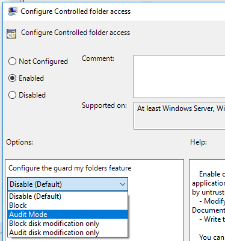

# <a name="enable-controlled-folder-access"></a>启用受控文件夹访问

[!INCLUDE [Microsoft 365 Defender rebranding](../../includes/microsoft-defender.md)]

**适用于：**
- [Microsoft Defender for Endpoint](https://go.microsoft.com/fwlink/p/?linkid=2154037)
- [Microsoft 365 Defender](https://go.microsoft.com/fwlink/?linkid=2118804)

> 想要体验适用于终结点的 Defender？ [注册免费试用版](https://signup.microsoft.com/create-account/signup?products=7f379fee-c4f9-4278-b0a1-e4c8c2fcdf7e&ru=https://aka.ms/MDEp2OpenTrial?ocid=docs-wdatp-assignaccess-abovefoldlink)。

[受控文件夹访问权限](controlled-folders.md) 可帮助你保护重要数据免受恶意应用和威胁（如勒索软件）的侵害。 受控文件夹访问权限包含在 Windows 10、Windows 11 和 Windows Server 2019 中。 受控文件夹访问权限也是 Windows [Server 2012R2 和 2016 新式统一](/microsoft-365/security/defender-endpoint/configure-server-endpoints#new-functionality-in-the-modern-unified-solution-for-windows-server-2012-r2-and-2016-preview)解决方案的一部分。

可以使用以下任一方法启用受控文件夹访问权限：

- [Windows 安全中心应用 *](#windows-security-app)
- [Microsoft Endpoint Manager](#endpoint-manager)
- [移动设备管理 (MDM)](#mobile-device-management-mdm)
- [Microsoft Endpoint Configuration Manager](#microsoft-endpoint-configuration-manager)
- [组策略](#group-policy)
- [PowerShell](#powershell)

[审核](evaluate-controlled-folder-access.md) 模式允许你测试此功能在 (并查看事件) 不会影响设备的正常使用。

禁用本地管理员列表合并的组策略设置将覆盖受控文件夹访问权限设置。 它们还通过受控文件夹访问权限覆盖受保护的文件夹和允许的本地管理员设置的应用。 这些策略包括：

- Microsoft Defender 防病毒 **配置列表的本地管理员合并行为**
- System Center Endpoint Protection **允许用户添加排除和替代**

有关禁用本地列表合并的信息，请参阅阻止或 [允许用户在本地修改 Microsoft Defender AV 策略设置](/windows/security/threat-protection/microsoft-defender-antivirus/configure-local-policy-overrides-microsoft-defender-antivirus)。

## <a name="windows-security-app"></a>Windows 安全中心应用

1. 在任务栏Windows 安全中心防护图标，打开应用。 You can also search the start menu for **Windows 安全中心**.

2. 选择病毒& **威胁** 防护磁贴 (或左侧菜单栏上的防护图标) 然后选择勒索 **软件保护**。

3. 将受控文件夹访问权限 **的开关设置为****开**。

> [!NOTE]
> *此方法在 Windows Server 2012R2 或 2016 上不可用。
> 
> 如果使用组策略、PowerShell 或 MDM CSP 配置受控文件夹访问权限，则设备重启后，Windows 安全中心应用中的状态将发生变化。
> If the feature is set to **Audit mode** with any of those tools， the Windows 安全中心 app will show the state as **Off**.
> 如果要保护用户配置文件数据，建议用户配置文件应位于默认安装Windows驱动器上。

## <a name="endpoint-manager"></a>Endpoint Manager

1. 登录到 [安全Endpoint Manager并](https://endpoint.microsoft.com)打开 **Endpoint Security**。

2. 转到攻击 **面减少** \> **策略**。

3. 选择 **平台**，选择 **Windows 10** 和更高版本，然后选择配置文件 **攻击面减少规则** \> **创建**。

4. 命名策略并添加说明。 选择“**下一步**”。

5. 向下滚动到底部，选择"**启用文件夹** 保护"下拉列表，然后选择"启用 **"。**

6. **选择"需要保护的其他文件夹的列表"，** 并添加需要保护的文件夹。

7. 选择 **有权访问受保护文件夹的应用列表** ，并添加有权访问受保护文件夹的应用。

8. 选择 **"从攻击面减少规则中** 排除文件和路径"，并添加需要从攻击面减少规则中排除的文件和路径。

9. 选择配置文件 **分配**，分配到所有用户 **&所有设备，****然后选择保存。**

10. 选择 **"下一** 步"保存每个打开的边栏选项卡，然后选择"**创建"。**

    > [!NOTE]
    > 应用程序支持通配符，但文件夹不支持通配符。 子文件夹不受保护。 允许的应用将继续触发事件，直到它们重新启动。

## <a name="mobile-device-management-mdm"></a>移动设备管理 (MDM)

使用 [./Vendor/MSFT/Policy/Config/ControlledFolderAccessProtectedFolders](/windows/client-management/mdm/policy-csp-defender) 配置服务提供程序 (CSP) 允许应用对受保护的文件夹进行更改。

## <a name="microsoft-endpoint-configuration-manager"></a>Microsoft Endpoint Configuration Manager

1. In Microsoft Endpoint Configuration Manager， go to **Assets and Compliance** \> **Endpoint Protection** Windows Defender Exploit \> **Guard**.

2. 选择 **"主页** \> **创建攻击防护策略"。**

3. 输入名称和说明，选择受控 **文件夹访问权限**，然后选择下一 **步**。

4. 选择是阻止还是审核更改、允许其他应用或添加其他文件夹，然后选择"下一 **步"。**

   > [!NOTE]
   > 应用程序支持通配符，但文件夹不支持通配符。 子文件夹不受保护。 允许的应用将继续触发事件，直到它们重新启动。

5. 查看设置，然后选择" **下一** 步"以创建策略。

6. 创建策略后 **，关闭**。

## <a name="group-policy"></a>组策略

1. 在组策略管理设备上，打开组 [策略管理控制台](https://technet.microsoft.com/library/cc731212.aspx)，右键单击要配置的组策略对象， **然后选择编辑**。

2. 在 **策略管理编辑器** 中， **计算机配置** 并选择 **管理模板**。

3. 展开树以 **Windows攻击防护> Microsoft Defender 防病毒 > Windows Defender受控>访问权限的组件**。

4. 双击配置受控文件夹 **访问权限** 设置，将选项设置为 **已启用**。 在选项部分中，必须指定以下选项之一：
   - **启用** - 不允许恶意和可疑应用对受保护文件夹中的文件进行更改。 将在事件日志中提供Windows通知。
   - **禁用 (默认)** - 受控文件夹访问权限功能将不起作用。 所有应用都可以对受保护的文件夹中的文件进行更改。
   - **审核模式** - 如果恶意或可疑应用尝试更改受保护文件夹中的文件，将允许更改。 但是，它将被记录在Windows事件日志中，您可以在其中评估对组织的影响。
   - **仅阻止磁盘修改**- 不受信任的应用尝试写入磁盘扇区将记录在Windows日志中。 可以在 Microsoft 应用程序和服务日志中找到这些日志 \> \> \> Windows Windows Defender ID \> \> 1123。
   - **仅审核** 磁盘修改 - 仅在应用程序和服务日志Microsoft Windows Windows Defender Operational ID \>  \>  \>  \>  \> **1124**) 下的 Windows (事件日志中记录写入受保护磁盘扇区的尝试。 不会记录修改或删除受保护文件夹中的文件的尝试。

      

> [!IMPORTANT]
> 若要完全启用受控文件夹访问权限，必须将组策略选项设置为 **已启用**，然后选择选项下拉菜单中的阻止。

## <a name="powershell"></a>PowerShell

1. 在 **"管理"中"开始"菜单 powershell，** 右键 **单击**"Windows PowerShell并选择"以 **管理员角色运行"。**

2. 输入以下 cmdlet：

    ```PowerShell
    Set-MpPreference -EnableControlledFolderAccess Enabled
    ```

可以通过指定 （而不是 ）在审核模式下 `AuditMode` 启用该功能 `Enabled` 。

用于 `Disabled` 关闭该功能。

## <a name="see-also"></a>另请参阅

- [使用受控文件夹访问保护文重要件夹](controlled-folders.md)
- [自定义受控文件夹访问](customize-controlled-folders.md)
- [评估 Microsoft Defender for Endpoint](evaluate-mde.md)
