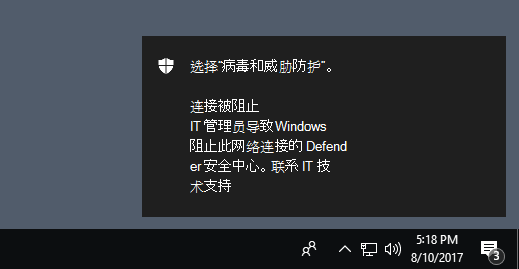

# <a name="evaluate-network-protection"></a>网络保护功能评估

[!INCLUDE [Microsoft 365 Defender rebranding](../../includes/microsoft-defender.md)]

**适用于：**
- [Microsoft Defender for Endpoint](https://go.microsoft.com/fwlink/?linkid=2154037)
- - [Microsoft 365 Defender](https://go.microsoft.com/fwlink/?linkid=2118804)

[网络](network-protection.md) 保护有助于防止员工使用任何应用程序访问可能承载网络钓鱼欺诈、攻击和 Internet 上的其他恶意内容危险域。

本文通过启用该功能并引导您访问测试站点，帮助你评估网络保护。 此评估文章中的网站并非恶意网站。 它们是专门创建的网站，冒充恶意网站。 网站将复制用户访问恶意站点或域时将发生的行为。

> [!TIP]
> 还可以访问 Microsoft Defender 演示方案网站，demo.wd.microsoft.com[](https://demo.wd.microsoft.com?ocid=cx-wddocs-testground)了解其他保护功能如何工作。

## <a name="enable-network-protection-in-audit-mode"></a>在审核模式下启用网络保护

在审核模式下启用网络保护，以查看哪些 IP 地址和域已被阻止。 你可以确保它不会影响业务线应用，或了解阻止出现的时间。

1. 在 **"管理"中"开始"菜单 powershell，** 右键 **单击**"Windows PowerShell并选择"以 **管理员角色运行"**
2. 输入以下 cmdlet：

    ```PowerShell
    Set-MpPreference -EnableNetworkProtection AuditMode
    ```

### <a name="visit-a-fake-malicious-domain"></a>访问恶意 () 伪造的域

1. 打开Internet Explorer浏览器、Google Chrome 或你选择的其他浏览器。

2. 转到 [https://smartscreentestratings2.net](https://smartscreentestratings2.net)。

将允许网络连接，并显示测试消息。



> [!NOTE]
> 即使站点被网络保护阻止，网络连接也可以成功。 若要了解更多信息，请参阅 [网络保护和 TCP 三向握手](network-protection.md#network-protection-and-the-tcp-three-way-handshake)。

## <a name="review-network-protection-events-in-windows-event-viewer"></a>在事件查看器中查看Windows保护事件

若要查看已阻止的应用，请打开事件查看器，并筛选 Microsoft-Windows-Windows-Defender/Operational 日志中的事件 ID 1125。 下表列出了所有网络保护事件。

| 事件 ID | 提供/源 | 说明 |
|---|---|---|
| 5007 | Windows Defender (操作)  | 更改设置时的事件 |
| 1125 | Windows Defender (操作)  | 审核网络连接时的事件 |
| 1126 | Windows Defender (操作)  | 网络连接被阻止时的事件 |

## <a name="see-also"></a>另请参阅

- [网络保护](network-protection.md)

- [网络保护和 TCP 三向握手](network-protection.md#network-protection-and-the-tcp-three-way-handshake)

- [启用网络保护](enable-network-protection.md)

- [网络保护疑难解答](troubleshoot-np.md)
