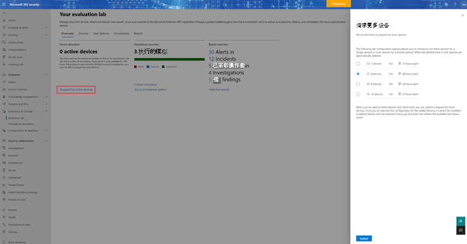

# Microsoft Defender for Endpoint 评估实验室

[!INCLUDE [Microsoft 365 Defender rebranding](../../includes/microsoft-defender.md)]

**适用于：**
- [Microsoft Defender for Endpoint 计划 2](https://go.microsoft.com/fwlink/?linkid=2154037)
- [Microsoft 365 Defender](https://go.microsoft.com/fwlink/?linkid=2118804)

> 希望体验 Microsoft Defender for Endpoint？ [注册免费试用版](https://signup.microsoft.com/create-account/signup?products=7f379fee-c4f9-4278-b0a1-e4c8c2fcdf7e&ru=https://aka.ms/MDEp2OpenTrial?ocid=docs-wdatp-enablesiem-abovefoldlink)。

执行全面安全产品评估可能是一个复杂的过程，要求在实际完成端到端攻击模拟之前进行繁琐的环境和设备配置。 增加复杂性是跟踪模拟活动、警报和结果在评估中的反映位置的难题。

Microsoft Defender for Endpoint 评估实验室旨在消除设备和环境配置的复杂性，以便你可以专注于评估平台的功能、运行模拟，并查看操作中的防护、检测和修正功能。

> [!VIDEO https://www.microsoft.com/videoplayer/embed/RE4qLUM]

借助简化的设置体验，你可以专注于运行自己的测试方案和预建模拟，以查看 Defender for Endpoint 的执行方式。

你可以完全访问该平台的强大功能，如自动调查、高级搜寻和威胁分析，从而可以测试 Defender for Endpoint 提供的全面保护堆栈。

你可以添加预配置为已安装最新操作系统版本和正确安全组件的 Windows 10、Windows 11、Windows Server 2019、Windows Server 2016 和 Linux (Ubuntu) 设备，以及安装 Office 2019 Standard。

还可以安装威胁模拟器。 Defender for Endpoint 已与行业领先的威胁模拟平台合作，帮助你测试 Defender for Endpoint 功能，而无需离开门户。

安装首选模拟器，在评估实验室内运行方案，并立即查看平台的运行方式-所有这些操作都很方便，无需额外付费。 还可以方便地访问广泛的模拟数组，你可以从模拟目录访问和运行这些模拟。

## 准备工作

你将需要满足许可要求 [，或具有](minimum-requirements.md#licensing-requirements) 对 Microsoft Defender for Endpoint 的试用访问权限，以访问评估实验室。

您必须具有 **"管理安全设置"** 权限才能：

- 创建实验室
- 创建设备
- 重置密码
- 创建模拟

如果启用了基于角色的访问控制 (RBAC) 并创建了至少一台计算机组，则用户必须具有访问所有计算机组的访问权限。

有关详细信息，请参阅创建 [和管理角色](user-roles.md)。

希望体验 Microsoft Defender for Endpoint？ [注册免费试用版](https://signup.microsoft.com/create-account/signup?products=7f379fee-c4f9-4278-b0a1-e4c8c2fcdf7e&ru=https://aka.ms/MDEp2OpenTrial?ocid=docs-wdatp-main-abovefoldlink)。

## 实验室入门

可以从菜单访问实验室。 在导航菜单中，选择评估 **实验室中的>教程**。

> [!NOTE]
>
> - 根据你选择的环境结构类型，设备将在激活后指定的小时数内可用。
> - 每个环境都使用一组有限的测试设备进行预配。 当你已使用预配的设备并将其删除后，你可以请求更多设备。
> - 你可以每月请求一次实验室资源。

已有实验室？ 请确保启用新的威胁模拟器并拥有活动设备。

## 设置评估实验室

1. 在导航窗格中，选择"评估&**评估实验室"教程**， \> 然后选择"**设置实验室"。**

    :::image type="content" source="../../media/evaluationtutormenu.png" alt-text="评估实验室欢迎页面的图像。":::

2. 根据你的评估需求，你可以选择设置一个在较长时间内具有较少设备的环境，或者选择在较短的一段时间设置更多设备。 选择首选实验室配置，然后选择"下一 **步"。**

    

3.  (可选) 你可以选择在实验室中安装威胁模拟器。

    

   > [!IMPORTANT]
   > 首先需要接受并同意条款和信息共享声明。

4. 选择你要使用的威胁模拟代理并输入详细信息。 还可以选择稍后安装威胁模拟器。 如果你选择在实验室设置期间安装威胁模拟代理，你将享受在添加的设备上方便地安装这些代理的好处。

    

5. 查看摘要，然后选择"**设置实验室"。**

实验室设置过程完成后，可以添加设备并运行模拟。

## 添加设备

当你将设备添加到你的环境时，Defender for Endpoint 会设置具有连接详细信息的配置良好的设备。 You can add Windows 10， Windows 11， Windows Server 2019， Windows Server 2016， and Linux (Ubuntu) .

设备将配置最新版本的操作系统和 Office 2019 Standard 以及其他应用（如 Java、Python 和 SysIntenals）。

如果你在实验室设置期间选择添加威胁模拟器，所有设备都将在添加的设备上安装威胁模拟器代理。

设备将自动载入到你的租户，同时Windows启用推荐的安全组件，并进入审核模式，无需任何努力。

在测试设备中预配置以下安全组件：

- [减少攻击面](attack-surface-reduction.md)
- [首次看到时阻止](configure-block-at-first-sight-microsoft-defender-antivirus.md)
- [受控文件夹访问](controlled-folders.md)
- [漏洞保护](enable-exploit-protection.md)
- [网络保护](network-protection.md)
- [可能不需要的应用程序检测](detect-block-potentially-unwanted-apps-microsoft-defender-antivirus.md)
- [云端保护](cloud-protection-microsoft-defender-antivirus.md)
- [Microsoft Defender SmartScreen](/windows/security/threat-protection/microsoft-defender-smartscreen/microsoft-defender-smartscreen-overview)

> [!NOTE]
> Microsoft Defender 防病毒不在审核 (审核模式下) 。 如果Microsoft Defender 防病毒阻止你运行你的模拟，则可以通过以下方法在设备上关闭Windows 安全中心。 有关详细信息，请参阅配置 [始终打开保护](configure-real-time-protection-microsoft-defender-antivirus.md)。

自动调查设置将取决于租户设置。 默认情况下，它将配置为半自动化。 有关详细信息，请参阅 [自动调查概述](automated-investigations.md)。

> [!NOTE]
> 与测试设备的连接使用 RDP 完成。 请确保防火墙设置允许 RDP 连接。

1. 从仪表板中，选择"**添加设备"。**

2. 选择要添加的设备类型。 你可以选择将 Windows 10、Windows 11、Windows Server 2019、Windows Server 2016 和 Linux (Ubuntu) 。

    :::image type="content" source="../../media/add-machine-optionsnew.png" alt-text="使用设备选项的实验室设置。":::

   > [!NOTE]
   > 如果设备创建过程出现问题，你将收到通知，并且需要提交新请求。 如果设备创建失败，将不会计入允许的总体配额。

3. 将显示连接详细信息。 选择 **"** 复制"保存设备的密码。

   > [!NOTE]
   > 密码只显示一次。 请务必保存它供以后使用。

    :::image type="content" source="../../media/add-machine-eval-lab-new.png" alt-text="添加有连接详细信息的设备的图像。":::

4. 设备设置开始。 这最多可能需要 30 分钟。

5. 通过选择"设备"选项卡，查看测试设备的状态、风险和曝光级别以及模拟器 **安装** 的状态。

    

   > [!TIP]
   > 在 **模拟器状态** 列中，你可以将鼠标悬停在信息图标上，了解代理的安装状态。

## 请求更多设备

当使用和删除所有现有设备时，你可以请求更多设备。 你可以每月请求一次实验室资源。

1. 从评估实验室仪表板中，选择 **"请求更多设备"。**

   

2. 选择配置。
3. 提交请求。

成功提交请求后，你将看到绿色确认横幅和上次提交的日期。

您可以在"用户操作"选项卡中查找请求的状态，该状态将在数小时内获得批准。

获得批准后，请求的设备将添加到实验室设置中，你将能够创建更多设备。

> [!TIP]
> 若要从实验室获取更多信息，请不要忘记查看我们的模拟库。

## 模拟攻击方案

通过连接到测试设备来运行自己的攻击模拟。

可以使用以下方法模拟攻击方案：

- " [自己执行"攻击方案](https://security.microsoft.com/tutorials/all)
- 威胁模拟器

您还可以使用 [高级搜寻](advanced-hunting-overview.md) 来查询数据和 [威胁分析](threat-analytics.md) ，以查看有关新出现的威胁的报告。

### 自己动手攻击方案

如果你要查找预先模拟，可以使用我们的"自己执行" [攻击方案](https://security.microsoft.com/tutorials/all)。 这些脚本安全、有记录且易于使用。 这些方案将反映适用于终结点的 Defender 功能并演练调查体验。

> [!NOTE]
> 与测试设备的连接使用 RDP 完成。 请确保防火墙设置允许 RDP 连接。

1. 连接你的设备，通过选择""选项运行攻击 **连接。**

    

2. 保存 RDP 文件，然后通过选择 **"连接"。**

    

    > [!NOTE]
    > 如果在初始设置期间没有保存密码的副本，则可以通过从菜单中选择"重置密码 **"来重置** 密码：
    >
    > 
    >
    > 设备会更改其状态为"正在执行密码重置"，然后你将在数分钟内看到新密码。

3. 输入在设备创建步骤期间显示的密码。

   

4. 在设备上运行自己动手攻击模拟。

### 威胁模拟器方案

如果你在实验室设置期间选择安装任何受支持的威胁模拟器，可以在评估实验室设备上运行内置模拟。

使用第三方平台运行威胁模拟是在实验室环境中评估 Microsoft Defender for Endpoint 功能的良好方法。

> [!NOTE]
>
> 在运行模拟之前，请确保满足以下要求：
>
> - 必须将设备添加到评估实验室
> - 威胁模拟器必须安装在评估实验室中

1. 从门户中选择"**创建模拟"。**

2. 选择威胁模拟器。

    

3. 选择模拟或浏览模拟库以浏览可用的模拟。

    你可以从以下方法访问模拟库：
    - 模拟概述 **磁贴或**
    - 通过导航从导航窗格 **评估和教程** \> **模拟&教程，** 然后选择 **模拟目录**。

4. 选择要运行模拟的设备。

5. 选择 **创建模拟**。

6. 通过选择"模拟"选项卡查看 **模拟** 的进度。查看模拟状态、活动警报和其他详细信息。

    

运行模拟后，我们鼓励你演练实验室进度栏，并探索 Microsoft Defender **for Endpoint 触发了自动调查和修正**。 查看功能收集和分析的证据。

使用丰富的查询语言和原始遥测通过高级搜寻来搜寻攻击证据，并查看威胁分析中记录的世界范围威胁。

## 模拟库

Microsoft Defender for Endpoint 已与各种威胁模拟平台合作，让你可以方便地从门户内测试平台的功能。

通过从菜单访问模拟和教程模拟 \> **目录，查看** 所有可用的模拟。

列出了受支持的第三方威胁模拟代理的列表，并且目录上提供了特定类型的模拟以及详细说明。

你可以方便地从目录运行任何可用的模拟。

每个模拟都附带对攻击方案的深入描述和参考，如使用的 MITRE 攻击技术和运行的高级搜寻查询示例。

**示例：**

## 评估报告

实验室报告汇总了在设备上进行的模拟的结果。

一目了然，你可以快速看到：

- 触发的事件
- 生成的警报
- 关于曝光级别的评估
- 观察到的威胁类别
- 检测源
- 自动调查

## 提供反馈

你的反馈可帮助我们更好地保护你的环境免受高级攻击。 分享产品功能和评估结果的体验和印象。

通过选择"提供反馈"，告诉我们 **您的想法**。

