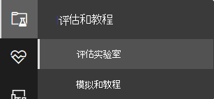

# Microsoft Defender for Endpoint 评估实验室Microsoft Defender for Endpoint evaluation lab

[!INCLUDE [Microsoft 365 Defender rebranding](../../includes/microsoft-defender.md)]

**适用于：****Applies to:**
- [Microsoft Defender for EndpointMicrosoft Defender for Endpoint](https://go.microsoft.com/fwlink/?linkid=2154037)
- [Microsoft 365 DefenderMicrosoft 365 Defender](https://go.microsoft.com/fwlink/?linkid=2118804)

>想要体验 Microsoft Defender for Endpoint？Want to experience Microsoft Defender for Endpoint? [注册免费试用版。Sign up for a free trial.](https://www.microsoft.com/microsoft-365/windows/microsoft-defender-atp?ocid=docs-wdatp-enablesiem-abovefoldlink)

执行全面安全产品评估可能是一个复杂的过程，要求在实际完成端到端攻击模拟之前进行繁琐的环境和设备配置。Conducting a comprehensive security product evaluation can be a complex process requiring cumbersome environment and device configuration before an end-to-end attack simulation can actually be done. 增加复杂性是跟踪模拟活动、警报和结果在评估中的反映位置的难题。Adding to the complexity is the challenge of tracking where the simulation activities, alerts, and results are reflected during the evaluation.

Microsoft Defender for Endpoint 评估实验室旨在消除设备和环境配置的复杂性，以便你可以专注于评估平台的功能、运行模拟，并查看防护、检测和修正功能的操作。The Microsoft Defender for Endpoint evaluation lab is designed to eliminate the complexities of device and environment configuration so that you can  focus on evaluating the capabilities of the platform, running simulations, and seeing the prevention, detection, and remediation features in action.

> [!VIDEO https://www.microsoft.com/en-us/videoplayer/embed/RE4qLUM]

借助简化的设置体验，你可以专注于运行自己的测试方案和预建模拟，以查看 Defender for Endpoint 的执行方式。With the simplified set-up experience, you can focus on running your own test scenarios and the pre-made simulations to see how Defender for Endpoint performs. 

你可以完全访问该平台的强大功能，如自动调查、高级搜寻和威胁分析，从而可以测试 Defender for Endpoint 提供的全面保护堆栈。You'll have full access to the powerful capabilities of the platform such as automated investigations, advanced hunting, and threat analytics, allowing you to test the comprehensive protection stack that Defender for Endpoint offers. 

你可以添加 Windows 10 或 Windows Server 2019 设备，这些设备预配置为已安装最新的操作系统版本和正确的安全组件以及 Office 2019 Standard。You can add Windows 10 or Windows Server 2019 devices that come pre-configured to have the latest OS versions and the right security components in place as well as Office 2019 Standard installed.

还可以安装威胁模拟器。You can also install threat simulators. Defender for Endpoint 已与行业领先的威胁模拟平台合作，帮助你测试 Defender for Endpoint 功能，而无需离开门户。Defender for Endpoint has partnered with industry leading threat simulation platforms to help you test out the Defender for Endpoint capabilities without having to leave the portal.

 安装首选模拟器，在评估实验室内运行方案，并立即查看平台的运行方式-所有这些操作都很方便，无需额外付费。Install your preferred simulator, run scenarios within the evaluation lab, and instantly see how the platform performs - all conveniently available at no extra cost to you. 还可以方便地访问广泛的模拟数组，你可以从模拟目录访问和运行这些模拟。You'll also have convenient access to wide array of simulations which you can access and run from the simulations catalog.
    

## 准备工作Before you begin
你将需要满足许可要求 [，或者具有](minimum-requirements.md#licensing-requirements) 对 Microsoft Defender for Endpoint 的试用访问权限，以访问评估实验室。You'll need to fulfill the [licensing requirements](minimum-requirements.md#licensing-requirements) or have trial access to Microsoft Defender for Endpoint to access the evaluation lab.

您必须具有 **"管理安全设置"** 权限才能：You must have **Manage security settings** permissions to:
- 创建实验室Create the lab
- 创建设备Create devices
- 重置密码Reset password
- 创建模拟Create simulations 
 
如果启用了基于角色的访问控制 (RBAC) 并创建了至少一台计算机组，则用户必须具有访问所有计算机组的访问权限。If you enabled role-based access control (RBAC) and created at least a one machine group, users must have access to All machine groups.

有关详细信息，请参阅创建 [和管理角色](user-roles.md)。For more information, see [Create and manage roles](user-roles.md).

想要体验 Microsoft Defender for Endpoint？Want to experience Microsoft Defender for Endpoint? [注册免费试用版。Sign up for a free trial.](https://www.microsoft.com/microsoft-365/windows/microsoft-defender-atp?ocid=docs-wdatp-main-abovefoldlink)

## 实验室入门Get started with the lab
可以从菜单访问实验室。You can access the lab from the menu. 在导航菜单中，选择评估 **实验室中的>教程**。In the navigation menu, select **Evaluation and tutorials > Evaluation lab**.

>[!NOTE]
>- 根据你选择的环境结构类型，设备将在激活后指定的小时数内可用。Depending the type of environment structure you select, devices will be available for the specified number of hours from the day of activation.
>- 每个环境都使用一组有限的测试设备进行预配。Each environment is provisioned with a limited set of test devices. 当你已使用预配的设备并将其删除后，你可以请求更多设备。When you've used up the provisioned devices and have deleted them, you can request for more devices. 
>- 你可以每月请求一次实验室资源。You can request for lab resources once a month. 

已有实验室？Already have a lab? 请确保启用新的威胁模拟器并拥有活动设备。Make sure to enable the new threat simulators and have active devices.

## 设置评估实验室Setup the evaluation lab

1. 在导航窗格中，选择"**评估和教程评估** 实验室  >  **"，** 然后选择"**设置实验室"。**In the navigation pane, select **Evaluation and tutorials** > **Evaluation lab**, then select **Setup lab**.

    

2. 根据你的评估需求，你可以选择设置一个在较长时间内具有较少设备的环境，或者选择在较短的一段时间设置更多设备。Depending on your evaluation needs, you can choose to setup an environment with fewer devices for a longer period or more devices for a shorter period. 选择首选实验室配置，然后选择"下一 **步"。**Select your preferred lab configuration then select **Next**.

     

3.  (可选) 你可以选择在实验室中安装威胁模拟器。(Optional) You can choose to install threat simulators in the lab. 

    

    >[!IMPORTANT]
    >首先需要接受并同意条款和信息共享声明。You'll first need to accept and provide consent to the terms and information sharing statements. 

4. 选择你要使用的威胁模拟代理并输入详细信息。Select the threat simulation agent you'd like to use and enter your details. 还可以选择稍后安装威胁模拟器。You can also choose to install threat simulators at a later time. 如果你选择在实验室设置期间安装威胁模拟代理，你将享受在添加的设备上方便地安装这些代理的好处。If you choose to install threat simulation agents during the lab setup, you'll enjoy the benefit of having them conveniently installed on the devices you add.  
    
    

5.  查看摘要，然后选择"**设置实验室"。**Review the summary and select **Setup lab**.  

实验室设置过程完成后，可以添加设备并运行模拟。After the lab setup process is complete, you can add devices and run simulations. 

## 添加设备Add devices
当你将设备添加到你的环境时，Defender for Endpoint 会设置具有连接详细信息的配置良好的设备。When you add a device to your environment, Defender for Endpoint sets up a well-configured device with connection details. 可以在 Server 2019 Windows 10或Windows服务器。You can add Windows 10 or Windows Server 2019 devices.

设备将配置最新版本的操作系统和 Office 2019 Standard 以及其他应用（如 Java、Python 和 SysIntenals）。The device will be configured with the most up-to-date version of the OS and Office 2019 Standard as well as other apps such as Java, Python, and SysIntenals. 

如果你在实验室设置期间选择添加威胁模拟器，所有设备都将在添加的设备上安装威胁模拟器代理。If you chose to add a threat simulator during the lab setup, all devices will have the threat simulator agent installed in the devices that you add.

设备将自动载入到你的租户，同时Windows启用推荐的安全组件，并进入审核模式，无需任何努力。The device will automatically be onboarded to your tenant with the recommended Windows security components turned on and in audit mode - with no effort on your side. 

在测试设备中预配置以下安全组件：The following security components are pre-configured in the test devices:

- [减少攻击面Attack surface reduction](attack-surface-reduction.md)
- [首次看到时阻止Block at first sight](configure-block-at-first-sight-microsoft-defender-antivirus.md)
- [受控文件夹访问Controlled folder access](controlled-folders.md)
- [漏洞保护Exploit protection](enable-exploit-protection.md)
- [网络保护Network protection](network-protection.md)
- [可能不需要的应用程序检测Potentially unwanted application detection](detect-block-potentially-unwanted-apps-microsoft-defender-antivirus.md)
- [云保护Cloud-delivered protection](cloud-protection-microsoft-defender-antivirus.md)
- [Microsoft Defender SmartScreenMicrosoft Defender SmartScreen](/windows/security/threat-protection/microsoft-defender-smartscreen/microsoft-defender-smartscreen-overview)

>[!NOTE]
> Microsoft Defender 防病毒不在审核 (审核模式下，将打开) 。Microsoft Defender Antivirus will be on (not in audit mode). 如果Microsoft Defender 防病毒阻止运行你的模拟，则可以通过以下方法在设备上关闭Windows 安全中心。If Microsoft Defender Antivirus blocks you from running your simulation, you can turn off real-time protection on the device through Windows Security. 有关详细信息，请参阅配置 [始终打开保护](configure-real-time-protection-microsoft-defender-antivirus.md)。For more information, see [Configure always-on protection](configure-real-time-protection-microsoft-defender-antivirus.md).

自动调查设置将取决于租户设置。Automated investigation settings will be dependent on tenant settings. 默认情况下，它将配置为半自动化。It will be configured to be semi-automated by default. 有关详细信息，请参阅 [自动调查概述](automated-investigations.md)。For more information, see [Overview of Automated investigations](automated-investigations.md).

>[!NOTE]
>与测试设备的连接使用 RDP 完成。The connection to the test devices is done using RDP. 请确保防火墙设置允许 RDP 连接。Make sure that your firewall settings allow RDP connections.

1. 从仪表板中，选择"**添加设备"。**From the dashboard, select **Add device**. 

2. 选择要添加的设备类型。Choose the type of device to add. 可以选择在 Server 2019 Windows 10或Windows服务器。You can choose to add Windows 10 or Windows Server 2019.

    

    >[!NOTE]
    >如果设备创建过程出现问题，你将收到通知，并且需要提交新请求。If something goes wrong with the device creation process, you'll be notified and you'll need to submit a new request. 如果设备创建失败，将不会计入允许的总体配额。If the device creation fails, it will not be counted against the overall allowed quota. 

3. 将显示连接详细信息。The connection details are displayed. 选择 **"** 复制"保存设备的密码。Select **Copy** to save the password for the device.

    >[!NOTE]
    >密码只显示一次。The password is only displayed once. 请务必保存它供以后使用。Be sure to save it for later use.

    

4. 设备设置开始。Device set up begins. 这最多可能需要 30 分钟。This can take up to approximately 30 minutes. 

5. 通过选择"设备"选项卡，查看测试设备的状态、风险和曝光级别以及模拟器 **安装** 的状态。See the status of test devices, the risk and exposure levels, and the status of simulator installations by selecting the **Devices** tab. 

    
    

    > [!TIP]
    > 在 **模拟器状态** 列中，你可以将鼠标悬停在信息图标上，了解代理的安装状态。In the **Simulator status** column, you can hover over the information icon to know the installation status of an agent.

## 请求更多设备Request for more devices
当使用和删除所有现有设备时，你可以请求更多设备。When all existing devices are used and deleted, you can request for more devices. 你可以每月请求一次实验室资源。You can request for lab resources once a month. 

1. 从评估实验室仪表板中，选择 **"请求更多设备"。**From the evaluation lab dashboard, select **Request for more devices**.

   

2. 选择配置。Choose your configuration. 
3. 提交请求。Submit the request. 

成功提交请求后，你将看到绿色确认横幅和上次提交的日期。When the request is submitted successfully you'll see a green confirmation banner and the date of the last submission.
 
您可以在"用户操作"选项卡中查找请求的状态，该状态将在数小时内获得批准。You can find the status of your request in the **User Actions** tab, which will be approved in a matter of hours.

获得批准后，请求的设备将添加到实验室设置中，你将能够创建更多设备。When approved, the requested devices will be added to your lab set up and you’ll be able to create more devices. 

> [!TIP]
> 若要从实验室获取更多信息，请不要忘记查看我们的模拟库。To get more out of your lab, don’t forget to check out our simulations library.

## 模拟攻击方案Simulate attack scenarios
通过连接到测试设备来运行自己的攻击模拟。Use the test devices to run your own attack simulations by connecting to them. 

可以使用以下方法模拟攻击方案：You can simulate attack scenarios using:
- " [自己执行"攻击方案](https://securitycenter.windows.com/tutorials)The ["Do It Yourself" attack scenarios](https://securitycenter.windows.com/tutorials)
- 威胁模拟器Threat simulators

您还可以使用 [高级搜寻](advanced-hunting-overview.md) 来查询数据和 [威胁分析](threat-analytics.md) ，以查看有关新出现的威胁的报告。You can also use [Advanced hunting](advanced-hunting-overview.md) to query data and [Threat analytics](threat-analytics.md) to view reports about emerging threats.

### 自己动手攻击方案Do-it-yourself attack scenarios
如果你要查找预先模拟，可以使用我们的"自己执行" [攻击方案](https://securitycenter.windows.com/tutorials)。If you are looking for a pre-made simulation, you can use our ["Do It Yourself" attack scenarios](https://securitycenter.windows.com/tutorials). 这些脚本安全、有记录且易于使用。These scripts are safe, documented, and easy to use. 这些方案将反映 Defender for Endpoint 功能，并演练调查体验。These scenarios will reflect Defender for Endpoint capabilities and walk you through investigation experience.

>[!NOTE]
>与测试设备的连接使用 RDP 完成。The connection to the test devices is done using RDP. 请确保防火墙设置允许 RDP 连接。Make sure that your firewall settings allow RDP connections.

1. 连接你的设备，通过选择""选项运行攻击 **连接。**Connect to your device and run an attack simulation by selecting **Connect**. 

    

2. 保存 RDP 文件，然后通过选择 **"连接"启动它**。Save the RDP file and launch it by selecting **Connect**.

    

    >[!NOTE]
    >如果在初始设置期间没有保存密码的副本，则可以通过从菜单中选择"重置密码：重置密码的图像"来 If you don't have a copy of the password saved during the initial setup, you can reset the password by selecting **Reset password** from the menu:  
    > 设备会更改其状态为"正在执行密码重置"，然后你将在数分钟内看到新密码。The device will change it’s state to “Executing password reset", then you’ll be presented with your new password in a few minutes.

3. 输入在设备创建步骤期间显示的密码。Enter the password that was displayed during the device creation step. 

   

4. 在设备上运行自己动手攻击模拟。Run Do-it-yourself attack simulations on the device. 

### 威胁模拟器方案Threat simulator scenarios
如果你在实验室设置期间选择安装任何受支持的威胁模拟器，可以在评估实验室设备上运行内置模拟。If you chose to install any of the supported threat simulators during the lab setup, you can run the built-in simulations on the evaluation lab devices. 

使用第三方平台运行威胁模拟是在实验室环境中评估 Microsoft Defender for Endpoint 功能的良好方法。Running threat simulations using third-party platforms is a good way to evaluate Microsoft Defender for Endpoint capabilities within the confines of a lab environment.

>[!NOTE]
>在运行模拟之前，请确保满足以下要求：Before you can run simulations, ensure the following requirements are met:
>- 必须将设备添加到评估实验室Devices must be added to the evaluation lab
>- 威胁模拟器必须安装在评估实验室中Threat simulators must be installed in the evaluation lab

1. 从门户中选择"**创建模拟"。**From the portal select **Create simulation**.

2. 选择威胁模拟器。Select a threat simulator.

    

3. 选择模拟或浏览模拟库以浏览可用的模拟。Choose a simulation or look through the simulation gallery to browse through the available simulations. 

    你可以从以下方法访问模拟库：You can get to the simulation gallery from:
    - 模拟概述 **磁贴或**The main evaluation dashboard in the **Simulations overview** tile or
    - 通过导航从导航窗格 **评估和教程**  >  **模拟&教程，** 然后选择 **模拟目录**。By navigating from the navigation pane **Evaluation and tutorials** > **Simulation & tutorials**, then select **Simulations catalog**.

4. 选择要运行模拟的设备。Select the devices where you'd like to run the simulation on.

5. 选择 **创建模拟**。Select **Create simulation**.

6. 通过选择"模拟"选项卡查看 **模拟** 的进度。查看模拟状态、活动警报和其他详细信息。View the progress of a simulation by selecting the **Simulations** tab. View the simulation state, active alerts, and other details. 

    
    
运行模拟后，我们鼓励你演练实验室进度栏，并探索 Microsoft Defender **for Endpoint 触发了自动调查和修正**。After running your simulations, we encourage you to walk through the lab progress bar and explore **Microsoft Defender for Endpoint triggered an automated investigation and remediation**. 查看功能收集和分析的证据。Check out the evidence collected and analyzed by the feature.

使用丰富的查询语言和原始遥测通过高级搜寻来搜寻攻击证据，并查看威胁分析中记录一些全球威胁。Hunt for attack evidence through advanced hunting by using the rich query language and raw telemetry and check out some world-wide threats documented in Threat analytics.

## 模拟库Simulation gallery
Microsoft Defender for Endpoint 已与各种威胁模拟平台合作，让你可以方便地从门户内测试平台的功能。Microsoft Defender for Endpoint has partnered with various threat simulation platforms to give you convenient access to test the capabilities of the platform right from the within the portal. 

通过从菜单访问模拟和教程模拟  >  **目录，查看** 所有可用的模拟。View all the available simulations by going to  **Simulations and tutorials** > **Simulations catalog**  from the menu. 

列出了受支持的第三方威胁模拟代理的列表，并且目录上提供了特定类型的模拟以及详细说明。A list of supported third-party threat simulation agents are listed, and specific types of simulations along with detailed descriptions are provided on the catalog. 

你可以方便地从目录运行任何可用的模拟。You can conveniently run any available simulation right from the catalog.  

每个模拟都附带对攻击方案的深入描述和参考，如使用的 MITRE 攻击技术和运行的高级搜寻查询示例。Each simulation comes with an in-depth description of the attack scenario and references such as the MITRE attack techniques used and sample Advanced hunting queries you run.

**示例：** 
 **Examples:**

## 评估报告Evaluation report
实验室报告汇总了在设备上进行的模拟的结果。The lab reports summarize the results of the simulations conducted on the devices.

一目了然，你可以快速看到：At a glance, you'll quickly be able to see:
- 触发的事件Incidents that were triggered
- 生成的警报Generated alerts
- 关于曝光级别的评估Assessments on exposure level 
- 观察到的威胁类别Threat categories observed
- 检测源Detection sources
- 自动调查Automated investigations

## 提供反馈Provide feedback
你的反馈可帮助我们更好地保护你的环境免受高级攻击。Your feedback helps us get better in protecting your environment from advanced attacks. 分享产品功能和评估结果的体验和印象。Share your experience and impressions from product capabilities and evaluation results.

通过选择"提供反馈"，告诉我们 **您的想法**。Let us know what you think, by selecting **Provide feedback**.

