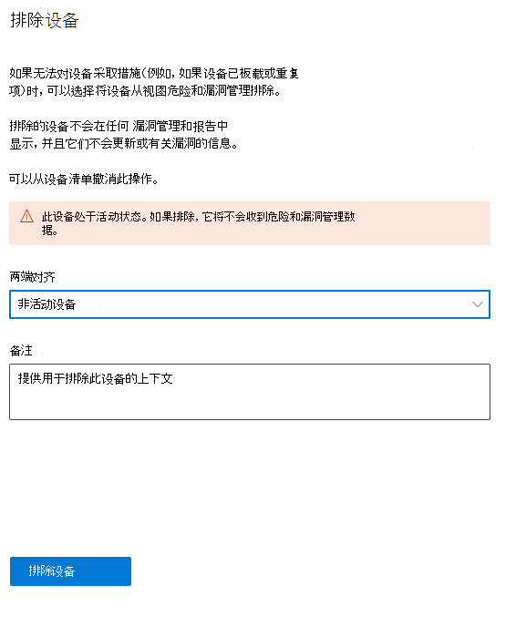
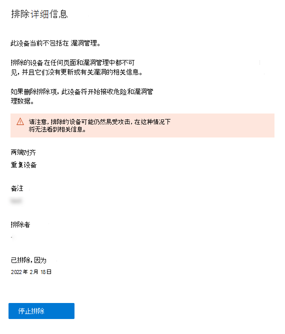

# 排除设备

[!INCLUDE [Microsoft 365 Defender rebranding](../../includes/microsoft-defender.md)]

**适用于：**

- [Microsoft Defender for Endpoint 计划 1](https://go.microsoft.com/fwlink/p/?linkid=2154037)
- [Microsoft Defender for Endpoint 计划 2](https://go.microsoft.com/fwlink/p/?linkid=2154037)
- [Microsoft 365 Defender](https://go.microsoft.com/fwlink/?linkid=2118804)

> 想要体验适用于终结点的 Defender？ [注册免费试用版](https://signup.microsoft.com/create-account/signup?products=7f379fee-c4f9-4278-b0a1-e4c8c2fcdf7e&ru=https://aka.ms/MDEp2OpenTrial?ocid=docs-wdatp-respondmachine-abovefoldlink)。

## 将设备从设备危险和漏洞管理

排除处于非活动、重复或超出范围的设备后，你可以专注于发现活动设备上的风险并设置其优先级。 此操作还有助于反映更准确的曝光危险和漏洞管理，因为排除的设备不会显示在你的危险和漏洞管理报告中。

排除设备后，你将无法查看有关这些设备上漏洞和已安装软件的更新或相关信息。 它会影响高级危险和漏洞管理的所有页面、报表和相关表。

即使设备排除功能从漏洞管理和报告中删除设备数据，设备仍保持连接到网络，并且仍可能给组织带来风险。 你可以随时取消设备排除。

## 如何排除设备

你可以选择同时排除一个或多个设备。

### 排除单个设备

1. 转到设备 **清单** 页面，然后选择要排除的设备。
2. 选择 **"从** 设备清单"页上的操作栏或设备弹出菜单中的"操作"菜单中选择"排除"。

 3. 选择理由：

    - 非活动设备
    - 重复设备
    - 设备不存在
    - 超出范围  
    - 其他

4. 键入笔记，然后选择排除 **设备**。

还可以从设备页面排除设备。

> [!NOTE]
> 不建议排除活动设备，因为无法查看其漏洞信息尤其有风险。 如果设备处于活动状态并且你尝试排除它，你会收到一条警告消息和一个确认弹出窗口，询问你确定要排除活动设备。

设备可能需要 10 个小时才能从视图和数据漏洞管理排除。

已排除的设备在"设备清单"列表中仍然可见。 可以通过：管理已排除设备的视图：

- 将 **排除状态** 列添加到设备清单视图。
- 使用 **Exclusion状态** 筛选器查看相关设备列表。

### 批量设备排除

还可以选择同时排除多个设备：

1. 转到设备 **清单** 页面，然后选择要排除的设备。

2. 从操作栏中，选择"排除 **"**。

3. 选择理由，然后选择排除 **设备**。

如果你在设备列表中选择具有不同排除状态的多个设备，则排除所选设备飞出将提供有关已排除所选设备数的详细信息。 你可以再次排除设备，但理由和注释将被覆盖。

排除设备后，如果你转到已排除设备的设备页面，你将看不到发现的漏洞、软件清单或安全建议的数据。 数据也不会显示在页面、漏洞管理高级搜寻表和易受攻击的设备报告中。

## 停止排除设备

你将能够随时停止排除设备。 一旦不再排除设备，其漏洞数据将在漏洞管理、报告和高级搜寻中可见。 更改最多可能需要 8 小时才能生效。

1. 转到设备清单，选择排除的设备以打开该飞出区，然后选择排除 **详细信息**
2. 选择 **"停止排除"**

## 另请参阅

- [设备清单](machines-view-overview.md)
