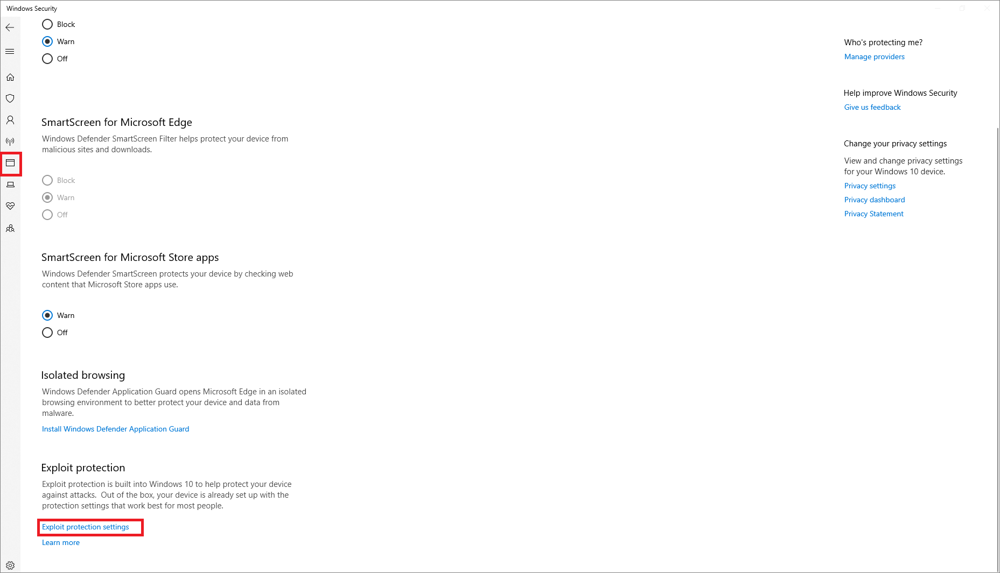
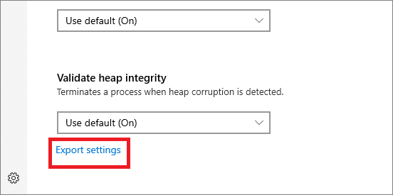

# <a name="import-export-and-deploy-exploit-protection-configurations"></a>导入、导出和部署 Exploit Protection 配置

[!INCLUDE [Microsoft 365 Defender rebranding](../../includes/microsoft-defender.md)]


**适用于：**
- [Microsoft Defender for Endpoint 计划 1](https://go.microsoft.com/fwlink/p/?linkid=2154037)
- [Microsoft Defender for Endpoint 计划 2](https://go.microsoft.com/fwlink/p/?linkid=2154037)
- [Microsoft 365 Defender](https://go.microsoft.com/fwlink/?linkid=2118804)

> 想要体验适用于终结点的 Defender？ [注册免费试用版](https://signup.microsoft.com/create-account/signup?products=7f379fee-c4f9-4278-b0a1-e4c8c2fcdf7e&ru=https://aka.ms/MDEp2OpenTrial?ocid=docs-wdatp-exposedapis-abovefoldlink)。

Exploit Protection 可帮助保护设备免受使用攻击进行传播和感染的恶意软件的攻击。 它包含许多可在操作系统级别或个别应用级别应用的缓解。

使用 Windows 安全中心 或 PowerShell 创建一组称为配置 (的缓解) 。 然后，你可以将此配置导出为 XML 文件，并与你的网络上多台设备共享它。 然后，它们都有相同的缓解设置集。

评估[包](https://demo.wd.microsoft.com/Page/EP)包含一个示例配置文件 (名称ProcessMitigation.xml(Selfhost v4) 可用于查看 XML 结构的外观。  示例文件还包含从增强的缓解体验转换的设置[Toolkit (不再支持) ](https://support.microsoft.com/help/2458544/the-enhanced-mitigation-experience-toolkit)配置。 可以在文本编辑器中打开文件 (例如记事本) 或将其直接导入 exploit Protection 并查看 Windows 安全中心 应用中的设置。

## <a name="create-and-export-a-configuration-file"></a>创建和导出配置文件

导出配置文件之前，需要确保具有正确的设置。 首先，在单个专用设备上配置 Exploit Protection。 有关 [配置缓解功能](customize-exploit-protection.md) 详细信息，请参阅自定义 Exploit Protection。

当你将 Exploit Protection 配置为所需状态 (包括系统级别和应用级别缓解) 时，可以使用 Windows 安全中心 应用或 PowerShell 导出文件。

### <a name="use-the-windows-security-app-to-export-a-configuration-file"></a>使用 Windows 安全中心 应用导出配置文件

1. 在任务栏Windows 安全中心防护图标，打开应用。 或者，在"开始"菜单中 **搜索** Windows 安全中心。

2. 选择应用 **&浏览器 (** 磁贴或左侧菜单栏上的应用图标) 然后选择 Exploit **Protection 设置**：

    

3. 在 Exploit Protection 部分的底部 **，** 选择"导出 **设置"。** 选择要保存配置的 XML 文件的位置和名称。

    > [!IMPORTANT]
    > 如果要使用默认配置，请使用设置"默认启用"，而不是"使用默认 (On) "获取在 XML 文件上正确导出的设置。

    

    > [!NOTE]
    > 导出设置时，将保存应用级别和系统级别缓解的所有设置。 这意味着你无需同时从"系统设置"和"程序设置"部分导出文件 (任一部分都将导出所有) 。

### <a name="use-powershell-to-export-a-configuration-file"></a>使用 PowerShell 导出配置文件

1. 在"管理"中"开始"菜单 **powershell，** 右键 **单击**"Windows PowerShell并选择"以 **管理员角色运行"。**
2. 输入以下 cmdlet：

    ```PowerShell
    Get-ProcessMitigation -RegistryConfigFilePath filename.xml
    ```

    更改为 `filename` 你选择的任何名称或位置。

    示例命令：

    ```powershell
    Get-ProcessMitigation -RegistryConfigFilePath C:\ExploitConfigfile.xml
    ```

> [!IMPORTANT]
> 使用组策略部署配置时，将使用该配置的所有设备都必须能够访问配置文件。 确保将文件放在共享位置。

## <a name="import-a-configuration-file"></a>导入配置文件

你可以导入之前创建的 Exploit Protection 配置文件。 只能使用 PowerShell 导入配置文件。

导入后，将立即应用这些设置，并可在 Windows 安全中心中查看。

### <a name="use-powershell-to-import-a-configuration-file"></a>使用 PowerShell 导入配置文件

1. 在"管理"中"开始"菜单 **powershell，** 右键 **单击**"Windows PowerShell并选择"以 **管理员角色运行"。**
2. 输入以下 cmdlet：

    ```PowerShell
    Set-ProcessMitigation -PolicyFilePath filename.xml
    ```

    更改为 `filename` Exploit Protection XML 文件的位置和名称。

    示例命令：

    ```powershell
    Set-ProcessMitigation -PolicyFilePath C:\ExploitConfigfile.xml
    ```

> [!IMPORTANT]
> 确保导入专为 Exploit Protection 创建的配置文件。

## <a name="manage-or-deploy-a-configuration"></a>管理或部署配置

可以使用组策略将已创建的配置部署到网络中多台设备。

> [!IMPORTANT]
> 使用组策略部署配置时，将使用该配置的所有设备都必须能够访问配置 XML 文件。 确保将文件放在共享位置。

### <a name="use-group-policy-to-distribute-the-configuration"></a>使用组策略分发配置

1. 在组策略管理设备上，打开组 [策略管理控制台](/previous-versions/windows/desktop/gpmc/group-policy-management-console-portal)，右键单击要配置的组策略对象并 **编辑**。

2. 在 **策略管理编辑器** 中， **计算机配置** 并选择 **管理模板**。

3. 展开树以 **Windows** \> **攻击Windows Defender Exploit Guard** Exploit Protection \> **的组件**。

    

4. 双击使用 **一组常见的 Exploit Protection 设置，** 将选项设置为 **已启用**。

5. 在 **选项：** 部分中，输入想要使用的 Exploit Protection 配置文件的位置和文件名，如以下示例所示：

    - `C:\MitigationSettings\Config.XML`
    - `\\Server\Share\Config.xml`
    - `https://localhost:8080/Config.xml`
    - `C:\ExploitConfigfile.xml`

6. 按 **正常**[操作选择确定并部署更新的 GPO。](/windows/win32/srvnodes/group-policy)

## <a name="see-also"></a>另请参阅

- [保护设备免遭攻击](exploit-protection.md)
- [评估 Exploit Protection](evaluate-exploit-protection.md)
- [启用漏洞保护](enable-exploit-protection.md)
- [配置和审核 Exploit Protection 缓解](customize-exploit-protection.md)
