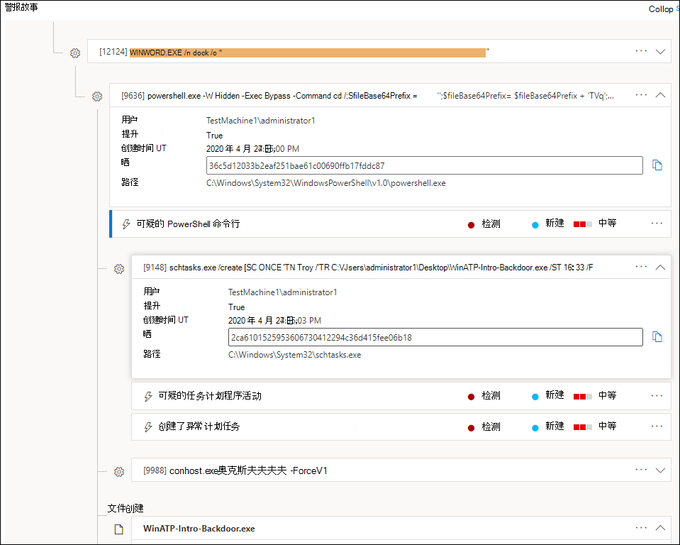
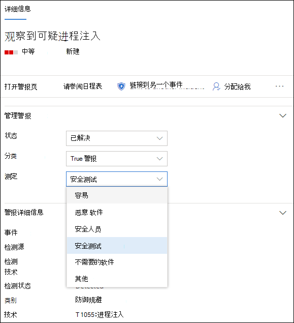

# 调查 Microsoft Defender for Endpoint 中的警报

[!INCLUDE [Microsoft 365 Defender rebranding](../../includes/microsoft-defender.md)]

**适用于：**
- [Microsoft Defender for Endpoint](https://go.microsoft.com/fwlink/p/?linkid=2154037)
- [Microsoft 365 Defender](https://go.microsoft.com/fwlink/?linkid=2118804)

> 想要体验适用于终结点的 Defender？ [注册免费试用版](https://signup.microsoft.com/create-account/signup?products=7f379fee-c4f9-4278-b0a1-e4c8c2fcdf7e&ru=https://aka.ms/MDEp2OpenTrial?ocid=docs-wdatp-investigatealerts-abovefoldlink)。

调查影响网络的警报，了解它们的含义以及如何解决它们。

从警报队列中选择警报以转到警报页面。 此视图包含警报标题、受影响的资产、详细信息侧窗格和警报情景。

从警报页面，通过选择警报情景树视图下受影响的资产或任何实体开始调查。 详细信息窗格将自动填充有关所选内容的详细信息。 若要查看可以在此处查看的信息类型，请阅读查看 Microsoft [Defender for Endpoint 中的警报](/microsoft-365/security/defender-endpoint/review-alerts)。

## 使用警报情景进行调查

警报情景详细介绍了触发警报的原因、之前和之后发生的相关事件以及其他相关实体。

实体是可单击的，并且每个不是警报的实体都可用该实体卡片右侧展开图标进行扩展。 焦点中的实体将用该实体卡片左侧的蓝色条带指示，标题中的警报首先处于焦点状态。

展开实体，一目了然地查看详细信息。 选择实体将详细信息窗格的上下文切换到此实体，并允许您查看详细信息以及管理该实体。 选择 *实体* 卡片右侧"..."将显示该实体的所有可用操作。 当实体具有焦点时，这些相同的操作将显示在详细信息窗格中。

> [!NOTE]
> 警报情景部分可能包含多个警报，与相同执行树相关的其他警报显示在所选警报之前或之后。

## 从详细信息窗格中采取操作

选择感兴趣的实体后，详细信息窗格将更改为显示有关所选实体类型的信息、可用时的历史信息，并提供直接从警报页对此实体采取措施的控件。 

完成调查后，返回到开始使用的警报，将警报状态标记为"已解决"，然后将其分类为 **"False 警报**"或"**真警报"。**  对警报进行分类有助于调整此功能，以提供更多真实警报和更少的假警报。

如果将其分类为真正的警报，则还可以选择一个决定，如下图所示。

如果业务线应用程序遇到错误警报，请创建抑制规则以避免将来出现此类型的警报。

> [!TIP]
> 如果遇到上面未介绍的任何问题，请使用按钮 🙂 提供反馈或打开支持票证。

## 相关主题
- [查看并组织 Microsoft Defender for Endpoint 警报队列](alerts-queue.md)
- [管理 Microsoft Defender for Endpoint 警报](manage-alerts.md)
- [调查与 Defender for Endpoint 警报关联的文件](investigate-files.md)
- [调查 Defender for Endpoint Devices 列表中的设备](investigate-machines.md)
- [调查与 Defender for Endpoint 警报关联的 IP 地址](investigate-ip.md)
- [调查与 Defender for Endpoint 警报关联的域](investigate-domain.md)
- [调查 Defender for Endpoint 中的用户帐户](investigate-user.md)

