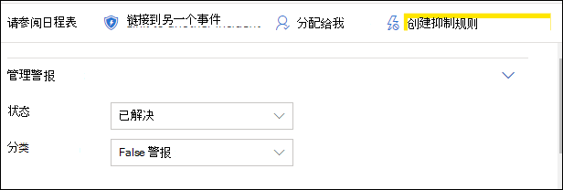

# 调查 Microsoft Defender for Endpoint 中的警报Investigate alerts in Microsoft Defender for Endpoint

[!INCLUDE [Microsoft 365 Defender rebranding](../../includes/microsoft-defender.md)]

**适用于：****Applies to:**
- [Microsoft Defender for EndpointMicrosoft Defender for Endpoint](https://go.microsoft.com/fwlink/p/?linkid=2154037)
- [Microsoft 365 DefenderMicrosoft 365 Defender](https://go.microsoft.com/fwlink/?linkid=2118804)

>想要体验适用于终结点的 Defender？Want to experience Defender for Endpoint? [注册免费试用版。Sign up for a free trial.](https://www.microsoft.com/microsoft-365/windows/microsoft-defender-atp?ocid=docs-wdatp-investigatealerts-abovefoldlink) 

调查影响网络的警报，了解它们的含义以及如何解决它们。Investigate alerts that are affecting your network, understand what they mean, and how to resolve them.

从警报队列中选择警报以转到警报页面。Select an alert from the alerts queue to go to alert page. 此视图包含警报标题、受影响的资产、详细信息侧窗格和警报情景。This view contains the alert title, the affected assets, the details side pane, and the alert story.

从警报页面，通过选择警报情景树视图下受影响的资产或任何实体开始调查。From the alert page, begin your investigation by selecting the affected assets or any of the entities under the alert story tree view. 详细信息窗格将自动填充有关所选内容的详细信息。The details pane automatically populates with further information about what you selected. 若要查看可以在此处查看的信息类型，请阅读查看 Microsoft [Defender for Endpoint 中的警报](/microsoft-365/security/defender-endpoint/review-alerts)。To see what kind of information you can view here, read [Review alerts in Microsoft Defender for Endpoint](/microsoft-365/security/defender-endpoint/review-alerts).

## 使用警报情景进行调查Investigate using the alert story

警报情景详细介绍了触发警报的原因、之前和之后发生的相关事件以及其他相关实体。The alert story details why the alert was triggered, related events that happened before and after, as well as other related entities.

实体是可单击的，并且每个不是警报的实体都可用该实体卡片右侧展开图标进行扩展。Entities are clickable and every entity that isn't an alert is expandable using the expand icon on the right side of that entity's card. 焦点中的实体将用该实体卡片左侧的蓝色条带指示，标题中的警报首先处于焦点。The entity in focus will be indicated by a blue stripe to the left side of that entity's card, with the alert in the title being in focus at first.

展开实体，一目了然地查看详细信息。Expand entities to view details at a glance. 选择实体将详细信息窗格的上下文切换到此实体，并允许您查看详细信息以及管理该实体。Selecting an entity will switch the context of the details pane to this entity, and will allow you to review further information, as well as manage that entity. 选择 *实体* 卡片右侧"..."将显示该实体的所有可用操作。Selecting *...* to the right of the entity card will reveal all actions available for that entity. 当实体具有焦点时，这些相同的操作将显示在详细信息窗格中。These same actions appear in the details pane when that entity is in focus.

> [!NOTE]
> 警报情景部分可能包含多个警报，与相同执行树相关的其他警报显示在所选警报之前或之后。The alert story section may contain more than one alert, with additional alerts related to the same execution tree appearing before or after the alert you've selected.

## 从详细信息窗格中采取操作Take action from the details pane

选择感兴趣的实体后，详细信息窗格将更改为显示有关所选实体类型的信息、可用时的历史信息，并提供直接从警报页面对此实体采取措施的控件。 Once you've selected an entity of interest, the details pane will change to display information about the selected entity type, historic information when it's available, and offer controls to **take action** on this entity directly from the alert page.

完成调查后，返回到开始使用的警报，将警报状态标记为"已解决"，然后将其分类为 **"False 警报**"或"**真警报"。** Once you're done investigating, go back to the alert you started with, mark the alert's status as **Resolved** and classify it as either **False alert** or **True alert**. 对警报进行分类有助于调整此功能，以提供更多真实警报和更少的假警报。Classifying alerts helps tune this capability to provide more true alerts and less false alerts.

如果将其分类为真正的警报，则还可以选择一个决定，如下图所示。If you classify it as a true alert, you can also select a determination, as shown in the image below.

如果业务线应用程序遇到错误警报，请创建抑制规则以避免将来出现此类型的警报。If you are experiencing a false alert with a line-of-business application, create a suppression rule to avoid this type of alert in the future.

> [!TIP]
> 如果遇到上面未介绍的任何问题，请使用按钮 🙂 提供反馈或打开支持票证。If you're experiencing any issues not described above, use the 🙂 button to provide feedback or open a support ticket.

## 相关主题Related topics
- [查看和组织 Microsoft Defender 终结点警报队列View and organize the Microsoft Defender for Endpoint Alerts queue](alerts-queue.md)
- [管理 Microsoft Defender for Endpoint 警报Manage Microsoft Defender for Endpoint alerts](manage-alerts.md)
- [调查与 Defender for Endpoint 警报关联的文件Investigate a file associated with a Defender for Endpoint alert](investigate-files.md)
- [调查 Defender for Endpoint Devices 列表中的设备Investigate devices in the Defender for Endpoint Devices list](investigate-machines.md)
- [调查与 Defender for Endpoint 警报关联的 IP 地址Investigate an IP address associated with a Defender for Endpoint alert](investigate-ip.md)
- [调查与 Defender for Endpoint 警报关联的域Investigate a domain associated with a Defender for Endpoint alert](investigate-domain.md)
- [调查 Defender for Endpoint 中的用户帐户Investigate a user account in Defender for Endpoint](investigate-user.md)

