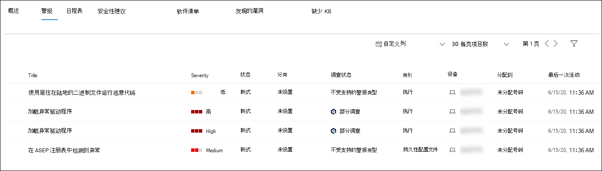

# 调查 Microsoft Defender 终结点设备列表中的设备

[!INCLUDE [Microsoft 365 Defender rebranding](../../includes/microsoft-defender.md)]

**适用于：**
- [Microsoft Defender for Endpoint](https://go.microsoft.com/fwlink/p/?linkid=2154037)
- [Microsoft 365 Defender](https://go.microsoft.com/fwlink/?linkid=2118804)

> 想要体验适用于终结点的 Defender？ [注册免费试用版](https://signup.microsoft.com/create-account/signup?products=7f379fee-c4f9-4278-b0a1-e4c8c2fcdf7e&ru=https://aka.ms/MDEp2OpenTrial?ocid=docs-wdatp-investigatemachines-abovefoldlink)。

调查特定设备上触发的警报的详细信息，以确定与警报或潜在泄露范围相关的其他行为或事件。

> [!NOTE]
> 作为调查或响应过程的一部分，你可以从设备收集调查包。 操作说明： [从设备收集调查包](/microsoft-365/security/defender-endpoint/respond-machine-alerts#collect-investigation-package-from-devices)。

只要在门户中看到受影响的设备，就可以单击它们，以打开有关该设备的详细报告。 受影响的设备在以下方面进行标识：

- [设备列表](investigate-machines.md)
- [警报队列](alerts-queue.md)
- [安全操作仪表板](security-operations-dashboard.md)
- 任何单个警报
- 任何单个文件详细信息视图
- 任何 IP 地址或域详细信息视图

调查特定设备时，你将看到：

- 设备详细信息
- 响应操作
- 选项卡 (概述、警报、时间线、安全建议、软件清单、发现的漏洞、缺少的) 
- 卡片 (活动警报、已登录用户、安全评估) 

> [!NOTE]
> 由于产品限制，设备配置文件在确定"上次查看"时间范围时不会考虑所有网络证据 (如设备页面上所见，) 。
> 例如，"设备"页中的"上次查看时间"值可能会显示较旧的时间范围，即使计算机时间线中提供了最新的警报或数据。

## 设备详细信息

设备详细信息部分提供诸如设备的域、操作系统和运行状况等信息。 如果设备上有可用的调查包，你将看到一个链接，允许你下载该程序包。

## 响应操作

响应操作沿着特定设备页面的顶部运行，包括：

- 管理标签
- 隔离设备
- 限制应用执行
- 运行防病毒扫描
- 收集调查程序包
- 启动实时响应会话
- 启动自动调查
- 咨询威胁专家
- 操作中心

可以在操作中心、特定设备页或特定文件页中执行响应操作。

若要详细了解如何在设备上采取操作，请参阅 [在设备上执行响应操作](respond-machine-alerts.md)。

有关详细信息，请参阅调查 [用户实体](investigate-user.md)。

## 选项卡

选项卡提供与设备相关的安全和威胁防护信息。 在每个选项卡中，可以通过从列标题上方的栏中选择"自定义列"来自定义显示的列。

### 概述

" **概述** "选项卡 [显示活动](#cards) 警报、已登录用户和安全评估的卡片。

### 警报

警报 **选项卡** 提供与设备关联的警报列表。 此列表是警报队列的筛选版本，显示警报、严重性 (高、中、低、信息) 、队列 (中的状态、新、正在进行、已解决) 、分类 (未设置、false 警报、真警报) 、调查状态、警报类别、解决警报的人和上次活动。 您还可以筛选警报。

当选择警报左侧的圆圈图标时，将出现一个飞出。 从此面板中，你可以管理警报并查看更多详细信息，如事件编号和相关设备。 可以一次选择多个警报。

若要查看警报的完整页面视图，包括事件图和进程树，请选择警报的标题。

### 日程表

" **时间线** "选项卡提供设备上已观测到的事件和相关警报的时间顺序视图。 这可以帮助你关联与设备相关的任何事件、文件和 IP 地址。

时间线还使您能够有选择地深入到给定时段内发生的事件。 你可以查看所选时段内在设备上发生的事件的时间序列。 若要进一步控制视图，可以按事件组进行筛选或自定义列。

> [!NOTE]
> 若要显示防火墙事件，你需要启用审核策略，请参阅审核 [筛选平台连接](/windows/security/threat-protection/auditing/audit-filtering-platform-connection)。
>
> 防火墙涵盖以下事件：
>
> - [5025](/windows/security/threat-protection/auditing/event-5025) - 防火墙服务已停止
> - [5031](/windows/security/threat-protection/auditing/event-5031) - 阻止应用程序接受网络上传入的连接
> - [5157](/windows/security/threat-protection/auditing/event-5157) - 阻止连接

一些功能包括：

- 搜索特定事件
  - 使用搜索栏查找特定的时间线事件。
- 筛选特定日期的事件
  - 选择表左上角的日历图标以显示过去一天、一周、30 天或自定义范围中的事件。 默认情况下，设备时间线设置为显示过去 30 天的事件。
  - 使用时间线通过突出显示部分跳转到特定时刻。 时间线上的箭头定位自动调查
- 导出详细的设备时间线事件
  - 导出当前日期或指定日期范围（最多七天）的设备时间线。

有关特定事件的更多详细信息，请参阅"其他信息 **"** 部分。 这些详细信息因事件类型而异，例如：

- 包含在应用程序防护中 - Web 浏览器事件受隔离容器限制
- 检测到的活动威胁 - 威胁检测在威胁运行时发生
- 修正失败 - 尝试修正检测到的威胁已调用，但失败
- 修正成功 - 已停止并清理检测到的威胁
- 用户绕过的警告 - Windows Defender SmartScreen 警告已消除，并已被用户覆盖
- 检测到可疑脚本 - 发现有潜在恶意脚本正在运行
- 警报类别 - 如果事件导致生成警报，则警报类别 ("横向移动"，例如) 警报

#### 事件详情

选择一个事件以查看有关该事件的相关详细信息。 将显示一个面板以显示常规事件信息。 如果适用且数据可用，还将显示显示相关实体及其关系的图形。

若要进一步检查事件和相关事件，可以通过为相关事件选择"搜寻"来 **快速运行高级搜寻查询**。 查询将返回所选事件以及同一终结点上同时发生的其他事件的列表。

### 安全性建议

**安全建议** 从 Microsoft Defender 针对终结点的威胁和漏洞& [生成](tvm-dashboard-insights.md) 。 选择建议将显示一个面板，您可以在其中查看相关详细信息，如建议说明和与不实施建议相关的潜在风险。 有关详细信息 [，请参阅安全](tvm-security-recommendation.md) 建议。

### 软件清单

借助 **"软件** 清单"选项卡，可以查看设备上的软件，以及任何漏洞或威胁。 选择软件名称后，您将访问软件详细信息页，您可以在其中查看安全建议、发现的漏洞、已安装的设备以及版本分发。 有关详细信息 [，请参阅](tvm-software-inventory.md) 软件清单

### 发现的漏洞

" **发现的漏洞"** 选项卡显示设备上发现的漏洞的名称、严重性和威胁见解。 选择特定漏洞将显示说明和详细信息。

### 缺少 KB
" **缺少的 KB"** 选项卡列出了设备缺少的安全更新。

## 卡片

### 活动警报

**如果已启用 Microsoft** Defender for Identity 功能，并且存在任何活动警报，Azure 高级威胁防护卡片将显示与设备及其风险级别相关的警报的高级概述。 "警报"向下钻取中提供了详细信息。

> [!NOTE]
> 你需要在 Microsoft Defender for Identity 和 Defender for Endpoint 上启用集成才能使用此功能。 在 Defender for Endpoint 中，可以在高级功能中启用此功能。 若要详细了解如何启用高级功能，请参阅 [启用高级功能](advanced-features.md)。

### 已登录用户

**"已登录用户"** 卡片显示过去 30 天内登录的用户数，以及最多且最不频繁的用户。 选择"查看所有用户"链接将打开详细信息窗格，其中显示诸如用户类型、登录类型以及首次看到用户和最后一次看到用户时的信息。 有关详细信息，请参阅调查 [用户实体](investigate-user.md)。

> [!NOTE]
> "最常见的"用户值仅根据已成功以交互方式登录的用户的证据进行计算。
> 但是，"所有用户"侧窗格将计算各种用户登录数，以便预期在侧窗格中看到更频繁的用户（假设这些用户可能无法交互）。

### 安全评估

安全 **评估卡片** 显示总体曝光级别、安全建议、已安装的软件和发现的漏洞。 设备的曝光级别由待定安全建议累积影响决定。

## 相关主题

- [查看并组织 Microsoft Defender for Endpoint 警报队列](alerts-queue.md)
- [管理 Microsoft Defender for Endpoint 警报](manage-alerts.md)
- [调查 Microsoft Defender for Endpoint 警报](investigate-alerts.md)
- [调查与 Defender for Endpoint 警报关联的文件](investigate-files.md)
- [调查与 Defender for Endpoint 警报关联的 IP 地址](investigate-ip.md)
- [调查与 Defender for Endpoint 警报关联的域](investigate-domain.md)
- [调查 Defender for Endpoint 中的用户帐户](investigate-user.md)
- [安全建议](tvm-security-recommendation.md)
- [软件库存](tvm-software-inventory.md)
