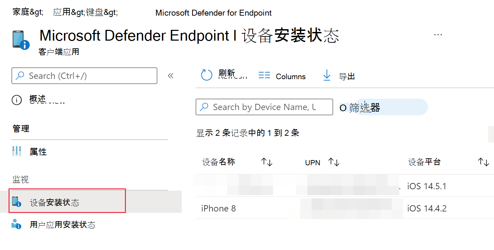
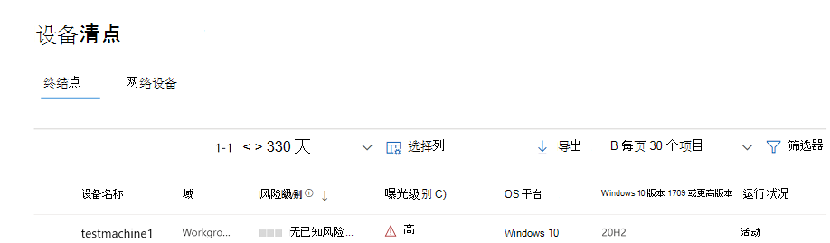
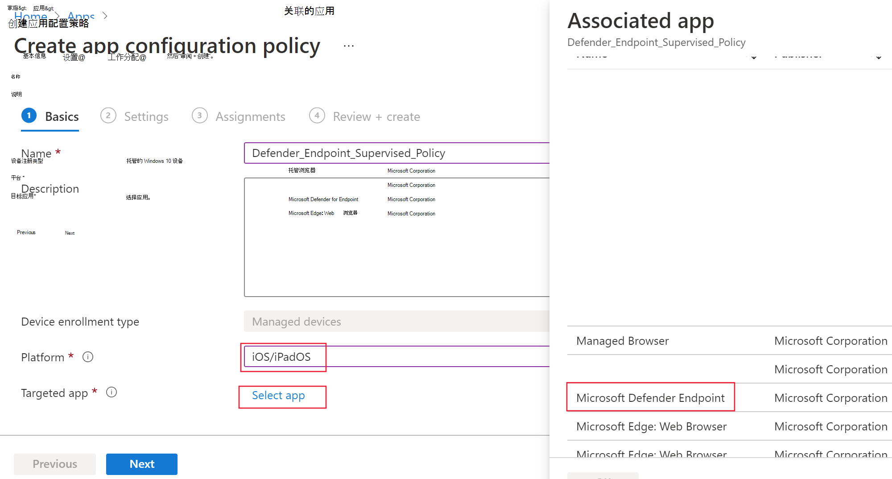

# 在 iOS 上部署 Microsoft Defender for Endpoint

[!INCLUDE [Microsoft 365 Defender rebranding](../../includes/microsoft-defender.md)]

**适用于：**
- [Microsoft Defender for Endpoint](https://go.microsoft.com/fwlink/p/?linkid=2154037)
- [Microsoft 365 Defender](https://go.microsoft.com/fwlink/?linkid=2118804)

> 想要体验适用于终结点的 Defender？ [注册免费试用版](https://signup.microsoft.com/create-account/signup?products=7f379fee-c4f9-4278-b0a1-e4c8c2fcdf7e&ru=https://aka.ms/MDEp2OpenTrial?ocid=docs-wdatp-investigateip-abovefoldlink)。

本主题介绍如何在已注册的设备上在 iOS Intune 公司门户 Defender for Endpoint。 有关 Intune 设备注册详细信息，请参阅在 Intune 中注册 [iOS/iPadOS 设备](/mem/intune/enrollment/ios-enroll)。

## 开始之前

- 确保你有权访问 [Microsoft Endpoint Manager 管理中心](https://go.microsoft.com/fwlink/?linkid=2109431)。

- 确保为用户完成了 iOS 注册。 用户需要分配有 Defender for Endpoint 许可证才能在 iOS 上使用 Defender for Endpoint。 有关如何 [分配许可证的说明，](/azure/active-directory/users-groups-roles/licensing-groups-assign) 请参阅向用户分配许可证。

> [!NOTE]
> iOS 上的 Microsoft Defender for Endpoint 在 [Apple App Store 中提供](https://aka.ms/mdatpiosappstore)。

## 部署步骤

通过 iOS 部署适用于终结点的 defender Intune 公司门户。

### 添加 iOS 应用商店应用

1. 在 [Microsoft Endpoint Manager 管理中心中](https://go.microsoft.com/fwlink/?linkid=2109431)，转到 **应用**  ->  **iOS/iPadOS**  ->  **添加**  ->  **iOS 应用商店应用**，然后单击选择 。 

    > [!div class="mx-imgBorder"]
    > 

1. 在"**添加应用"** 页上，单击"**搜索应用商店"，** 在搜索栏中键入 **Microsoft Defender for Endpoint。** 在搜索结果部分中，单击 Microsoft *Defender for Endpoint，***然后单击选择**。

1. 选择 **iOS 11.0** 作为最低操作系统。 查看有关应用的其他信息，然后单击下一 **步**。

1. 在"**分配"** 部分，转到"**必需"** 部分，然后选择"**添加组"。** 然后，你可以选择要 (iOS) Defender for Endpoint 的用户组。 单击 **"选择**"，然后单击"下一 **步"。**

    > [!NOTE]
    > 所选用户组应由 Intune 注册的用户组成。

    > [!div class="mx-imgBorder"]
    > 

1. 在"*审阅 + 创建*"部分，验证输入的所有信息是否正确，然后选择"创建 **"。** 片刻后，应成功创建 Defender for Endpoint 应用，并且页面右上角会显示一条通知。

1. 在显示的"应用信息"页的"监视器"部分，选择"设备安装状态"以验证设备安装是否成功完成。

    > [!div class="mx-imgBorder"]
    > 

## VPN 配置文件的自动载入 (简化的载入) 

管理员可以配置 VPN 配置文件的自动设置。 这将自动设置 Defender for Endpoint VPN 配置文件，无需用户在载入时这样做。 请注意，VPN 用于提供 Web 保护功能。 这不是常规 VPN，它是不接受设备外流量的本地/自循环 VPN。

1. 在 [Microsoft Endpoint Manager 管理中心中](https://go.microsoft.com/fwlink/?linkid=2109431)，转到 **"设备**  ->  **配置文件""**  ->  **创建配置文件"。**
1. 选择 **"平台** 为 **iOS/iPadOS"** 和 **"配置文件类型** 为 **VPN"。** 单击“**创建**”。
1. 键入配置文件的名称，然后单击下一 **步**。
1. 为 **"连接** 类型"选择"自定义 **VPN"，在"基本 VPN"** 部分，输入以下内容：
    - 连接名称 = Microsoft Defender for Endpoint
    - VPN 服务器地址 = 127.0.0.1
    - Auth 方法 = "Username and password"
    - 拆分隧道 = 禁用
    - VPN 标识符 = com.microsoft.scmx
    - 在键值对中，输入键 **AutoOnboard，** 将值设置为 **True**。
    - 自动 VPN 的类型 = 按需 VPN
    - 单击 **"** 为 **按需规则添加**"，然后选择"我想执行以下操作 = 建立 **VPN，****我希望限制为 = 所有域"。**

    

1. 单击"下一步"，并将配置文件分配给目标用户。
1. 在"*审阅 + 创建*"部分，验证输入的所有信息是否正确，然后选择"创建 **"。**

## 完成载入和检查状态

1. 在设备上安装 iOS 上的 Defender for Endpoint 后，你将看到应用图标。

    

2. 点击 MSDefender (Defender for Endpoint 应用图标) 并按照屏幕上的说明完成载入步骤。 详细信息包括最终用户接受 iOS 上终结点的 Defender 所需的 iOS 权限。

3. 成功载入后，设备将开始显示在 Microsoft 365 Defender 列表中。

    > [!div class="mx-imgBorder"]
    > 

## 配置适用于监督模式的 Microsoft Defender 终结点

鉴于平台在这些类型的设备上提供的管理功能已增强，iOS 上的 Microsoft Defender for Endpoint 应用在受监督的 iOS/iPadOS 设备上具有专门的功能。 若要充分利用这些功能，适用于终结点的 Defender 应用需要知道设备是否位于监督模式下。

### 通过 Intune 配置监督模式

Intune 允许你通过应用配置策略配置适用于 iOS 的 Defender 应用。

   > [!NOTE]
   > 适用于受监督设备的此应用配置策略仅适用于托管设备，并且作为最佳做法应面向所有托管 iOS 设备。

1. 登录到管理中心 [Microsoft Endpoint Manager](https://go.microsoft.com/fwlink/?linkid=2109431)应用 \> **应用配置策略** \> **添加**。 单击 **托管设备**。

    > [!div class="mx-imgBorder"]
    > 

1. 在 *"创建应用配置策略"* 页中，提供以下信息：
    - 策略名称
    - 平台：选择 iOS/iPadOS
    - 目标应用：从 **列表中选择适用于终结点的 Microsoft Defender**

    > [!div class="mx-imgBorder"]
    > 

1. 下一个屏幕中，选择 **"使用配置设计器** "作为格式。 指定以下属性：
    - 配置密钥：issupervised
    - 值类型：String
    - 配置值：{{issupervised}}

    > [!div class="mx-imgBorder"]
    > 

1. 单击 **"下** 一步"打开 **"范围标记"** 页。 作用域标记是可选的。 单击“下一步”即可继续操作。

1. 在“**分配**”页上，选择将接收此配置文件的组。 对于此方案，最佳做法是面向 **所有设备**。 有关分配配置文件的详细信息，请参阅[分配用户和设备配置文件](/mem/intune/configuration/device-profile-assign)。

   部署到用户组时，用户必须在应用策略之前登录设备。

   单击 **下一个**。

1. 完成后，在“**查看 + 创建**”页上，选择“**创建**”。 新配置文件显示在配置文件列表中。

## 后续步骤

- [配置应用保护策略，以将 Defender for Endpoint 风险信号 (MAM) ](ios-install-unmanaged.md)
- [在 iOS 功能上为终结点配置 Defender](ios-configure-features.md)
