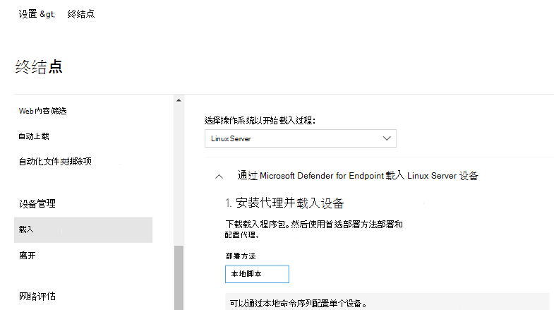

# <a name="deploy-microsoft-defender-for-endpoint-on-linux-manually"></a>在 Linux 上手动部署 Microsoft Defender for Endpoint

[!INCLUDE [Microsoft 365 Defender rebranding](../../includes/microsoft-defender.md)]


**适用于：**
- [Microsoft Defender for Endpoint](https://go.microsoft.com/fwlink/p/?linkid=2154037)
- [Microsoft 365 Defender](https://go.microsoft.com/fwlink/?linkid=2118804)

> 想要体验适用于终结点的 Defender？ [注册免费试用版](https://signup.microsoft.com/create-account/signup?products=7f379fee-c4f9-4278-b0a1-e4c8c2fcdf7e&ru=https://aka.ms/MDEp2OpenTrial?ocid=docs-wdatp-investigateip-abovefoldlink)。

本文介绍了如何在 Linux 上手动部署 Microsoft Defender for Endpoint。 成功的部署需要完成以下所有任务：

- [在 Linux 上手动部署 Microsoft Defender for Endpoint](#deploy-microsoft-defender-for-endpoint-on-linux-manually)
  - [先决条件和系统要求](#prerequisites-and-system-requirements)
  - [配置 Linux 软件存储库](#configure-the-linux-software-repository)
    - [CentOS 和 Oracle Linux (RHEL 和) ](#rhel-and-variants-centos-and-oracle-linux)
    - [SLES 和变量](#sles-and-variants)
    - [Ubuntu 和 Debian 系统](#ubuntu-and-debian-systems)
  - [应用程序安装](#application-installation)
  - [下载载入程序包](#download-the-onboarding-package)
  - [客户端配置](#client-configuration)
  - [安装程序脚本](#installer-script)
  - [记录安装问题](#log-installation-issues)
  - [操作系统升级](#operating-system-upgrades)
  - [卸载](#uninstallation)

## <a name="prerequisites-and-system-requirements"></a>先决条件和系统要求

在开始使用之前，请参阅 Linux 上的 [Microsoft Defender for Endpoint，](microsoft-defender-endpoint-linux.md) 了解当前软件版本的先决条件和系统要求。

## <a name="configure-the-linux-software-repository"></a>配置 Linux 软件存储库

Linux 上的 Defender for Endpoint 可以从以下频道之一进行部署 (下面表示为 *[channel]* *) ：insiders-fast、insiders-slow* 或 *prod*。 每个通道对应于 Linux 软件存储库。 下面提供了配置设备以使用这些存储库之一的说明。

通道的选择决定了提供给你的设备的更新的类型和频率。 预览 *体验成员-快* 中的设备是首先接收更新和新功能的设备，随后是预览体验成员 - *慢* ，最后是 *受支持*。

为了预览新功能并提供早期反馈，建议将企业中的某些设备配置为使用预览体验成员 *-快* 或预览体验成员-慢 *。*

> [!WARNING]
> 在初始安装后切换通道需要重新安装产品。 若要切换产品渠道：卸载现有程序包，将设备重新配置为使用新通道，然后按照本文档中的步骤从新位置安装程序包。

### <a name="rhel-and-variants-centos-and-oracle-linux"></a>CentOS 和 Oracle Linux (RHEL 和) 

- 如果 `yum-utils` 尚未安装，请安装：

    ```bash
    sudo yum install yum-utils
    ```

- 记下你的分发和版本，并确定最近的条目 (按主要版本，然后在 下) 次要条目 `https://packages.microsoft.com/config/rhel/` 。

    使用下表可帮助指导你找到程序包：

    <br>

    ****

    |发布&版本|程序包|
    |---|---|
    |对于 RHEL 8.0-8.5|<https://packages.microsoft.com/config/rhel/8/prod/>|
    |对于 RHEL 7.2-7.9|<https://packages.microsoft.com/config/rhel/7/prod/>|
    |

    在下列命令中，将 *[version]* *和 [channel]* 替换为已识别的信息：

    > [!NOTE]
    > 对于 Oracle Linux，将 *[distro]* 替换为"rhel"。

    ```bash
    sudo yum-config-manager --add-repo=https://packages.microsoft.com/config/rhel/[version]/[channel].repo
    ```

    例如，如果你运行的是 CentOS 7，并且想要从 *Prod* 渠道在 Linux 上部署 Defender for Endpoint：

    ```bash
    sudo yum-config-manager --add-repo=https://packages.microsoft.com/config/rhel/7/prod.repo
    ```

    或者，如果你想要在所选设备上探索新功能，你可能想要在 Linux 上将 Microsoft Defender for Endpoint 部署到预览 *体验成员-快频道* ：

    ```bash
    sudo yum-config-manager --add-repo=https://packages.microsoft.com/config/rhel/7/insiders-fast.repo
    ```

- 安装 Microsoft GPG 公钥：

    ```bash
    sudo rpm --import http://packages.microsoft.com/keys/microsoft.asc
    ```

- 下载并启用当前启用的 yum 存储库的所有元数据：

    ```bash
    yum makecache
    ```

### <a name="sles-and-variants"></a>SLES 和变量

- 记下你的分发和版本，并按主要 (条目，然后在 下) 次要条目 `https://packages.microsoft.com/config/sles/` 。

    在下列命令中，将 *[distro]* 和 *[version]* 替换为已识别的信息：

    ```bash
    sudo zypper addrepo -c -f -n microsoft-[channel] https://packages.microsoft.com/config/[distro]/[version]/[channel].repo
    ```

    例如，如果你运行的是 SLES 12，并且想要从 *Prod* 通道在 Linux 上部署 Microsoft Defender for Endpoint：

    ```bash
    sudo zypper addrepo -c -f -n microsoft-prod https://packages.microsoft.com/config/sles/12/prod.repo
    ```

- 安装 Microsoft GPG 公钥：

    ```bash
    sudo rpm --import http://packages.microsoft.com/keys/microsoft.asc
    ```

### <a name="ubuntu-and-debian-systems"></a>Ubuntu 和 Debian 系统

- 如果 `curl` 尚未安装，请安装：

    ```bash
    sudo apt-get install curl
    ```

- 如果 `libplist-utils` 尚未安装，请安装：

    ```bash
    sudo apt-get install libplist-utils
    ```

- 记下你的分发和版本，并确定最近的条目 (按主要版本，然后在 下) 次要条目 `https://packages.microsoft.com/config/[distro]/` 。

    在下面的命令中，将 *[distro]* 和 *[version]* 替换为已识别的信息：

    ```bash
    curl -o microsoft.list https://packages.microsoft.com/config/[distro]/[version]/[channel].list
    ```

    例如，如果你运行的是 Ubuntu 18.04，并且想要从 *Prod* 渠道在 Linux 上部署 Microsoft Defender for Endpoint：

    ```bash
    curl -o microsoft.list https://packages.microsoft.com/config/ubuntu/18.04/prod.list
    ```

- 安装存储库配置：

    ```bash
    sudo mv ./microsoft.list /etc/apt/sources.list.d/microsoft-[channel].list
    ```

    例如，如果选择 *"专业频道* "：

    ```bash
    sudo mv ./microsoft.list /etc/apt/sources.list.d/microsoft-prod.list
    ```

- 安装 `gpg` 程序包（如果尚未安装）：

    ```bash
    sudo apt-get install gpg
    ```

  如果 `gpg` 不可用，则安装 `gnupg` 。

- 安装 Microsoft GPG 公钥：

    ```bash
    curl https://packages.microsoft.com/keys/microsoft.asc | sudo apt-key add -
    ```

- 如果 https 驱动程序不存在，请安装它：

    ```bash
    sudo apt-get install apt-transport-https
    ```

- 更新存储库元数据：

    ```bash
    sudo apt-get update
    ```

## <a name="application-installation"></a>应用程序安装

- CentOS 和 Oracle Linux (RHEL 和) ：

    ```bash
    sudo yum install mdatp
    ```

    如果你在设备上配置了多个 Microsoft 存储库，你可以明确关于从哪个存储库安装程序包。 以下示例演示了如果在此设备上还配置了存储库通道，如何从该通道 `production` `insiders-fast` 安装程序包。 如果你正在设备上使用多个 Microsoft 产品，则可能会发生此情况。 根据服务器的分发和版本，存储库别名可能不同于以下示例中的别名。

    ```bash
    # list all repositories
    yum repolist
    ```

    ```Output
    ...
    packages-microsoft-com-prod               packages-microsoft-com-prod        316
    packages-microsoft-com-prod-insiders-fast packages-microsoft-com-prod-ins      2
    ...
    ```

    ```bash
    # install the package from the production repository
    sudo yum --enablerepo=packages-microsoft-com-prod install mdatp
    ```

- SLES 和变量：

    ```bash
    sudo zypper install mdatp
    ```

    如果你在设备上配置了多个 Microsoft 存储库，你可以明确关于从哪个存储库安装程序包。 以下示例演示了如果在此设备上还配置了存储库通道，如何从该通道 `production` `insiders-fast` 安装程序包。 如果你正在设备上使用多个 Microsoft 产品，则可能会发生此情况。

    ```bash
    zypper repos
    ```

    ```Output
    ...
    #  | Alias | Name | ...
    XX | packages-microsoft-com-insiders-fast | microsoft-insiders-fast | ...
    XX | packages-microsoft-com-prod | microsoft-prod | ...
    ...

    ```

    ```bash
    sudo zypper install packages-microsoft-com-prod:mdatp
    ```

- Ubuntu 和 Debian 系统：

    ```bash
    sudo apt-get install mdatp
    ```

    如果你在设备上配置了多个 Microsoft 存储库，你可以明确关于从哪个存储库安装程序包。 以下示例演示了如果在此设备上还配置了存储库通道，如何从该通道 `production` `insiders-fast` 安装程序包。 如果你正在设备上使用多个 Microsoft 产品，则可能会发生此情况。

    ```bash
    cat /etc/apt/sources.list.d/*
    ```

    ```Output
    deb [arch=arm64,armhf,amd64] https://packages.microsoft.com/config/ubuntu/18.04/prod insiders-fast main
    deb [arch=amd64] https://packages.microsoft.com/config/ubuntu/18.04/prod bionic main
    ```

    ```bash
    sudo apt -t bionic install mdatp
    ```

## <a name="download-the-onboarding-package"></a>下载载入程序包

从应用门户下载Microsoft 365 Defender包：

1. 在 Microsoft 365 Defender门户中，转到"设置 >终结点 **>">载入"。**
2. 在"第一个"下拉菜单中，选择 **"Linux Server"** 作为操作系统。 第二个下拉菜单中，选择" **本地脚本** "作为部署方法。
3. 选择 **下载载入程序包**。 将文件另存为WindowsDefenderATPOnboardingPackage.zip。

    

4. 在命令提示符下，验证您是否具有该文件。
    提取存档的内容：

    ```bash
    ls -l
    ```

    ```Output
    total 8
    -rw-r--r-- 1 test  staff  5752 Feb 18 11:22 WindowsDefenderATPOnboardingPackage.zip
    ```

    ```bash
    unzip WindowsDefenderATPOnboardingPackage.zip
    ```

    ```Output
    Archive:  WindowsDefenderATPOnboardingPackage.zip
    inflating: MicrosoftDefenderATPOnboardingLinuxServer.py
    ```

## <a name="client-configuration"></a>客户端配置

1. 将 MicrosoftDefenderATPOnboardingLinuxServer.py 复制到目标设备。

    最初，客户端设备不与组织关联。 请注意 *，orgId* 属性为空：

    ```bash
    mdatp health --field org_id
    ```

2. 运行 MicrosoftDefenderATPOnboardingLinuxServer.py。

    > [!NOTE]
    > 若要运行此命令，你必须 `python` 已安装在设备上。 如果运行的是 RHEL 8.x 或 Ubuntu 20.04 或更高版本，则需要使用 Python 3 而不是 Python。

    ```bash
    python MicrosoftDefenderATPOnboardingLinuxServer.py
    ```

3. 验证设备现在是否与组织关联，并报告有效的组织标识符：

    ```bash
    mdatp health --field org_id
    ```

4. 完成安装后几分钟，可以通过运行以下命令来查看状态。 返回值 表示 `1` 产品正在正常运行：

    ```bash
    mdatp health --field healthy
    ```

    > [!IMPORTANT]
    > 当产品首次启动时，它将下载最新的反恶意软件定义。 根据您的 Internet 连接，这最多可能需要几分钟。 在此期间，上述命令将返回 的值 `false` 。 可以使用以下命令检查定义更新的状态：
    >
    > ```bash
    > mdatp health --field definitions_status
    > ```
    >
    > 请注意，完成初始安装后，可能还需要配置代理。 请参阅 [在 Linux 上为终结点配置静态代理发现：安装后配置](linux-static-proxy-configuration.md#post-installation-configuration)。

5. 运行检测测试，验证设备是否正确载入并报告给服务。 对新载入的设备执行以下步骤：

    - 确保启用实时保护 (运行以下命令或命令的结果 `1`) ：

        ```bash
        mdatp health --field real_time_protection_enabled
        ```

    - 打开"终端"窗口。 复制并执行以下命令：

        ``` bash
        curl -o /tmp/eicar.com.txt https://www.eicar.org/download/eicar.com.txt
        ```

    - 该文件应该已由 Linux 上的 Defender for Endpoint 隔离。 使用以下命令列出所有检测到的威胁：

        ```bash
        mdatp threat list
        ```

## <a name="experience-linux-endpoint-detection-and-response-edr-capabilities-with-simulated-attacks"></a>使用模拟攻击体验 Linux 终结点 (EDR) 响应和响应功能

若要测试适用于 Linux EDR的功能，请按照以下步骤在 Linux 服务器上模拟检测并调查这种情况。

1. 验证载入的 Linux 服务器是否显示在Microsoft 365 Defender。 如果这是计算机首次载入，可能需要最多 20 分钟才会显示。

2. 将脚本文件 [下载并](https://aka.ms/LinuxDIY) 解压缩到载入的 Linux 服务器并运行以下命令： `./mde_linux_edr_diy.sh`

3. 几分钟后，应在运行中引发Microsoft 365 Defender。

4. 查看警报详细信息、计算机时间线，并执行典型的调查步骤。

## <a name="installer-script"></a>安装程序脚本

或者，您可以使用公共数据库存储库中提供的自动安装程序[bash](https://github.com/microsoft/mdatp-xplat/blob/master/linux/installation/mde_installer.sh) [GitHub脚本](https://github.com/microsoft/mdatp-xplat/)。
该脚本标识分发和版本，并设置设备以拉取最新的程序包并安装它。
您还可以使用提供的脚本载入。

```bash
❯ ./mde_installer.sh --help
usage: basename ./mde_installer.sh [OPTIONS]
Options:
-c|--channel      specify the channel from which you want to install. Default: insiders-fast
-i|--install      install the product
-r|--remove       remove the product
-u|--upgrade      upgrade the existing product
-o|--onboard      onboard/offboard the product with <onboarding_script>
-p|--passive-mode set EPP to passive mode
-t|--tag          set a tag by declaring <name> and <value>. ex: -t GROUP Coders
-m|--min_req      enforce minimum requirements
-w|--clean        remove repo from package manager for a specific channel
-v|--version      print out script version
-h|--help         display help
```

在此处阅读[更多。](https://github.com/microsoft/mdatp-xplat/tree/master/linux/installation)

## <a name="log-installation-issues"></a>记录安装问题

请参阅 [日志](linux-resources.md#log-installation-issues) 安装问题，详细了解如何在发生错误时查找安装程序创建的自动生成的日志。

## <a name="operating-system-upgrades"></a>操作系统升级

将操作系统升级到新的主要版本时，必须先卸载 Linux 上的 Defender for Endpoint，安装升级，最后在设备上重新配置 Linux 上的 Defender for Endpoint。

## <a name="how-to-migrate-from-insiders-fast-to-production-channel"></a>如何从生产Insiders-Fast到生产渠道

1. 在 Linux 上卸载 Defender for Endpoint 的"Insiders-Fast channel"版本。

    ```bash
    sudo yum remove mdatp
    ```

1. 在 Linux 客户端上禁用 Defender for Endpoint Insiders-Fast存储库

    ```bash
    sudo yum repolist
    ```

    > [!NOTE]
    > 输出应显示"packages-microsoft-com-fast-prod"。

    ```bash
    sudo yum-config-manager --disable packages-microsoft-com-fast-prod
    ```

1. 使用"生产频道"在 Linux 上重新部署 Microsoft Defender for Endpoint。

## <a name="uninstallation"></a>卸载

请参阅 [卸载](linux-resources.md#uninstall) ，了解有关如何在 Linux 上从客户端设备中删除 Defender for Endpoint 的详细信息。

## <a name="see-also"></a>另请参阅

- [调查代理运行状况问题](health-status.md)
