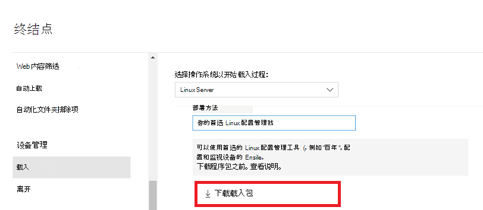

# <a name="deploy-microsoft-defender-for-endpoint-on-linux-with-puppet"></a>使用部署在 Linux 上的 Microsoft Defender for Endpoint

[!INCLUDE [Microsoft 365 Defender rebranding](../../includes/microsoft-defender.md)]


**适用于：**
- [Microsoft Defender for Endpoint](https://go.microsoft.com/fwlink/p/?linkid=2154037)
- [Microsoft 365 Defender](https://go.microsoft.com/fwlink/?linkid=2118804)

> 想要体验适用于终结点的 Defender？ [注册免费试用版](https://signup.microsoft.com/create-account/signup?products=7f379fee-c4f9-4278-b0a1-e4c8c2fcdf7e&ru=https://aka.ms/MDEp2OpenTrial?ocid=docs-wdatp-investigateip-abovefoldlink)。

本文介绍如何使用部署在 Linux 上使用部署适用于终结点的 Defender。 成功的部署需要完成以下所有任务：

- [下载载入程序包](#download-the-onboarding-package)
- [创建清单](#create-a-puppet-manifest)
- [部署](#deployment)
- [检查载入状态](#check-onboarding-status)

## <a name="prerequisites-and-system-requirements"></a>先决条件和系统要求

 有关当前软件版本的先决条件和系统要求的说明，请参阅 Linux 页面上的 Defender [for Endpoint 主页面](microsoft-defender-endpoint-linux.md)。

此外，对于部署部署，你需要熟悉管理中心任务、配置了管理中心并知道如何部署程序包。 安装工具有许多方法可以完成同一任务。 这些说明假定受支持的"开发工具"模块可用， *例如，有助于* 部署程序包。 您的组织可能使用不同的工作流。 有关详细信息， [请参阅"百分百](https://puppet.com/docs) "文档。

## <a name="download-the-onboarding-package"></a>下载载入程序包

从应用门户下载Microsoft 365 Defender包：

1. In Microsoft 365 Defender portal， go to **设置 > Endpoints > Device management > Onboarding**.
2. 在"第一个"下拉菜单中，选择 **"Linux Server"** 作为操作系统。 In the second drop-down menu， select **Your preferred Linux configuration management tool** as the deployment method.
3. 选择 **下载载入程序包**。 将文件另存为WindowsDefenderATPOnboardingPackage.zip。

    

4. 在命令提示符下，验证您是否具有该文件。 

    ```bash
    ls -l
    ```
    ```Output
    total 8
    -rw-r--r-- 1 test  staff  4984 Feb 18 11:22 WindowsDefenderATPOnboardingPackage.zip
    ```
5. 提取存档的内容。
    ```bash
    unzip WindowsDefenderATPOnboardingPackage.zip
    ```
    ```Output
    Archive:  WindowsDefenderATPOnboardingPackage.zip
    inflating: mdatp_onboard.json
    ```

## <a name="create-a-puppet-manifest"></a>创建一个清单

你需要创建一个清单，用于将 Linux 上的 Defender for Endpoint 部署到由开发工具服务器管理的设备上。 此示例使用了从 *labs中* 提供的 apt 和 *yumrepo* 模块，并假定模块已安装在了您的开发工具服务器上。

在安装 *Install_mdatp模块文件夹* 下创建 *install_mdatp/* 文件和清单文件夹。 此文件夹通常位于安装服务器 */etc/moduleslabs/code/environments/production/modules* 中。 将上面创建的 mdatp_onboard.json 文件复制到 *install_mdatp/files* 文件夹。 创建 *init.pp* 包含部署说明的文件：

```bash
pwd
```
```Output
/etc/puppetlabs/code/environments/production/modules
```

```bash
tree install_mdatp
```
```Output
install_mdatp
├── files
│   └── mdatp_onboard.json
└── manifests
    └── init.pp
```

### <a name="contents-of-install_mdatpmanifestsinitpp"></a>`install_mdatp/manifests/init.pp` 的内容

Linux 上的 Defender for Endpoint 可以从以下频道之一进行部署 (如下表示为 *[channel]* *) ：insiders-fast、insiders-slow* 或 *prod*。 每个通道对应于 Linux 软件存储库。

通道的选择决定了提供给你的设备的更新的类型和频率。 预览 *体验成员-快* 中的设备是首先接收更新和新功能的设备，随后是预览体验成员 - *慢* ，最后是 *受支持*。

为了预览新功能并提供早期反馈，建议将企业中的某些设备配置为使用预览体验成员- *快* 或预览体验成员- *慢*。

> [!WARNING]
> 在初始安装后切换通道需要重新安装产品。 若要切换产品渠道：卸载现有程序包，将设备重新配置为使用新通道，然后按照本文档中的步骤从新位置安装程序包。

记下分发和版本，并确定 其最接近的 `https://packages.microsoft.com/config/[distro]/` 条目。

在下面的命令中，将 *[distro]* 和 *[version]* 替换为已识别的信息：

> [!NOTE]
> 对于 RedHat、Oracle Linux、Amazon Linux 2 和 CentOS 8，将 *[distro]* 替换为"rhel"。

```puppet
# Puppet manifest to install Microsoft Defender for Endpoint on Linux.
# @param channel The release channel based on your environment, insider-fast or prod.
# @param distro The Linux distribution in lowercase. In case of RedHat, Oracle Linux, Amazon Linux 2, and CentOS 8, the distro variable should be 'rhel'.
# @param version The Linux distribution release number, e.g. 7.4.

class install_mdatp (
$channel = 'insiders-fast',
$distro = undef,
$version = undef
){
    case $::osfamily {
        'Debian' : {
            apt::source { 'microsoftpackages' :
                location => "https://packages.microsoft.com/config/${distro}/${version}/prod",
                release  => $channel,
                repos    => 'main',
                key      => {
                    'id'     => 'BC528686B50D79E339D3721CEB3E94ADBE1229CF',
                    'server' => 'keyserver.ubuntu.com',
                },
            }
        }
        'RedHat' : {
            yumrepo { 'microsoftpackages' :
                baseurl  => "https://packages.microsoft.com/config/${distro}/${version}/${channel}",
                descr    => "packages-microsoft-com-prod-${channel}",
                enabled  => 1,
                gpgcheck => 1,
                gpgkey   => 'https://packages.microsoft.com/keys/microsoft.asc'
            }
        }
        default : { fail("${::osfamily} is currently not supported.") }
    }

    case $::osfamily {
        /(Debian|RedHat)/: {
            file { ['/etc/opt', '/etc/opt/microsoft', '/etc/opt/microsoft/mdatp']:
                ensure => directory,
                owner  => root,
                group  => root,
                mode   => '0755'
            }

            file { '/etc/opt/microsoft/mdatp/mdatp_onboard.json':
                source  => 'puppet:///modules/install_mdatp/mdatp_onboard.json',
                owner   => root,
                group   => root,
                mode    => '0600',
                require => File['/etc/opt/microsoft/mdatp']
            }

            package { 'mdatp':
                ensure  => 'installed',
                require => File['/etc/opt/microsoft/mdatp/mdatp_onboard.json']
            }
        }
        default : { fail("${::osfamily} is currently not supported.") }
    }
}
```

## <a name="deployment"></a>部署

在 site.pp 中包括上述清单 文件：

```bash
cat /etc/puppetlabs/code/environments/production/manifests/site.pp
```
```Output
node "default" {
    include install_mdatp
}
```

注册的代理设备定期轮询部署服务器，并一经检测到，立即安装新的配置文件和策略。

## <a name="monitor-puppet-deployment"></a>监视部署部署

在代理设备上，还可以运行以下程序检查载入状态：

```bash
mdatp health
```
```Output
...
licensed                                : true
org_id                                  : "[your organization identifier]"
...
```

- **许可**：这可确认设备已绑定到你的组织。

- **orgId：** 这是适用于终结点的 Defender 组织标识符。

## <a name="check-onboarding-status"></a>检查载入状态

可以通过创建脚本来检查设备是否正确载入。 例如，以下脚本检查已注册设备是否载入状态：

```bash
mdatp health --field healthy
```

如果产品已载入并正常工作，则上述命令 `1` 将输出。

> [!IMPORTANT]
> 当产品首次启动时，它将下载最新的反恶意软件定义。 根据您的 Internet 连接，这最多可能需要几分钟。 在此期间，上述命令将返回 的值 `0` 。

如果产品运行不正常， (检查退出代码) `echo $?` 问题：

- 1（如果设备尚未载入）。
- 3（如果无法建立与守护程序的连接）。

## <a name="log-installation-issues"></a>记录安装问题

 若要详细了解如何在发生错误时查找安装程序创建的自动生成的日志，请参阅日志 [安装问题](linux-resources.md#log-installation-issues)。

## <a name="operating-system-upgrades"></a>操作系统升级

将操作系统升级到新的主要版本时，必须先卸载 Linux 上的 Defender for Endpoint，安装升级，最后在设备上重新配置 Linux 上的 Defender for Endpoint。

## <a name="uninstallation"></a>卸载

创建一个 *remove_mdatp**模块*，install_mdatp *init.pp* 中的以下内容类似的模块 文件：

```bash
class remove_mdatp {
    package { 'mdatp':
        ensure => 'purged',
    }
}
```
