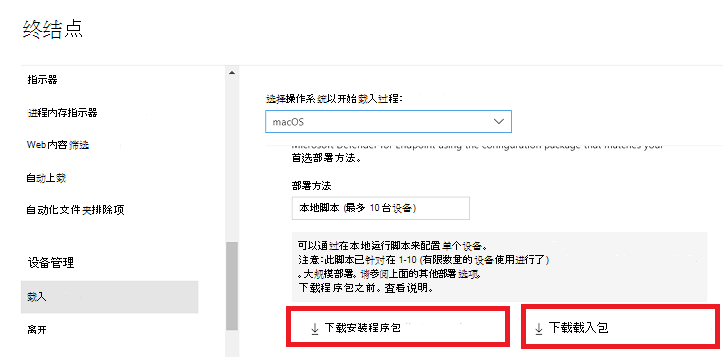
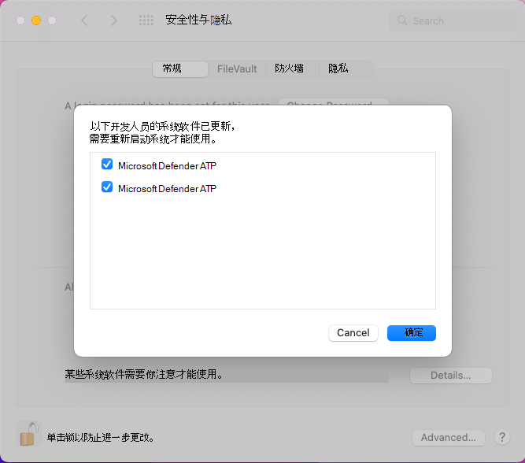

# <a name="manual-deployment-for-microsoft-defender-for-endpoint-on-macos"></a>在 macOS 上手动部署 Microsoft Defender for Endpoint

[!INCLUDE [Microsoft 365 Defender rebranding](../../includes/microsoft-defender.md)]

**适用于：**
- [Microsoft Defender for Endpoint 计划 1](https://go.microsoft.com/fwlink/p/?linkid=2154037)
- [Microsoft Defender for Endpoint 计划 2](https://go.microsoft.com/fwlink/p/?linkid=2154037)
- [Microsoft 365 Defender](https://go.microsoft.com/fwlink/?linkid=2118804)

> 想要体验适用于终结点的 Defender？ [注册免费试用版](https://signup.microsoft.com/create-account/signup?products=7f379fee-c4f9-4278-b0a1-e4c8c2fcdf7e&ru=https://aka.ms/MDEp2OpenTrial?ocid=docs-wdatp-investigateip-abovefoldlink)。

本主题介绍如何手动在 macOS 上部署 Microsoft Defender for Endpoint。 要成功部署，需要完成以下所有步骤：

- [下载安装和载入程序包](#download-installation-and-onboarding-packages)
- [macOS (10.15 及早期版本的应用程序安装) ](#application-installation-macos-1015-and-older-versions)
- [macOS 11 (更高版本的应用程序安装) ](#application-installation-macos-11-and-newer-versions)
- [客户端配置](#client-configuration)

## <a name="prerequisites-and-system-requirements"></a>先决条件和系统要求

在开始使用之前，请参阅 [macOS 上的 Microsoft Defender for Endpoint](microsoft-defender-endpoint-mac.md) 主页，了解当前软件版本的先决条件和系统要求说明。

## <a name="download-installation-and-onboarding-packages"></a>下载安装和载入程序包

从门户下载安装和载入Microsoft 365 Defender包：

1. In <a href="https://go.microsoft.com/fwlink/p/?linkid=2077139" target="_blank">Microsoft 365 Defender portal</a>， go to **设置 > Endpoints > Device management > Onboarding**.
2. 在页面的第 1 节中，将操作系统设置为 **macOS** ，将 Deployment 方法设置为 **本地脚本**。
3. 在页面的第 2 部分中，选择 **下载安装程序包**。 将其另存为 wdav.pkg 到本地目录。
4. 在页面的第 2 部分中，选择 **下载载入程序包**。 将其另存WindowsDefenderATPOnboardingPackage.zip同一目录。

    

5. 在命令提示符下，验证您是否具有这两个文件。

## <a name="application-installation-macos-1015-and-older-versions"></a>macOS (10.15 及早期版本的应用程序安装) 

若要完成此过程，你必须在设备上拥有管理员权限。

1. 导航到 Finder 中下载的 wdav.pkg 并打开它。

    

2. 选择 **"继续**"，同意许可条款，在系统提示时输入密码。

    

   > [!IMPORTANT]
   > 系统将提示你允许从 Microsoft 安装驱动程序， ("系统扩展被阻止"或"安装已保留"或两者同时安装。 必须允许安装驱动程序。

   

3. 选择 **"打开安全首选项"** 或"打开系统 **首选项>安全&隐私"**。 选择 **"允许"**：

    

   继续安装。

   > [!CAUTION]
   > 如果未选择"允许 **"，** 则安装将在 5 分钟后继续。 Microsoft Defender for Endpoint 将加载，但某些功能（如实时保护）将被禁用。 请参阅 [内核扩展问题](mac-support-kext.md) 疑难解答，了解如何解决此问题。

> [!NOTE]
> macOS 可能会请求在首次安装 Microsoft Defender for Endpoint 时重新启动设备。 在重新启动设备之前，实时保护将不可用。

## <a name="application-installation-macos-11-and-newer-versions"></a>macOS 11 (更高版本的应用程序安装) 

若要完成此过程，你必须在设备上拥有管理员权限。

1. 导航到 Finder 中下载的 wdav.pkg 并打开它。

    

2. 选择 **"继续**"，同意许可条款，在系统提示时输入密码。

3. 在安装过程结束时，你将被提升为批准产品使用的系统扩展。 选择 **"打开安全首选项"**。

    

4. 从" **安全&隐私"** 窗口中，选择" **允许"**。

    

5. 对通过 Mac 上的 Microsoft Defender for Endpoint 分发的所有系统扩展重复步骤 3 & 4。

6. 作为终结点检测和响应功能的一部分，Mac 上的 Microsoft Defender for Endpoint 会检查套接字流量，将此信息报告给 Microsoft 365 Defender 门户。 当系统提示授予 Microsoft Defender 终结点权限以筛选网络流量时，请选择" **允许"**。

    

7. 打开 **"系统**\>首选项 **&** 隐私"并导航到"隐私"选项卡。授予 **Microsoft Defender** 和 **Microsoft Defender 终结点** 安全扩展的"完全磁盘访问权限"。

    

## <a name="client-configuration"></a>客户端配置

1. 将 wdav.pkg 和 MicrosoftDefenderATPOnboardingMacOs.py 复制到 macOS 上部署 Microsoft Defender for Endpoint 的设备。

    客户端设备不与客户端org_id。 请注意， *org_id* 属性为空。

    ```bash
    mdatp health --field org_id
    ```

2. 运行 Python 脚本以安装配置文件：

    ```bash
    /usr/bin/python MicrosoftDefenderATPOnboardingMacOs.py
    ```

3. 验证设备现在是否与组织关联，并报告有效的组织 ID：

    ```bash
    mdatp health --field org_id
    ```

    安装后，你将在右上角的 macOS 状态栏中看到 Microsoft Defender 图标。

    > [!div class="mx-imgBorder"]
    > 

## <a name="how-to-allow-full-disk-access"></a>如何：允许完全磁盘访问

> [!CAUTION]
> macOS 10.15 (加泰罗尼亚语) 新增了安全和隐私增强功能。 从此版本开始，默认情况下，应用程序在未经明确同意的情况下 (访问磁盘上的某些位置，如文档、下载、桌面) 等。 如果没有此同意，Microsoft Defender for Endpoint 将无法完全保护你的设备。

1. 若要授予同意，请打开 **"系统首选项安全性** \> **&隐私****""** \> \> **完全磁盘访问"**。 单击锁定图标以在 (对话框底部进行更改) 。 选择"适用于终结点的 Microsoft Defender"。

2. 运行 AV 检测测试，验证设备是否正确载入并报告给服务。 对新载入的设备执行以下步骤：

    1. 确保通过运行以下命令 (1 的结果来启用实时) ：

        ```bash
        mdatp health --field real_time_protection_enabled
        ```

    1. 打开"终端"窗口。 复制并执行以下命令：

        ```bash
        curl -o ~/Downloads/eicar.com.txt https://www.eicar.org/download/eicar.com.txt
        ```

    1. 文件应已由 Mac 上的 Defender for Endpoint 隔离。 使用以下命令列出所有检测到的威胁：

        ```bash
        mdatp threat list
        ```

3. 运行EDR检测测试，验证设备已正确载入并报告给服务。 对新载入的设备执行以下步骤：

   1. 在浏览器（如 Microsoft Edge For Mac 或 Safari）中。

   1. 下载 MDATP MacOS DIY.zip并从中提取 https://aka.ms/mdatpmacosdiy 。

      系统可能会提示你：

      > 是否要允许下载"mdatpclientanalyzer.blob.core.windows.net"？<br/>
      > 你可以更改哪些网站可以下载网站首选项中的文件。

4. 单击" **允许"**。

5. 打开 **下载**。

6. 你应该会看到 **MDATP MacOS DIY**。

   > [!TIP]
   > 如果双击，将收到以下消息：
   >
   > > **无法打开"MDATP MacOS DIY"，因为开发人员无法验证程序。**<br/>
   > > macOS 无法验证此应用程序是否不含恶意软件。<br/>
   > > **\[移动到回收站\]****\[取消\]**

7. Click **Cancel**.

8. 右键单击 **"MDATP MacOS DIY**"，然后单击"打开 **"**。

    系统应显示以下消息：

    > **macOS 无法验证 MDATP MacOS DIY 的开发人员。确定要打开它吗？**<br/>
    > 通过打开此应用，你将覆盖系统安全，这样可能会向可能损害 Mac 或隐私的恶意软件公开计算机和个人信息。

9. 单击“打开”。

    系统应显示以下消息：

    > Microsoft Defender for Endpoint - macOS EDR DIY 测试文件<br/>
    > MDATP 门户中将提供相应的警报。

10. 单击“打开”。

    几分钟后，将引发名为"macOS EDR测试警报"的警报。

11. 转到Microsoft 365 Defender门户 (https://security.microsoft.com/)。

12. 转到警报队列。

    :::image type="content" source="images/b8db76c2-c368-49ad-970f-dcb87534d9be.png" alt-text="macOS 示例EDR显示严重性、类别、检测源和折叠操作菜单的测试警报。":::

    查看警报详细信息和设备时间线，并执行常规调查步骤。

## <a name="logging-installation-issues"></a>记录安装问题

请参阅 [记录](mac-resources.md#logging-installation-issues) 安装问题，详细了解如何在发生错误时查找安装程序创建的自动生成的日志。

## <a name="uninstallation"></a>卸载

请参阅 [卸载](mac-resources.md#uninstalling) ，详细了解如何从客户端设备中删除 macOS 上的 Microsoft Defender for Endpoint。
