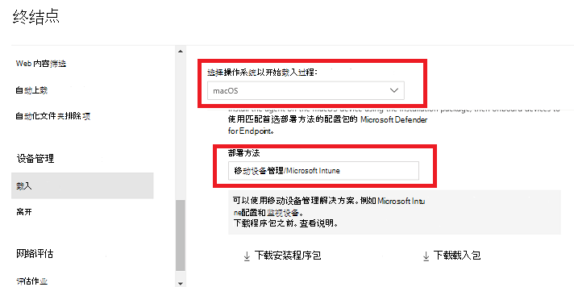
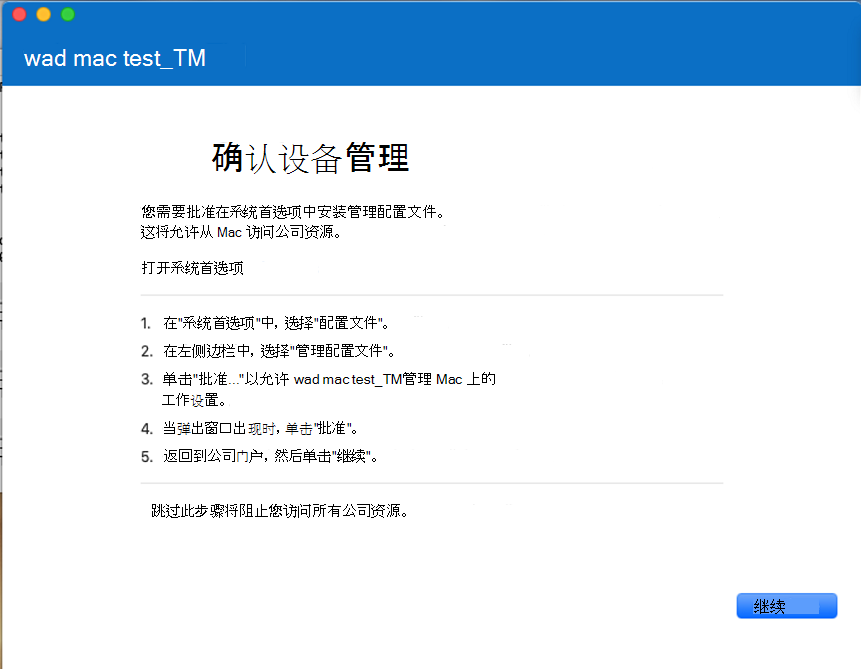

# <a name="intune-based-deployment-for-microsoft-defender-for-endpoint-on-macos"></a>macOS 上的 Microsoft Defender for Endpoint 的基于 Intune 的部署

[!INCLUDE [Microsoft 365 Defender rebranding](../../includes/microsoft-defender.md)]

**适用于：**

- [macOS 上的 Microsoft Defender for Endpoint](microsoft-defender-endpoint-mac.md)

本主题介绍如何通过 Intune 在 macOS 上部署 Microsoft Defender for Endpoint。 要成功部署，需要完成以下所有步骤：

1. [下载载入程序包](#download-the-onboarding-package)
1. [客户端设备设置](#client-device-setup)
1. [批准系统扩展](#approve-system-extensions)
1. [创建系统配置文件](#create-system-configuration-profiles)
1. [发布应用程序](#publish-application)

## <a name="prerequisites-and-system-requirements"></a>先决条件和系统要求

在开始使用之前，请参阅 [macOS](microsoft-defender-endpoint-mac.md) 上的 Microsoft Defender for Endpoint 主页，了解当前软件版本的先决条件和系统要求说明。

## <a name="overview"></a>概述

下表总结了通过 Intune 部署和管理 Mac 上的 Microsoft Defender for Endpoint 需要执行的步骤。 下面提供了更详细的步骤。

<br>

****

|步骤|示例文件名|BundleIdentifier|
|---|---|---|
|[下载载入程序包](#download-the-onboarding-package)|WindowsDefenderATPOnboarding__MDATP_wdav.atp.xml|com.microsoft.wdav.atp|
|[批准适用于终结点的 Microsoft Defender 的系统扩展](#approve-system-extensions)|MDATP_SysExt.xml|不适用|
|[批准适用于终结点的 Microsoft Defender 内核扩展](#download-the-onboarding-package)|MDATP_KExt.xml|不适用|
|[授予对 Microsoft Defender for Endpoint 的完全磁盘访问权限](#full-disk-access)|MDATP_tcc_Catalina_or_newer.xml|com.microsoft.wdav.tcc|
|[网络扩展策略](#network-filter)|MDATP_NetExt.xml|不适用|
|[配置 Microsoft AutoUpdate (MAU) ](mac-updates.md#intune)|MDATP_Microsoft_AutoUpdate.xml|com.microsoft.autoupdate2|
|[Microsoft Defender for Endpoint 配置设置](mac-preferences.md#intune-full-profile) <p> **注意：** 如果计划运行适用于 macOS 的第三方 AV，请设置为 `passiveMode` `true` 。|MDATP_WDAV_and_exclusion_settings_Preferences.xml|com.microsoft.wdav|
|[配置 Microsoft Defender for Endpoint 和 MS AutoUpdate (MAU) 通知](mac-updates.md)|MDATP_MDAV_Tray_and_AutoUpdate2.mobileconfig|com.microsoft.autoupdate2 或 com.microsoft.wdav.tray|
|

## <a name="download-the-onboarding-package"></a>下载载入程序包

从应用门户下载Microsoft 365 Defender包：

1. 在Microsoft 365 Defender门户中，**转到设置** \> **终结点** \> **设备管理** \> **载入"。**

2. 将操作系统设置为 **macOS，** 将部署方法设置为移动设备管理 **/Microsoft Intune**。

    

3. 选择 **下载载入程序包**。 将其另 _存WindowsDefenderATPOnboardingPackage.zip_ 同一目录。

4. 提取文件.zip内容：

    ```bash
    unzip WindowsDefenderATPOnboardingPackage.zip
    ```

    ```Output
    Archive:  WindowsDefenderATPOnboardingPackage.zip
    warning:  WindowsDefenderATPOnboardingPackage.zip appears to use backslashes as path separators
      inflating: intune/kext.xml
      inflating: intune/WindowsDefenderATPOnboarding.xml
      inflating: jamf/WindowsDefenderATPOnboarding.plist
    ```

## <a name="create-system-configuration-profiles"></a>创建系统配置文件

下一步是创建 Microsoft Defender for Endpoint 所需的系统配置文件。
在管理 [Microsoft Endpoint Manager，](https://endpoint.microsoft.com/)打开 **设备** \> **配置文件**。

### <a name="onboarding-blob"></a>载入 blob

此配置文件包含 Microsoft Defender for Endpoint 的许可证信息，如果没有它，它将报告其未获得许可。

1. 选择 **"配置文件"下的****"创建配置文件"。**
1. 选择 **平台** = **macOS** **，配置文件类型** = **模板**。 **模板名称** =**自定义**。 单击“**创建**”。

    > [!div class="mx-imgBorder"]
    > 

1. 为配置文件选择名称，例如"Defender for Cloud 或 Endpoint onboarding for macOS"。 单击 **下一个**。

    > [!div class="mx-imgBorder"]
    > 

1. 为配置文件名称选择名称，例如"适用于 macOS 的终结点载入的 Defender"。
1. 选择"intune/WindowsDefenderATPOnboarding.xml从上述载入程序包中提取的配置文件作为配置文件。

    > [!div class="mx-imgBorder"]
    > 

1. 单击 **下一个**。
1. 在"分配"选项卡上 **分配** 设备。单击"下一 **步"。**

    > [!div class="mx-imgBorder"]
    > 

1. 查看 和 **创建**。
1. 打开 **设备** \> **配置文件 ，** 你可以在那里查看你创建的配置文件。

    > [!div class="mx-imgBorder"]
    > 

### <a name="approve-system-extensions"></a>批准系统扩展

MacOS 10.15 或更高版本 (macOS 10.15) 此配置文件。 它将在较旧的 macOS 上被忽略。

1. 选择 **"配置文件"下的****"创建配置文件"。**
1. 选择 **平台** = **macOS** **，配置文件类型** = **模板**。 **模板名称** =**扩展**。 单击“**创建**”。
1. 在 **"基本"** 选项卡中，为此新配置文件命名。
1. 在" **配置设置"** 选项卡中，展开" **系统扩展"，** 在"允许的系统扩展"部分 **添加以下** 条目：

    |捆绑包标识符|团队标识符|
    |---|---|
    |com.microsoft.wdav.epsext|UBF8T346G9|
    |com.microsoft.wdav.netext|UBF8T346G9|

    > [!div class="mx-imgBorder"]
    > 

1. 在"**分配**"选项卡中，将此配置文件分配给"**所有&所有用户"。**
1. 查看并创建此配置文件。

### <a name="kernel-extensions"></a>内核扩展

macOS 10.15 和加泰罗尼亚语或 (需要) 配置文件。 它将在较新的 macOS 上被忽略。

> [!CAUTION]
> Apple 芯片 (M1) 设备不支持 KEXT。 在这些设备上安装包含 KEXT 策略的配置文件将失败。

1. 选择 **"配置文件"下的****"创建配置文件"。**
1. 选择 **平台** = **macOS** **，配置文件类型** = **模板**。 **模板名称** =**扩展**。 单击“**创建**”。
1. 在 **"基本"** 选项卡中，为此新配置文件命名。
1. 在"**配置设置"** 选项卡中，展开 **"内核扩展"。**
1. 将 **团队标识符设置为** **UBF8T346G9，** 然后单击下一 **步**。

    > [!div class="mx-imgBorder"]
    > 

1. 在"**分配**"选项卡中，将此配置文件分配给"**所有&所有用户"。**
1. 查看并创建此配置文件。

### <a name="full-disk-access"></a>完全磁盘访问

   > [!CAUTION]
   > macOS 10.15 (加泰罗尼亚语) 新增了安全和隐私增强功能。 从此版本开始，默认情况下，应用程序无法访问磁盘上的某些位置 (如文档、下载、桌面等) 未经明确同意。 如果没有此同意，Microsoft Defender for Endpoint 将无法完全保护你的设备。
   >
   > 此配置文件授予对 Microsoft Defender for Endpoint 的完全磁盘访问权限。 如果你之前通过 Intune 配置了适用于 Endpoint 的 Microsoft Defender，我们建议你通过此配置文件更新部署。

从我们的 GitHub [存储库中下载](https://github.com/microsoft/mdatp-xplat/tree/master/macos/mobileconfig/profiles) [**fulldisk.mobileconfig。**](https://raw.githubusercontent.com/microsoft/mdatp-xplat/master/macos/mobileconfig/profiles/fulldisk.mobileconfig)

按照上述载入 [blob](#onboarding-blob) 的说明操作，使用"Defender for Endpoint Full Disk Access"作为配置文件名称，并下载 **fulldisk.mobileconfig** 作为配置文件名称。

### <a name="network-filter"></a>网络筛选器

作为终结点检测和响应功能的一部分，macOS 上的 Microsoft Defender for Endpoint 会检查套接字流量，将此信息报告给 Microsoft 365 Defender 门户。 以下策略允许网络扩展执行此功能。

从我们的 GitHub 存储库下载 [**netfilter.mobileconfig。**](https://raw.githubusercontent.com/microsoft/mdatp-xplat/master/macos/mobileconfig/profiles/netfilter.mobileconfig) [](https://github.com/microsoft/mdatp-xplat/tree/master/macos/mobileconfig/profiles)

按照上述载入 [blob](#onboarding-blob) 的说明操作，使用"Defender for Endpoint Network Filter"作为配置文件名称，将下载的 **netfilter.mobileconfig** 用作配置文件名称。

### <a name="notifications"></a>通知

此配置文件用于允许 macOS 和 Microsoft 自动更新上的 Microsoft Defender for Endpoint 在 macOS 10.15 (或更高版本的 UI) 通知。

从我们的 GitHub[存储库中下载 notif.mobileconfig。](https://github.com/microsoft/mdatp-xplat/tree/master/macos/mobileconfig/profiles) [](https://raw.githubusercontent.com/microsoft/mdatp-xplat/master/macos/mobileconfig/profiles/notif.mobileconfig)

按照上面有关 [载入 blob](#onboarding-blob) 的说明操作，使用"Defender for Endpoint Notifications"作为配置文件名称，并下载 **notif.mobileconfig** 作为配置文件名称。

### <a name="view-status"></a>查看状态

将 Intune 更改传播到已注册的设备后，你可以看到它们列在监视 \> **设备状态下**：

> [!div class="mx-imgBorder"]
> 

## <a name="publish-application"></a>发布应用程序

此步骤支持将 Microsoft Defender for Endpoint 部署到注册的计算机。

1. 在管理 [Microsoft Endpoint Manager中，打开](https://endpoint.microsoft.com/)**应用。**

    > [!div class="mx-imgBorder"]
    > 

1. 选择"按平台> macOS >添加"。
1. 选择 **"应用类型** = **""macOS"，** 单击"**选择"。**

    > [!div class="mx-imgBorder"]
    > 

1. 保留默认值，单击"下一 **步"。**

    > [!div class="mx-imgBorder"]
    > 

1. 添加分配，单击下 **一步**。

    > [!div class="mx-imgBorder"]
    > 

1. 查看 和 **创建**。
1. 你可以按 **平台** \>  \> **macOS** 访问应用，在所有应用程序列表中查看它。

    > [!div class="mx-imgBorder"]
    > 

有关详细信息，请参阅使用[.Microsoft Intune .) ](/mem/intune/apps/apps-advanced-threat-protection-macos)将 Microsoft Defender for Endpoint 添加到 macOS 设备

   > [!CAUTION]
   > 你必须创建所有必需的配置文件，并推送到所有计算机，如上所述。

## <a name="client-device-setup"></a>客户端设备设置

除了标准安装之外，你无需为 Mac 设备公司门户[预配](/intune-user-help/enroll-your-device-in-intune-macos-cp)。

1. 确认设备管理。

    > [!div class="mx-imgBorder"]
    > 

    选择 **"打开系统首选项"，** 在列表中找到"**管理配置文件**"，然后选择"批准 **..."。** 你的管理配置文件将显示为 **"已验证"：**

    

2. 选择 **"继续** "并完成注册。

   你现在可以注册更多设备。 还可以在完成后完成系统配置和应用程序包的预配后注册它们。

3. 在 Intune 中，打开 **"** \> **管理设备** \> **""所有设备"。** 你可以在此处查看列出的设备：

   > [!div class="mx-imgBorder"]
   > 

## <a name="verify-client-device-state"></a>验证客户端设备状态

1. 将配置文件部署到设备后，在 Mac 设备上打开系统 \> 首选项配置文件。

    > [!div class="mx-imgBorder"]
    > 

    

2. 确认存在并安装了以下配置文件。 管理 **配置文件** 应为 Intune 系统配置文件。 _Wdav-config_ 和 _wdav-kext_ 是在 Intune 中添加的系统配置文件：

    

3. 你还应在右上角看到"适用于终结点的 Microsoft Defender"图标：

    > [!div class="mx-imgBorder"]
    > 

## <a name="troubleshooting"></a>疑难解答

问题：未找到许可证。

解决方案：按照上述步骤使用 WindowsDefenderATPOnboarding.xml。

## <a name="logging-installation-issues"></a>记录安装问题

若要详细了解如何在发生错误时查找安装程序创建的自动生成的日志，请参阅记录 [安装问题](mac-resources.md#logging-installation-issues)。

## <a name="uninstallation"></a>卸载

请参阅 [卸载](mac-resources.md#uninstalling) ，详细了解如何从客户端设备中删除 macOS 上的 Microsoft Defender for Endpoint。
