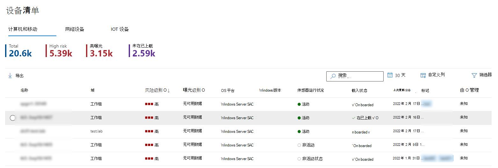

# 设备清单

[!INCLUDE [Microsoft 365 Defender rebranding](../../includes/microsoft-defender.md)]

**适用于：**

- [Microsoft Defender for Endpoint 计划 1](https://go.microsoft.com/fwlink/p/?linkid=2154037)
- [Microsoft Defender for Endpoint 计划 2](https://go.microsoft.com/fwlink/p/?linkid=2154037)
- [Microsoft 365 Defender](https://go.microsoft.com/fwlink/?linkid=2118804)

> 想要体验适用于终结点的 Defender？ [注册免费试用版](https://signup.microsoft.com/create-account/signup?products=7f379fee-c4f9-4278-b0a1-e4c8c2fcdf7e&ru=https://aka.ms/MDEp2OpenTrial?ocid=docs-wdatp-machinesview-abovefoldlink)。

**"设备"** 列表显示网络中生成警报的设备列表。 默认情况下，队列显示最近 30 天内看到的设备。

一目了然地，你将看到域、风险级别、操作系统平台和其他详细信息，以轻松识别风险最大的设备。

有几种选项可供选择以自定义设备列表视图。 在顶部导航上，你可以：

- 添加或删除列
- 导出 CSV 格式的整个列表
- 选择要显示每页的项目数
- 应用筛选器

在载入过程中， **设备列表** 将随着设备开始报告传感器数据而逐渐填充。 使用此视图在已载入终结点联机时跟踪它们，或下载完整终结点列表作为 CSV 文件进行脱机分析。

> [!NOTE]
> 如果导出设备列表，它将包含组织的每台设备。 下载可能需要很长时间，具体取决于你的组织规模。 以 CSV 格式导出列表以未筛选的方式显示数据。 CSV 文件将包含组织的所有设备，而不考虑视图本身应用的任何筛选。

:::image type="content" source="images/device-inventory.png" alt-text="设备列表" lightbox="images/device-inventory.png":::

## 排序和筛选设备列表

可以应用以下筛选器来限制警报列表并获取更集中的视图。

### 设备名称

在Microsoft Defender for Endpoint载入过程中，载入到 MDE 的设备将随着开始报告传感器数据而逐渐填充到设备清单中。 然后，设备清单由通过设备发现过程在网络中发现的设备填充。 设备清单有三个选项卡，按以下三个选项卡列出设备：

- **计算机和移动设备**：Enterprise工作站 (服务器和移动设备的终结点) 
- **网络设备**：路由器和交换机等设备
- **IoT 设备**：打印机和相机等设备

## 导航到"设备清单"页

通过在"终结点"门户的"终结点"导航菜单中选择"设备清单"，访问[Microsoft 365 Defender页面](/defender/microsoft-365-security-center-mde)。

## 设备清单概述

设备清单将在"计算机和移动 **"选项卡上** 打开。一目了然地，你将看到设备名称、域、风险级别、曝光级别、操作系统平台、载入状态、传感器运行状况和其他详细信息，以轻松识别风险最大的设备。

使用 **"载入状态"** 列按发现的设备和已载入设备进行排序和Microsoft Defender for Endpoint。

在 **"网络设备"和****"IoT** 设备"选项卡中，你还将看到供应商、型号和设备类型等信息：

在每个设备清单选项卡的顶部，你可以看到设备总数、尚未载入的设备数，以及被标识为对组织高风险的设备数量。 可以使用此信息来帮助你确定设备优先级，以改进安全状况。

" **最近** 发现的网络设备和 IoT 设备"选项卡的设备计数显示在当前视图中列出的最近 7 天内发现的新设备数。

## 浏览设备清单

有几种选项可供选择以自定义设备清单视图。 在每个选项卡的顶部导航上，你可以：

- 按名称搜索设备
- 按最近使用的 IP 地址或 IP 地址前缀搜索设备
- 添加或删除列
- 以 CSV 格式导出整个列表进行脱机分析
- 选择要显示的日期范围
- 应用筛选器

> [!NOTE]
> 如果导出设备列表，它将包含组织的每台设备。 下载可能需要很长时间，具体取决于你的组织规模。 以 CSV 格式导出列表以未筛选的方式显示数据。 CSV 文件将包含组织的所有设备，而不考虑视图本身应用的任何筛选。

可以使用每个设备清单选项卡上提供的排序和筛选功能获得更集中的视图，并帮助你评估和管理组织中设备。

每个选项卡顶部的计数将基于当前视图进行更新。

## 使用筛选器自定义设备清单视图

筛选器 | 说明
:---|:---
**风险级别**   | 风险级别根据各种因素（包括设备上活动警报的类型和严重性）反映设备的总体风险评估。 解决活动警报、批准修正活动以及抑制后续警报会降低风险级别。
**曝光级别**   | 曝光级别根据设备挂起的安全建议累积影响反映设备的当前曝光情况。 可能的级别为低、中和高。 低曝光意味着你的设备不太易受利用。     如果曝光级别显示"无可用数据"，可能有以下原因： - 设备停止报告超过 30 天。 在这种情况下，它被视为非活动状态，并且不会计算曝光。 - 设备操作系统不受支持 - 请参阅[设备的最低Microsoft Defender for Endpoint](/microsoft-365/security/defender-endpoint/minimum-requirements)。 - 具有过时代理 (不太可能) 。
**Tags**   | 根据已添加到个别设备的分组和标记筛选列表。 请参阅 [创建和管理设备标记](machine-tags.md)。
**设备值**  | 根据设备已标记为"高值"还是"低值"来筛选列表。
**排除状态**   | 根据设备是否已排除筛选列表。 有关详细信息，请参阅排除 [设备](exclude-devices.md)。
**操作系统平台**  | 按你感兴趣的操作系统平台进行筛选    (_计算机以及移动和 IoT 设备)_
**首次看到**   | 根据设备在网络中首次看到或首次由传感器报告时，筛选Microsoft Defender for Endpoint视图。   (_计算机以及移动和 IoT 设备)_
**Windows 版本**   | 按你Windows调查的版本进行筛选。    (_计算机和移动设备)_
**传感器运行状况**   | 按以下传感器运行状况状态进行筛选，使设备载入Microsoft Defender for Endpoint：  - **活动**：主动向服务报告传感器数据的设备。  - **非** 活动：停止发送信号超过 7 天的设备。   - **错误配置：** 与服务通信受损或无法发送传感器数据的设备。   可以将错误配置的设备进一步分类为：    - 无传感器数据    - 通信受损    若要详细了解如何解决错误配置设备上的问题，请参阅修复 [不正常的传感器](/microsoft-365/security/defender-endpoint/fix-unhealthy-sensors)。    (_计算机和移动设备)_
**载入状态**   | 载入状态指示设备当前是否已Microsoft Defender for Endpoint载入。 可以按以下状态进行筛选：   - **已** 载入：终结点已载入Microsoft Defender for Endpoint。    - **可以载入**：终结点已作为受支持的设备在网络中发现，但当前尚未载入。 Microsoft 强烈建议载入这些设备。   - **不支持**：终结点已发现在网络中，但不受 Microsoft Defender for Endpoint。   - **信息** 不足：系统无法确定设备的可支持性。    (_计算机和移动设备)_
**防病毒状态**   | 根据防病毒状态是已禁用、未更新还是未知来筛选视图。    (_计算机和移动设备)_
**Group**   | 根据你感兴趣的组筛选列表。     (_计算机和移动设备)_
**托管者**   | "管理者"指示如何管理设备。 You can filter by: - Microsoft Defender for Endpoint   - 移动设备管理 (MDM)   - 未知：这可能是由于正在运行过时的 Windows 版本、SCCM 已就位或其他第三方 MDM。    (_计算机和移动设备)_
**设备类型**   | 按你感兴趣的设备类型进行筛选。    (_IoT 设备)_

## 使用列自定义设备清单视图

You can add or remove columns from the view and sort the entries by clicking on an available column header.

在" **计算机和移动设备"** 选项卡上，选择"自定义 **列** "以查看可用的列。 默认值在下图中进行检查：

在" **网络设备"** 选项卡上，选择" **自定义列** "以查看可用的列。 默认值在下图中进行检查：

在 **"IoT 设备"** 选项卡上，选择" **自定义列** "以查看可用的列。 默认值在下图中进行检查：

## 相关文章

[调查"设备Microsoft Defender for Endpoint中的设备](investigate-machines.md)
