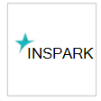
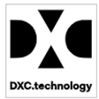

# 支持的托管安全服务提供程序

**适用于：**
- [Microsoft Defender for Endpoint](https://go.microsoft.com/fwlink/p/?linkid=2154037)
- [Microsoft 365 Defender](https://go.microsoft.com/fwlink/?linkid=2118804)

> 想要体验 Microsoft Defender for Endpoint？ [注册免费试用版。](https://www.microsoft.com/microsoft-365/windows/microsoft-defender-atp?ocid=docs-wdatp-exposedapis-abovefoldlink)

可以通过门户访问以下托管安全服务提供程序。 

徽标 |合作伙伴名称   | 说明 
:---|:---|:---
| [BDO Digital](https://go.microsoft.com/fwlink/?linkid=2090394) | BDO Digital's Managed Defense 利用最佳实践工具、AI 和内部安全专家进行 24/7/365 身份保护
| [BlueVoyant](https://go.microsoft.com/fwlink/?linkid=2121401) | 适用于 Microsoft Defender for Endpoint 的 MDR 在终结点上监视、调查和缓解高级攻击方面提供支持
| [云安全中心](https://go.microsoft.com/fwlink/?linkid=2099315) | InSpark 的云安全中心是一项 24x7 托管服务，可提供保护、检测&响应功能
| [云 SOC](https://go.microsoft.com/fwlink/?linkid=2104265) | 云 SOC 提供基于 Microsoft 云的 24/7 安全监视服务，可帮助你持续改进安全状况
| [CSIS 托管检测&响应](https://go.microsoft.com/fwlink/?linkid=2091005) | 对安全警报进行 24/7 的监视和分析，使公司可以操作地了解安全事件发生的位置、时间以及如何发生
| [Dell 技术高级威胁防护](https://go.microsoft.com/fwlink/?linkid=2091004) | 针对恶意行为和异常的专业监视服务（24/7 功能）
| [DXC 托管的终结点威胁检测和响应](https://go.microsoft.com/fwlink/?linkid=2090395) | 识别规避传统安全防护的终结点威胁，并包含小时数或分钟数（而不是数天）
 | [eSentire 托管检测和响应](https://go.microsoft.com/fwlink/?linkid=2154970) | 通过 Microsoft Defender for Endpoint 进行 24x7 威胁调查和响应。
| [NTT 安全性](https://go.microsoft.com/fwlink/?linkid=2095320) | NTT 的 EDR 服务跨终结点和网络提供 24/7 &安全监视和响应
 | [Onevinn MDR](https://go.microsoft.com/fwlink/?linkid=2155203)| 基于 Microsoft Defender 和 Azure Sentinel 构建的 24/7 托管检测和响应，使用 Onevinn 的威胁智能进行丰富。
 | [仲裁网络](https://go.microsoft.com/fwlink/?linkid=2155202)| 一项边缘威胁搜寻&安全工程服务。
| [红色 Canary](https://go.microsoft.com/fwlink/?linkid=2103852) | 红色 Canary 是新式团队的安全运营合作伙伴，以分钟数部署 MDR
| [由 Red 在 PowerEd 的 SecureWorks 托管检测和响应](https://go.microsoft.com/fwlink/?linkid=2133634) | Secureworks 将威胁情报和 20 多年来的经验组合到 SaaS 和托管安全解决方案中
| [sepagoSOC](https://go.microsoft.com/fwlink/?linkid=2090491) | 通过零信任环境中复杂的自动化工作流确保整体安全性
| [Trustwave 威胁检测&响应服务](https://go.microsoft.com/fwlink/?linkid=2127542) | Azure 的威胁检测和响应服务，利用与 Sentinel 和 Defender for Endpoint 的集成
| [White Shark Managed Security Services](https://go.microsoft.com/fwlink/?linkid=2154210) |通过每个平台（包括移动设备）的透明定价实现网络安全的真正专家方法。
| [Wortell 的云 SOC](https://go.microsoft.com/fwlink/?linkid=2108415) | 24x7 托管 Defender for Endpoint 服务，用于&响应
| [零信任分析平台 (ZTAP) ](https://go.microsoft.com/fwlink/?linkid=2090971) | 将警报减少 99%，从移动设备访问各种安全性功能

## 相关主题
- [配置托管服务安全提供程序集成](configure-mssp-support.md)