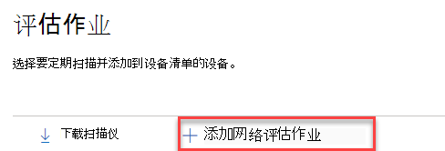

# 网络设备发现和漏洞管理

[!INCLUDE [Microsoft 365 Defender rebranding](../../includes/microsoft-defender.md)]

**适用于：**
- [Microsoft Defender for Endpoint 计划 2](https://go.microsoft.com/fwlink/p/?linkid=2154037)
- [威胁和漏洞管理](next-gen-threat-and-vuln-mgt.md)
- [Microsoft 365 Defender](https://go.microsoft.com/fwlink/?linkid=2118804)

> 希望体验 Microsoft Defender for Endpoint？ [注册免费试用版](https://signup.microsoft.com/create-account/signup?products=7f379fee-c4f9-4278-b0a1-e4c8c2fcdf7e&ru=https://aka.ms/MDEp2OpenTrial?ocid=docs-wdatp-portaloverview-abovefoldlink)。

> [!NOTE]
> 2021 年 4 月 \( 13 日发布的网络设备发现和漏洞评估博客提供了有关 Defender for Endpoint 中新网络设备发现功能的 \) 见解。  本文概述了网络设备发现旨在应对的挑战，并详细介绍了如何使用这些新功能。

网络发现功能在 Microsoft 365 Defender 和Microsoft 365 Defender<a href="https://go.microsoft.com/fwlink/p/?linkid=2077139" target="_blank">控制台</a>的设备清单部分提供。

指定的 Microsoft Defender for Endpoint 设备将用于每个网段，以定期对预配置的网络设备执行经过身份验证的扫描。 发现后，适用于终结点的 defender 危险和漏洞管理 功能提供集成的工作流，用于保护发现的交换机、路由器、WLAN 控制器、防火墙和 VPN 网关。

发现网络设备并进行分类后，安全管理员将能够接收最新的安全建议，并查看最近在组织中部署的网络设备上发现的漏洞。

## 方法

由于 Defender for Endpoint 本身没有内置于网络设备中的传感器，因此不会将网络设备作为标准终结点进行管理。 这些类型的设备需要无代理方法，远程扫描将获取设备的必要信息。 根据网络拓扑和特征，已载入 Microsoft Defender for Endpoint 的一台或几台设备使用 SNMP 或只读 (对网络设备执行经过身份验证) 。

需要记住两种类型的设备：

- **评估** 设备：已载入用于扫描网络设备的设备。
- **网络设备**：计划扫描和载入的网络设备。

### 网络设备的漏洞管理

发现网络设备并进行分类后，安全管理员将能够接收最新的安全建议，并查看最近在组织中部署的网络设备上发现的漏洞。

## 支持的操作系统

目前支持以下操作系统：

- Cisco IOS、IOS-XE、NX-OS
- Juniper JUNOS
- HPE 更新、安装交换机软件
- Palo Alto Networks PAN-OS

随着时间的推移，将基于从客户使用情况收集的数据，添加更多的网络供应商和操作系统。 因此，建议配置所有网络设备，即使在此列表中未指定这些设备。

## 如何开始使用

第一步是选择将执行经过身份验证的网络扫描的设备。

1. 确定终结点载入的 Defender (客户端或) ，该客户端或服务器具有与计划扫描的网络设备的管理端口的网络连接。

2. 必须允许 Defender for Endpoint 评估设备和目标网络设备之间的 SNMP 流量 (例如，防火墙) 。

3. 确定将评估哪些网络设备以发现漏洞 (例如：Cisco 交换机或 Palo Alto Networks 防火墙) 。

4. 确保在所有已配置的网络设备上启用 SNMP 只读，以允许 Defender for Endpoint 评估设备查询配置的网络设备。 此功能的正确功能不需要"SNMP 写入"。

5. 获取要扫描的网络设备的 IP 地址 (或将这些设备部署到的子网) 。

6. 获取网络设备的 SNMP 凭据 (例如：Community String、noAuthNoPriv、authNoPriv、authPriv) 。 配置新的评估作业时，需要提供凭据。

7. 代理客户端配置：除 Defender for Endpoint 设备代理要求外，无需其他配置。

8. 若要允许网络扫描程序进行身份验证并正常运行，必须添加以下域/URL：

    - login.windows.net
    - \*.security.microsoft.com
    - login.microsoftonline.com
    - \*.blob.core.windows.net/networkscannerstable/\*

    > [!NOTE]
    > 并非所有 URL 都指定在 Defender for Endpoint 记录允许的数据收集列表中。

## Permissions

若要配置评估作业，需要以下用户权限选项：在 **Defender 中管理安全设置**。 可以通过访问角色 来设置 \> **权限**。 有关详细信息，请参阅为基于角色 [的访问控制创建和管理角色](user-roles.md)。

## 安装网络扫描程序

1. 转到 **"Microsoft 365安全设置** 终结点"下 (\>  \>  \> **评估作业**) 。
    1. 在Microsoft 365 Defender门户中，转到"设置 >作业"页。

2. 下载网络扫描程序，将其安装在指定的 Defender for Endpoint 评估设备上。

    > [!div class="mx-imgBorder"]
    > 

## 网络扫描程序安装&注册

登录过程可以在指定的评估设备本身或其他任何设备（例如 (，你的个人客户端设备）上) 。

要完成网络扫描程序注册过程，请执行以下操作：

1. 复制并遵循命令行上出现的 URL，并使用提供的安装代码完成注册过程。

    > [!NOTE]
    > 您可能需要更改命令提示符设置才能复制 URL。

2. 输入代码，然后使用具有名为"在 Defender 中管理安全设置"的 Defender for Endpoint 权限的 Microsoft 帐户登录。

3. 完成后，应该会看到一条消息，确认你已登录。

## 配置新的评估作业

在"评估作业"页的 **设置，** 选择 **"添加网络评估作业"。** 按照设置过程选择要定期扫描并添加到设备清单的网络设备。

若要防止网络设备清单中的设备重复，请确保跨多个评估设备仅配置每个 IP 地址一次。

> [!div class="mx-imgBorder"]
> 

添加网络评估作业步骤：

1. 选择"评估作业"名称和"评估设备"，其中安装了网络扫描程序。 此设备将定期执行经过身份验证的扫描。

2. 添加要扫描的目标网络设备的 IP 地址 (或部署这些设备的子网) 。

3. 添加目标网络设备所需的 SNMP 凭据。

4. 保存新配置的网络评估作业以启动定期网络扫描。

### 扫描和添加网络设备

在设置过程中，可以执行一次测试扫描来验证：

- Defender for Endpoint 评估设备和已配置的目标网络设备之间具有连接。
- 配置的 SNMP 凭据正确。

每个评估设备可支持最多 1，500 个成功的 IP 地址扫描。 例如，如果扫描仅 100 个 IP 地址返回成功结果的 10 个不同子网，您将能够扫描来自同一评估设备上其他子网的 1，400 个 IP 其他地址。

如果有多个 IP 地址范围/子网要扫描，则测试扫描结果需要几分钟时间才能显示。 测试扫描最多可用于 1，024 个地址。

显示结果后，你可以选择哪些设备将包含在定期扫描中。 如果跳过查看扫描结果，则所有配置的 IP 地址都将添加到网络评估作业 (无论设备的响应状态如何) 。 也可以导出扫描结果。

## 设备清单

新发现的设备将显示在"设备清单"页中的"新网络设备"**选项卡** 下。 添加评估作业后最多可能需要两个小时，直到设备更新。

> [!div class="mx-imgBorder"]
> 

## 疑难解答

### 网络扫描程序安装失败

验证所需的 URL 是否添加到防火墙设置中的允许域。 此外，请确保代理设置已配置，如配置 [设备代理和 Internet 连接设置 中所述](configure-proxy-internet.md)。

### Microsoft.com/devicelogin 网页未显示

验证所需的 URL 是否添加到防火墙中的允许域。 此外，请确保代理设置已配置，如配置 [设备代理和 Internet 连接设置 中所述](configure-proxy-internet.md)。

### 几个小时后，网络设备不会显示在设备清单中

完成评估作业配置后，应在进行初始扫描后几小时更新扫描结果。

如果仍未显示设备，请验证服务"MdatpNetworkScanService"是否正在你安装了网络扫描程序的评估设备上运行，并执行相关评估作业配置中的"运行扫描"。

如果在 5 分钟后仍未获得结果，请重新启动该服务。

### 设备上次看到时间超过 24 小时

验证扫描程序是否正常运行。 然后转到扫描定义，然后选择"运行测试"。 检查从相关 IP 地址返回的错误消息。

### 必需的危险和漏洞管理用户权限

注册后出现错误："看起来你没有足够的权限添加新代理。 所需权限为"在 Defender 中管理安全设置"。

按任意键退出。

要求系统管理员分配所需的权限。 或者，请求其他相关成员通过为他们提供登录代码和链接来帮助你执行登录过程。

### 注册过程在注册过程中使用命令行中提供的链接失败

请尝试不同的浏览器，或将登录链接和代码复制到其他设备。

### 文本过小或无法从命令行复制文本

更改设备的命令行设置，以允许复制和更改文本大小。

## 相关文章

- [设备清单](machines-view-overview.md)
- [配置高级功能](advanced-features.md)
