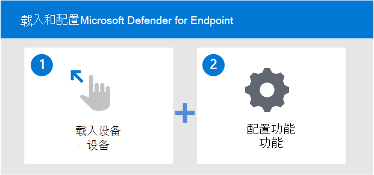

# 载入设备并配置 Microsoft Defender for Endpoint 功能

[!INCLUDE [Microsoft 365 Defender rebranding](../../includes/microsoft-defender.md)]

**适用于：**
- [Microsoft Defender for Endpoint 计划 2](https://go.microsoft.com/fwlink/p/?linkid=2154037)
- [Microsoft 365 Defender](https://go.microsoft.com/fwlink/?linkid=2118804)

[!include[Prerelease information](../../includes/prerelease.md)]

> 想要体验适用于终结点的 Defender？ [注册免费试用版](https://signup.microsoft.com/create-account/signup?products=7f379fee-c4f9-4278-b0a1-e4c8c2fcdf7e&ru=https://aka.ms/MDEp2OpenTrial?ocid=docs-wdatp-onboardconfigure-abovefoldlink)。

部署 Microsoft Defender for Endpoint 的过程分两步完成。

- 将设备载入服务
- 配置服务功能

## 将设备载入服务
你需要转到 Defender for Endpoint 门户的载入部分，以载入任何受支持的设备。 根据设备，将指导你执行相应步骤，并提供适当的适用于设备的管理和部署工具选项。 

通常，若要将设备载入服务：

- 验证设备是否满足 [最低要求](minimum-requirements.md)
- 根据设备，按照 Defender for Endpoint 门户的载入部分中提供的配置步骤操作
- 为设备使用适当的管理工具和部署方法
- 运行检测测试，验证设备是否正确载入并报告给服务

## 载入和配置工具选项
下表列出了基于需要载入的终结点的可用工具。

| 端点     | 工具选项                       |
|--------------|------------------------------------------|
| **Windows**  |  [本地脚本 (最多 10 台设备) ](configure-endpoints-script.md)    [组策略](configure-endpoints-gp.md)    [Microsoft Endpoint Manager/ 移动设备管理器](configure-endpoints-mdm.md)     [Microsoft Endpoint Configuration Manager](configure-endpoints-sccm.md)   [VDI 脚本](configure-endpoints-vdi.md)   [与 Microsoft Defender for Cloud 集成](configure-server-endpoints.md#integration-with-azure-defender)  |
| **macOS**    | [本地脚本](mac-install-manually.md)   [Microsoft Endpoint Manager](mac-install-with-intune.md)   [JAMF Pro](mac-install-with-jamf.md)   [移动设备管理](mac-install-with-other-mdm.md) |
| **Linux Server** | [本地脚本](linux-install-manually.md)   [百分百](linux-install-with-puppet.md)   [Ansible](linux-install-with-ansible.md)|
| **iOS**      | [Microsoft Endpoint Manager](ios-install.md)               |
| **Android**  | [Microsoft Endpoint Manager](android-intune.md)            | 

下表列出了基于需要载入的终结点的可用工具。

## 配置服务功能
载入设备可有效地启用 Micorosft Defender for Endpoint 的终结点检测和响应功能。

载入设备后，你将需要配置服务的其他功能。 下表列出了您可以配置的功能，以获得最佳环境保护。

| 功能 | 说明 |
|-|-|
| [Configure Threat & Vulnerability Management (TVM) ](tvm-prerequisites.md) | 威胁&漏洞管理是 Microsoft Defender for Endpoint 的一个组件，可为安全管理员和安全运营团队提供独特的价值，包括：    - 实时终结点检测和响应 (EDR) 与终结点漏洞相关的见解。    - 事件调查期间有价值的设备漏洞上下文。    - 通过 Microsoft Microsoft Intune 的内置修正System Center Configuration Manager。  |
| [配置 NGP (下一代) ](configure-microsoft-defender-antivirus-features.md) | Microsoft Defender 防病毒是内置反恶意软件解决方案，可为台式机、便携计算机和服务器提供下一代保护。 Microsoft Defender 防病毒包括以下功能：   -云提供的保护，用于即时检测和阻止新出现的威胁。 在机器学习和 Intelligent Security Graph 功能的基础上，Microsoft Defender 防病毒的下一代技术包括云提供的保护功能。    - 始终使用高级文件和进程行为监视以及其他启发式扫描 (也称为"实时保护") 。   - 基于机器学习、人工和自动大数据分析以及深度威胁防护研究进行专用保护更新。 |
| [配置攻击面减少 (ASR) ](overview-attack-surface-reduction.md) | Microsoft Defender for Endpoint 中的攻击面减少功能可帮助保护组织的设备和应用程序免受新的和新出现的威胁。 |
| [Configure Auto Investigation & Remediation (AIR) capabilities](configure-automated-investigations-remediation.md) | Microsoft Defender for Endpoint 使用自动调查显著减少需要单独调查的警报数量。 自动调查功能利用各种检查算法和分析人员 (例如) 手册）来检查警报并立即采取修正措施来解决违规问题。 这将极大地减少警报量，使安全操作专家能够专注于更复杂的威胁和其他高价值计划。 |
| [配置Microsoft 威胁专家 (MTE) 功能](configure-microsoft-threat-experts.md) | Microsoft 威胁专家 是一项托管搜寻服务，可为安全操作中心 (SOC) 提供专家级别的监视和分析，以帮助它们确保不会错过独特环境中的关键威胁。      |

## 支持的设备Windows功能

|操作系统  |Windows 10 & 11  |Windows Server 2012 R2 [[1](#fn1)]  |Windows Server 2016[[1](#fn1)]   |Windows Server 2019 & 2022|Windows Server 1803 及以上|
|---------|---------|---------|---------|---------|---------|
|**保护**    |         |         |         |         |         |
|攻击面减少规则     |    Y     |   Y      |    Y     |    Y     |    Y     |
|设备控制     |     Y    |    N     |    N     |    N     |    N     |  
|防火墙     |      Y   |    Y     |     Y    |    Y    |    Y   |
|网络保护     |      Y   |    Y     |     Y    |    Y    |    Y   |
|下一代保护     |      Y   |    Y     |     Y    |    Y    |    Y   |
|防篡改保护     |        Y   |    Y     |     Y    |    Y    |    Y   |
|Web 保护     |       Y   |    Y     |     Y    |    Y    |    Y   |
|||||||
|**检测**     |         |         |         |||
|高级搜寻     |      Y   |    Y     |     Y    |    Y    |    Y   |
|自定义文件指示器     |      Y   |    Y     |     Y    |    Y    |    Y   |
|自定义网络指示器     |      Y   |    Y     |     Y    |    Y    |    Y   |
|EDR被动&阻止     |      Y   |    Y     |     Y    |    Y    |    Y   |
|感知检测传感器     |      Y   |    Y     |     Y    |    Y    |    Y   |
|终结点&网络设备发现     |      Y   |    N     |     N    |    N    |    N   |
|||||||
|**响应**     |         |         |         |||
|AIR &自动 (调查)     |      Y   |    Y     |     Y    |    Y    |    Y   |
|设备响应功能：隔离、收集调查包、运行 AV 扫描     |      Y   |    Y     |     Y    |    Y    |    Y   |
|文件响应功能：收集文件、深度分析、阻止文件、停止和隔离过程     |      Y   |    Y     |     Y    |    Y    |    Y   |
|实时响应    |      Y   |    Y     |     Y    |    Y    |    Y   |

 (<a id="fn1">1</a>) 2016 年 1 月指适用于 Windows Server 2012 和 2016 的新式统一解决方案。 有关详细信息，请参阅[将 Windows 服务器载入到 Defender for Endpoint 服务](configure-server-endpoints.md)。

>[!NOTE]
>Windows 7、8.1、Windows Server 2008 R2 包括对 EDR 传感器和使用 SCEP System Center Endpoint Protection (AV 的支持) 。
