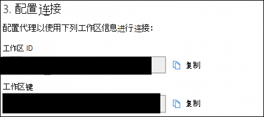
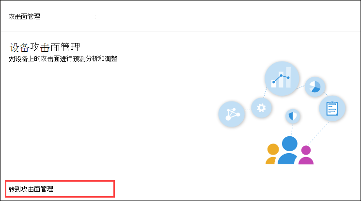

# 使用 Microsoft Endpoint Configuration Manager 载入Onboarding using Microsoft Endpoint Configuration Manager

[!INCLUDE [Microsoft 365 Defender rebranding](../../includes/microsoft-defender.md)]

**适用于：****Applies to:**
- [Microsoft Defender for EndpointMicrosoft Defender for Endpoint](https://go.microsoft.com/fwlink/p/?linkid=2154037)
- [Microsoft 365 DefenderMicrosoft 365 Defender](https://go.microsoft.com/fwlink/?linkid=2118804)

> 想要体验 Microsoft Defender for Endpoint？Want to experience Microsoft Defender for Endpoint? [注册免费试用版。Sign up for a free trial.](https://www.microsoft.com/microsoft-365/windows/microsoft-defender-atp?ocid=docs-wdatp-exposedapis-abovefoldlink)

本文是部署指南的一部分，并作为示例载入方法。This article is part of the Deployment guide and acts as an example onboarding method. 

在 [规划主题](deployment-strategy.md) 中，提供了多种方法将设备载入服务。In the [Planning](deployment-strategy.md) topic, there were several methods provided to onboard devices to the service. 本主题介绍共同管理体系结构。This topic covers the co-management architecture. 

 *环境体系结构关系图*
*Diagram of environment architectures*

尽管 Defender for Endpoint 支持载入各种终结点和工具，但本文并未涵盖它们。While Defender for Endpoint supports onboarding of various endpoints and tools, this article does not cover them. 有关使用其他受支持的部署工具和方法进行常规载入的信息，请参阅 [载入概述](onboarding.md)。For information on general onboarding using other supported deployment tools and methods, see [Onboarding overview](onboarding.md).

本主题指导用户：This topic guides users in:
- 步骤 1：Windows设备加入服务Step 1: Onboarding Windows devices to the service 
- 步骤 2：为终结点功能配置 DefenderStep 2: Configuring Defender for Endpoint capabilities

本载入指南将指导你完成在使用应用时需要执行Microsoft Endpoint Configuration Manager：This onboarding guidance will walk you through the following basic steps that you need to take when using Microsoft Endpoint Configuration Manager:
- **在 Microsoft Endpoint Configuration Manager****Creating a collection in Microsoft Endpoint Configuration Manager**
- **使用 Microsoft Endpoint Configuration Manager 为终结点配置 Microsoft Defender Microsoft Endpoint Configuration Manager****Configuring Microsoft Defender for Endpoint capabilities using Microsoft Endpoint Configuration Manager**

>[!NOTE]
>此示例Windows仅涵盖所有设备。Only Windows devices are covered in this example deployment. 

## 步骤 1：Windows设备载入Microsoft Endpoint Configuration ManagerStep 1: Onboard Windows devices using Microsoft Endpoint Configuration Manager

### 集合创建Collection creation
若要Windows 10设备载入Microsoft Endpoint Configuration Manager，部署可以面向现有集合，也可以创建一个新集合进行测试。To onboard Windows 10 devices with Microsoft Endpoint Configuration Manager, the deployment can target an existing collection or a new collection can be created for testing. 

使用组策略或手动方法等工具载入不会在系统上安装任何代理。Onboarding using tools such as Group policy or manual method does not install any agent on the system. 

在Microsoft Endpoint Configuration Manager控制台中，载入过程将配置为控制台内的合规性设置的一部分。Within the Microsoft Endpoint Configuration Manager console the onboarding process will be configured as part of the compliance settings within the console.

只要 Configuration Manager 客户端继续从管理点接收此策略，接收此必需配置的任何系统都将保持该配置。Any system that receives this required configuration will maintain that configuration for as long as the Configuration Manager client continues to receive this policy from the management point. 

按照以下步骤使用 Microsoft Endpoint Configuration Manager。Follow the steps below to onboard endpoints using Microsoft Endpoint Configuration Manager.

1. In Microsoft Endpoint Configuration Manager console， navigate to **Assets and Compliance Overview Device \> \> Collections**.In Microsoft Endpoint Configuration Manager console, navigate to **Assets and Compliance \> Overview \> Device Collections**.            

    

2. 右键单击 **设备集合** ，然后选择 **创建设备集合**。Right Click **Device Collection** and select **Create Device Collection**.

    

3. 提供名称和 **限制集合，** 然后选择下一 **步**。Provide a **Name** and **Limiting Collection**, then select **Next**.

    

4. 选择 **"添加规则**"，然后选择"**查询规则"。**Select **Add Rule** and choose **Query Rule**.

    

5.  在 **"直接** 成员身份向导"上单击"下一步 **"，** 然后单击"**编辑查询语句"。**Click **Next** on the **Direct Membership Wizard** and click on **Edit Query Statement**.

     

6. 选择 **条件** ，然后选择星形图标。Select **Criteria** and then choose the star icon.

     

7. 将条件类型保留为 **简单值**，选择"操作系统 **-** 内部版本号"，运算符为大于或等于值 **14393，** 然后单击"确定 **"。** Keep criterion type as **simple value**, choose where as **Operating System - build number**, operator as **is greater than or equal to** and value **14393** and click on **OK**.

    

8. 选择 **"下一步**"和"**关闭"。**Select **Next** and **Close**.

    

9. 选择“下一步”。Select **Next**.

    

完成此任务后，你现在拥有一个设备集合，Windows 10环境中的所有终结点。After completing this task, you now have a device collection with all the Windows 10 endpoints in the environment. 

## 步骤 2：为终结点功能配置 Microsoft DefenderStep 2: Configure Microsoft Defender for Endpoint capabilities 
本部分指导你在设备上使用 Microsoft Endpoint Configuration Manager 配置Windows功能：This section guides you in configuring the following capabilities using Microsoft Endpoint Configuration Manager on Windows devices:

- [**终结点检测和响应****Endpoint detection and response**](#endpoint-detection-and-response)
- [**下一代保护****Next-generation protection**](#next-generation-protection)
- [**减少攻击面****Attack surface reduction**](#attack-surface-reduction)

### 终结点检测和响应Endpoint detection and response
#### Windows 10Windows 10
从 Microsoft Defender 安全中心可以下载可用于在 System Center Configuration Manager 中创建策略的".onboarding"策略，Windows 10部署该策略。From within the Microsoft Defender Security Center it is possible to download the '.onboarding' policy that can be used to create the policy in System Center Configuration Manager and deploy that policy to Windows 10 devices.

1. 从"Microsoft Defender 安全中心门户"中，[选择"设置"，然后选择"载入"。](https://securitycenter.windows.com/preferences2/onboarding)From a Microsoft Defender Security Center Portal, select [Settings and then Onboarding](https://securitycenter.windows.com/preferences2/onboarding).

2. 在"部署方法"下，选择支持的版本 **Microsoft Endpoint Configuration Manager。**Under Deployment method select the supported version of **Microsoft Endpoint Configuration Manager**.

    

3. 选择 **下载程序包**。Select **Download package**.

    

4. 将程序包保存到可访问的位置。Save the package to an accessible location.
5. In Microsoft Endpoint Configuration Manager， navigate to： **Assets and Compliance > Overview > Endpoint Protection > Microsoft Defender ATP Policies**.In  Microsoft Endpoint Configuration Manager, navigate to: **Assets and Compliance > Overview > Endpoint Protection > Microsoft Defender ATP Policies**.

6. 右键单击 **"Microsoft Defender ATP策略"，** 然后选择"**创建Microsoft Defender ATP策略"。**Right-click **Microsoft Defender ATP Policies** and select **Create Microsoft Defender ATP Policy**.

    

7. 输入名称和说明，确认 **已选择载入** ，然后选择下一 **步**。Enter the name and description, verify **Onboarding** is selected, then select **Next**.

    

8. 单击"浏览"。Click **Browse**.

9. 从上面的步骤 4 导航到已下载文件的位置。Navigate to the location of the downloaded file from step 4 above.

10. 单击“**下一步**”。Click **Next**.
11. 使用"无"或"所有文件类型 (**相应的示例配置代理) 。** Configure the Agent with the appropriate samples (**None** or **All file types**).

    

12. Select the appropriate telemetry (**Normal** or **Expedited**) then click **Next**.Select the appropriate telemetry (**Normal** or **Expedited**) then click **Next**.

    

14. 验证配置，然后单击下一 **步**。Verify the configuration, then click **Next**.

     

15. 向导 **完成后** ，单击"关闭"。Click **Close** when the Wizard completes.

16.  在 Microsoft Endpoint Configuration Manager 控制台中，右键单击刚创建的 Defender for Endpoint 策略，**然后选择部署**。In the Microsoft Endpoint Configuration Manager console, right-click the Defender for Endpoint policy you just created and select **Deploy**.

     

17. 在右侧面板上，选择之前创建的集合，**然后单击确定。**On the right panel, select the previously created collection and click **OK**.

    

#### 早期版本的 Windows Client (Windows 7 和 Windows 8.1) Previous versions of Windows Client (Windows 7 and Windows 8.1)
按照以下步骤标识 Defender for Endpoint Workspace ID 和工作区密钥，这是载入早期版本的 Windows。Follow the steps below to identify the Defender for Endpoint Workspace ID and Workspace Key, that will be required for the onboarding of previous versions of Windows.

1. 从"Microsoft Defender 安全中心门户"中 **，设置 >"载入"。**From a Microsoft Defender Security Center Portal, select **Settings > Onboarding**.

2. 在操作系统下 **，Windows 7 SP1 和 8.1。**Under operating system choose **Windows 7 SP1 and 8.1**.

3. 复制 **工作区 ID 和\*\*\*\*工作区密钥并** 保存它们。Copy the **Workspace ID** and **Workspace Key** and save them. 稍后将在过程中使用。They will be used later in the process.

    

4. 安装Microsoft Monitoring Agent (MMA) 。Install the Microsoft Monitoring Agent (MMA).  
    MMA 当前 (2019 年 1) 以下操作系统Windows支持：MMA is currently (as of January 2019) supported on the following Windows Operating Systems:

    -   服务器 SKUS：Windows Server 2008 SP1 或更高版本Server SKUs: Windows Server 2008 SP1 or Newer

    -   客户端 SKUS：Windows 7 SP1 及更高版本Client SKUs: Windows 7 SP1 and later

    MMA 代理将需要安装在Windows设备上。The MMA agent will need to be installed on Windows devices. 若要安装代理，某些系统将需要下载客户体验更新和诊断遥测，以便使用 MMA 收集数据。To install the agent, some systems will need to download the [Update for customer experience and diagnostic telemetry](https://support.microsoft.com/help/3080149/update-for-customer-experience-and-diagnostic-telemetry) in order to collect the data with MMA. 这些系统版本包括但不限于：These system versions include but may not be limited to:

    -   Windows 8.1Windows 8.1

    -   Windows 7Windows 7

    -   Windows Server 2016Windows Server 2016

    -   Windows Server 2012 R2Windows Server 2012 R2

    -   Windows Server 2008 R2Windows Server 2008 R2

    具体而言，Windows 7 SP1，必须安装以下修补程序：Specifically, for Windows 7 SP1, the following patches must be installed:

    -   安装 [KB4074598](https://support.microsoft.com/help/4074598/windows-7-update-kb4074598)Install [KB4074598](https://support.microsoft.com/help/4074598/windows-7-update-kb4074598)

    -   安装 .NET Framework [4.5](https://www.microsoft.com/download/details.aspx?id=30653) (或更高版本)  
         [KB3154518。](https://support.microsoft.com/help/3154518/support-for-tls-system-default-versions-included-in-the-net-framework)Install either [.NET Framework 4.5](https://www.microsoft.com/download/details.aspx?id=30653) (or later) **or**
        [KB3154518](https://support.microsoft.com/help/3154518/support-for-tls-system-default-versions-included-in-the-net-framework).
        不要在同一个系统中同时安装这两者。Do not install both on the same system.

5. 如果使用代理连接到 Internet，请参阅配置代理设置部分。If you're using a proxy to connect to the Internet see the Configure proxy settings section.

完成后，你应该在一小时内在门户中看到已载入的终结点。Once completed, you should see onboarded endpoints in the portal within an hour.

### 下一代保护Next generation protection 
Microsoft Defender 防病毒是内置反恶意软件解决方案，为台式机、便携式计算机和服务器提供安全提供下一代防护。Microsoft Defender Antivirus is a built-in antimalware solution that provides next generation protection for desktops, portable computers, and servers.

1. 在Microsoft Endpoint Configuration Manager控制台中，导航到"资产和合规性概述 **\> \> Endpoint Protection \> 反恶意软件策略"，** 然后选择"**创建反恶意软件策略"。**In the Microsoft Endpoint Configuration Manager console, navigate to **Assets and Compliance \> Overview \> Endpoint Protection \> Antimalware Polices** and choose **Create Antimalware Policy**.

    

2. 选择 **计划扫描**、**扫描** 设置、**默认** 操作、**实时保护**、**排除** 设置、**高级**、威胁覆盖、**云保护** 服务 **和安全智能更新**，**然后选择确定。**Select **Scheduled scans**, **Scan settings**, **Default actions**, **Real-time protection**, **Exclusion settings**, **Advanced**, **Threat overrides**, **Cloud Protection Service** and **Security intelligence   updates** and choose **OK**.

    

    在某些行业或某些选择的企业中，客户可能对如何配置防病毒有特定需求。In certain industries or some select enterprise customers might have specific needs on how Antivirus is configured.

  
    [快速扫描与完全扫描和自定义扫描Quick scan versus full scan and custom scan](/windows/security/threat-protection/microsoft-defender-antivirus/scheduled-catch-up-scans-microsoft-defender-antivirus#quick-scan-versus-full-scan-and-custom-scan)

    有关详细信息，请参阅配置[Windows 安全中心框架](/windows/security/threat-protection/windows-security-configuration-framework/windows-security-configuration-framework)For more details, see [Windows Security configuration framework](/windows/security/threat-protection/windows-security-configuration-framework/windows-security-configuration-framework)
  
    

    

    

    

    

    

    

    

3. 右键单击新创建的反恶意软件策略， **然后选择部署**。Right-click on the newly created antimalware policy and select **Deploy**.

    

4. 将新的反恶意软件策略定向到 Windows 10 集合，然后单击"确定 **"。**Target the new antimalware policy to your Windows 10 collection and click **OK**.

     

完成此任务后，现在已成功配置Windows Defender 防病毒。After completing this task, you now have successfully configured Windows Defender Antivirus.

### 攻击面减少Attack surface reduction
适用于终结点的 Defender 的攻击面减少支柱包括攻击防护下提供的功能集。The attack surface reduction pillar of Defender for Endpoint includes the feature set that is available under Exploit Guard. 攻击面减少 (ASR) 规则、受控文件夹访问权限、网络保护和 Exploit Protection。Attack surface reduction (ASR) rules, Controlled Folder Access, Network Protection and Exploit Protection. 

所有这些功能都提供审核模式和阻止模式。All these features provide an audit mode and a block mode. 在审核模式下，对最终用户没有影响。In audit mode there is no end-user impact. 它所执行的所有工作就是收集其他遥测，并使其在Microsoft Defender 安全中心。All it does is collect additional telemetry and make it available in the Microsoft Defender Security Center. 部署的目标是将安全控件分步移动到阻止模式。The goal with a deployment is to step-by-step move security controls into block mode.

在审核模式下设置 ASR 规则：To set ASR rules in Audit mode:

1. In the Microsoft Endpoint Configuration Manager console， navigate to **Assets and Compliance Overview Endpoint Protection Windows Defender Exploit \> \> \> Guard** and choose **Create Exploit Guard Policy**.In the Microsoft Endpoint Configuration Manager console, navigate to **Assets and Compliance \> Overview \> Endpoint Protection \> Windows Defender Exploit Guard** and choose **Create Exploit Guard Policy**.

   

2.  选择 **攻击面减少**。Select **Attack Surface Reduction**.
   

3. 将规则设置为 **审核，** 然后单击下一 **步**。Set rules to **Audit** and click **Next**.

    

4. 通过单击下一步确认新的攻击 **防护策略**。Confirm the new Exploit Guard policy by clicking on **Next**.

    

    
5. 创建策略后，单击"关闭 **"。**Once the policy is created click **Close**.

    

    
   

6.  右键单击新创建的策略， **然后选择部署**。Right-click on the newly created policy and choose **Deploy**.
    
    

7. 将策略定向到新创建的 Windows 10 集合，然后单击"确定 **"。**Target the policy to the newly created Windows 10 collection and click **OK**.

    

完成此任务后，现在可以在审核模式下成功配置 ASR 规则。After completing this task, you now have successfully configured ASR rules in audit mode.  
  
下面是验证 ASR 规则是否已正确应用到终结点的其他步骤。Below are additional steps to verify whether ASR rules are correctly applied to endpoints.  (这可能需要几分钟) (This may take few minutes)

1. 在 Web 浏览器中，导航到 <https://securitycenter.windows.com> 。From a web browser, navigate to <https://securitycenter.windows.com>.

2.  从 **左侧菜单中选择** 配置管理。Select **Configuration management** from left side menu.

3. 单击 **攻击面管理面板中的** 转到攻击面管理。Click **Go to attack surface management** in the Attack surface management panel. 
    
    

4. 单击 **攻击面** 减少规则报告中的"配置"选项卡。Click **Configuration** tab in Attack surface reduction rules reports. 它显示每台设备的 ASR 规则配置概述和 ASR 规则状态。It shows ASR rules configuration overview and ASR rules status on each devices.

    

5. 单击每台设备可显示 ASR 规则的配置详细信息。Click each device shows configuration details of ASR rules.

    

有关 [更多详细信息，请参阅优化 ASR 规则](/microsoft-365/security/defender-endpoint/configure-machines-asr)   部署和检测。See [Optimize ASR rule deployment and detections](/microsoft-365/security/defender-endpoint/configure-machines-asr)   for more details.  

#### 在审核模式下设置网络保护规则：Set Network Protection rules in Audit mode:
1. In the Microsoft Endpoint Configuration Manager console， navigate to **Assets and Compliance Overview Endpoint Protection Windows Defender Exploit \> \> \> Guard** and choose **Create Exploit Guard Policy**.In the Microsoft Endpoint Configuration Manager console, navigate to **Assets and  Compliance \> Overview \> Endpoint Protection \> Windows Defender Exploit Guard** and choose **Create Exploit Guard Policy**.

    

2. 选择 **"网络保护"。**Select **Network protection**.

3. 将设置设置为审核 **，** 然后单击下一 **步**。Set the setting to **Audit** and click **Next**. 

    

4. 通过单击下一步确认新的攻击防护 **策略**。Confirm the new Exploit Guard Policy by clicking **Next**.
    
    

5. 创建策略后，单击"关闭 **"。**Once the policy is created click on **Close**.

    

6. 右键单击新创建的策略， **然后选择部署**。Right-click on the newly created policy and choose **Deploy**.

    

7. 选择新创建的组策略Windows 10选择"确定 **"。**Select the policy to the newly created Windows 10 collection and choose **OK**.

    

完成此任务后，现在可以在审核模式下成功配置网络保护。After completing this task, you now have successfully configured Network Protection in audit mode.

#### 在审核模式下设置受控文件夹访问权限规则：To set Controlled Folder Access rules in Audit mode:

1. In the Microsoft Endpoint Configuration Manager console， navigate to **Assets and Compliance Overview Endpoint Protection Windows Defender Exploit \> \> \> Guard** and choose **Create Exploit Guard Policy**.In the Microsoft Endpoint Configuration Manager console, navigate to **Assets and Compliance \> Overview \> Endpoint Protection \> Windows Defender Exploit Guard** and choose **Create Exploit Guard Policy**.

    

2. 选择 **受控文件夹访问权限**。Select **Controlled folder access**.
    
3. 将配置设置为审核 **，** 然后单击下一 **步**。Set the configuration to **Audit** and click **Next**.

        
    
4. 通过单击下一步确认新的攻击防护 **策略**。Confirm the new Exploit Guard Policy by clicking on **Next**.

    

5. 创建策略后，单击"关闭 **"。**Once the policy is created click on **Close**.

    

6. 右键单击新创建的策略， **然后选择部署**。Right-click on the newly created policy and choose **Deploy**.

    

7.  将策略定向到新创建的 Windows 10 集合，然后单击"确定 **"。**Target the policy to the newly created Windows 10 collection and click **OK**.

    

现在，你已成功在审核模式下配置受控文件夹访问权限。You have now successfully configured Controlled folder access in audit mode.

## 相关主题Related topic
- [使用 Microsoft Endpoint Manager 载入Onboarding using Microsoft Endpoint Manager](onboarding-endpoint-manager.md)
