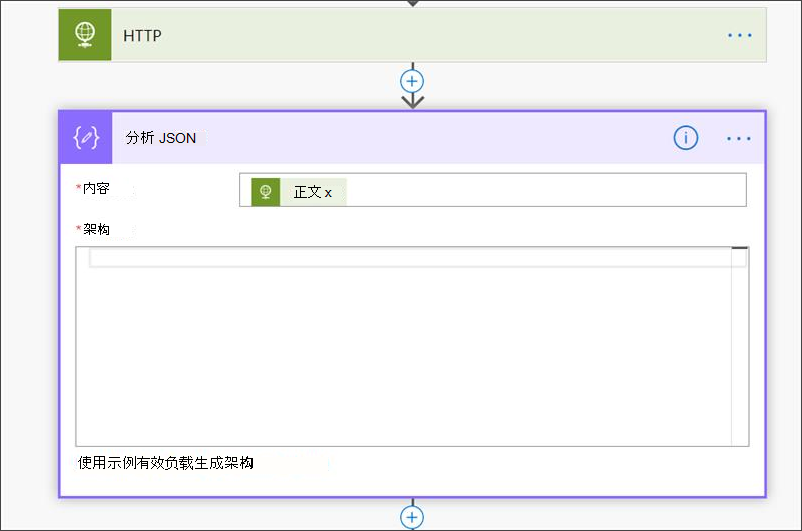

# <a name="create-a-notification-rule-when-a-local-onboarding-or-offboarding-script-is-used"></a>使用本地载入或载出脚本时创建通知规则

[!INCLUDE [Microsoft 365 Defender rebranding](../../includes/microsoft-defender.md)]


**适用于：**
- [Microsoft Defender for Endpoint](https://go.microsoft.com/fwlink/p/?linkid=2154037)
- [Microsoft 365 Defender](https://go.microsoft.com/fwlink/?linkid=2118804)

> 希望体验 Microsoft Defender for Endpoint？ [注册免费试用版](https://signup.microsoft.com/create-account/signup?products=7f379fee-c4f9-4278-b0a1-e4c8c2fcdf7e&ru=https://aka.ms/MDEp2OpenTrial?ocid=docs-wdatp-exposedapis-abovefoldlink)。

[!include[Microsoft Defender for Endpoint API URIs for US Government](../../includes/microsoft-defender-api-usgov.md)]

[!include[Improve request performance](../../includes/improve-request-performance.md)]


创建通知规则，以便当使用本地载入或载出脚本时，将通知你。

## <a name="before-you-begin"></a>准备工作

你将需要具有访问权：

- Power Automate (每用户计划的最低) 。 有关详细信息，请参阅定价[Power Automate页面](https://flow.microsoft.com/pricing/)。
- Azure 表或SharePoint列表或库/SQL DB。

## <a name="create-the-notification-flow"></a>创建通知流

1. 在 [flow.microsoft.com](https://flow.microsoft.com/)中。

2. 导航到 **"我的流>新>计划 - 从空白。**

    

3. 构建计划流。
   1. 输入流名称。
   2. 指定开始时间和时间。
   3. 指定频率。 例如，每 5 分钟。

    

4. 选择" +"按钮以添加新操作。 新操作将是向 Defender for Endpoint 安全中心设备发送的 HTTP (API) API。 还可以将其替换为开箱即用"WDATP 连接器" (操作："计算机 - 获取计算机列表") 。

    

5. 输入以下 HTTP 字段：

   - 方法："GET"作为获取设备列表的值。
   - URI：输入 `https://api.securitycenter.microsoft.com/api/machines` 。
   - 身份验证：选择"Active Directory OAuth"。
   - 租户：登录并导航到Azure Active Directory > https://portal.azure.com **注册并** 获取租户 ID 值。
   - 访问群体： `https://securitycenter.onmicrosoft.com/windowsatpservice\`
   - 客户端 ID：登录并导航到Azure Active Directory > https://portal.azure.com **应用注册并** 获取客户端 ID 值。
   - 凭据类型：选择"机密"。
   - 密码：登录并导航到Azure Active Directory > https://portal.azure.com **注册并** 获取租户 ID 值。

    

6. 通过选择"添加新操作"，然后 **搜索"数据** 操作"并选择"**分析 JSON"添加新步骤**。 

    

7. 在"内容" **字段中添加** 正文。

    

8. 选择" **使用示例有效负载生成架构"** 链接。

    

9. 复制并粘贴以下 JSON 代码段：

    ```json
    {
        "type": "object",
        "properties": {
            "@@odata.context": {
                "type": "string"
            },
            "value": {
                "type": "array",
                "items": {
                    "type": "object",
                    "properties": {
                        "id": {
                            "type": "string"
                        },
                        "computerDnsName": {
                            "type": "string"
                        },
                        "firstSeen": {
                            "type": "string"
                        },
                        "lastSeen": {
                            "type": "string"
                        },
                        "osPlatform": {
                            "type": "string"
                        },
                        "osVersion": {},
                        "lastIpAddress": {
                            "type": "string"
                        },
                        "lastExternalIpAddress": {
                            "type": "string"
                        },
                        "agentVersion": {
                            "type": "string"
                        },
                        "osBuild": {
                            "type": "integer"
                        },
                        "healthStatus": {
                            "type": "string"
                        },
                        "riskScore": {
                            "type": "string"
                        },
                        "exposureScore": {
                            "type": "string"
                        },
                        "aadDeviceId": {},
                        "machineTags": {
                            "type": "array"
                        }
                    },
                    "required": [
                        "id",
                        "computerDnsName",
                        "firstSeen",
                        "lastSeen",
                        "osPlatform",
                        "osVersion",
                        "lastIpAddress",
                        "lastExternalIpAddress",
                        "agentVersion",
                        "osBuild",
                        "healthStatus",
                        "rbacGroupId",
                        "rbacGroupName",
                        "riskScore",
                        "exposureScore",
                        "aadDeviceId",
                        "machineTags"
                    ]
                }
            }
        }
    }

    ```

10. 从 JSON 调用中提取值，并检查已载入设备 (是否) /已在 SharePoint 列表注册为示例：

    - 如果是，则不触发任何通知
    - 如果否，将在" (") 注册新的已载入SharePoint，并且会向 Defender for Endpoint 管理员发送通知

    

    

11. 在 **"条件**"下，添加以下表达式："length (body ('Get_items') ？['value']) "，将条件设置为等于 0。

    
     
     
     

## <a name="alert-notification"></a>警报通知

下图是电子邮件通知的一个示例。


## <a name="tips"></a>提示

- 你可以在此处仅使用 lastSeen 进行筛选：
  - 每 60 分钟：
    - 使用过去 7 天内最后看到的所有设备。

- 对于每个设备：
  - 如果上次看到的属性的时间间隔为 [-7 天， -7days + 60 分钟 ] ->发生载出可能性的警报。
  - 如果第一次看到是过去一小时 ->载入警报。

在此解决方案中，你将没有重复的警报：存在具有大量设备的租户。 获取所有这些设备可能非常昂贵，并且可能需要分页。

您可以拆分为两个查询：

1. 对于载出，使用 OData $filter此间隔，并且仅在满足条件时通知。
2. 查看过去一小时内最后看到的所有设备，并检查第一次看到的属性 (如果第一次看到的属性是过去一小时，则最后一次看到的设备必须太) 。
