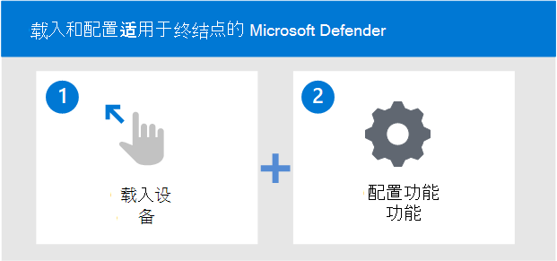

# 载入至 Microsoft Defender for Endpoint 服务

[!INCLUDE [Microsoft 365 Defender rebranding](../../includes/microsoft-defender.md)]

**适用于：**
- [Microsoft Defender for Endpoint](https://go.microsoft.com/fwlink/p/?linkid=2154037)
- [Microsoft 365 Defender](https://go.microsoft.com/fwlink/?linkid=2118804)

> 希望体验 Microsoft Defender for Endpoint？ [注册免费试用版](https://signup.microsoft.com/create-account/signup?products=7f379fee-c4f9-4278-b0a1-e4c8c2fcdf7e&ru=https://aka.ms/MDEp2OpenTrial?ocid=docs-wdatp-exposedapis-abovefoldlink)。

了解部署 Microsoft Defender for Endpoint 的各个阶段，以及如何在解决方案中配置功能。

部署适用于终结点的 Defender 需要执行以下步骤：

- 步骤 1：将终结点载入服务
- 步骤 2: 配置功能

## 步骤 1：使用任何受支持的管理工具载入终结点

规划 [部署](deployment-strategy.md) 主题概述了部署 Defender for Endpoint 所需的一般步骤。

观看此视频，快速概览载入过程并了解可用的工具和方法。

> [!VIDEO https://www.microsoft.com/videoplayer/embed/RE4bGqr]

确定体系结构后，需要决定使用哪种部署方法。 你选择的部署工具会影响将终结点载入到服务中。

### 载入工具选项

下表列出了基于需要载入的终结点的可用工具。

| 端点     | 工具选项                       |
|--------------|------------------------------------------|
| **Windows**  |  [本地脚本 (最多 10 台设备) ](configure-endpoints-script.md)    [组策略](configure-endpoints-gp.md)    [Microsoft Endpoint Manager/ 移动设备管理器](configure-endpoints-mdm.md)   [Microsoft Endpoint Configuration Manager](configure-endpoints-sccm.md)   [VDI 脚本](configure-endpoints-vdi.md)   [与 Microsoft Defender for Cloud 集成](azure-server-integration.md) |
| **macOS**    | [本地脚本](mac-install-manually.md)   [Microsoft Endpoint Manager](mac-install-with-intune.md)   [JAMF Pro](mac-install-with-jamf.md)   [移动设备管理](mac-install-with-other-mdm.md) |
| **Linux Server** | [本地脚本](linux-install-manually.md)   [百分百](linux-install-with-puppet.md)   [Ansible](linux-install-with-ansible.md)|
| **iOS**      | [Microsoft Endpoint Manager](ios-install.md)                                |
| **Android**  | [Microsoft Endpoint Manager](android-intune.md)               | 

## 步骤 2: 配置功能
载入终结点后，你将配置这些功能。 下表列出了可以配置的组件。 选择希望使用的组件并删除不适用的组件。

| 功能 | Description |
|-|-|
| [终结点检测&响应 (EDR) ](overview-endpoint-detection-response.md) | Defender for Endpoint endpoint detection and response capabilities provide advanced attack detections that are near real-time and actionable. 安全分析员可以有效地确定警报的优先级，了解整个泄露范围，并采取响应措施来修正威胁。 |
| [TVM &威胁 (漏洞管理) ](next-gen-threat-and-vuln-mgt.md) | 威胁 & 漏洞管理是 Microsoft Defender for Endpoint 的一个组件，可为安全管理员和安全运营团队提供独特的价值，包括：- 实时终结点检测和响应与终结点漏洞相关的 (EDR) 见解 - 事件调查期间最有价值的设备漏洞上下文 - 通过 Microsoft Intune 执行内置修正Microsoft Intune 和 Microsoft System Center Configuration Manager。  |
| [NGP (下一代) ](microsoft-defender-antivirus-windows.md) | Microsoft Defender 防病毒是内置反恶意软件解决方案，可为台式机、便携计算机和服务器提供下一代保护。 Microsoft Defender 防病毒包括以下功能：   -云提供的保护，用于即时检测和阻止新出现的威胁。 在机器学习和 Intelligent Security Graph 功能的基础上，Microsoft Defender 防病毒的下一代技术包括云提供的保护功能。    - 始终使用高级文件和进程行为监视以及其他启发式扫描 (也称为"实时保护") 。   - 基于机器学习、人工和自动大数据分析以及深度威胁防护研究进行专用保护更新。 |
| [攻击面减少 (ASR) ](overview-attack-surface-reduction.md) | Microsoft Defender for Endpoint 中的攻击面减少功能可帮助保护组织的设备和应用程序免受新的和新出现的威胁。 |
| [AIR &自动 (修正) ](automated-investigations.md) | Microsoft Defender for Endpoint 使用自动调查显著减少需要单独调查的警报数量。 自动调查功能利用各种检查算法和分析人员 (例如) 手册）来检查警报并立即采取修正措施来解决违规问题。 这将极大地减少警报量，使安全操作专家能够专注于更复杂的威胁和其他高价值计划。 |
| [Microsoft 威胁专家 (MTE) ](microsoft-threat-experts.md) | Microsoft 威胁专家是一项托管搜寻服务，可为安全操作中心 (SOC) 提供专家级别的监视和分析，以帮助他们确保不会错过独特环境中的关键威胁。      |

载入终结点后，你将配置各种功能，如终结点检测和响应、下一代保护和攻击面减少。

## 部署示例

在此部署指南中，我们将指导你使用两个部署工具载入终结点以及如何配置功能。

示例部署中的工具包括：

- [使用 Microsoft Endpoint Configuration Manager 载入](onboarding-endpoint-configuration-manager.md)
- [使用 Microsoft Endpoint Manager 载入](onboarding-endpoint-manager.md)

然后，使用上面提到的部署工具，指导你配置以下 Defender for Endpoint 功能：

- 终结点检测和响应配置
- 下一代保护配置
- 攻击面减少配置

## 相关主题

- [使用 Microsoft Endpoint Configuration Manager 载入](onboarding-endpoint-configuration-manager.md)
- [使用 Microsoft Endpoint Manager 载入](onboarding-endpoint-manager.md)
- [Microsoft 365 E5 中的安全文档](../office-365-security/safe-docs.md)
