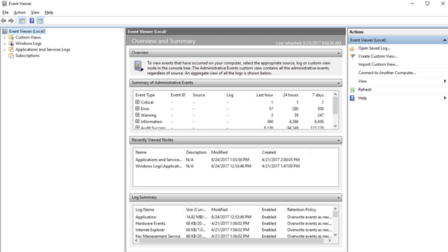

# <a name="understand-and-use-attack-surface-reduction-capabilities"></a>了解并使用攻击面减少功能

[!INCLUDE [Microsoft 365 Defender rebranding](../../includes/microsoft-defender.md)]

**适用于：**

- [Microsoft Defender for Endpoint 计划 1](https://go.microsoft.com/fwlink/p/?linkid=2154037)
- [Microsoft Defender for Endpoint 计划 2](https://go.microsoft.com/fwlink/p/?linkid=2154037)
- [Microsoft 365 Defender](https://go.microsoft.com/fwlink/?linkid=2118804)

> [!TIP]
> 希望体验 Microsoft Defender for Endpoint？ [注册免费试用版](https://signup.microsoft.com/create-account/signup?products=7f379fee-c4f9-4278-b0a1-e4c8c2fcdf7e&ru=https://aka.ms/MDEp2OpenTrial?ocid=docs-wdatp-exposedapis-abovefoldlink)。

攻击面是组织易受网络威胁和攻击的所有位置。 Defender for Endpoint 包括多项功能，可帮助减少攻击面。 观看以下视频，详细了解攻击面减少。

> [!VIDEO https://www.microsoft.com/videoplayer/embed/RE4woug]

## <a name="configure-attack-surface-reduction-capabilities"></a>配置攻击面减少功能

若要在你的环境中配置攻击面减少，请按照以下步骤操作：

1. [为用户启用基于硬件的Microsoft Edge](/windows/security/threat-protection/microsoft-defender-application-guard/install-md-app-guard)。

2. 启用应用程序控制。

   1. 查看 Windows 中的基本策略。 请参阅 [示例基本策略](/windows/security/threat-protection/windows-defender-application-control/example-wdac-base-policies)。
   2. 请参阅Windows Defender[控件设计指南](/windows/security/threat-protection/windows-defender-application-control/windows-defender-application-control-design-guide)。
   3. 请参阅使用 [WDAC Windows Defender部署 (应用程序) 策略](/windows/security/threat-protection/windows-defender-application-control/windows-defender-application-control-deployment-guide)。

3. [启用受控文件夹访问权限](enable-controlled-folders.md)。

4. [打开网络保护](enable-network-protection.md)。

5. [启用 Exploit Protection](enable-exploit-protection.md)。

6. [部署攻击面减少规则](attack-surface-reduction-rules-deployment.md)。

7. 设置网络防火墙。

   1. 获取高级安全[Windows Defender防火墙概述](/windows/security/threat-protection/windows-firewall/windows-firewall-with-advanced-security)。
   2. 使用[Windows Defender防火墙](/windows/security/threat-protection/windows-firewall/windows-firewall-with-advanced-security-design-guide)设计指南决定您希望如何设计防火墙策略。
   3. 使用 [Windows Defender 防火墙](/windows/security/threat-protection/windows-firewall/windows-firewall-with-advanced-security-deployment-guide)部署指南设置组织的高级安全防火墙。

> [!TIP]
> 在大多数情况下，配置攻击面减少功能时，可以从以下几种方法中选择：
>
> - Microsoft Endpoint Manager (现在包括Microsoft Intune和Microsoft Endpoint Configuration Manager) 
> - 组策略
> - PowerShell cmdlet

## <a name="test-attack-surface-reduction-in-microsoft-defender-for-endpoint"></a>在 Microsoft Defender for Endpoint 中测试攻击面减少

作为组织安全团队的一部分，你可以配置攻击面减少功能以在审核模式下运行，以查看这些功能如何工作。 在审核模式下，可以启用：

- 攻击面减少规则
- 漏洞保护
- 网络保护
- 在审核模式下受控文件夹访问权限

通过审核模式，你可以查看启用该功能后将发生的情况记录。

可以在测试这些功能的运行方式时启用审核模式。 仅启用用于测试的审核模式有助于防止审核模式影响业务线应用。 还可以了解在一定时段内发生的可疑文件修改尝试次数。

这些功能不会阻止或阻止应用、脚本或文件被修改。 但是，Windows事件日志将记录事件，就像功能完全启用一样。 使用审核模式，你可以查看事件日志，以查看如果启用该功能，将有什么影响。

若要查找审核的条目，  \>请转到"Microsoft 应用程序和服务 **"** \> Windows **Windows Defender** \> \> **操作"**。

使用 Defender for Endpoint 获取每个事件的更多详细信息。 这些详细信息对于调查攻击面减少规则尤其有用。 使用 Defender for Endpoint 控制台，你可以调查作为警报时间线和调查方案的 [一部分的问题](investigate-alerts.md)。

可以使用组策略、PowerShell 和配置服务提供程序和 CSP (启用审核) 。

> [!TIP]
> 您还可以访问 Testground Windows Defender[网站，demo.wd.microsoft.com](https://demo.wd.microsoft.com?ocid=cx-wddocs-testground) 确认这些功能是否正常工作并查看它们如何工作。

> [!NOTE]
> 位于 Demo.wd.microsoft.com 的 Defender for Endpoint 演示网站已弃用，并且将在未来删除。

| 审核选项 | 如何启用审核模式 | 如何查看事件 |
|---|---|---|
| 审核适用于所有事件 | [启用受控文件夹访问](enable-controlled-folders.md) | [受控文件夹访问事件](evaluate-controlled-folder-access.md#review-controlled-folder-access-events-in-windows-event-viewer) |
| 审核适用于单个规则 | [步骤 1：使用审核测试 ASR 规则](attack-surface-reduction-rules-deployment-test.md#step-1-test-asr-rules-using-audit) | [步骤 2：了解攻击面减少规则报告页](attack-surface-reduction-rules-deployment-test.md#step-2-understand-the-attack-surface-reduction-rules-reporting-page-in-the-microsoft-365-defender-portal) |
| 审核适用于所有事件 | [启用网络保护](enable-network-protection.md) | [网络保护事件](evaluate-network-protection.md#review-network-protection-events-in-windows-event-viewer) |
| 审核适用于单个缓解 | [启用漏洞保护](enable-exploit-protection.md) | [Exploit Protection 事件](exploit-protection.md#review-exploit-protection-events-in-windows-event-viewer) |

## <a name="view-attack-surface-reduction-events"></a>查看攻击面减少活动

查看事件查看器中的攻击面减少事件，以监视哪些规则或设置正在工作。 您还可以确定任何设置是否过于"干扰"或影响您的日常工作流。

评估功能时，查看事件很方便。 您可以为功能或设置启用审核模式，然后查看在完全启用这些功能或设置后将发生的情况。

本节列出了所有事件及其关联的功能或设置，并介绍如何创建自定义视图以筛选到特定事件。

获取事件、阻止和警告的详细报告，Windows 安全中心 E5 订阅并使用 [Microsoft Defender for Endpoint](microsoft-defender-endpoint.md)。

### <a name="use-custom-views-to-review-attack-surface-reduction-capabilities"></a>使用自定义视图查看攻击面减少功能

在事件查看器中Windows视图，以仅查看特定功能和设置的事件。 最简单的方法是将自定义视图导入为 XML 文件。 您可以直接从此页面复制 XML。

还可以手动导航到与功能对应的事件区域。

#### <a name="import-an-existing-xml-custom-view"></a>导入现有 XML 自定义视图

1. 创建一个.txt文件，将想要使用的自定义视图的 XML 复制到.txt文件中。 为想要使用的每个自定义视图执行这一操作。 按如下所示重命名文件 (请确保将类型从 .txt 更改为 .xml) ：
    - 受控文件夹访问事件自定义视图： *cfa-events.xml*
    - Exploit Protection 事件自定义视图： *ep-events.xml*
    - 攻击面减少事件自定义视图： *asr-events.xml*
    - 网络/保护事件自定义视图： *np-events.xml*

2. 在 **事件查看器** 中键入"开始"菜单并打开 **事件查看器**。

3. 选择 **操作** \> **导入自定义视图...**

   > [!div class="mx-imgBorder"]
   > 

4. 导航到您为您想要的自定义视图提取 XML 文件的位置并选择它。

5. 选择 **“打开”**。

6. 它将创建一个自定义视图，该视图筛选为只显示与该功能相关的事件。

#### <a name="copy-the-xml-directly"></a>直接复制 XML

1. 在 **事件查看器** 中键入"开始"菜单，然后打开Windows **事件查看器**。

2. 在左侧面板的"操作 **"下**，选择 **"创建自定义视图..."。**

   > [!div class="mx-imgBorder"]
   > 

3. 转到"XML"选项卡，然后选择" **手动编辑查询"**。 如果使用的是 XML 选项，则会看到一条警告，提示你无法使用"筛选器"选项卡编辑查询。 选择“**是**”。

4. 将您希望从中筛选事件的功能的 XML 代码粘贴到 XML 部分。

5. 选择“**确定**”。 为筛选器指定名称。 这将创建一个自定义视图，该视图筛选为只显示与该功能相关的事件。

#### <a name="xml-for-attack-surface-reduction-rule-events"></a>攻击面减少规则事件的 XML

```xml
<QueryList>
  <Query Id="0" Path="Microsoft-Windows-Windows Defender/Operational">
   <Select Path="Microsoft-Windows-Windows Defender/Operational">*[System[(EventID=1121 or EventID=1122 or EventID=5007)]]</Select>
   <Select Path="Microsoft-Windows-Windows Defender/WHC">*[System[(EventID=1121 or EventID=1122 or EventID=5007)]]</Select>
  </Query>
</QueryList>
```

#### <a name="xml-for-controlled-folder-access-events"></a>受控文件夹访问事件的 XML

```xml
<QueryList>
  <Query Id="0" Path="Microsoft-Windows-Windows Defender/Operational">
   <Select Path="Microsoft-Windows-Windows Defender/Operational">*[System[(EventID=1123 or EventID=1124 or EventID=5007)]]</Select>
   <Select Path="Microsoft-Windows-Windows Defender/WHC">*[System[(EventID=1123 or EventID=1124 or EventID=5007)]]</Select>
  </Query>
</QueryList>
```

#### <a name="xml-for-exploit-protection-events"></a>Exploit Protection 事件的 XML

```xml
<QueryList>
  <Query Id="0" Path="Microsoft-Windows-Security-Mitigations/KernelMode">
   <Select Path="Microsoft-Windows-Security-Mitigations/KernelMode">*[System[Provider[@Name='Microsoft-Windows-Security-Mitigations' or @Name='Microsoft-Windows-WER-Diag' or @Name='Microsoft-Windows-Win32k' or @Name='Win32k'] and ( (EventID &gt;= 1 and EventID &lt;= 24)  or EventID=5 or EventID=260)]]</Select>
   <Select Path="Microsoft-Windows-Win32k/Concurrency">*[System[Provider[@Name='Microsoft-Windows-Security-Mitigations' or @Name='Microsoft-Windows-WER-Diag' or @Name='Microsoft-Windows-Win32k' or @Name='Win32k'] and ( (EventID &gt;= 1 and EventID &lt;= 24)  or EventID=5 or EventID=260)]]</Select>
   <Select Path="Microsoft-Windows-Win32k/Contention">*[System[Provider[@Name='Microsoft-Windows-Security-Mitigations' or @Name='Microsoft-Windows-WER-Diag' or @Name='Microsoft-Windows-Win32k' or @Name='Win32k'] and ( (EventID &gt;= 1 and EventID &lt;= 24)  or EventID=5 or EventID=260)]]</Select>
   <Select Path="Microsoft-Windows-Win32k/Messages">*[System[Provider[@Name='Microsoft-Windows-Security-Mitigations' or @Name='Microsoft-Windows-WER-Diag' or @Name='Microsoft-Windows-Win32k' or @Name='Win32k'] and ( (EventID &gt;= 1 and EventID &lt;= 24)  or EventID=5 or EventID=260)]]</Select>
   <Select Path="Microsoft-Windows-Win32k/Operational">*[System[Provider[@Name='Microsoft-Windows-Security-Mitigations' or @Name='Microsoft-Windows-WER-Diag' or @Name='Microsoft-Windows-Win32k' or @Name='Win32k'] and ( (EventID &gt;= 1 and EventID &lt;= 24)  or EventID=5 or EventID=260)]]</Select>
   <Select Path="Microsoft-Windows-Win32k/Power">*[System[Provider[@Name='Microsoft-Windows-Security-Mitigations' or @Name='Microsoft-Windows-WER-Diag' or @Name='Microsoft-Windows-Win32k' or @Name='Win32k'] and ( (EventID &gt;= 1 and EventID &lt;= 24)  or EventID=5 or EventID=260)]]</Select>
   <Select Path="Microsoft-Windows-Win32k/Render">*[System[Provider[@Name='Microsoft-Windows-Security-Mitigations' or @Name='Microsoft-Windows-WER-Diag' or @Name='Microsoft-Windows-Win32k' or @Name='Win32k'] and ( (EventID &gt;= 1 and EventID &lt;= 24)  or EventID=5 or EventID=260)]]</Select>
   <Select Path="Microsoft-Windows-Win32k/Tracing">*[System[Provider[@Name='Microsoft-Windows-Security-Mitigations' or @Name='Microsoft-Windows-WER-Diag' or @Name='Microsoft-Windows-Win32k' or @Name='Win32k'] and ( (EventID &gt;= 1 and EventID &lt;= 24)  or EventID=5 or EventID=260)]]</Select>
   <Select Path="Microsoft-Windows-Win32k/UIPI">*[System[Provider[@Name='Microsoft-Windows-Security-Mitigations' or @Name='Microsoft-Windows-WER-Diag' or @Name='Microsoft-Windows-Win32k' or @Name='Win32k'] and ( (EventID &gt;= 1 and EventID &lt;= 24)  or EventID=5 or EventID=260)]]</Select>
   <Select Path="System">*[System[Provider[@Name='Microsoft-Windows-Security-Mitigations' or @Name='Microsoft-Windows-WER-Diag' or @Name='Microsoft-Windows-Win32k' or @Name='Win32k'] and ( (EventID &gt;= 1 and EventID &lt;= 24)  or EventID=5 or EventID=260)]]</Select>
   <Select Path="Microsoft-Windows-Security-Mitigations/UserMode">*[System[Provider[@Name='Microsoft-Windows-Security-Mitigations' or @Name='Microsoft-Windows-WER-Diag' or @Name='Microsoft-Windows-Win32k' or @Name='Win32k'] and ( (EventID &gt;= 1 and EventID &lt;= 24)  or EventID=5 or EventID=260)]]</Select>
  </Query>
</QueryList>
```

#### <a name="xml-for-network-protection-events"></a>网络保护事件的 XML

```xml
<QueryList>
 <Query Id="0" Path="Microsoft-Windows-Windows Defender/Operational">
  <Select Path="Microsoft-Windows-Windows Defender/Operational">*[System[(EventID=1125 or EventID=1126 or EventID=5007)]]</Select>
  <Select Path="Microsoft-Windows-Windows Defender/WHC">*[System[(EventID=1125 or EventID=1126 or EventID=5007)]]</Select>
 </Query>
</QueryList>
```

### <a name="list-of-attack-surface-reduction-events"></a>攻击面减少事件列表

所有攻击面减少事件都位于 **Microsoft** > 应用程序和服务日志> Windows下，然后位于下表中列出的文件夹或提供程序下。

可以在事件查看器中Windows这些事件：

1. 打开" **开始"** 菜单并 **键入事件查看器**，然后选择 **事件查看器** 结果。
2. 展开 **Microsoft >** 应用程序和服务日志> Windows然后转到下表中的提供程序 **/源** 下列出的文件夹。
3. 双击子项以查看事件。 滚动浏览事件以查找你正在查找的事件。

   

<br>

****

|功能|提供程序/源|事件 ID|描述|
|---|---|:---:|---|
|漏洞保护|Security-Mitigations (内核模式/用户模式) |1|ACG 审核|
|漏洞保护|Security-Mitigations (内核模式/用户模式) |2|ACG 强制|
|漏洞保护|Security-Mitigations (内核模式/用户模式) |3|不允许子进程审核|
|漏洞保护|Security-Mitigations (内核模式/用户模式) |4|不允许子进程阻止|
|漏洞保护|Security-Mitigations (内核模式/用户模式) |5|阻止低完整性图像审核|
|漏洞保护|Security-Mitigations (内核模式/用户模式) |6 |阻止低完整性图像阻止|
|漏洞保护|Security-Mitigations (内核模式/用户模式) |7 |阻止远程图像审核|
|漏洞保护|Security-Mitigations (内核模式/用户模式) |8 |阻止远程图像阻止|
|漏洞保护|Security-Mitigations (内核模式/用户模式) |9 |禁用 win32k 系统调用审核|
|漏洞保护|Security-Mitigations (内核模式/用户模式) |10 |禁用 win32k 系统调用阻止|
|漏洞保护|Security-Mitigations (内核模式/用户模式) |11|代码完整性防护审核|
|漏洞保护|Security-Mitigations (内核模式/用户模式) |12 |代码完整性防护阻止|
|漏洞保护|Security-Mitigations (内核模式/用户模式) |13|EAF 审核|
|漏洞保护|Security-Mitigations (内核模式/用户模式) |14 |EAF 强制|
|漏洞保护|Security-Mitigations (内核模式/用户模式) |15 |EAF+ 审核|
|漏洞保护|Security-Mitigations (内核模式/用户模式) |16|EAF+ 强制|
|漏洞保护|Security-Mitigations (内核模式/用户模式) |17 |IAF 审核|
|漏洞保护|Security-Mitigations (内核模式/用户模式) |18 |IAF 强制|
|漏洞保护|Security-Mitigations (内核模式/用户模式) |19|ROP StackPivot 审核|
|漏洞保护|Security-Mitigations (内核模式/用户模式) |20|ROP StackPivot 强制|
|漏洞保护|Security-Mitigations (内核模式/用户模式) | 21|ROP CallerCheck 审核|
|漏洞保护|Security-Mitigations (内核模式/用户模式) |22|ROP CallerCheck 强制|
|漏洞保护|Security-Mitigations (内核模式/用户模式) |23|ROP SimExec 审核|
|漏洞保护|Security-Mitigations (内核模式/用户模式) |24|ROP SimExec 强制|
|漏洞保护|WER-诊断|5|CFG 阻止|
|漏洞保护|Win32K (Operational) |260|不受信任的字体|
|网络保护|Windows Defender (操作) |5007|更改设置时的事件|
|网络保护|Windows Defender (操作) |1125|在审核模式下触发网络保护时的事件|
|网络保护|Windows Defender (操作) |1126|在阻止模式下触发网络保护时的事件|
|文件夹限制访问|Windows Defender (操作) |5007|更改设置时的事件|
|文件夹限制访问|Windows Defender (操作) |1124|已审核的受控文件夹访问权限事件|
|文件夹限制访问|Windows Defender (操作) |1123|阻止的受控文件夹访问权限事件|
|文件夹限制访问|Windows Defender (操作) |1127|阻止的受控文件夹访问权限扇区写入块事件|
|文件夹限制访问|Windows Defender (操作) |1128|审核的受控文件夹访问权限扇区写入块事件|
|攻击面减少|Windows Defender (操作) |5007|更改设置时的事件|
|攻击面减少|Windows Defender (操作) |1122|在审核模式下触发规则时的事件|
|攻击面减少|Windows Defender (操作) |1121|在阻止模式下触发规则时的事件|

>[!NOTE]
> 从用户的角度来看，ASR 警告模式通知作为攻击面减少Windows Toast 通知。
>
> 在 ASR 中，网络保护仅提供审核和阻止模式。

## <a name="resources-to-learn-more-about-attack-surface-reduction"></a>了解有关攻击面减少更多信息的资源

如视频所述，Defender for Endpoint 包括多种攻击面减少功能。 使用以下资源了解更多信息：

| 文章 | 说明 |
|:---|:---|
| [基于硬件的隔离](/windows/security/threat-protection/microsoft-defender-application-guard/md-app-guard-overview) | 在系统启动时和运行时保护和维护系统的完整性。 通过本地和远程证明验证系统完整性。 使用容器隔离Microsoft Edge帮助防范恶意网站。 |
| [应用程序控制](/windows/security/threat-protection/windows-defender-application-control/windows-defender-application-control) | 使用应用程序控制，以便应用程序必须获得信任才能运行。 |
| [受控文件夹访问](controlled-folders.md) | 帮助防止恶意或可疑应用 (包括文件加密勒索软件恶意软件) 更改关键系统文件夹中的文件 (需要Microsoft Defender 防病毒)  |
| [网络保护功能](network-protection.md) | 将保护扩展到组织设备上网络流量和连接。  (需要Microsoft Defender 防病毒)  |
| [漏洞保护](exploit-protection.md) | 帮助保护组织使用的操作系统和应用免遭攻击。 Exploit Protection 还适用于第三方防病毒解决方案。 |
| [攻击面减少规则](attack-surface-reduction.md) | 使用有助于停止恶意软件的智能规则，减少应用程序中的漏洞（攻击面）。  (需要Microsoft Defender 防病毒) 。 |
| [设备控制](device-control-report.md) | 通过监视和控制组织中设备上使用的媒体（如可移动存储和 USB 驱动器）防止数据丢失。 |
