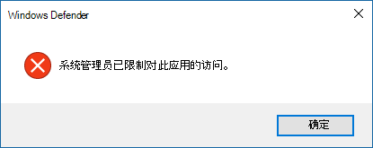

# 阻止用户查看 Microsoft Defender 防病毒用户界面或与之交互Prevent users from seeing or interacting with the Microsoft Defender Antivirus user interface

[!INCLUDE [Microsoft 365 Defender rebranding](../../includes/microsoft-defender.md)]

**适用于：****Applies to:**

- [Microsoft Defender for EndpointMicrosoft Defender for Endpoint](/microsoft-365/security/defender-endpoint/)

可以使用组策略阻止终结点上的用户看到 Microsoft Defender 防病毒界面。You can use Group Policy to prevent users on endpoints from seeing the Microsoft Defender Antivirus interface. 还可以阻止他们暂停扫描。You can also prevent them from pausing scans.

## 隐藏 Microsoft Defender 防病毒界面Hide the Microsoft Defender Antivirus interface

在 Windows 10 版本 1703 中，隐藏界面将隐藏 Microsoft Defender 防病毒通知，并防止病毒 & 威胁防护磁贴显示在 Windows 安全应用中。In Windows 10, versions 1703, hiding the interface will hide Microsoft Defender Antivirus notifications and prevent the Virus & threat protection tile from appearing in the Windows Security app.

将设置设置为"**已启用"：**With the setting set to **Enabled**:

将设置设置为"已 **禁用"** 或未配置：With the setting set to **Disabled** or not configured:

>[!NOTE]
>隐藏界面还会阻止在终结点上显示 Microsoft Defender 防病毒通知。Hiding the interface will also prevent Microsoft Defender Antivirus notifications from appearing on the endpoint. Microsoft Defender for Endpoint 通知仍将显示。Microsoft Defender for Endpoint notifications will still appear. 还可以单独 [配置终结点上显示的通知](configure-notifications-microsoft-defender-antivirus.md)You can also individually [configure the notifications that appear on endpoints](configure-notifications-microsoft-defender-antivirus.md)

在早期版本的 Windows 10 中，该设置将隐藏Windows Defender客户端接口。In earlier versions of Windows 10, the setting will hide the Windows Defender client interface. 如果用户尝试打开它，他们将收到一条警告，指出"你的系统管理员已限制对此应用的访问"。If the user attempts to open it, they will receive a warning that says, "Your system administrator has restricted access to this app."

## 使用组策略向用户隐藏 Microsoft Defender AV 界面Use Group Policy to hide the Microsoft Defender AV interface from users

1. 在组策略管理计算机上，打开组 [策略管理控制台](/previous-versions/windows/desktop/gpmc/group-policy-management-console-portal)，右键单击要配置的组策略对象，**然后单击编辑。**On your Group Policy management machine, open the [Group Policy Management Console](/previous-versions/windows/desktop/gpmc/group-policy-management-console-portal), right-click the Group Policy Object you want to configure and click **Edit**.

2. 使用组 **策略管理编辑器转到** 计算机 **配置**。Using the **Group Policy Management Editor** go to **Computer configuration**.

3. 单击 **"管理模板"。**Click **Administrative templates**.

4. 将树展开到 **Microsoft Defender 防病毒>客户端**> Windows 组件。Expand the tree to **Windows components > Microsoft Defender Antivirus > Client interface**.

5. 双击启用 **无头 UI 模式** 设置，将选项设置为 **已启用**。Double-click the **Enable headless UI mode** setting and set the option to **Enabled**. 单击“**确定**”。Click **OK**. 

有关 [阻止用户修改其电脑保护](configure-local-policy-overrides-microsoft-defender-antivirus.md) 的更多选项，请参阅防止用户在本地修改策略设置。See [Prevent users from locally modifying policy settings](configure-local-policy-overrides-microsoft-defender-antivirus.md) for more options on preventing users form modifying protection on their PCs.

## 阻止用户暂停扫描Prevent users from pausing a scan

你可以阻止用户暂停扫描，这有助于确保计划扫描或按需扫描不会被用户中断。You can prevent users from pausing scans, which can be helpful to ensure scheduled or on-demand scans are not interrupted by users.

> [!NOTE]
> 此设置在 Windows 10 上不受支持。This setting is not supported on Windows 10.

### 使用组策略阻止用户暂停扫描Use Group Policy to prevent users from pausing a scan

1. 在组策略管理计算机上，打开组 [策略管理控制台](/previous-versions/windows/desktop/gpmc/group-policy-management-console-portal)，右键单击要配置的组策略对象，**然后单击编辑。**On your Group Policy management machine, open the [Group Policy Management Console](/previous-versions/windows/desktop/gpmc/group-policy-management-console-portal), right-click the Group Policy Object you want to configure and click **Edit**.

2. 使用组 **策略管理编辑器转到** 计算机 **配置**。Using the **Group Policy Management Editor** go to **Computer configuration**.

3. 单击 **"管理模板"。**Click **Administrative templates**.

4. 将树展开到 **Windows 组件** Microsoft Defender  >  **防病毒**  >  **扫描**。Expand the tree to **Windows components** > **Microsoft Defender Antivirus** > **Scan**.

5. 双击允许用户暂停 **扫描设置** ，将选项设置为 **已禁用**。Double-click the **Allow users to pause scan** setting and set the option to **Disabled**. 单击“**确定**”。Click **OK**. 

## 相关文章Related articles

- [配置终结点上显示的通知Configure the notifications that appear on endpoints](configure-notifications-microsoft-defender-antivirus.md)

- [配置最终用户与 Microsoft Defender 防病毒的交互Configure end-user interaction with Microsoft Defender Antivirus](configure-end-user-interaction-microsoft-defender-antivirus.md)

- [Windows 10 中的 Microsoft Defender 防病毒Microsoft Defender Antivirus in Windows 10](microsoft-defender-antivirus-in-windows-10.md)