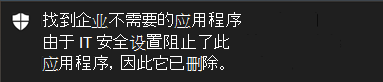

# <a name="take-response-actions-on-a-file"></a>对文件执行响应操作

[!INCLUDE [Microsoft 365 Defender rebranding](../../includes/microsoft-defender.md)]


**适用于：**
- [Microsoft Defender for Endpoint](https://go.microsoft.com/fwlink/?linkid=2154037)

[!include[Prerelease information](../../includes/prerelease.md)]

> 想要体验适用于终结点的 Defender？ [注册免费试用版](https://signup.microsoft.com/create-account/signup?products=7f379fee-c4f9-4278-b0a1-e4c8c2fcdf7e&ru=https://aka.ms/MDEp2OpenTrial?ocid=docs-wdatp-responddile-abovefoldlink)。

通过停止和隔离文件或阻止文件来快速响应检测到的攻击。 对文件采取操作后，可以在操作中心查看活动详细信息。

响应操作在文件的详细配置文件页上可用。 进入此页面后，可以通过切换新的"文件"页面在新页面布局和旧 **页面布局之间切换**。 本文的其余部分介绍了较新的页面布局。

响应操作沿着文件页的顶部运行，包括：

- 停止和隔离文件
- 添加指示器
- 下载文件
- 咨询威胁专家
- 操作中心

还可以提交文件进行深入分析，以在安全的云沙盒中运行该文件。 分析完成后，您将获得提供有关文件行为的信息的详细报告。 可以通过选择"深入分析"选项卡来提交文件进行深入分析并阅读 **过去的** 报告。它位于文件信息卡下方。

某些操作需要某些权限。 下表介绍了某些权限对 PE 文件和非 PE (可执行) 可以执行哪些操作：

<br>

****

|权限|PE 文件|非 PE 文件|
|---|:---:|:---:|
|查看数据|X|X|
|警报调查|&#x2611;|X|
|实时响应基本|X|X|
|实时响应高级|&#x2611;|&#x2611;|
|

有关角色详细信息，请参阅为基于角色的访问控制 [创建和管理角色](user-roles.md)。

## <a name="stop-and-quarantine-files-in-your-network"></a>停止并隔离网络中的文件

通过停止恶意进程并隔离观察到的文件，你可以在你的组织中包含攻击。

> [!IMPORTANT]
> 只有在：
>
> - 正在采取操作的设备正在运行Windows 10版本 1703 或更高版本
> - 该文件不属于受信任的第三方发布者，或者未由 Microsoft 签名
> - Microsoft Defender 防病毒必须至少在被动模式下运行。 有关详细信息，请参阅兼容性[Microsoft Defender 防病毒兼容性](/windows/security/threat-protection/microsoft-defender-antivirus/microsoft-defender-antivirus-compatibility)。

停止 **和隔离文件** 操作包括停止正在运行的进程、隔离文件以及删除永久性数据（如注册表项）。

此操作在具有 Windows 10 版本 1703 或更高版本的设备（过去 30 天内观测到该文件）上生效。

> [!NOTE]
> 你将能够随时从隔离区还原文件。

### <a name="stop-and-quarantine-files"></a>停止和隔离文件

1. 选择要停止和隔离的文件。 可以从以下任一视图中选择文件，或使用"搜索"框：

   - **警报** - 单击警报情景时间线中的"说明"或"详细信息"中的相应链接
   - **搜索框** - **从下拉菜单** 中选择"文件"，然后输入文件名

   > [!NOTE]
   > 停止和隔离文件操作限制为最多 1000 台设备。 若要在更多设备上停止文件，请参阅添加 [用于阻止或允许文件的指示器](#add-indicator-to-block-or-allow-a-file)。

2. 转到顶部栏，然后选择"停止 **和隔离文件"。**

   

3. 指定原因，然后选择"确认 **"。**

   

   操作中心显示提交信息：

   

   - **提交时间** - 显示提交操作的时间。
   - **Success** - 显示已停止和隔离文件的设备数。
   - **Failed** - 显示操作失败的设备数量和有关失败的详细信息。
   - **挂起** - 显示文件尚未停止和隔离的设备数量。 当设备脱机或未连接到网络时，这可能需要一些时间。

4. 选择任何状态指示器以查看有关操作详细信息。 例如，选择 **"失败** "以查看操作失败的地方。

#### <a name="notification-on-device-user"></a>有关设备用户的通知

从设备中删除文件时，将显示以下通知：



在设备时间线中，将针对停止和隔离文件的每个设备添加一个新事件。

在针对整个组织中广泛使用的文件实施操作之前，会显示一条警告。 它用于验证操作是否预期。

## <a name="restore-file-from-quarantine"></a>从隔离区还原文件

如果在调查后确定文件是干净的，你可以回滚并从隔离区中删除文件。 在隔离文件的每台设备上运行以下命令。

1. 在设备上打开提升的命令行提示符：

   1. 转到“**开始**”并键入“_cmd_”。

   1. 右键单击“**命令提示符**”，然后选择“**以管理员身份运行**”。

2. 输入以下命令，然后按 **Enter：**

   ```dos
   "%ProgramFiles%\Windows Defender\MpCmdRun.exe" -Restore -Name EUS:Win32/CustomEnterpriseBlock -All
   ```

   > [!NOTE]
   > 在某些情况下 **，ThreatName** 可能显示为：EUS：Win32/CustomEnterpriseBlock！cl。
   >
   > Defender for Endpoint 将还原最近 30 天内在此设备上隔离的所有自定义阻止文件。

> [!IMPORTANT]
> 作为潜在网络威胁隔离的文件可能无法恢复。 如果用户尝试在隔离后还原文件，则该文件可能无法访问。 这是因为系统不再具有访问该文件的网络凭据。 通常，这是临时登录到系统或共享文件夹且访问令牌过期的结果。

## <a name="download-or-collect-file"></a>下载或收集文件

从 **响应** 操作中选择"下载文件"，可下载包含文件.zip受密码保护的本地文件存档。 将出现一个飞出图，可在其中记录下载文件的原因并设置密码。

默认情况下，您应该能够下载隔离的文件。


### <a name="download-quarantined-files"></a>下载隔离文件

你的安全团队或Microsoft Defender 防病毒隔离的文件将按照你的提交配置示例以合规[方式保存](enable-cloud-protection-microsoft-defender-antivirus.md)。 安全团队可以通过"下载文件"按钮直接从文件的详细信息页面下载文件。 **默认情况下，此预览功能为"开"。**

位置取决于组织的地理位置设置 (欧盟、英国或美国) 。 每个组织仅收集一次隔离文件。 若要详细了解 Microsoft 数据保护，请通过 服务信任门户了解 https://aka.ms/STP 。

启用此设置可帮助安全团队检查潜在的错误文件，并快速且风险较低地调查事件。 但是，如果你需要关闭此设置，请转到设置 \> **终结点** 高级 \> **功能** \> **下载隔离** 文件以调整设置。 [详细了解高级功能](advanced-features.md)

#### <a name="backing-up-quarantined-files"></a>备份隔离的文件

系统可能会提示用户在备份隔离文件之前提供显式同意，具体取决于你的 [示例提交配置](enable-cloud-protection-microsoft-defender-antivirus.md#use-group-policy-to-turn-on-cloud-protection)。

如果关闭示例提交，此功能将不起作用。 如果将自动提交示例设置为向用户请求权限，则仅收集用户同意发送的示例。

> [!IMPORTANT]
> 下载隔离文件要求：
>
> - 你的组织Microsoft Defender 防病毒活动模式
> - 防病毒引擎版本为 1.1.17300.4 或更高版本。 请参阅 [每月平台和引擎版本](manage-updates-baselines-microsoft-defender-antivirus.md#monthly-platform-and-engine-versions)
> - 启用基于云的保护。 请参阅 [启用云保护](enable-cloud-protection-microsoft-defender-antivirus.md)
> - 示例提交已打开
> - 设备具有 Windows 10 1703 或更高版本、Windows Server 2016 或 2019 或 Windows Server 2022

### <a name="collect-files"></a>收集文件

如果 Microsoft Defender for Endpoint 尚未存储文件，则你无法下载它。 相反，你将在同一 **位置看到** "收集文件"按钮。 如果在过去 30 天内未在组织中看到文件， **将禁用收集** 文件。
> [!Important]
> 作为潜在网络威胁隔离的文件可能无法恢复。 如果用户尝试在隔离后还原文件，则该文件可能无法访问。 这是因为系统不再具有访问该文件的网络凭据。 通常，这是临时登录到系统或共享文件夹且访问令牌过期的结果。

## <a name="add-indicator-to-block-or-allow-a-file"></a>添加用于阻止或允许文件的指示器

通过禁止潜在恶意文件或可疑恶意软件，防止攻击在组织中进一步传播。 如果你知道 PE 文件中可能存在恶意 (可执行) ，可以阻止它。 此操作将阻止在组织的设备上读取、写入或执行该操作。

> [!IMPORTANT]
>
> - 如果你的组织使用云保护并启用Microsoft Defender 防病毒，此功能可用。 有关详细信息，请参阅管理 [云提供的保护](/windows/security/threat-protection/microsoft-defender-antivirus/deploy-manage-report-microsoft-defender-antivirus)。
>
> - 反恶意软件客户端版本必须为 4.18.1901.x 或更高版本。
> - 此功能旨在防止从 (下载可疑的恶意软件) 潜在的恶意文件。 它当前支持可移植的可执行 (PE) _文件，包括_.exe和 _.dll_ 文件。 覆盖范围将随着时间的推移而延长。
> - 此响应操作适用于 Windows 10 版本 1703 或更高版本上的设备。
> - 如果在允许或阻止操作之前文件分类存在于设备的缓存中，则不能对文件执行允许或阻止功能。

> [!NOTE]
> PE 文件需在设备时间线中，才能执行该操作。
>
> 在采取操作和阻止实际文件之间，可能有几分钟的延迟。

### <a name="enable-the-block-file-feature"></a>启用阻止文件功能

若要开始阻止文件，首先需要打开"阻止或允许"[功能设置。  ](advanced-features.md)

### <a name="allow-or-block-file"></a>允许或阻止文件

为文件添加指示器哈希时，可以选择引发警报，并阻止组织中设备尝试运行该文件。

由指示器自动阻止的文件不会显示在文件的"操作中心"中，但警报仍显示在警报队列中。

有关 [阻止和](manage-indicators.md) 引发文件警报的更多详细信息，请参阅管理指示器。

若要停止阻止文件，请删除指示器。 您可以通过文件配置文件页上 **的"编辑** 指示器"操作来这样做。 在添加指示器之前，此操作将在与 **添加指示器操作** 相同的位置可见。

还可以在"规则指示器 **"下的****"设置"页面** \> **编辑指示器**。 此区域中的指示器按其文件的哈希列出。

## <a name="consult-a-threat-expert"></a>咨询威胁专家

有关可能受到威胁的设备或已受到威胁的设备的更多见解，请咨询 Microsoft 威胁专家。 Microsoft 威胁专家门户中直接参与Microsoft 365 Defender，及时准确地做出响应。 专家提供有关可能受到威胁的设备的见解，并帮助你了解复杂的威胁和目标攻击通知。 它们还可以提供有关你在门户仪表板上看到的警报或威胁智能上下文的信息。

有关详细信息 [，请参阅咨询 Microsoft 威胁](/microsoft-365/security/defender-endpoint/configure-microsoft-threat-experts#consult-a-microsoft-threat-expert-about-suspicious-cybersecurity-activities-in-your-organization) 专家。

## <a name="check-activity-details-in-action-center"></a>在操作中心检查活动详细信息

**操作中心** 提供有关对设备或文件采取的操作的信息。 可以查看以下详细信息：

- 调查包集合
- 防病毒扫描
- 应用限制
- 设备隔离

还会显示所有其他相关详细信息，如提交日期/时间、提交用户以及操作是成功还是失败。


## <a name="deep-analysis"></a>深度分析

网络安全调查通常由警报触发。 警报与一个或多个观察到的文件相关，这些文件通常是新的或未知的。 选择文件后，你将看到文件视图，可在其中查看文件的元数据。 若要丰富与文件相关的数据，可以提交文件进行深入分析。

深度分析功能在安全的、完全检测的云环境中执行文件。 深度分析结果显示文件的活动、观察到的行为和相关项目，如丢弃的文件、注册表修改以及与 IP 的通信。
深度分析目前支持对可移植可执行文件 (PE) 文件 _(包括.exe_ 和 _.dll文件_) 。

文件的深入分析需要几分钟。 文件分析完成后，"深入分析"选项卡将更新以显示摘要以及最新可用结果的日期和时间。

深度分析摘要包括观察到的行为列表，其中一些行为可指示恶意活动和可观测行为，包括联系的 IP 和磁盘上创建的文件。 如果未找到任何内容，这些部分将显示一条简短消息。

深度分析结果与威胁智能匹配，任何匹配都将生成相应的警报。

使用深度分析功能调查任何文件的详细信息，通常是在调查警报期间或出于任何其他怀疑恶意行为的原因。 此功能在文件的配置文件页上 **的** "深入分析"选项卡中提供。

> [!VIDEO https://www.microsoft.com/videoplayer/embed/RE4aAYy?rel=0]

**当文件在** Defender for Endpoint 后端示例集合中可用时，或在支持提交到深入分析的 Windows 10 设备上观察到该文件时，将启用提交进行深度分析。

> [!NOTE]
> 只能自动Windows 10文件。

如果文件未在 Windows 10 设备上观测到，还可以通过 [Microsoft](https://www.microsoft.com/security/portal/submission/submit.aspx)安全中心门户提交示例，并等待"提交"**进行** 深入分析按钮变为可用。

> [!NOTE]
> 由于 Microsoft 安全中心门户中的后端处理流，文件提交和 Defender for Endpoint 中深入分析功能的可用性之间最多存在 10 分钟的延迟。

### <a name="submit-files-for-deep-analysis"></a>提交文件进行深入分析

1. 选择要提交进行深入分析的文件。 可以从以下任一视图中选择或搜索文件：

    - **警报** - 从"警报情景"时间线 **中的"说明** "或 **"** 详细信息"中选择文件链接
    - **设备列表**- 从"组织中设备"**部分的说明或** 详细信息 **中选择文件** 链接
    - **搜索框** - **从下拉菜单** 中选择"文件"，然后输入文件名

2. 在文件 **视图的"** 深入分析"选项卡中，选择"提交 **"。**

   

   > [!NOTE]
   > 仅支持 PE _文件，包括_.exe和 _.dll_ 文件。

   将显示一个进度栏，并提供有关分析的不同阶段的信息。 然后，您可以在分析完成时查看报告。

> [!NOTE]
> 根据设备可用性，示例收集时间可能会有所不同。 示例集合有 3 小时超时。 如果当时没有联机设备报告，该集合Windows 10将中止操作。 你可以重新提交文件进行深入分析，以获得文件的新数据。

### <a name="view-deep-analysis-reports"></a>查看深入分析报告

查看提供的深入分析报告，以查看有关你提交的文件的更深入见解。 此功能在文件视图上下文中可用。

您可以查看全面报告，该报告提供有关以下各节的详细信息：

- Behaviors
- Observables

提供的详细信息可以帮助你调查是否有潜在攻击的迹象。

1. 选择要提交进行深入分析的文件。
2. 选择" **深入分析"** 选项卡。如果之前有任何报告，报告摘要将显示在此选项卡中。

    

#### <a name="troubleshoot-deep-analysis"></a>深度分析疑难解答

如果在尝试提交文件时遇到问题，请尝试以下每个疑难解答步骤。

1. 确保该文件是 PE 文件。 PE 文件 _通常具有.exe__或.dll_ 可执行 (应用程序的扩展) 。

2. 确保服务具有对文件的访问权限，它仍然存在，并且尚未损坏或修改。

3. 稍等一会，然后再次尝试提交文件。 队列可能已满，或者出现临时连接或通信错误。

4. 如果未配置示例集合策略，则默认行为是允许示例集合。 如果已配置，请验证策略设置是否允许示例收集，然后再重新提交文件。 配置示例集合后，请检查以下注册表值：

    ```text
    Path: HKLM\SOFTWARE\Policies\Microsoft\Windows Advanced Threat Protection
    Name: AllowSampleCollection
    Type: DWORD
    Hexadecimal value :
      Value = 0 - block sample collection
      Value = 1 - allow sample collection
    ```

5. 通过组策略更改组织单位。 有关详细信息，请参阅使用 [组策略配置](configure-endpoints-gp.md)。

6. 如果这些步骤无法解决问题，请与联系[winatp@microsoft.com。](mailto:winatp@microsoft.com)

## <a name="related-topics"></a>相关主题

- [在设备上执行响应操作](respond-machine-alerts.md)
- [调查文件](investigate-files.md)
- [Microsoft Defender for Endpoint Plan 1 中的手动响应操作 (预览) ](defender-endpoint-plan-1.md#manual-response-actions)
