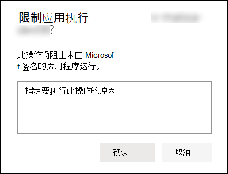

# 在设备上执行响应操作

[!INCLUDE [Microsoft 365 Defender rebranding](../../includes/microsoft-defender.md)]

**适用于：**
- [Microsoft Defender for Endpoint](https://go.microsoft.com/fwlink/?linkid=2154037)

>想要体验适用于终结点的 Defender？ [注册免费试用版。](https://www.microsoft.com/microsoft-365/windows/microsoft-defender-atp?ocid=docs-wdatp-respondmachine-abovefoldlink) 

通过隔离设备或收集调查包来快速响应检测到的攻击。 在设备上采取操作后，可以在操作中心查看活动详细信息。

响应操作沿着特定设备页面的顶部运行，包括：

- 管理标签
- 启动自动调查
- 启动实时响应会话
- 收集调查程序包
- 运行防病毒扫描
- 限制应用执行
- 隔离设备
- 咨询威胁专家
- 操作中心

 可以从以下任一视图查找设备页面：

- **安全操作仪表板** - 从"处于风险的设备"卡中选择设备名称。
- **警报队列** - 从警报队列中选择设备图标旁边的设备名称。
- **设备列表** - 从设备列表中选择设备名称的标题。
- **搜索框** - 从下拉菜单中选择设备，然后输入设备名称。

>[!IMPORTANT]
> - 这些响应操作仅适用于 Windows 10 版本 1703 或更高版本上的设备。 
> - 对于非 Windows 平台，响应 (设备隔离) 依赖于第三方功能。

## 管理标签

添加或管理标记以创建逻辑组附属关系。 设备标记支持网络的正确映射，使您能够附加不同的标记以捕获上下文，并启用动态列表创建作为事件的一部分。

有关设备标记详细信息，请参阅创建 [和管理设备标记](machine-tags.md)。

## 启动自动调查

如果需要，可以在设备上启动新的通用自动调查。 当调查正在运行时，从设备生成的其他任何警报都将添加到正在进行的自动调查，直到完成该调查。 此外，如果在其他设备上看到相同的威胁，则这些设备将添加到调查。

有关自动调查详细信息，请参阅 [自动调查概述](automated-investigations.md)。

## 启动实时响应会话

实时响应是一项功能，可让你使用远程 shell 连接即时访问设备。 这让你能够执行深入调查工作，并立即采取响应操作，以立即包含识别的威胁— 实时。

实时响应旨在通过让你能够收集取证数据、运行脚本、发送可疑实体进行分析、修正威胁和主动搜寻新出现的威胁来增强调查。

有关实时响应详细信息，请参阅使用实时响应调查 [设备上的实体](live-response.md)。

## 从设备收集调查包

作为调查或响应过程的一部分，你可以从设备收集调查包。 通过收集调查包，你可以确定设备的当前状态，并进一步理解攻击者使用的工具和技术。

下载 Zip (包) 并调查设备上发生的事件

1. 从 **设备页面** 顶部的响应操作行中选择收集调查包。
2. 在文本框中指定要执行此操作的原因。 选择“**确认**”。
3. zip 文件将下载

备用方法：

1. 从 **设备页面** 的响应操作部分选择操作中心。

    

3. 在操作中心飞出中，选择 **可用于** 下载 zip 文件的程序包集合包。
  
    

程序包包含以下文件夹：

| Folder | 说明 |
|:---|:---------|
|自动运行 | 包含一组文件，每个文件分别表示已知自动启动入口点 (ASEP) 的注册表内容，以帮助识别攻击者在设备上是否具有持久性。    
<b>注意：</b> 如果找不到注册表项，则文件将包含以下消息："错误：系统无法找到指定的注册表项或值。"
                                                                                                                                |
|已安装的程序 | 此 。CSV 文件包含已安装的程序列表，可帮助确定设备上当前安装的内容。 有关详细信息，请参阅Win32_Product [类](https://go.microsoft.com/fwlink/?linkid=841509)。                                                                                  |
|网络连接 | 此文件夹包含一组与连接信息相关的数据点，可帮助识别与可疑 URL 的连接、攻击者的命令和控制 (C&C) 基础结构、任何横向移动或远程连接。   - ActiveNetConnections.txt – 显示协议统计信息和当前的 TCP/IP 网络连接。 提供查找进程建立可疑连接的能力。    - Arp.txt – 在所有接口的缓存表中 (ARP) 当前地址解析协议。    ARP 缓存可以显示网络上已受到威胁的其他主机或网络上可能用于运行内部攻击的可疑系统。   - DnsCache.txt - 显示 DNS 客户端解析程序缓存的内容，其中包括从本地 Hosts 文件预加载的条目和计算机解析的名称查询的任何最近获取的资源记录。 这有助于识别可疑连接。    - IpConfig.txt – 显示所有适配器的完整 TCP/IP 配置。 适配器可以表示物理接口（如已安装的网络适配器）或逻辑接口（如拨号连接）。    - FirewallExecutionLog.txt和 pfirewall.log                                                                                  |
| 预取文件| Windows 预取文件旨在加快应用程序启动过程。 它可用于跟踪系统中最近使用的所有文件，并查找可能已删除但仍可在预取文件列表中找到的应用程序的跟踪。    - 预取文件夹 – 包含 中的预取文件的副本 `%SystemRoot%\Prefetch` 。 注意：建议下载预取文件查看器以查看预取文件。    - PrefetchFilesList.txt – 包含所有复制文件的列表，这些文件可用于跟踪预取文件夹是否有复制失败。                                                                                                      |
| 进程| 包含 。列出正在运行的过程的 CSV 文件，它提供识别设备上运行的当前进程的能力。 在标识可疑进程及其状态时，这非常有用。                                                                                                                                                                                                       |
| 计划任务| 包含 。列出计划任务的 CSV 文件，可用于标识在所选设备上自动执行的例程，以查找已设置为自动运行的可疑代码。                                                                                                                                                                                                      |
| 安全事件日志| 包含安全事件日志，其中包含登录或注销活动的记录，或者由系统的审核策略指定的其他与安全相关的事件。   
<b>注意：</b> 使用事件查看器日志文件事件视图。
                                                                                    |
| 服务| 包含 。列出服务及其状态的 CSV 文件。                                                                                      |
| SMB 会话 (Windows Server) 块 | 列出对文件、打印机和串行端口的共享访问，以及网络上节点之间的其他通信。 这可以帮助识别数据外排或横向移动。    包含 SMBInboundSessions 和 SMBOutboundSession 的文件。    
<b>注意：</b> 如果入站或出站 (会话) ，您将获得一个文本文件，告知您未找到 SMB 会话。
                                                                                                                          |
| 系统信息| 包含一SystemInformation.txt列出系统信息（如操作系统版本和网络卡）的文件。                                                                                     |
| 临时目录| 包含一组文本文件，其中列出了系统中每个用户位于 %Temp% 中的文件。    这可以帮助跟踪攻击者可能丢弃在系统上的可疑文件。    
<b>注意：</b> 如果文件包含以下消息："系统找不到指定的路径"，这意味着此用户没有临时目录，可能是因为用户未登录到系统。
                                                                                                                                         |
| 用户和组| 提供每个表示一个组及其成员的文件的列表。                                                                                                                   |
|WdSupportLogs| 提供MpCmdRunLog.txt和MPSupportFiles.cab     
<b>注意：</b> 此文件夹仅在安装了 2020 年 2 月更新汇总或更高版本的 Windows 10 版本 1709 或更高版本上创建：  Win10 1709 (RS3) 内部版本 16299.1717 [：KB4537816](https://support.microsoft.com/en-us/help/4537816/windows-10-update-kb4537816)   Win10 1803 (RS4) 内部版本 17134.1345：KB4537795    Win10 1809 (RS5) 内部版本 17763.1075 [：KB4537818](https://support.microsoft.com/en-us/help/4537818/windows-10-update-kb4537818)   Win10 1903/1909 (19h1/19h2) 内部版本 18362.693 和 [18363.693：KB4535996](https://support.microsoft.com/en-us/help/4535996/windows-10-update-kb4535996) 
                                                                                                                    |
| CollectionSummaryReport.xls| 此文件是调查包集合的摘要，它包含数据点列表、用于提取数据的命令、执行状态以及失败时的错误代码。 可以使用此报告跟踪程序包是否包含所有预期数据，并确定是否有错误。 |

## 在设备上运行 Microsoft Defender 防病毒扫描

作为调查或响应过程的一部分，你可以远程启动防病毒扫描，以帮助识别和修正可能存在于受到威胁的设备的恶意软件。

>[!IMPORTANT]
>- 此操作适用于 Windows 10 版本 1709 或更高版本上的设备。
>- Microsoft Defender 防病毒 (Microsoft Defender AV) 扫描可以与其他防病毒解决方案一起运行，无论 Microsoft Defender AV 是否是活动的防病毒解决方案。 Microsoft Defender AV 可以处于被动模式。 有关详细信息，请参阅 [Microsoft Defender 防病毒兼容性](https://docs.microsoft.com/windows/security/threat-protection/microsoft-defender-antivirus/microsoft-defender-antivirus-compatibility.md)。

选择"运行 **防病毒扫描**"之一，选择要快速或完整 (运行扫描类型) 在确认扫描之前添加注释。

操作中心将显示扫描信息，设备时间线将包含一个新事件，反映扫描操作已提交到设备上。 Microsoft Defender AV 警报将反映扫描期间显示的任何检测。

>[!NOTE]
>使用 Defender for Endpoint 响应操作触发扫描时，Microsoft Defender 防病毒"ScanAvgCPULoadFactor"值仍然适用并限制扫描的 CPU 影响。  如果未配置 ScanAvgCPULoadFactor，则默认值为扫描期间最大 CPU 负载的 50% 的限制。 
>有关详细信息，请参阅 [configure-advanced-scan-types-microsoft-defender-antivirus](https://docs.microsoft.com/windows/security/threat-protection/microsoft-defender-antivirus/configure-advanced-scan-types-microsoft-defender-antivirus)。

## 限制应用执行

除了通过停止恶意进程来阻止攻击之外，还可以锁定设备并防止潜在恶意程序的后续尝试运行。

>[!IMPORTANT]
> - 此操作适用于 Windows 10 版本 1709 或更高版本上的设备。
> - 如果你的组织使用 Microsoft Defender 防病毒，则此功能可用。
> - 此操作需要满足Windows Defender控制代码完整性策略格式和签名要求。 有关详细信息，请参阅代码 [完整性策略格式和签名](https://docs.microsoft.com/windows/device-security/device-guard/requirements-and-deployment-planning-guidelines-for-device-guard#code-integrity-policy-formats-and-signing)。

为了限制应用程序运行，应用了代码完整性策略，该策略只允许文件在由 Microsoft 颁发的证书签名时运行。 这种限制方法有助于防止攻击者控制受到威胁的设备，并执行进一步恶意活动。

>[!NOTE]
>你将能够随时撤消对应用程序运行的限制。 设备页面上的按钮将更改为"删除应用限制"，然后执行与限制应用执行相同的步骤。

在设备页面上选择 **"限制** 应用执行"后，键入注释并选择"确认 **"。** 操作中心将显示扫描信息，设备时间线将包含新事件。

**有关设备用户的通知**： 
当应用受限时，将显示以下通知，通知用户应用被限制运行：

## 将设备从网络隔中离出来

根据攻击的严重性和设备敏感度，你可能希望将设备与网络隔离。 此操作有助于防止攻击者控制受到威胁的设备，并执行进一步的活动，如数据泄漏和横向移动。

>[!IMPORTANT]
>- 完全隔离适用于 Windows 10 版本 1703 上的设备。
>- 选择性隔离适用于 Windows 10 版本 1709 或更高版本上的设备。

此设备隔离功能断开受损设备与网络的连接，同时保留与 Defender for Endpoint 服务的连接，该服务将继续监视设备。

在 Windows 10 版本 1709 或更高版本上，你将对网络隔离级别进行其他控制。 还可以选择启用 Outlook、Microsoft Teams 和 Skype for Business (&quot;选择性隔离") 。

>[!NOTE]
>你将能够随时将设备重新连接到网络。 设备页面上的按钮将更改为"从隔离中释放 **"，** 然后执行与隔离设备相同的步骤。

在设备页面上选择"**隔离** 设备"后，键入注释并选择"确认 **"。** 操作中心将显示扫描信息，设备时间线将包含新事件。

>[!NOTE]
>设备将保持与 Defender for Endpoint 服务连接，即使它与网络隔离。 如果你已选择启用 Outlook 和 Skype for Business 通信，则你将能够在设备隔离时与用户通信。

**有关设备用户的通知**： 
隔离设备时，将显示以下通知，通知用户设备正在与网络隔离：

## 咨询威胁专家

你可以咨询 Microsoft 威胁专家，了解有关可能受到威胁的设备或已受到威胁的设备的更多见解。 Microsoft 威胁专家可以直接在 Microsoft Defender 安全中心内参与，及时准确地做出响应。 专家不仅提供有关潜在威胁设备的见解，而且还可以更好地了解复杂的威胁、你收到的目标攻击通知，或者你需要有关警报或你在门户仪表板上看到的威胁情报上下文详细信息。

有关详细信息 [，请参阅咨询 Microsoft 威胁](https://docs.microsoft.com/microsoft-365/security/defender-endpoint/configure-microsoft-threat-experts#consult-a-microsoft-threat-expert-about-suspicious-cybersecurity-activities-in-your-organization) 专家。

## 在操作中心检查活动详细信息

**操作中心** 提供有关对设备或文件采取的操作的信息。 你将能够查看以下详细信息：

- 调查包集合
- 防病毒扫描
- 应用限制
- 设备隔离

还会显示所有其他相关详细信息，例如提交日期/时间、提交用户以及操作成功还是失败。

## 相关主题
- [对文件执行响应操作](respond-file-alerts.md)
- [报告 inaccuracy](https://docs.microsoft.com/microsoft-365/security/defender-endpoint/tvm-security-recommendation#report-inaccuracy)
