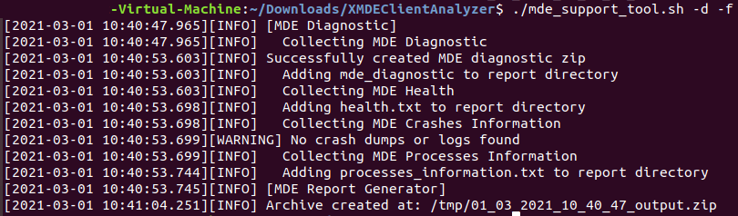

# 在 macOS 或 Linux 上运行客户端分析器

**适用于：**
- [Microsoft Defender for Endpoint](https://go.microsoft.com/fwlink/p/?linkid=2146631)

## 通过 GUI 方案运行分析器

1. 将 [XMDE 客户端分析器](https://aka.ms/XMDEClientAnalyzer) 工具下载到需要调查的 macOS 或 Linux 计算机。

   > [!NOTE]
   > 从上述链接下载的"XMDEClientAnalyzer.zip"的当前 SHA256 哈希为："973725417D136B7B17AF4B301F1E99BA21D7F4A7DF88036DC5A731A4B768A8B2"。

2. 提取计算机上XMDEClientAnalyzer.zip的内容。

3. 打开终端会话，将目录更改为提取的位置并运行：

   `./mde_support_tool.sh -d`

   > [!NOTE]
   > 在 Linux 上，如果脚本没有执行权限，则需要首先运行：
   >
   > `chmod a+x mde_support_tool.sh`

## 使用终端或 SSH 方案运行分析器

打开相关计算机中的终端或 SSH 并运行以下命令：

1. `wget --quiet -O XMDEClientAnalyzer.zip https://aka.ms/XMDEClientAnalyzer`

2. `unzip -q XMDEClientAnalyzer.zip`

3. `cd XMDEClientAnalyzer`

4. `chmod +x mde_support_tool.sh`

3. 作为非根使用运行以安装所需的管道和 lxml 组件： `./mde_support_tool.sh`

4. 若要收集实际的诊断包并生成结果存档文件，请再次作为根运行： `./mde_support_tool.sh -d`

> [!NOTE]
> - 对于 Linux，分析器需要"lxml"来生成结果输出。 如果未安装，分析器将尝试从下面的 python 包的官方存储库获取它： <https://files.pythonhosted.org/packages/\*/lxml\*.whl>
> 
> - 此外，该工具当前需要安装 Python 版本 3 或更高版本。
> 
> - 如果你的设备位于代理后面，则只需将代理服务器作为环境变量传递到 mde_support_tool.sh 脚本。 例如：`https_proxy=https://myproxy.contoso.com:8080 ./mde_support_tool.sh"`

示例：

其他语法帮助：

**-h** \# 帮助 
\# 显示帮助消息

**性能** \# 性能 
\# 收集大量跟踪，以分析可按需重现的性能问题。 用于 `--length=<seconds>` 指定基准的持续时间。

**-o** \# 输出 
\# 指定结果文件的目标路径

**-nz** \# No-Zip 
\# 如果设置，将创建目录，而不是生成的存档文件

**-f** \# Force 
\# 如果输出在目标路径中已存在，则覆盖

## macOS 和 Linux 上的结果包内容

- report.html

  说明：主 HTML 输出文件，其中包含计算机上运行的分析器脚本可以生成的结果和指导。

- mde_diagnostic.zip

  说明：在任一 macOS 上运行 *mdatp* 诊断创建时生成的相同 [诊断输出](/windows/security/threat-protection/microsoft-defender-atp/mac-resources#collecting-diagnostic-information)

  或

  [Linux](/windows/security/threat-protection/microsoft-defender-atp/linux-resources#collect-diagnostic-information)

- mde.xml

  说明：运行时生成的 XML 输出，用于生成 html 报告文件。

- Processes_information.txt

  说明：包含系统上运行的 Microsoft Defender 终结点相关进程的详细信息。

- Log.txt

  说明：包含数据收集期间在屏幕上写入的相同日志消息。

- Health.txt

  说明：运行 *mdatp* 运行状况命令时显示的基本运行状况输出相同。

- Events.xml

  说明：生成 HTML 报告时分析器使用的其他 XML 文件。

- Auditd_info.txt

  说明：有关 Linux OS 的已审核服务和相关 [组件](/windows/security/threat-protection/microsoft-defender-atp/linux-support-events) 的详细信息

- perf_benchmark.tar.gz

  说明：性能测试报告。 只有在使用 performance 参数时，才能看到此参数。
