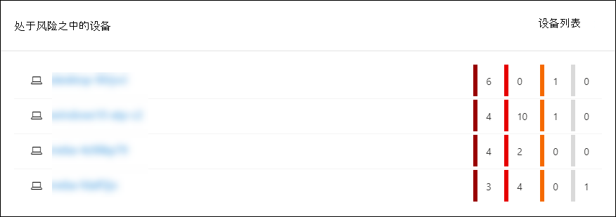
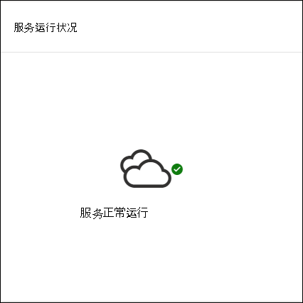
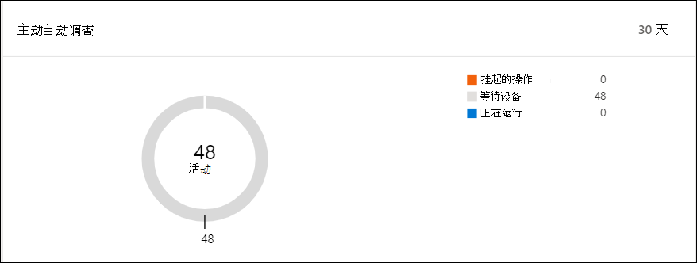
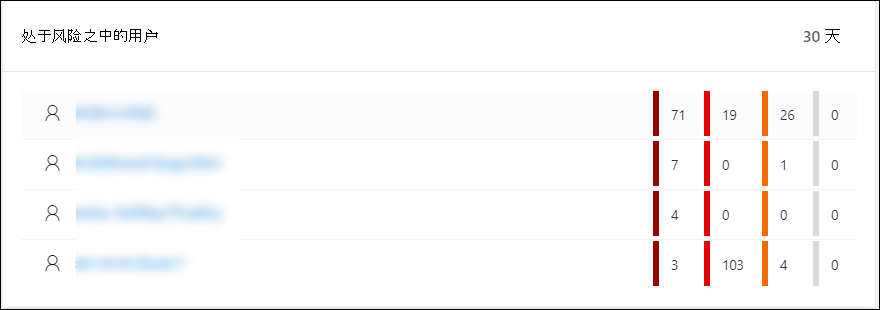

# Microsoft Defender 安全中心安全操作仪表板Microsoft Defender Security Center Security operations dashboard

[!INCLUDE [Microsoft 365 Defender rebranding](../../includes/microsoft-defender.md)]

**适用于：****Applies to:**
- [Microsoft Defender for EndpointMicrosoft Defender for Endpoint](https://go.microsoft.com/fwlink/?linkid=2154037)

>想要体验 Microsoft Defender for Endpoint？Want to experience Microsoft Defender for Endpoint? [注册免费试用版。Sign up for a free trial.](https://www.microsoft.com/microsoft-365/windows/microsoft-defender-atp?ocid=docs-wdatp-secopsdashboard-abovefoldlink) 

安全 **操作仪表板** 是显示终结点检测和响应功能的地方。The **Security operations dashboard** is where the endpoint detection and response capabilities are surfaced. 它提供了发现检测位置的简要概述，并突出显示了需要响应操作的地方。It provides a high level overview of where detections were seen and highlights where response actions are needed. 

仪表板显示以下项的快照：The dashboard displays a snapshot of:

- 活动警报Active alerts
- 处于风险之中的设备Devices at risk
- 传感器运行状况Sensor health
- 服务运行状况Service health
- 每日设备报告Daily devices reporting
- 主动自动调查Active automated investigations
- 自动调查统计信息Automated investigations statistics
- 处于风险之中的用户Users at risk
- 可疑活动Suspicious activities

你可以浏览和调查警报和设备，以快速确定网络中是否、何处以及何时发生可疑活动，以帮助你了解它们出现的上下文。You can explore and investigate alerts and devices to quickly determine if, where, and when suspicious activities occurred in your network to help you understand the context they appeared in.

从 **安全操作仪表板** 中，你将看到聚合事件，以便于识别设备上的重要事件或行为。From the **Security operations dashboard** you will see aggregated events to facilitate the identification of significant events or behaviors on a device. 还可以深入到粒度事件和低级别指示器。You can also drill down into granular events and low-level indicators.

它还具有可单击的磁贴，可直观提示组织的整体运行状况。It also has clickable tiles that give visual cues on the overall health state of your organization. 每个磁贴将打开相应概述的详细视图。Each tile opens a detailed view of the corresponding overview.

## 活动警报Active alerts
你可以从磁贴查看最近 30 天内网络的活动警报的个数。You can view the overall number of active alerts from the last 30 days in your network from the tile. 警报分为"**新建"和**"**正在进行"。**Alerts are grouped into **New** and **In progress**.

每个组进一步细分为相应的警报严重性级别。Each group is further sub-categorized into their corresponding alert severity levels. 单击每个警报圈内的警报数，以查看该类别的队列的已排序视图 **("** 新建"或"正在进行) "。 Click the number of alerts inside each alert ring to see a sorted view of that category's queue (**New** or **In progress**).

有关详细信息，请参阅 [警报概述](alerts-queue.md)。For more information see, [Alerts overview](alerts-queue.md).

每行包括警报严重性类别和警报的简短说明。Each row includes an alert severity category and a short description of the alert. 你可以单击警报以查看其详细视图。You can click an alert to see its detailed view. 有关详细信息，请参阅调查  [适用于终结点的 Microsoft Defender](investigate-alerts.md) 警报 [和警报概述](alerts-queue.md)。For more information see,  [Investigate Microsoft Defender for Endpoint alerts](investigate-alerts.md) and [Alerts overview](alerts-queue.md).

## 处于风险之中的设备Devices at risk
此磁贴显示活动警报数最高的设备列表。This tile shows you a list of devices with the highest number of active alerts. 每个设备的警报总数在设备名称旁的圆圈中显示，然后按严重级别进一步分类到磁贴 (悬停在每个严重性栏的末尾以查看其标签) 。The total number of alerts for each device is shown in a circle next to the device name, and then further categorized by severity levels at the far end of the tile (hover over each severity bar to see its label).

单击设备名称以查看有关该设备的详细信息。Click the name of the device to see details about that device. 有关详细信息，请参阅调查 [Microsoft Defender 终结点设备列表中的设备](investigate-machines.md)。For more information see, [Investigate devices in the Microsoft Defender for Endpoint Devices list](investigate-machines.md).

还可以单击磁贴 **顶部的**"设备"列表，直接转到"设备"列表（按活动警报数排序）。You can also click **Devices list** at the top of the tile to go directly to the **Devices list**, sorted by the number of active alerts. 有关详细信息，请参阅调查 [Microsoft Defender 终结点设备列表中的设备](investigate-machines.md)。For more information see, [Investigate devices in the Microsoft Defender for Endpoint Devices list](investigate-machines.md).

## 具有传感器问题的设备Devices with sensor issues
" **具有传感器问题的设备** "图块提供有关单个设备向 Microsoft Defender for Endpoint 服务提供传感器数据的能力的信息。The **Devices with sensor issues** tile provides information on the individual device’s ability to provide sensor data to the Microsoft Defender for Endpoint service. 它报告需要关注的设备数，并帮助你识别有问题的设备。It reports how many devices require attention and helps you identify problematic devices.

有两个状态指示器提供有关未正确报告给服务的设备数量的信息：There are two status indicators that provide information on the number of devices that are not reporting properly to the service:
- **错误配置** – 这些设备可能部分向 Microsoft Defender for Endpoint 服务报告传感器数据，并且可能有需要更正的配置错误。**Misconfigured** – These devices might partially be reporting sensor data to the Microsoft Defender for Endpoint service and might have configuration errors that need to be corrected.
- **非** 活动 - 在过去一个月内停止向 Microsoft Defender for Endpoint 服务报告超过七天的设备。**Inactive** - Devices that have stopped reporting to the Microsoft Defender for Endpoint service for more than seven days in the past month.

当你单击任何组时，你将定向到设备列表，根据你的选择进行筛选。When you click any of the groups, you’ll be directed to devices list, filtered according to your choice. 有关详细信息，请参阅检查[传感器状态和](check-sensor-status.md)[调查设备](investigate-machines.md)。For more information, see [Check sensor state](check-sensor-status.md) and [Investigate devices](investigate-machines.md).

## 服务运行状况Service health
服务 **运行状况** 磁贴会通知服务是否处于活动状态或是否有问题。The **Service health** tile informs you if the service is active or if there are issues.

有关服务运行状况详细信息，请参阅 [检查 Microsoft Defender 终结点服务运行状况](service-status.md)。For more information on the service health, see [Check the Microsoft Defender for Endpoint service health](service-status.md).

## 每日设备报告Daily devices reporting
" **每日设备报告** "磁贴显示一个条形图，表示过去 30 天内每天报告的设备数。The **Daily devices reporting** tile shows a bar graph that represents the number of devices reporting daily in the last 30 days. 将鼠标悬停在图形上的个别条形上，查看每天报告的具体设备数。Hover over individual bars on the graph to see the exact number of devices reporting in each day.

## 主动自动调查Active automated investigations
你可以从"活动自动调查"磁贴中查看最近 30 天内网络中自动 **调查的个数** 。You can view the overall number of automated investigations from the last 30 days in your network from the **Active automated investigations** tile. 调查分为"挂起 **操作"、"\*\*\*\*等待设备"** 和"正在运行 **"。**Investigations are grouped into **Pending action**, **Waiting for device**, and **Running**.

## 自动调查统计信息Automated investigations statistics
此图块显示最近七天内与自动调查相关的统计信息。This tile shows statistics related to automated investigations in the last seven days. 它显示完成的调查数、成功修正调查的数量、启动调查所花费的平均待定时间、修正警报的平均时间、调查的警报数以及从典型手动调查保存的自动化小时数。It shows the number of investigations completed, the number of successfully remediated investigations, the average pending time it takes for an investigation to be initiated, the average time it takes to remediate an alert, the number of alerts investigated, and the number of hours of automation saved from a typical manual investigation. 

你可以单击自动 **调查**、**修正** 调查和调查的警报，以导航到按相应类别筛选的"调查"页面。You can click on **Automated investigations**, **Remediated investigations**, and **Alerts investigated** to navigate to the **Investigations** page, filtered by the appropriate category. 这样，你可以查看上下文中调查的详细说明。This lets you see a detailed breakdown of investigations in context.

## 处于风险之中的用户Users at risk
磁贴显示具有最活跃警报的用户帐户列表，以及在高、中或低警报上看到的警报数。The tile shows you a list of user accounts with the most active alerts and the number of alerts seen on high, medium, or low alerts. 

单击用户帐户以查看有关用户帐户的详细信息。Click the user account to see details about the user account. 有关详细信息，请参阅 [调查用户帐户](investigate-user.md)。For more information see [Investigate a user account](investigate-user.md).

>想要体验 Microsoft Defender for Endpoint？Want to experience Microsoft Defender for Endpoint? [注册免费试用版。Sign up for a free trial.](https://www.microsoft.com/microsoft-365/windows/microsoft-defender-atp?ocid=docs-wdatp-secopsdashboard-belowfoldlink)

## 相关主题Related topics
- [了解适用于终结点的 Microsoft Defender 门户Understand the Microsoft Defender for Endpoint portal](use.md)
- [门户概述Portal overview](portal-overview.md)
- [查看威胁&漏洞管理仪表板View the Threat & Vulnerability Management dashboard](tvm-dashboard-insights.md)
- [查看威胁分析仪表板，采取建议的缓解操作View the Threat analytics dashboard and take recommended mitigation actions](threat-analytics.md)
