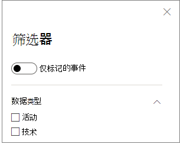

# 设备时间线中的技术Techniques in the device timeline

**适用于：****Applies to:**
- [Microsoft Defender for EndpointMicrosoft Defender for Endpoint](https://go.microsoft.com/fwlink/p/?linkid=2154037)

通过分析特定设备上发生的事件，你可以获取调查的更多见解。You can gain more insight in an investigation by analyzing the events that happened on a specific device. 首先，从设备列表中选择 [感兴趣的设备](machines-view-overview.md)。First, select the device of interest from the [Devices list](machines-view-overview.md). 在设备页面上，可以选择"时间线"选项卡以查看设备上发生的所有事件。On the device page, you can select the **Timeline** tab to view all the events that occurred on the device.

## 了解时间线中的技术Understand techniques in the timeline

>[!IMPORTANT]
>某些信息与公共预览版中预发布的产品功能相关，在商业发行之前可能会对其进行重大修改。Some information relates to a prereleased product feature in public preview which may be substantially modified before it's commercially released. Microsoft 对此处所提供的信息不作任何明示或默示的保证。Microsoft makes no warranties, express or implied, with respect to the information provided here.

在 Microsoft Defender for Endpoint 中 **，** 技术是数据类型时间线中的附加功能。In Microsoft Defender for Endpoint, **Techniques** are an additional data type in the event timeline. 技术提供有关与 [MITRE ATT](https://attack.mitre.org/) 和 CK 技术&子技术相关的活动的更多见解。Techniques provide more insight on activities associated with [MITRE ATT&CK](https://attack.mitre.org/) techniques or sub-techniques. 

此功能通过帮助分析员了解在设备上观察到的活动来简化调查体验。This feature simplifies the investigation experience by helping analysts understand the activities that were observed on a device. 然后，分析员可以决定进一步进行调查。Analysts can then decide to investigate further.

对于公共预览，技术默认可用，在查看设备的时间线时与事件一起显示。For public preview, Techniques are available by default and shown together with events when a device's timeline is viewed. 

技术以粗体文本突出显示，左侧显示蓝色图标。Techniques are highlighted in bold text and appear with a blue icon on the left. 相应的 MITRE ATT&CK ID 和技术名称也显示为其他信息下的标记。The corresponding MITRE ATT&CK ID and technique name also appear as tags under Additional information. 

搜索和导出选项还可用于技术。Search and Export options are also available for Techniques.

## 使用侧窗格进行调查Investigate using the side pane

选择一种技术以打开其对应的侧窗格。Select a Technique to open its corresponding side pane. 你可以在此处查看其他信息和见解，如相关的 ATT&CK 技术、策略和说明。Here you can see additional information and insights like related ATT&CK techniques, tactics, and descriptions. 

选择特定 *攻击技术* 以打开相关 ATT&CK 技术页面，可在其中找到有关它的信息。Select the specific *Attack technique* to open the related ATT&CK technique page where you can find more information about it.

在右侧看到蓝色图标时，可以复制实体的详细信息。You can copy an entity's details when you see a blue icon on the right. 例如，若要复制相关文件的 SHA1，请选择蓝色页面图标。For instance, to copy a related file's SHA1, select the blue page icon.

您可以对命令行执行相同的操作。You can do the same for command lines.

## 调查相关事件Investigate related events

若要使用 [高级搜寻](advanced-hunting-overview.md) 查找与所选技术相关的事件，请选择 **"搜寻"查找相关事件**。To use [advanced hunting](advanced-hunting-overview.md) to find events related to the selected Technique, select **Hunt for related events**. 这将导致高级搜寻页面，该页面包含一个查询，用于查找与技术相关的事件。This leads to the advanced hunting page with a query to find events related to the Technique.

>[!NOTE]
>使用"技术"侧窗格中的 **"搜寻** 相关事件"按钮进行查询将显示与标识的技术相关的所有事件，但不包括技术本身在查询结果中。Querying using the **Hunt for related events** button from a Technique side pane displays all the events related to the identified technique but does not include the Technique itself in the query results.

## 自定义设备时间线Customize your device timeline

在设备时间线的右上角，你可以选择一个日期范围来限制时间线中的事件和技术数量。On the upper right-hand side of the device timeline, you can choose a date range to limit the number of events and techniques in the timeline. 

您可以自定义要公开哪些列。You can customize which columns to expose. 您还可以按事件组或事件组数据类型标记的事件。You can also filter for flagged events by data type or by event group.

### 选择要公开列Choose columns to expose
可以通过选择"选择列"按钮选择要在日程表 **中公开哪些** 列。You can choose which columns to expose in the timeline by selecting the **Choose columns** button.

可以从中选择要包含的信息集。From there you can select which information set to include.

### 筛选以仅查看技术或事件Filter to view techniques or events only

若要仅查看事件或技术， **请从设备** 时间线选择筛选器，然后选择要查看的首选数据类型。To view only either events or techniques, select **Filters** from the device timeline and choose your preferred Data type to view.

## 另请参阅See also
- [查看和组织"设备"列表View and organize the Devices list](machines-view-overview.md)
- [Microsoft Defender for Endpoint 设备时间线事件标志Microsoft Defender for Endpoint device timeline event flags](device-timeline-event-flag.md) 

 
