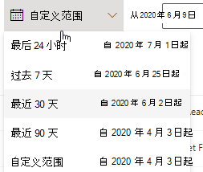

# 事件时间线 - 危险和漏洞管理

[!INCLUDE [Microsoft 365 Defender rebranding](../../includes/microsoft-defender.md)]

**适用于：**
- [Microsoft Defender for Endpoint 计划 2](https://go.microsoft.com/fwlink/?linkid=2154037)
- [Microsoft 365 Defender](https://go.microsoft.com/fwlink/?linkid=2118804)

> 希望体验 Microsoft Defender for Endpoint？ [注册免费试用版](https://signup.microsoft.com/create-account/signup?products=7f379fee-c4f9-4278-b0a1-e4c8c2fcdf7e&ru=https://aka.ms/MDEp2OpenTrial?ocid=docs-wdatp-portaloverview-abovefoldlink)。

事件时间线是一个风险新闻源，可帮助您解释通过新漏洞或漏洞向组织引入风险的方式。 您可以查看可能会影响组织风险的事件。 例如，你可以找到引入的新漏洞、被利用的漏洞、添加到攻击工具包的漏洞等。

事件时间线还告知你的 [曝光分数和](tvm-exposure-score.md) 适用于设备的 [Microsoft 安全](tvm-microsoft-secure-score-devices.md) 分数，以便你可以确定重大更改的原因。 事件可能会影响你的设备或你的设备分数。 通过根据优先安全建议解决需要修正的问题，减少 [曝光](tvm-security-recommendation.md)。

> [!TIP]
> 若要获取有关新漏洞事件的电子邮件，请参阅在 Microsoft [Defender for Endpoint](configure-vulnerability-email-notifications.md)中配置漏洞电子邮件通知

## 导航到"事件时间线"页

还有三个入口点来自 危险和漏洞管理[仪表板](tvm-dashboard-insights.md)：

- **组织曝光分数卡**：将鼠标悬停在"时间曝光分数"图中的事件点上，然后选择"查看这一天的所有事件"。 这些事件表示软件漏洞。
- **Microsoft 设备安全分数**：将鼠标悬停在"你的设备时间分数"图中的事件点上，然后选择"查看当天的所有事件"。 这些事件表示新的配置评估。
- **Top events card**： Select "Show more" at the bottom of the top events table. 卡片显示最近 7 天内影响最大的三个事件。 如果事件影响大量设备，或者它是一个关键漏洞，则可包括有影响的事件。

### 设备曝光分数和 Microsoft 安全分数图

在危险和漏洞管理仪表板中，将鼠标悬停在曝光分数图上，查看当天影响设备的顶部软件漏洞事件。 将鼠标悬停在 Microsoft 设备安全分数图上可查看影响分数的新安全配置评估。

如果没有影响你的设备或你的设备分数的事件，则不会显示任何事件。

 
 

### 向下钻取到当天的事件

选择 **"显示这一天的所有** 事件"将你访问具有该日期的自定义日期范围的"事件时间线"页。

选择 **"自定义** 范围"将日期范围更改为其他自定义范围或预设的时区。

## 事件时间线概述

在"事件时间线"页上，可以查看与事件相关的全部必要信息。

功能：

- 自定义列
- 按事件类型或受影响设备的百分比进行筛选
- 每页查看 30、50 或 100 个项目

页面顶部的两个大数字显示新漏洞和可利用漏洞的数量，而不是事件数。 某些事件可能有多个漏洞，而某些漏洞可以有多个事件。

### 列数

- **日期**：月、日、年
- **事件**：影响的事件，包括组件、类型和受影响设备的数量
- **相关组件**： 软件
- **最初影响的设备**：最初发生此事件时受影响设备的数量和百分比。 还可以按最初影响设备的百分比筛选出设备总数。
- **当前影响的设备**：此事件当前影响的设备的当前数量和百分比。 可以通过选择"自定义列 **"来查找此字段**。
- **类型**：反映影响分数的时间戳事件。 可以筛选它们。
  - 添加到攻击工具包的 Exploit
  - 已验证攻击
  - 新的公共攻击
  - 新漏洞
  - 新配置评估
- **分数趋势**：曝光分数趋势

### 图标

事件旁边会显示以下图标：

-  新的公共攻击
-  已发布新漏洞
-  在攻击工具包中发现攻击
-  已验证攻击

### 向下钻取到特定事件

选择事件后，将显示一个飞出列表，其中列出了影响设备的详细信息和当前 CVEs。 你可以显示更多 CVEs 或查看相关建议。

"分数趋势"下方的箭头可帮助你确定此事件是可能会提高还是降低你的组织曝光分数。 曝光分数越高，设备更容易被利用。

从中选择" **转到相关安全建议** "，查看解决安全建议页中的新软件 [漏洞的建议](tvm-security-recommendation.md)。 阅读安全建议中的说明和漏洞详细信息后，可以提交修正请求，并跟踪修正 [页面中的请求](tvm-remediation.md)。

## 在软件页面中查看事件时间线

若要打开软件页面，请选择事件>在 (称为"相关组件"的部分中选择超链接软件名称 (如 Visual Studio 2017) 。 [详细了解软件页面](tvm-software-inventory.md#software-pages)

将显示一个完整的页面，其中包含特定软件的所有详细信息。 将鼠标悬停在图形上以查看该特定软件的事件时间线。

导航到事件时间线选项卡以查看与该软件相关的所有事件。 还可以查看安全建议、发现的漏洞、已安装的设备以及版本分发。

## 相关主题

- [威胁和漏洞管理概述](next-gen-threat-and-vuln-mgt.md)
- [仪表板](tvm-dashboard-insights.md)
- [风险评分](tvm-exposure-score.md)
- [安全性建议](tvm-security-recommendation.md)
- [修正漏洞](tvm-remediation.md)
- [软件库存](tvm-software-inventory.md)
