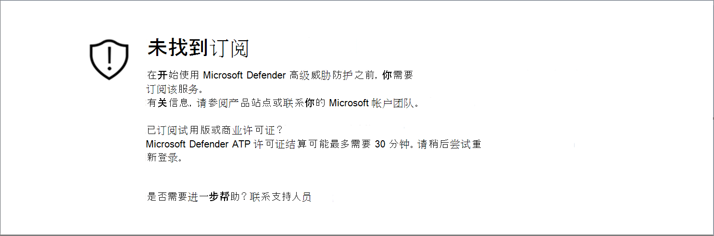
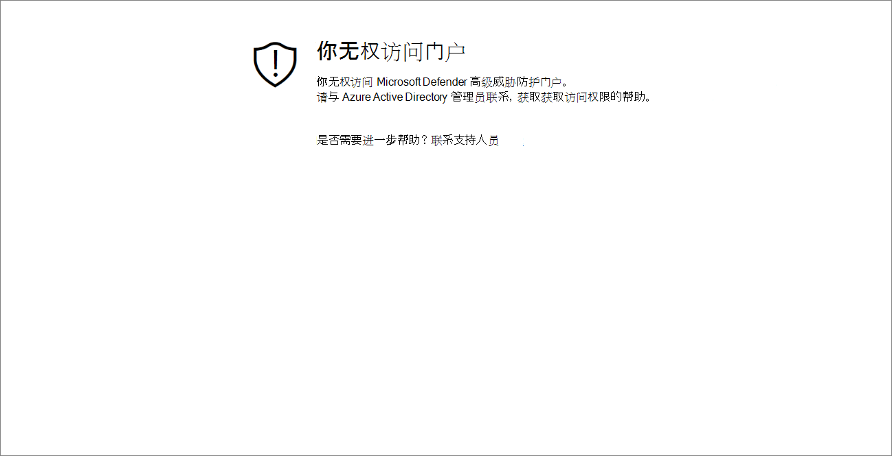

# 解决订阅和门户访问问题

[!INCLUDE [Microsoft 365 Defender rebranding](../../includes/microsoft-defender.md)]

**适用于：**
- [Microsoft Defender for Endpoint](https://go.microsoft.com/fwlink/p/?linkid=2154037)
- [Microsoft 365 Defender](https://go.microsoft.com/fwlink/?linkid=2118804)

> 希望体验 Microsoft Defender for Endpoint？ [注册免费试用版](https://signup.microsoft.com/create-account/signup?products=7f379fee-c4f9-4278-b0a1-e4c8c2fcdf7e&ru=https://aka.ms/MDEp2OpenTrial?ocid=docs-wdatp-troublshootonboarding-abovefoldlink)。

此页面提供了详细步骤，用于解决设置 Microsoft Defender for Endpoint 服务时可能发生的问题。

如果您收到错误消息，Microsoft 365 Defender将详细说明问题是什么，并提供相关链接。

## 未找到订阅

如果在访问 Microsoft 365 Defender收到"未找到订阅"消息，这意味着用于登录门户的用户的 Azure Active Directory (Azure AD) 没有 Microsoft Defender 终结点许可证。

可能的原因：

- Windows E5 和 Office E5 许可证是分开的。
- 许可证已购买，但没有预配到此 Azure AD 实例。
  - 这可能是许可证预配问题。
  - 这可能是您无意中将许可证预配到与Microsoft Azure AD身份验证所使用的许可证不同的证书。

对于这两种情况，你应联系 Microsoft 支持部门，地址为 [适用于终结点的一](https://support.microsoft.com/getsupport?wf=0&tenant=ClassicCommercial&oaspworkflow=start_1.0.0.0&locale=en-us&supportregion=en-us&pesid=16055&ccsid=636419533611396913) 般 Microsoft Defender 或 [批量许可证支持](https://www.microsoft.com/licensing/servicecenter/Help/Contact.aspx)。

## 你的订阅已过期

如果在访问Microsoft 365 Defender收到你的订阅 **已过期** 的消息，则你的联机服务订阅已过期。 与任何其他联机服务订阅一样，Microsoft Defender for Endpoint 订阅具有到期日期。

你可以选择随时续订或延长许可证。 在过期日期后访问门户时，如果选择不续订许可证，将显示你的订阅已过期的消息，你可以选择下载设备载出包。

> [!NOTE]
> 出于安全考虑，用于"载出"设备的程序包将在下载日期 30 天后过期。 发送到设备的过期载出包将被拒绝。 下载载出包时，你将收到程序包到期日期的通知，该日期也将包含在程序包名称中。

## 你无权访问门户

如果收到"你无权访问门户"，请注意，Microsoft Defender for Endpoint 是一种安全监视、事件调查和响应产品，因此，对它的访问受到用户的限制和控制。
有关详细信息，请参阅分配 [**对门户的用户访问权限**](/windows/threat-protection/windows-defender-atp/assign-portal-access-windows-defender-advanced-threat-protection)。

## 数据当前在门户的一些部分不可用

如果门户仪表板和其他部分显示错误消息，如"数据当前不可用"：

你需要允许 及其下的所有 `security.windows.com` 子域。 例如，`*.security.windows.com`。

## 门户通信问题

如果在访问门户时遇到问题、缺少数据或对门户部分的访问权限受限，则需要验证是否允许并打开以下 URL 用于通信。

- `*.blob.core.windows.net`
- `crl.microsoft.com`
- `https://*.microsoftonline-p.com`
- `https://*.securitycenter.windows.com`
- `https://automatediracs-eus-prd.securitycenter.windows.com`
- `https://login.microsoftonline.com`
- `https://login.windows.net`
- `https://onboardingpackagescusprd.blob.core.windows.net`
- `https://secure.aadcdn.microsoftonline-p.com`
- `https://securitycenter.windows.com`
- `https://static2.sharepointonline.com`
