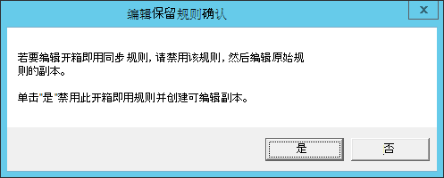

# <a name="troubleshoot-onboarding-issues-related-to-security-management-for-microsoft-defender-for-endpoint"></a>解决与 Microsoft Defender for Endpoint 的安全管理相关的载入问题 

[!INCLUDE [Microsoft 365 Defender rebranding](../../includes/microsoft-defender.md)]


**适用于：**

- [在设备上使用 Microsoft Defender for Endpoint 管理Microsoft Endpoint Manager](/mem/intune/protect/mde-security-integration)
- [Microsoft Defender for Endpoint](https://go.microsoft.com/fwlink/?linkid=2154037)
- [Microsoft 365 Defender](https://go.microsoft.com/fwlink/?linkid=2118804)

Microsoft Defender for Endpoint 的安全管理是一项功能，适用于不由 Microsoft Endpoint Manager 管理的设备，Microsoft Intune或Microsoft Endpoint Configuration Manager，直接从客户端接收适用于终结点的 Microsoft Defender Endpoint Manager。
有关适用于终结点的 Microsoft Defender 安全管理详细信息，请参阅在设备上使用 Microsoft Endpoint Manager 管理[Microsoft Defender for Endpoint。](/mem/intune/protect/mde-security-integration)

有关适用于终结点的 Microsoft Defender 的安全管理载入说明，请参阅 [Microsoft Defender for Endpoint Security Configuration Management](security-config-management.md)

此端到端载入设计为无接触，不需要用户输入。 但是，如果你在载入期间遇到问题，可以在 Microsoft Defender for Endpoint 平台中查看错误并排查错误。

> [!NOTE]
> 如果你在新设备的载入流方面遇到问题，请查看 Microsoft Defender for [Endpoint](/mem/intune/protect/mde-security-integration#prerequisites) 先决条件并确保遵循载入说明。

有关客户端分析器详细信息，请参阅使用 [Microsoft Defender for Endpoint Client Analyzer 解决传感器运行状况问题](/microsoft-365/security/defender-endpoint/overview-client-analyzer)。

## <a name="registering-domain-joined-computers-with-azure-active-directory"></a>向用户注册加入域Azure Active Directory
若要成功注册设备Azure Active Directory，你需要确保：

- 计算机可以使用域控制器进行身份验证 
- 计算机可以访问组织网络内部的以下 Microsoft 资源：
  - https://enterpriseregistration.windows.net
  - https://login.microsoftonline.com
  - https://device.login.microsoftonline.com
- Azure AD连接以同步计算机对象。 默认情况下，计算机 US Azure AD连接同步作用域。 如果计算机对象属于特定组织单位 (组织单位) ，请配置要同步到Azure AD 连接。 若要了解有关如何使用计算机对象同步计算机对象Azure AD 连接，请参阅基于组织[单位的筛选](/azure/active-directory/hybrid/how-to-connect-sync-configure-filtering#organizational-unitbased-filtering)。

> [!IMPORTANT]
> Azure AD连接不会同步Windows Server 2012 R2 计算机对象。 如果你需要在 Microsoft Defender for Endpoint Azure AD安全管理中注册它们，则需要自定义 Azure AD 连接同步规则，以在同步作用域中包括这些计算机对象。 请参阅[在计算机加入规则中应用计算机加入Azure Active Directory 连接。]()

> [!NOTE]
> 要成功完成载入流，并且独立于设备的操作系统，Azure Active Directory设备的初始状态可能会更改：<br>
>
> |      启动设备状态     |      新设备状态     |
> |---|---|
> |     已使用 AADJ 或 HAADJ    |     保持为    |
> |     未加入 AADJ 或混合 Azure Active Directory (HAADJ) + 已加入域    |     设备为 HAADJ'd    |
> |     未加入 AADJ 或 HAADJ + 未加入域    |     设备为 AADJ'd    |
>
> 其中 AADJ 表示 joined Azure Active Directory HAADJ 表示 Hybrid Azure Active Directory Joined。

## <a name="troubleshoot-errors-from-the-microsoft-defender-for-endpoint-portal"></a>排查 Microsoft Defender 终结点门户中的错误


通过 Microsoft Defender for Endpoint 门户，安全管理员可以对适用于终结点载入的 Microsoft Defender 安全管理进行故障排除。 


在 **Endpoints > Device inventory** 中，"托管者"列已添加到按管理通道 (例如 MEM) 。


:::image type="content" alt-text="设备清单页的图像" source="./images/device-inventory-mde-error.png":::

To see a list of all devices that have failed the Security Management for Microsoft Defender for Endpoint onboarding process， filter the table by **MDE-Error**.

在列表中，选择特定设备以查看侧面板中的疑难解答详细信息、指向错误的根本原因以及相应的文档。


:::image type="content" alt-text="已筛选设备清单页面的图像" source="./images/secconfig-mde-error.png":::


## <a name="run-microsoft-defender-for-endpoint-client-analyzer-on-windows"></a>在终结点客户端分析器上运行 Microsoft Defender Windows 

请考虑在无法完成 Microsoft Defender 终结点载入流程安全管理的终结点上运行客户端分析器。 有关客户端分析器详细信息，请参阅使用 [Microsoft Defender for Endpoint Client Analyzer 解决传感器运行状况问题](overview-client-analyzer.md)。

MDE 客户端分析器 (输出文件Results.htm) 可提供关键疑难解答信息：

- 在"常规设备详细信息"部分，验证设备操作系统是否位于适用于终结点的 Microsoft Defender 载入流 **的安全管理范围内**
- 在"设备配置管理详细信息"中验证Azure Active Directory **是否成功注册为已注册**

    

在 **报告的"详细** 结果"部分，客户端分析器还提供了可操作指导。

> [!TIP]
> 确保报告的详细结果部分不包含任何"错误"，并确保查看所有"警告"消息。

例如，作为安全管理载入流程的一部分，Microsoft Defender for Endpoint Tenant 中的 Azure Active Directory 租户 ID 必须与报告的设备配置管理详细信息部分中出现的 SCP 租户 ID相匹配。 如果相关，报告输出将建议执行此验证。


## <a name="general-troubleshooting"></a>一般疑难解答

如果你无法识别 AAD 或 MEM 中已载入的设备，并且注册期间未收到错误，检查注册表项可以提供其他 `Computer\\HKEY\_LOCAL\_MACHINE\\SOFTWARE\\Microsoft\\SenseCM\\EnrollmentStatus` 疑难解答信息。  

:::image type="content" alt-text="注册状态的图像。" source="images/enrollment-status.png":::

下表列出了为了处理错误而尝试/检查的错误和说明。 请注意，错误列表不完整，并且基于客户过去遇到的典型/常见错误：

| 错误代码                    | 注册状态                     | 管理员操作                                                                                                                                                                                                                                                                                                                                                                                                                                                                                                                                   |
|-------------------------------|---------------------------------------|---------------------------------------------------------------------------------------------------------------------------------------------------------------------------------------------------------------------------------------------------------------------------------------------------------------------------------------------------------------------------------------------------------------------------------------------------------------------------------------------------------------------------------------------------------|
| ``5-9``,``11-12``, ``26-33``  |常规错误                          |设备已成功载入到 Microsoft Defender for Endpoint。 但是，安全配置管理流中出现错误。 这可能是由于设备未满足 [Microsoft Defender 终结点管理频道 的先决条件](security-config-management.md)。 在 [设备上运行](https://aka.ms/BetaMDEAnalyzer) 客户端分析器可帮助确定问题的根本原因。 如果这不起作用，请联系支持人员。   |
| ``13-14``,``20``,``24``,``25``|连接问题                     |设备已成功载入到 Microsoft Defender for Endpoint。 但是，安全配置管理流中出现错误，这可能是由于连接问题。 验证[Azure Active Directory Microsoft Endpoint Manager终结点是否](security-config-management.md#connectivity-requirements)在你的防火墙中打开。                                                                                       |
| ``10``,``42``                 |常规混合加入失败            |设备已成功载入到 Microsoft Defender for Endpoint。 但是，安全配置管理流出错，操作系统无法执行混合加入。 使用[混合Azure Active Directory设备疑](/azure/active-directory/devices/troubleshoot-hybrid-join-windows-current)难解答操作系统级别混合加入故障。                                                                                                                               |
| ``15``                        |租户不匹配                        |设备已成功载入到 Microsoft Defender for Endpoint。 但是，由于 Microsoft Defender for Endpoint 租户 ID 与租户 ID 不匹配，因此安全配置管理流Azure Active Directory错误。 确保你的 Defender Azure Active Directory租户的租户 ID 与域的 SCP 条目中的租户 ID 匹配。 有关详细信息，请参阅 [解决与 Microsoft Defender for Endpoint 的安全管理相关的载入问题](troubleshoot-security-config-mgt.md)。|
| ``16``,``17``                 |混合错误 - 服务连接点|设备已成功载入到 Microsoft Defender for Endpoint。 但是，服务 (SCP) 记录未正确配置，并且设备无法加入 Azure AD。 这可能是由于 SCP 配置为加入 DRS Enterprise的原因。 确保 SCP 记录指向 AAD SCP 按照最佳做法进行配置。 有关详细信息，请参阅配置 [服务连接点](/azure/active-directory/devices/hybrid-azuread-join-manual#configure-a-service-connection-point)。                                                      |
| ``18``                        |证书错误                      |设备已成功载入到 Microsoft Defender for Endpoint。 但是，由于设备证书错误，安全配置管理流中出现错误。 设备证书属于其他租户。 验证创建受信任证书配置文件时 [是否遵循最佳做法](/mem/intune/protect/certificates-trusted-root#create-trusted-certificate-profiles)。                                                                                                    |
| ``36``                        |LDAP API 错误                         |设备已成功载入到 Microsoft Defender for Endpoint。 但是，安全配置管理流中出现错误。 验证网络拓扑并确保 LDAP API 可用于完成混合加入请求。     |
| ``37``                        |本地同步问题                  |设备已成功载入到 Microsoft Defender for Endpoint。 但是，安全配置管理流中出现错误。 请稍后重试。 如果不起作用，请参阅疑难解答[对象同步与Azure AD 连接同步](/azure/active-directory/hybrid/tshoot-connect-objectsync)。|
| ``38``,``41``                 |DNS 错误                              |设备已成功载入到 Microsoft Defender for Endpoint。 但是，由于 DNS 错误，安全配置管理流中出现错误。 检查设备的 Internet 连接和/或 DNS 设置。 无效的 DNS 设置可能位于工作站的一侧。 Active Directory 要求您使用域 DNS 来正确 (，而不是路由器的地址) 。 有关详细信息，请参阅 Troubleshoot [onboarding issues related to Security Management for Microsoft Defender for Endpoint](troubleshoot-security-config-mgt.md)。             |
| ``40``                        |时钟同步问题                       |设备已成功载入到 Microsoft Defender for Endpoint。 但是，安全配置管理流中出现错误。 验证时钟已正确设置，并且已同步发生错误的设备上。    |

## <a name="azure-active-directory-runtime-troubleshooting"></a>Azure Active Directory运行时疑难解答

### <a name="azure-active-directory-runtime"></a>Azure Active Directory运行时  

AADRT Azure Active Directory运行时 (的主要) 是收集调试跟踪。 Azure Active Directory运行时Windows ID 为 **bd67e65c-9cc2-51d8-7399-0bb9899e75c1** 的 ETW 提供程序。 ETW 跟踪需要通过故障 (的重现进行捕获。例如，如果发生联接失败，则需要在一段时间内启用跟踪，包括调用 AADRT API 以执行加入) 。  

有关 AADRT 日志中的典型错误以及如何读取错误，请参阅下文：


根据消息信息，在大多数情况下，可以了解遇到的错误、返回错误 (（如果适用) ）的 Win32 API、使用的 URL () （如果适用）以及遇到的 AAD 运行时 API 错误。 
  
 

## <a name="instructions-for-applying-computer-join-rule-in-aad-connect"></a>有关在计算机加入规则中应用计算机加入AAD 连接 

对于加入 R2 域Windows Server 2012计算机上的 Microsoft Defender for Endpoint 的安全管理，需要更新 Azure AD 连接 sync rule "In from AD-Computer Join"。 这可以通过克隆和修改规则实现，这将禁用原始"从 AD - 计算机加入"规则。 Azure AD 连接为更改内置规则提供此体验。

> [!NOTE]
>需要将这些更改应用于运行AAD 连接服务器。 如果部署了多个 AAD 连接，则必须将这些更改应用于所有实例。

1. 从"开始"菜单打开同步规则编辑器应用程序。 在规则列表中，从 AD - 计算机加入 **中查找** 名为 In 的规则。 **记下此规则的"优先级"列中的值。** 

    

2. 突出显示"**从 AD 加入 - 计算机加入"** 规则后，选择"编辑 **"。** 在"**编辑保留的规则确认"对话框中**，选择"**是"。** 

   

3. 将显示 **"编辑入站同步规则** "窗口。 更新规则说明以请注意，Windows Server 2012R2 将使用此规则进行同步。 除"优先级"值外，保留所有其他选项不变。 为"优先级"输入一个值，该值高于规则列表中的 (规则列表中的值) 。  

   

4. 选择 **"下一步** "三次。 这将导航到规则的"转换"部分。 不要对规则的"范围筛选器"和"加入规则"部分进行任何更改。 现在应显示"转换"部分。

    

5. 滚动到转换列表的底部。 查找 **cloudFiltered 属性的** 转换。 在"源"列的文本框中，选择"Control-A" (所有文本) 将其删除。 文本框现在应该为空。 

6. 将新规则的内容粘贴到文本框中。 


    ```command
    IIF(
      IsNullOrEmpty([userCertificate])
      || 
      (
        (InStr(UCase([operatingSystem]),"WINDOWS") > 0)
        && 
        (Left([operatingSystemVersion],2) = "6.")
        &&
        (Left([operatingSystemVersion],3) <> "6.3")
      )
      ||
      (
        (Left([operatingSystemVersion],3) = "6.3") 
        &&
        (InStr(UCase([operatingSystem]),"WINDOWS") > 0)
        &&
        With(
          $validCerts,
          Where(
            $c, 
            [userCertificate], 
            IsCert($c) && CertNotAfter($c) > Now() && RegexIsMatch(CertSubject($c), "CN=[{]*" & StringFromGuid([objectGUID]) & "[}]*", "IgnoreCase")),
          Count($validCerts) = 0)
      ),
      True,
      NULL
    )

    ```

7.  选择 **"保存** "以保存新规则。

## <a name="related-topic"></a>相关主题
- [在设备上使用 Microsoft Defender for Endpoint 管理Microsoft Endpoint Manager](/mem/intune/protect/mde-security-integration)
