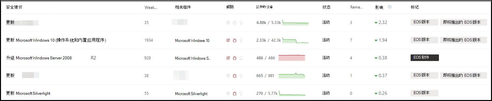

# 规划支持终止的软件版本和 危险和漏洞管理Plan for end-of-support software and software versions with threat and vulnerability management

[!INCLUDE [Microsoft 365 Defender rebranding](../../includes/microsoft-defender.md)]

**适用于：****Applies to:**

- [Microsoft Defender for EndpointMicrosoft Defender for Endpoint](https://go.microsoft.com/fwlink/?linkid=2154037)
- [威胁和漏洞管理Threat and vulnerability management](next-gen-threat-and-vuln-mgt.md)
- [Microsoft 365 DefenderMicrosoft 365 Defender](https://go.microsoft.com/fwlink/?linkid=2118804)

>想要体验 Microsoft Defender for Endpoint？Want to experience Microsoft Defender for Endpoint? [注册免费试用版。Sign up for a free trial.](https://www.microsoft.com/microsoft-365/windows/microsoft-defender-atp?ocid=docs-wdatp-portaloverview-abovefoldlink)

软件或软件版本的支持终止 (EOS) （也称为生命周期结束 (EOL) ）意味着它们将不再受支持或获得服务，并且不会接收安全更新。End-of-support (EOS), otherwise known as end-of-life (EOL), for software or software versions means that they will no longer be supported or serviced, and will not receive security updates. 当你使用具有结束支持的软件或软件版本时，你将使组织面临安全漏洞、法律和财务风险。When you use software or software versions with ended support, you're exposing your organization to security vulnerabilities, legal, and financial risks.

安全与 IT 管理员必须协同工作，并确保组织的软件清单配置为获得最佳结果、合规性和正常的网络生态系统。It's crucial for Security and IT Administrators to work together and ensure that the organization's software inventory is configured for optimal results, compliance, and a healthy network ecosystem. 他们应检查删除或替换已到达停止支持的应用的选项，并更新不再受支持的版本。They should examine the options to remove or replace apps that have reached end-of-support and update versions that are no longer supported. 最好在支持日期结束之前 **创建** 和实施计划。It's best to create and implement a plan **before** the end of support dates.

>[!NOTE]
> 支持终止功能当前仅适用于Windows产品。End-of-support capability is currently available only for Windows products.

## 查找不再受支持的软件或软件版本Find software or software versions that are no longer supported

1. 从"危险和漏洞管理"菜单中，导航到"[**安全建议"。**](tvm-security-recommendation.md)From the threat and vulnerability management menu, navigate to [**Security recommendations**](tvm-security-recommendation.md).
2. 转到筛选器 **面板** 并查找标记部分。Go to the **Filters** panel and look for the tags section. 选择一个或多个 EOS 标记选项。Select one or more of the EOS tag options. 然后 **应用**。Then **Apply**.

    

3. 你将看到与已结束支持的软件、停止提供支持的软件版本或即将停止提供支持的版本相关的建议列表。You'll see a list of recommendations related to software with ended support, software versions that are end of support, or versions with upcoming end of support. 这些标记还显示在软件清单 [页面中](tvm-software-inventory.md) 。These tags are also visible in the [software inventory](tvm-software-inventory.md) page.

    

## 版本和日期列表List of versions and dates

若要查看已终止支持或即将结束或支持的版本列表以及这些日期，请按照以下步骤操作：To view a list of versions that have reached end of support, or end or support soon, and those dates, follow the below steps:

1. 对于版本已终止支持或即将停止提供支持的软件，将在安全建议飞出中显示一条消息。A message will appear in the security recommendation flyout for software with versions that have reached end of support, or will reach end of support soon.

    

2. 选择 **版本分发** 链接以转到软件深化页面。Select the **version distribution** link to go to the software drill-down page. 其中，你可以看到经过筛选的版本列表，其中标记将它们标识为支持终止或即将停止提供支持。There, you can see a filtered list of versions with tags identifying them as end of support, or upcoming end of support.

    

3. 选择要打开的表中的某个版本。Select one of the versions in the table to open. 例如，版本 10.0.18362.1。For example, version 10.0.18362.1. 将显示一个显示支持日期结束的飞出图。A flyout will appear with the end of support date.

    

在确定哪些软件和硬件版本由于停止支持状态而易受攻击后，您必须决定是更新还是从组织中删除它们。Once you identify which software and software versions are vulnerable due to their end-of-support status, you must decide whether to update or remove them from your organization. 这样做将降低组织对漏洞和高级永久性威胁的暴露程度。Doing so will lower your organizations exposure to vulnerabilities and advanced persistent threats.

## 相关主题Related topics

- [威胁和漏洞管理概述Threat and vulnerability management overview](next-gen-threat-and-vuln-mgt.md)
- [安全性建议Security recommendations](tvm-security-recommendation.md)
- [软件库存Software inventory](tvm-software-inventory.md)
