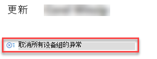

# 创建和查看安全建议例外 - 危险和漏洞管理

[!INCLUDE [Microsoft 365 Defender rebranding](../../includes/microsoft-defender.md)]

**适用于：**

- [Microsoft Defender for Endpoint](https://go.microsoft.com/fwlink/?linkid=2154037)
- [威胁和漏洞管理](next-gen-threat-and-vuln-mgt.md)
- [Microsoft 365 Defender](https://go.microsoft.com/fwlink/?linkid=2118804)

> 希望体验 Microsoft Defender for Endpoint？ [注册免费试用版](https://signup.microsoft.com/create-account/signup?products=7f379fee-c4f9-4278-b0a1-e4c8c2fcdf7e&ru=https://aka.ms/MDEp2OpenTrial?ocid=docs-wdatp-portaloverview-abovefoldlink)。

当建议此时不相关时，作为修正请求的替代方法，你可以为建议创建例外。 如果你的组织具有设备组，你将能够将异常范围范围缩小到特定设备组。 可以针对所选设备组或过去和现在的所有设备组创建例外。

为建议创建例外时，建议在例外持续时间结束之前不会处于活动状态。 建议状态将更改为"完全 **异常**"或"部分异常 (组设置) 。

## 权限

只有具有"异常处理"权限的用户才能管理异常 (包括创建或取消) 。 [详细了解 RBAC 角色](user-roles.md)。

## 创建异常

选择要创建例外的安全建议，然后选择" **异常** 选项"并填写表单。

### 按设备组分组的异常

将异常应用于所有当前设备组或选择特定设备组。 将来设备组不会包含在异常中。 列表中不会显示已具有异常的设备组。 如果你仅选择某些设备组，建议状态将从"活动"更改为"部分异常"。 如果选择所有设备组，状态将更改为"完全异常"。

#### 筛选的视图

如果你已按任意页面的设备组进行危险和漏洞管理，则只有经过筛选的设备组将显示为选项。

这是要按设备组筛选任意页面的危险和漏洞管理按钮：

具有已筛选设备组的异常视图：

#### 大量设备组

如果你的组织拥有 20 多个设备组，请选择 **已筛选** 设备组选项旁边的"编辑"。

将出现一个飞出框，可在其中搜索和选择想要包含的设备组。 Select the check mark icon below Search to check/uncheck all.

### 全局例外

如果您具有全局管理员权限，您将能够创建和取消全局异常。 它会影响 **组织** 的所有当前和未来设备组，只有具有相似权限的用户才能更改它。 建议状态将从"活动"更改为"完全例外"。

需要记住的一些内容：

- 如果建议在全局例外下，则设备组的新创建异常将暂停，直到全局异常过期或取消。 此后，新的设备组例外将生效，直到它们过期。
- 如果建议已具有特定设备组的例外，并且创建了全局例外，则设备组异常将暂停，直到它过期，或者全局异常在过期之前被取消。

### 理由

选择需要提交异常的理由，而不是修正相关安全建议。 填写理由上下文，然后设置例外持续时间。

以下列表详细介绍了例外选项背后的理由：

- **第三** 方控制 - 第三方产品或软件已解决此建议 - 选择此理由类型将降低曝光分数并增加安全分数，因为风险已降低
- **备用缓解** - 内部工具已解决此建议 - 选择此理由类型将降低曝光分数并增加安全分数，因为风险已降低
- **接受风险** - 风险较低且/或实施建议成本过高
- **计划的修正 (宽限期)** - 已计划，但正在等待执行或授权

## 查看所有异常

导航到 **"修正"** 页中的"例外 **"** 选项卡。 可以按理由、类型和状态进行筛选。

 选择例外以打开包含更多详细信息的飞出区。 每个设备组的例外将包含例外范围中每个设备组的列表，你可以导出该列表。 您还可以查看相关建议或取消例外。

## 如何取消异常

若要取消异常，请导航到" **修正"页** 中的"例外 **"** 选项卡。 选择例外。

若要取消所有设备组或全局例外的异常，请选择"取消 **所有设备组例外"** 按钮。 你只能取消你有权使用的设备组的例外。

### 取消特定设备组的例外

选择特定设备组以取消它的例外。 设备组将显示一个飞出，并且可以选择取消 **异常**。

## 应用例外后查看影响

在"安全推荐页上，选择"自定义列"，并选中"在异常发生后公开 ("和"在) 后影响 ("复选框 **) 。**

在应用 (后) 公开的设备会显示在应用异常后仍易受漏洞攻击的其余设备。 影响曝光的异常理由包括"第三方控制"和"备用缓解"。 其他理由不会减少设备的曝光，并且它们仍被视为公开。

异常 (后的影响) 在应用异常后对曝光分数或安全分数的剩余影响。 影响分数的异常理由包括"第三方控制"和"备用缓解"。 其他理由不会减少设备的曝光，因此曝光分数和安全分数不会更改。

## 相关主题

- [威胁漏洞管理概述](next-gen-threat-and-vuln-mgt.md)
- [修正漏洞](tvm-remediation.md)
- [安全性建议](tvm-security-recommendation.md)
- [风险评分](tvm-exposure-score.md)
- [设备的 Microsoft 安全功能分数](tvm-microsoft-secure-score-devices.md)
