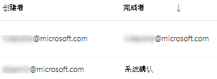

# 通过威胁和漏洞管理修正漏洞Remediate vulnerabilities with threat and vulnerability management

[!INCLUDE [Microsoft 365 Defender rebranding](../../includes/microsoft-defender.md)]

**适用于：****Applies to:**
- [Microsoft Defender for EndpointMicrosoft Defender for Endpoint](https://go.microsoft.com/fwlink/?linkid=2154037)
- [威胁和漏洞管理Threat and vulnerability management](next-gen-threat-and-vuln-mgt.md)
- [Microsoft 365 DefenderMicrosoft 365 Defender](https://go.microsoft.com/fwlink/?linkid=2118804)

>想要体验 Microsoft Defender for Endpoint？Want to experience Microsoft Defender for Endpoint? [注册免费试用版。Sign up for a free trial.](https://www.microsoft.com/microsoft-365/windows/microsoft-defender-atp?ocid=docs-wdatp-portaloverview-abovefoldlink)

## 请求修正Request remediation

Microsoft Defender for Endpoint 中的威胁和漏洞管理功能通过修正请求工作流填补了安全和 IT 管理员之间的空白。The threat and vulnerability management capability in Microsoft Defender for Endpoint bridges the gap between Security and IT administrators through the remediation request workflow. 安全管理员（如你可以请求 IT 管理员将漏洞从安全建议页面修正到Intune）Security admins like you can request for the IT Administrator to remediate a vulnerability from the **Security recommendation** pages to Intune.

### 启用 Microsoft Intune 连接Enable Microsoft Intune connection

若要使用此功能，请启用 Microsoft Intune 连接。To use this capability, enable your Microsoft Intune connections. 在 Microsoft Defender 安全中心中，**导航到"** 设置""  >  **常规**  >  **高级功能"。**In the Microsoft Defender Security Center, navigate to **Settings** > **General** > **Advanced features**. 向下滚动并查找 **Microsoft Intune 连接**。Scroll down and look for **Microsoft Intune connection**. 默认情况下，切换处于关闭状态。By default, the toggle is turned off. 打开 **Microsoft Intune 连接\*\*\*\*切换开关。**Turn your **Microsoft Intune connection** toggle **On**.

**注意**：如果启用了 Intune 连接，则创建修正请求时可以选择创建 Intune 安全任务。**Note**: If you have the Intune connection enabled, you get an option to create an Intune security task when creating a remediation request. 如果未设置连接，则不显示此选项。This option does not appear if the connection is not set.

有关详细信息 [，请参阅使用 Intune 修正由 Microsoft Defender for Endpoint](https://docs.microsoft.com/intune/atp-manage-vulnerabilities) 标识的漏洞。See [Use Intune to remediate vulnerabilities identified by Microsoft Defender for Endpoint](https://docs.microsoft.com/intune/atp-manage-vulnerabilities) for details.

### 修正请求步骤Remediation request steps

1. 转到 Microsoft Defender 安全中心中的"威胁和漏洞管理"导航菜单，然后选择"[**安全建议"。**](tvm-security-recommendation.md)Go to the threat and vulnerability management navigation menu in the Microsoft Defender Security Center, and select [**Security recommendations**](tvm-security-recommendation.md).

2. 选择要请求修正的安全建议，然后选择"修正 **选项"。**Select a security recommendation you would like to request remediation for, and then select **Remediation options**.

3. 填写表单，包括请求修正内容、适用的设备组、优先级、截止日期和可选注释。Fill out the form, including what you are requesting remediation for, applicable device groups, priority, due date, and optional notes.
    1. 如果选择"注意必需"修正选项，则选择截止日期将不可用，因为没有任何特定操作。If you choose the "attention required" remediation option, selecting a due date will not be available since there is no specific action.

4. 选择 **"提交请求"。**Select **Submit request**. 提交修正请求将在威胁和漏洞管理内创建修正活动项，可用于监视此建议中的修正进度。Submitting a remediation request creates a remediation activity item within threat and vulnerability management, which can be used for monitoring the remediation progress for this recommendation. 这不会触发修正或对设备应用任何更改。This will not trigger a remediation or apply any changes to devices.

5. 将新请求通知 IT 管理员，让他们登录到 Intune 以批准或拒绝请求并启动程序包部署。Notify your IT Administrator about the new request and have them log into Intune to approve or reject the request and start a package deployment.

6. 转到" [**修正"**](tvm-remediation.md) 页以查看修正请求的状态。Go to the [**Remediation**](tvm-remediation.md) page to view the status of your remediation request.

如果你想要检查票证在 Intune 中的显示方式，请参阅使用 [Intune](https://docs.microsoft.com/intune/atp-manage-vulnerabilities) 修正由 Microsoft Defender for Endpoint 标识的漏洞，了解详细信息。If you want to check how the ticket shows up in Intune, see [Use Intune to remediate vulnerabilities identified by Microsoft Defender for Endpoint](https://docs.microsoft.com/intune/atp-manage-vulnerabilities) for details.

>[!NOTE]
>如果你的请求涉及修正超过 10，000 台设备，我们只能发送 10，000 台设备以修正 Intune。If your request involves remediating more than 10,000 devices, we can only send 10,000 devices for remediation to Intune.

确定组织的网络安全弱点并将其映射到可操作的安全建议后，开始创建安全任务。 After your organization's cybersecurity weaknesses are identified and mapped to actionable [security recommendations](tvm-security-recommendation.md), start creating security tasks. 通过与 Microsoft Intune 集成（其中创建了修正票证）可以创建任务。You can create tasks through the integration with Microsoft Intune where remediation tickets are created.

通过修正安全建议，降低组织对漏洞的暴露程度，并增加安全配置。Lower your organization's exposure from vulnerabilities and increase your security configuration by remediating the security recommendations.

## 查看修正活动View your remediation activities

当你从"安全建议"页提交修正请求时，它会启动修正活动。When you submit a remediation request from the Security recommendations page, it kicks-off a remediation activity. 将创建一个可在威胁和漏洞管理修正页中跟踪的安全任务，并且将在 Microsoft Intune 中创建修正票证。A security task is created that can be tracked in the threat and vulnerability management **Remediation** page, and a remediation ticket is created in Microsoft Intune.

如果选择"注意需要"修正选项，则没有进度栏、票证状态或截止日期，因为我们可以监视任何实际操作。If you chose the "attention required" remediation option, there will be no progress bar, ticket status, or due date since there is no actual action we can monitor.

进入"修正"页后，选择要查看的修正活动。Once you are in the Remediation page, select the remediation activity that you want to view. 你可以按照修正步骤、跟踪进度、查看相关建议、导出到 CSV 或标记为完成。You can follow the remediation steps, track progress, view the related recommendation, export to CSV, or mark as complete.

>[!NOTE]
> 已完成的修正活动保留期为 180 天。There is a 180 day retention period for completed remediation activities. 若要使"修正"页以最佳方式执行，修正活动将在完成后 6 个月后删除。To keep the Remediation page performing optimally, the remediation activity will be removed 6 months after its completion.

### 按列完成Completed by column

使用"修正"页上的"完成者"列跟踪哪些人关闭了修正活动。Track who closed the remediation activity with the "Completed by" column on the Remediation page.

- **电子邮件地址**：手动完成任务的人的电子邮件**Email address**: The email of the person who manually completed the task
- **系统确认**：在已修正 (自动完成任务) **System confirmation**: The task was automatically completed (all devices remediated)
- **N/A：** 信息不可用，因为我们不知道此旧任务的完成情况**N/A**: Information is not available because we don't know how this older task was completed

### 仪表板中的热门修正活动Top remediation activities in the dashboard

查看 **威胁和** 漏洞 [管理仪表板中的热门修正活动](tvm-dashboard-insights.md)。View **Top remediation activities** in the [threat and vulnerability management dashboard](tvm-dashboard-insights.md). 选择任意条目以转到"修正 **"** 页。Select any of the entries to go to the **Remediation** page. 可以在 IT 管理员团队修正任务后将修正活动标记为已完成。You can mark the remediation activity as completed after the IT admin team remediates the task.

## 相关文章Related articles

- [威胁和漏洞管理概述Threat and vulnerability management overview](next-gen-threat-and-vuln-mgt.md)
- [仪表板Dashboard](tvm-dashboard-insights.md)
- [安全性建议Security recommendations](tvm-security-recommendation.md)