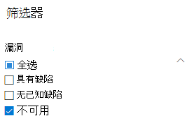
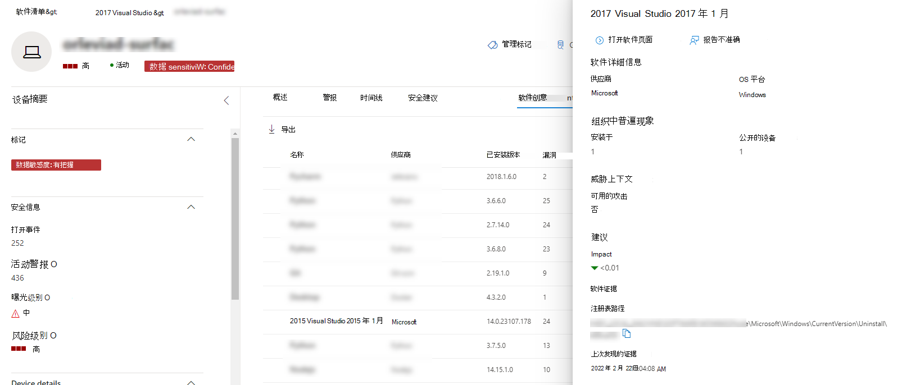
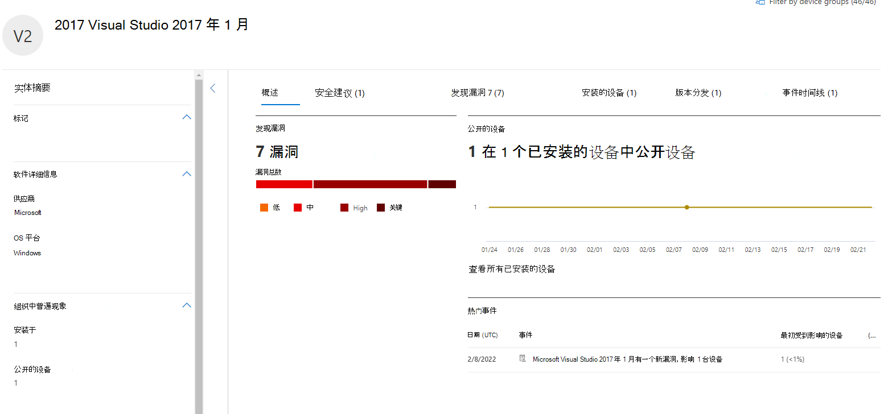

# 软件清单 - 危险和漏洞管理Software inventory - threat and vulnerability management

[!INCLUDE [Microsoft 365 Defender rebranding](../../includes/microsoft-defender.md)]

**适用于：****Applies to:**
- [Microsoft Defender for EndpointMicrosoft Defender for Endpoint](https://go.microsoft.com/fwlink/?linkid=2154037)
- [威胁和漏洞管理Threat and vulnerability management](next-gen-threat-and-vuln-mgt.md)
- [Microsoft 365 DefenderMicrosoft 365 Defender](https://go.microsoft.com/fwlink/?linkid=2118804)

>想要体验适用于终结点的 Defender？Want to experience Defender for Endpoint? [注册免费试用版。Sign up for a free trial.](https://www.microsoft.com/microsoft-365/windows/microsoft-defender-atp?ocid=docs-wdatp-portaloverview-abovefoldlink)

危险和漏洞管理软件清单是组织中具有正式通用平台枚举的已知软件列表 ([CPE) 。 ](https://nvd.nist.gov/products/cpe)The software inventory in threat and vulnerability management is a list of known software in your organization with official [Common Platform Enumerations (CPE)](https://nvd.nist.gov/products/cpe). 没有正式 CPE 的软件产品没有发布漏洞。Software products without an official CPE don’t have vulnerabilities published. 它还包括供应商名称、漏洞数量、威胁和公开设备数量等详细信息。It also includes details such as the name of the vendor, number of weaknesses, threats, and number of exposed devices.

## 运作方式How it works

在发现领域，我们正在利用在 Microsoft Defender 中负责检测和漏洞评估的同一组信号，用于终结点检测和 [响应功能](overview-endpoint-detection-response.md)。In the field of discovery, we're leveraging the same set of signals that is responsible for detection and vulnerability assessment in [Microsoft Defender for Endpoint detection and response capabilities](overview-endpoint-detection-response.md).

由于它是实时的，因此在几分钟内，您将在发现漏洞信息时看到它们。Since it's real time, in a matter of minutes, you'll see vulnerability information as they get discovered. 该引擎自动从多个安全源获取信息。The engine automatically grabs information from multiple security feeds. 事实上，你将看到特定软件是否连接到实时威胁活动。In fact, you'll see if a particular software is connected to a live threat campaign. 它还提供指向威胁分析报告的链接（一旦可用）。It also provides a link to a Threat Analytics report soon as it's available.

## 导航到"软件清单"页Navigate to the Software inventory page

通过在页面的导航 **菜单中从**"危险和漏洞管理"菜单中选择"软件清单"，访问"软件 [Microsoft Defender 安全中心"。](portal-overview.md)Access the Software inventory page by selecting **Software inventory** from the threat and vulnerability management navigation menu in the [Microsoft Defender Security Center](portal-overview.md).

在"设备"列表的"单个设备"页面中查看 [特定设备上的软件](machines-view-overview.md)。View software on specific devices in the individual devices pages from the [devices list](machines-view-overview.md).

>[!NOTE]
>如果使用 Microsoft Defender for Endpoint 全局搜索搜索软件，请确保使用下划线字符而不是空格。If you search for software using the Microsoft Defender for Endpoint global search, make sure to put an underscore instead of a space. 例如，为了获得最佳搜索结果，您可以编写"windows_10"，而不是"Windows 10"。For example, for the best search results you'd write "windows_10" instead of "Windows 10".

## 软件清单概述Software inventory overview

" **软件清单** "页将打开，其中列出了网络中安装的软件，包括供应商名称、发现的缺点、与其关联的威胁、公开的设备、曝光评分的影响和标签。The **Software inventory** page opens with a list of software installed in your network, including the vendor name, weaknesses found, threats associated with them, exposed devices, impact to exposure score, and tags.

你可以根据软件中发现的缺点、与其关联的威胁以及软件是否已达到支持终止等标记来筛选列表视图。You can filter the list view based on weaknesses found in the software, threats associated with them, and tags like whether the software has reached end-of-support.

选择要调查的软件。Select the software that you want to investigate. 在打开一个飞出面板时，页面上的信息视图会更紧凑。A flyout panel will open with a more compact view of the information on the page. 你可以深入调查并选择"打开软件页"，或者通过选择"报告不准确"来标记 **任何技术不一致情况**。You can either dive deeper into the investigation and select **Open software page**, or flag any technical inconsistencies by selecting **Report inaccuracy**.

### 不支持的软件Software that isn't supported

"软件清单"页中& 漏洞管理当前不受威胁威胁支持的软件。Software that isn't currently supported by threat & vulnerability management may be present in the Software inventory page. 由于它不受支持，因此只有有限的数据可用。Because it is not supported, only limited data will be available. 使用"漏洞"部分中的"不可用"选项按不受支持的软件进行筛选。Filter by unsupported software with the "Not available" option in the "Weakness" section.

下面指示软件不受支持：The following indicates that a software is not supported:

- "漏洞"字段显示"不可用"Weaknesses field shows "Not available"
- "公开的设备"字段显示短划线Exposed devices field shows a dash
- 在侧面板和软件页中添加的信息性文本Informational text added in side panel and in software page
- 软件页面将没有安全建议、发现的漏洞或事件时间线部分The software page won't have the security recommendations, discovered vulnerabilities, or event timeline sections

目前，没有 CPE 的产品不会显示在软件清单页中，而只显示在设备级别的软件清单中。Currently, products without a CPE are not shown in the software inventory page, only in the device level software inventory.

## 设备上的软件清单Software inventory on devices

从Microsoft Defender 安全中心导航面板中，转到 **["设备"列表](machines-view-overview.md)**。From the Microsoft Defender Security Center navigation panel, go to the **[Devices list](machines-view-overview.md)**. 选择设备名称以打开设备页面 (如 Computer1) ，然后选择"软件清单"选项卡以查看设备上存在的所有已知软件的列表。Select the name of a device to open the device page (like Computer1), then select the **Software inventory** tab to see a list of all the known software present on the device. 选择特定软件项以打开包含详细信息的飞出区。Select a specific software entry to open the flyout with more information.

软件可能在设备级别可见，即使软件当前不受设备危险和漏洞管理。Software may be visible at the device level even if it is currently not supported by threat and vulnerability management. 但是，只有有限的数据可用。However, only limited data will be available. 你将知道软件是否不受支持，因为它将在"漏洞"列中显示"不可用"。You'll know if software is unsupported because it will say "Not available" in the "Weakness" column.

没有 CPE 的软件也可以显示在此设备特定的软件清单下。Software with no CPE can also show up under this device specific software inventory.

### 软件证据Software evidence

查看我们在设备上从注册表和/或磁盘检测到特定软件的证据。可以在设备软件清单的任何设备上找到它。See evidence of where we detected a specific software on a device from the registry, disk, or both.You can find it on any device in the device software inventory.

选择一个软件名称以打开该飞出页面，并查找名为"软件证据"的部分。Select a software name to open the flyout, and look for the section called "Software Evidence."

## 软件页Software pages

可以通过几种不同的方式查看软件页面：You can view software pages a few different ways:

- "软件清单">在>"选择 **打开** 软件"页中选择软件名称Software inventory page > Select a software name > Select **Open software page** in the flyout
- ["安全建议">](tvm-security-recommendation.md) 在>选择 **"打开** 软件"页中的"选择建议"[Security recommendations page](tvm-security-recommendation.md) > Select a recommendation > Select **Open software page** in the flyout
- [事件时间线页面](threat-and-vuln-mgt-event-timeline.md)> 选择事件>在 ("相关组件"部分选择超链接软件名称 (如 Visual Studio 2017) [Event timeline page](threat-and-vuln-mgt-event-timeline.md) > Select an event > Select the hyperlinked software name (like Visual Studio 2017) in the section called "Related component" in the flyout

 将显示一个完整的页面，其中包含特定软件的所有详细信息和以下信息：A full page will appear with all the details of a specific software and the following information:

- 包含供应商信息的侧面板、组织中软件的普遍程度 (包括其安装的设备数量，以及未修补) 的公开设备、是否可用和攻击，以及你的曝光评分。Side panel with vendor information, prevalence of the software in the organization (including number of devices it's installed on, and exposed devices that aren't patched), whether and exploit is available, and impact to your exposure score.
- 显示漏洞和错误配置的数量和严重性的数据可视化。Data visualizations showing the number of, and severity of, vulnerabilities and misconfigurations. 此外，使用公开的设备数的图形。Also, graphs with the number of exposed devices.
- 显示以下信息的选项卡：Tabs showing information such as:
    - 针对所识别的漏洞的相应安全建议。Corresponding security recommendations for the weaknesses and vulnerabilities identified.
    - 发现的漏洞的命名 CVEs。Named CVEs of discovered vulnerabilities.
    - 安装了软件的设备 (设备名称、域、操作系统等) 。Devices that have the software installed (along with device name, domain, OS, and more).
    - 软件版本列表 (包括安装版本的设备数、发现的漏洞数以及安装的设备名称) 。Software version list (including number of devices the version is installed on, the number of discovered vulnerabilities, and the names of the installed devices).

    

## 报告 inaccuracyReport inaccuracy

当你看到任何模糊、不准确或不完整的信息时报告误报。Report a false positive when you see any vague, inaccurate, or incomplete information. 还可以报告已修正的安全建议。You can also report on security recommendations that have already been remediated.

1. 在"软件清单"页上打开软件飞出。Open the software flyout on the Software inventory page.
2. 选择 **报告 inaccuracy**。Select **Report inaccuracy**.
3. 从弹出窗格中，从下拉菜单中选择不准确类别，填写您的电子邮件地址和有关不准确的详细信息。From the flyout pane, select the inaccuracy category from the drop-down menu, fill in your email address, and details about the inaccuracy.
4. 选择“**提交**”。Select **Submit**. 你的反馈将立即发送给危险和漏洞管理专家。Your feedback is immediately sent to the threat and vulnerability management experts.

## 相关文章Related articles

- [威胁和漏洞管理概述Threat and vulnerability management overview](next-gen-threat-and-vuln-mgt.md)
- [安全性建议Security recommendations](tvm-security-recommendation.md)
- [活动日程表Event timeline](threat-and-vuln-mgt-event-timeline.md)
- [查看和组织适用于终结点设备的 Microsoft Defender 列表View and organize the Microsoft Defender for Endpoint Devices list](machines-view-overview.md)
