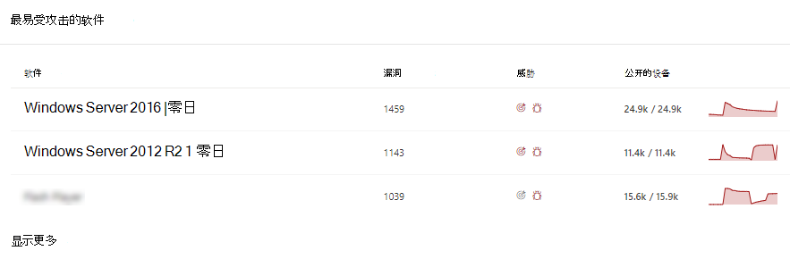
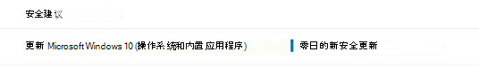

# 缓解零日漏洞 - 危险和漏洞管理Mitigate zero-day vulnerabilities - threat and vulnerability management

[!INCLUDE [Microsoft 365 Defender rebranding](../../includes/microsoft-defender.md)]

**适用于：****Applies to:**

- [Microsoft Defender for EndpointMicrosoft Defender for Endpoint](https://go.microsoft.com/fwlink/?linkid=2154037)
- [威胁和漏洞管理Threat and vulnerability management](next-gen-threat-and-vuln-mgt.md)
- [Microsoft 365 DefenderMicrosoft 365 Defender](https://go.microsoft.com/fwlink/?linkid=2118804)

>想要体验 Microsoft Defender for Endpoint？Want to experience Microsoft Defender for Endpoint? [注册免费试用版。Sign up for a free trial.](https://www.microsoft.com/microsoft-365/windows/microsoft-defender-atp?ocid=docs-wdatp-portaloverview-abovefoldlink)

零日漏洞是公开披露的漏洞，尚未发布正式的修补程序或安全更新程序。A zero-day vulnerability is a publicly disclosed vulnerability for which no official patches or security updates have been released. 零日漏洞通常具有高严重性级别，并且被主动利用。Zero-day vulnerabilities often have high severity levels and are actively exploited.

威胁漏洞管理仅显示其拥有相关信息的零日漏洞。Threat and vulnerability management will only display zero-day vulnerabilities it has information about.

## 查找有关零日漏洞的信息Find information about zero-day vulnerabilities

一旦发现零日漏洞，有关该漏洞的信息将通过该漏洞中的以下Microsoft Defender 安全中心。Once a zero-day vulnerability has been found, information about it will be conveyed through the following experiences in the Microsoft Defender Security Center.

### 威胁和漏洞管理仪表板Threat and vulnerability management dashboard

在"顶级安全建议"卡片中查找带零日标记的建议。Look for recommendations with a zero-day tag in the “Top security recommendations” card.

在"最易受攻击的软件"卡中查找带零日标记的顶级软件。Find top software with the zero-day tag in the "Top vulnerable software" card.

### "漏洞"页Weaknesses page

查找已命名的零日漏洞以及说明和详细信息。Look for the named zero-day vulnerability along with a description and details.

- 如果此漏洞分配了 CVE ID，你将在 CVE 名称旁边看到零日标签。If this vulnerability has a CVE-ID assigned, you’ll see the zero-day label next to the CVE name.

- 如果此漏洞未分配 CVE ID，你将在类似于"TVM-XXXX-XXXX"的内部临时名称下找到它。If this vulnerability has no CVE-ID assigned, you'll find it under an internal, temporary name that looks like “TVM-XXXX-XXXX”. 分配官方 CVE-ID 后，该名称将更新，但以前的内部名称仍可搜索，并位于侧面板中。The name will be updated once an official CVE-ID has been assigned, but the previous internal name will still be searchable and found in the side-panel.

### 软件清单页Software inventory page

查找带零日标记的软件。Look for software with the zero-day tag. 按"零日"标记进行筛选，以仅查看具有零日漏洞的软件。Filter by the "zero day" tag to only see software with zero-day vulnerabilities.

### "软件"页Software page

查找受零日漏洞影响的每个软件的零日标记。Look for a zero-day tag for each software that has been affected by the zero–day vulnerability.

### "安全建议"页Security recommendations page

查看有关修正和缓解选项的清晰建议，包括解决方法（如果存在）。View clear suggestions about remediation and mitigation options, including workarounds if they exist. 按"零日"标记进行筛选，以仅查看解决零日漏洞的安全建议。Filter by the "zero day" tag to only see security recommendations addressing zero-day vulnerabilities.

如果有软件具有零日漏洞和其他要解决的漏洞，你将获得有关所有漏洞的一个建议。If there's software with a zero-day vulnerability and additional vulnerabilities to address, you'll get one recommendation about all vulnerabilities.

## 解决零日漏洞Addressing zero-day vulnerabilities

转到安全建议页面，然后选择一个零日建议。Go to the security recommendation page and select a recommendation with a zero-day. 将打开一个空出场，并提供有关该软件的零日和其他漏洞的信息。A flyout will open with information about the zero-day and other vulnerabilities for that software.

如果缓解选项和解决方法可用，将会提供相关链接。There will be a link to mitigation options and workarounds if they are available. 在可以部署修补程序或安全更新之前，解决方法可能会帮助降低此零日漏洞带来的风险。Workarounds may help reduce the risk posed by this zero-day vulnerability until a patch or security update can be deployed.

打开修正选项并选择注意类型。Open remediation options and choose the attention type. 建议对零日漏洞使用"注意"修正选项，因为更新尚未发布。An "attention required" remediation option is recommended for the zero-day vulnerabilities, since an update hasn't been released yet. 由于没有要执行的特定操作，因此无法选择截止日期。You won't be able to select a due date, since there's no specific action to perform. 如果你希望修正此软件存在较旧的漏洞，你可以替代"需要注意"的修正选项并选择"更新"。If there are older vulnerabilities for this software you wish to remediation, you can override the "attention required" remediation option and choose “update.”

## 跟踪零日修正活动Track zero-day remediation activities

转到["危险和漏洞管理"](tvm-remediation.md)页以查看修正活动项。Go to the threat and vulnerability management [Remediation](tvm-remediation.md) page to view the remediation activity item. 如果选择"注意需要"修正选项，则没有进度栏、票证状态或截止日期，因为我们可以监视任何实际操作。If you chose the "attention required" remediation option, there will be no progress bar, ticket status, or due date since there's no actual action we can monitor. 您可以按修正类型（如"软件更新"或"需要注意"）进行筛选，以查看同一类别的所有活动项。You can filter by remediation type, such as "software update" or "attention required," to see all activity items in the same category.

## 修补零日漏洞Patching zero-day vulnerabilities

当修补程序在零日发布时，建议将更改为"更新"，其旁边的蓝色标签显示"零日的新安全更新"。When a patch is released for the zero-day, the recommendation will be changed to “Update” and a blue label next to it that says “New security update for zero day.” 它不再视为零日，将从所有页面中删除零日标记。It will no longer consider as a zero-day, the zero-day tag will be removed from all pages.

## 相关文章Related articles

- [威胁和漏洞管理概述Threat and vulnerability management overview](next-gen-threat-and-vuln-mgt.md)
- [仪表板Dashboard](tvm-dashboard-insights.md)
- [安全性建议Security recommendations](tvm-security-recommendation.md)
- [软件库存Software inventory](tvm-software-inventory.md)
- [我组织中的漏洞Vulnerabilities in my organization](tvm-weaknesses.md)
